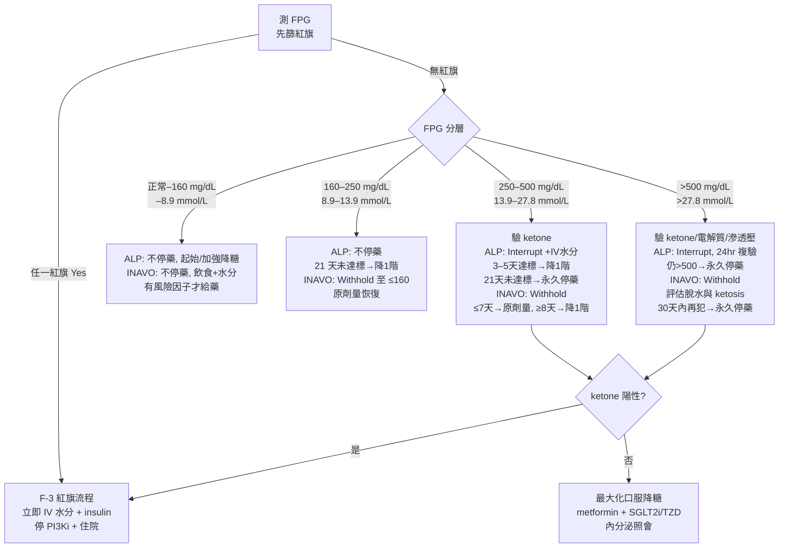

# PI3Kα 抑制劑相關高血糖與 metformin —— 臨床回顧

**編纂日期：2026-07-21**
**讀者對象：臨床醫師（腫瘤科、內分泌科、藥師、營養師）**
**涵蓋藥物：alpelisib（Piqray）、inavolisib（Itovebi）；capivasertib（Truqap）僅作對照，不屬 PI3K inhibitor**

---

## 本文件的證據標記說明

本文件的每一條論斷都同時帶三種標記，供讀者與稽核者判讀強度與可追溯性。

### 一、證據等級【L1】–【L5】

| 標記 | 意義 | 本文件中的典型來源 |
|---|---|---|
| **【L1】** | FDA／EMA／TFDA **正式仿單**（含逐字劑量調整表、警語、特殊族群段） | `label_alpelisib.md`、`label_inavolisib.md` |
| **【L2】** | **前瞻性臨床試驗**（SOLAR-1、BYLieve、METALLICA、INAVO120、GO39374、CAPItello-291、SANDPIPER、ITACA 等） | 各試驗論文與其安全性分析 |
| **【L3】** | **專家共識／Delphi／學會指引** | ADA SOC—2026、Delphi (Gallagher 2024)、Tankova 2022、Rugo 2022、ASCO Rapid Recommendation Update |
| **【L4】** | **回溯性研究／real-world／claims／case series／case report** | MSKCC Liu 2022、Shen 2023、Ismail 2026、各 DKA／HHS 個案 |
| **【L5】** | **前臨床或機轉推論**（動物、細胞、藥理模型） | Hopkins 2018 insulin feedback、Song 2022 degrader 機轉 |

> **本文件的判讀原則**：當【L1】與【L5】衝突時，**以【L1】為準**。最典型的例子是 insulin —— insulin feedback 的療效顧慮來自【L5】前臨床，而致死性 ketoacidosis 已寫入【L1】仿單，故**嚴重高血糖／DKA／HHS 時 insulin 不可延誤**。

### 二、全文取得標記 📄／📌

| 標記 | 意義 | 使用規則 |
|---|---|---|
| **📄** | 本地有**全文**可 grep（`原始PDF/*.md` 或 `來源/*.md`） | 可引用正文、表格、subgroup 與數字 |
| **📌** | 本地**僅有 abstract／metadata** | **禁止對其內文細節作具體斷言**；僅可引用 abstract 層級之敘述 |

本回顧共納入 **69 篇獨立文獻**，其中 **📄 40 篇／📌 29 篇**（全文取得率約 58%）。完整清單見 [K. 重要文獻表](#sec-K) 與 `MISSING_FULLTEXT.md`。

> **本版（2026-07-21 定稿）之關鍵更新**：三篇原本僅有 abstract（📌）的核心論文，經使用者提供 PDF 後已全部轉為可 grep 的本地全文（📄）——
> `SOLAR1_AE_Rugo_2020.md`（Ann Oncol 2020，PMID 32416251）、`INAVO120_Turner_2024.md`（NEJM 2024，PMID 39476340）、`MSKCC_RealWorld_Shen_2023.md`（Cancer 2023，PMID 37743730）。
> 三篇之逐字事實擷取稿分別落地為 `來源/fulltext_facts_SOLAR1.md`、`fulltext_facts_INAVO120.md`、`fulltext_facts_MSKCC.md`，**跨章節同一數字如有歧異，一律以此三份擷取稿為準**。
> 本版因此新增了先前無法作出的具體斷言：SOLAR-1 之 preferred term／AESI grouped term 雙套定義與基線血糖分層發生率、INAVO120 之族群體位與 grade 3/4 未拆分之限制、以及 MSKCC 之 **standard care 80.3%／40.2% vs clinical trial 34.0%／13.0%** 真實世界落差。

### 三、來源檔註記 `[檔名.md]`

每個論斷後方的 `[檔名.md]` 指向 `原始PDF/` 或 `來源/` 內的實際落地檔案，**供稽核者以 grep 逐字複驗**。若某項資訊本地檔案查不到，本文明白寫「**本回顧未取得可驗證來源**」，不以先驗知識補洞。

---

## 🔴 四條貫穿全文的紅線

1. **alpelisib 與 inavolisib 必須分開陳述。** 兩者的發生率、中位發生時間、FPG 劑量調整門檻、減量階梯與監測頻率**全部不同**，且無 head-to-head 隨機比較。所有 PI3K／AKT inhibitors 亦**不可當成同一類**。
2. **METALLICA 是單臂 phase 2（n=68）。** 它支持「對 alpelisib 的高風險病人**考慮**預防性 metformin」，**不等於「所有病人都該用」**。FDA 的措辭是「Consider」。
3. **嚴重高血糖、DKA 或 HHS 時，絕不可為了避免 hyperinsulinemia 而延誤 insulin。**
4. **全程必須顧及癌症病人的腹瀉、體重下降、食慾不佳、脫水與腎功能波動**——這些不是背景雜訊，它們會直接改變 metformin 的可用性與 PI3Ki 的劑量決策。

---

## 目錄

| 章 | 標題 | 對應臨床問題 |
|---|---|---|
| [A](#sec-A) | 摘要（Executive Summary） | — |
| [B](#sec-B) | 病理生理學：PI3Kα 抑制造成高血糖的機轉 | Q1、Q2 |
| [C](#sec-C) | Alpelisib versus Inavolisib 比較 | Q3、Q4 |
| [D](#sec-D) | 基線風險分層表 | Q5 |
| [E](#sec-E) | Metformin 三欄決策表：預防性／治療性／不適合 | Q6、Q7 |
| [F](#sec-F) | 以 FPG 呈現的臨床處置流程 | Q9、Q13、Q14 |
| [G](#sec-G) | Metformin dosing and titration table | Q8、Q10、Q11 |
| [H](#sec-H) | 後續降糖藥比較表 | Q12 |
| [M](#sec-M) | 監測策略與多專科流程（監測與 MDT） | Q15、Q16 |
| [I](#sec-I) | 目前證據爭議與 knowledge gaps | Q17 |
| [J](#sec-J) | 演講大綱（30 分鐘） | 全部 |
| [K](#sec-K) | 重要文獻表 | — |
| [L](#sec-L) | Take-home messages（五句） | — |
| [附](#sec-Z) | 本回顧的方法與限制 | — |

### 17 個臨床問題的落點對照

| # | 問題 | 主要落點 |
|---|---|---|
| Q1 | 為何 PI3Kα inhibition 會造成急性 insulin resistance、hepatic glucose output 增加與代償性 hyperinsulinemia？ | B-2 |
| Q2 | Hyperinsulinemia 是否可能重新活化腫瘤 PI3K signaling？是臨床證據還是前臨床推論？ | B-3 |
| Q3 | 兩藥的高血糖發生率、中位發生時間與 Grade 3–4 風險各是多少？ | C-4 |
| Q4 | SOLAR-1 與 INAVO120 為何不能直接 cross-trial compare？ | C-3 |
| Q5 | 治療前應如何依 HbA1c、FPG、BMI、年齡、既有糖尿病、steroid use、eGFR、營養狀態分層？ | D-1～D-5 |
| Q6 | 哪些病人應考慮 prophylactic metformin？ | E §2 |
| Q7 | 正常血糖／prediabetes／已知糖尿病三種情境的建議有何不同？ | E §3 |
| Q8 | METALLICA 的 metformin regimen 具體怎麼做？證據強度如何？ | G-1 |
| Q9 | 何時開始 metformin？ | F-1 |
| Q10 | Metformin IR 與 XR 如何選擇與 titration？ | G-2 |
| Q11 | Metformin 的安全性邊界（eGFR、顯影劑、脫水／AKI、DKA）？ | G-3 |
| Q12 | Metformin 控制不足時加什麼藥？ | H 全章 |
| Q13 | Insulin-sparing approach 的理由，以及何時仍必須立即用 insulin？ | F-3 |
| Q14 | 高血糖緩解後如何恢復用藥（resume）與再挑戰（rechallenge）？ | F-4 |
| Q15 | SMBG、CGM、postprandial glucose 與 ketone monitoring 的證據？ | M1–M7 |
| Q16 | oncology–endocrinology–pharmacy–nutrition 的多專科流程？ | M8–M9 |
| Q17 | 本文每一條核心建議的證據等級為何？ | I-1 |

> **註**：章節內文對 Q14 未以編號標示，本對照表依內容比對將 F-4（恢復用藥與再挑戰原則）指定為 Q14 之落點；原始問題清單未落地於本地檔案，此一對應為內容比對之結果而非逐字引用。

---


<a id="sec-A"></a>

# A. 摘要（Executive Summary）

PI3Kα 抑制劑的高血糖是 **on-target 機轉性效應**：阻斷 p110α 即阻斷 insulin receptor 下游訊號，造成急性 insulin resistance、肝糖輸出上升與代償性 hyperinsulinemia【L5】[InsulinFeedback_Hopkins_2018.md]📄。它可預期、有時間窗，不能「等它自己好」。

**兩藥必須分開陳述。** alpelisib（300 mg QD）：SOLAR-1 全文（n=284）preferred term 高血糖 **181 人（63.7%）**、Grade 3 **93 人（32.7%）**、Grade 4 **11 人（3.9%）**；改用 AESI grouped term 則為 **65.8%／grade ≥3 38.0%**，兩套定義不可混用；grade ≥3 中位發生 **15 天（range 5–395）**、改善 ≥1 級中位 **6 天**【L2】[SOLAR1_AE_Rugo_2020.md]📄。inavolisib（9 mg QD 三合一）：INAVO120 主論文 grouped term **95/162（58.6%）**、**Grade 3 or 4 合併 5.6%（9/162）**（原文未拆分 3 與 4）【L2】[INAVO120_Turner_2024.md]📄；安全性專文另載 grade 3 5.6%、**無 grade 4-5、無 DKA**，中位發生 **7.0 天**【L2】[INAVO120_Safety_Im_2026.md]📄。

**這兩個數字不可相減。** INAVO120 只收 **fasting glucose <126 mg/dL、HbA1c <6.0%**、排除需治療之糖尿病，中位體重 **63.0 kg**、BMI ≥30 僅 **17.5%**；SOLAR-1 則有 **56% prediabetic、4% diabetic**，且其 prediabetic 次族群任何級高血糖 **74%（G3 43.4%）** vs normal **52%（G3 16.8%）**【L2】[INAVO120_Turner_2024.md][SOLAR1_AE_Rugo_2020.md]📄。**族群篩選的效應量遠大於藥物差距。**

**真實世界落差是本回顧最具政策意涵的發現。** MSKCC（n=247，alpelisib）any-grade **61.5%**、Grade 3–4 **29.2%**；但 **standard care 80.3%／40.2% vs clinical trial 34.0%／13.0%（p<.001）**，即使只比較同為 300 mg 的次族群仍為 **80% vs 52%（p<.001）**；中位發生 **16 天**，基線 HbA1c 為獨立預測因子（p<.001）【L4】[MSKCC_RealWorld_Shen_2023.md]📄。**用試驗數字衛教門診病人會低估風險。**

**Metformin** 在 alpelisib 為 FDA 明文的「**Consider** premedication」，非全體適用【L1】[label_alpelisib.md]📄。METALLICA（單臂 phase 2、n=68、歷史對照、排除既有糖尿病）cohort A grade 3–4 **1/48（2.1%）**、cohort B **3/20（15.0%）**，代價為任何級腹瀉 **67.6%**、Grade ≥3 **13.2%**【L2】[METALLICA_LlombartCussac_2024.md]📄。真實世界中 metformin 為最常用藥（SOLAR-1 163 名用藥者中 **87.1%**；MSKCC 101 名用藥者中 **89.1%**），但 INAVO120 之 protocol 僅「allowed」預防性使用，實際只有 **12/162（7.4%）**用到【L2】[SOLAR1_AE_Rugo_2020.md][MSKCC_RealWorld_Shen_2023.md][INAVO120_Safety_Im_2026.md]📄。**inavolisib 之 FDA PI 全文未出現 metformin 字樣；EMA SmPC 僅寫「can be considered in patients with risk factors」【L1】[label_inavolisib.md]📄。METALLICA 之結論不可外推至 inavolisib。**

**🔴 安全紅線**：insulin feedback 的療效顧慮僅止於前臨床【L5】，而 SOLAR-1 作者於全文逐字寫下「**short-term insulin is clearly effective for managing acute cases as well as more severe hyperglycemia**」【L2】[SOLAR1_AE_Rugo_2020.md]📄，alpelisib 仿單亦已載上市後致死性 ketoacidosis【L1】[label_alpelisib.md]📄。**嚴重高血糖、DKA 或 HHS 時，絕不可為避免 hyperinsulinemia 而延誤 insulin。** 全程並須同時顧及腹瀉、體重下降、食慾不佳、脫水與 eGFR 波動——腹瀉導致脫水、eGFR 落入 30–<60，會**同時**觸發 PI3Ki 減量與 metformin 不可起始。

---

<a id="sec-B"></a>

# B. 病理生理學圖解文字稿 —— PI3Kα inhibition 造成高血糖的機轉，以及 insulin feedback 的真實證據強度

> **本節閱讀規則**
> `📄` = 本地有全文可 grep；`📌` = 本地僅有 abstract，不對其內文細節作具體斷言。
> 每個事實後標示來源檔名；每個建議標示證據等級【L1】–【L5】。
> 本節刻意把 **alpelisib（α-selective inhibitor）** 與 **inavolisib（α-selective inhibitor + mutant p110α degrader）** 分開陳述，不視為同一藥。

---

## B-1. 一張投影片的圖解文字稿（分層節點與箭頭）

### 圖標題
**「PI3Kα inhibition 的 on-target 代謝級聯：從 p110α 到腫瘤抗藥性」**

### 第 0 層｜藥物作用點（人體證據，【L1】【L2】）

```
alpelisib / inavolisib
        │  抑制 p110α（PIK3CA 基因產物）
        ▼
   ★ 關鍵：治療劑量下同時抑制 mutant 與 wild-type p110α
```

- p110α「mediates most tissue responses to insulin and IGF1, driving tissue growth and maintaining glucose homeostasis」[Mech_Fruman_Cell_2017.md] 📄【L5】
- 「most p110α inhibitors that have entered clinical trials for solid tumors inhibit both the mutant and wild type p110α at therapeutic doses, these drugs induce acute insulin resistance, resulting in severe hyperglycemia, which, in turn, leads to severe hyperinsulinemia」[Mech_Fruman_Cell_2017.md] 📄【L5】
- 生化層面上，各 PI3K inhibitor 對 **p110α WT 與 mutant 酵素的 Ki 並無顯著差異**（"no significant differences between inhibitor Ki for p110a wild-type (WT) and p110a-mutant enzyme"）[Preclin_Song_Inavolisib_2022.md] 📄【L5】
  → **臨床意義：沒有任何一個已上市的 PI3Kα inhibitor 是「只打腫瘤、不打肌肉肝臟」的。高血糖不是脫靶毒性，而是療效的同源代價。**

### 第 1 層｜近端訊號（前臨床機轉，【L5】）

```
p110α ⊣（受抑制）
   │
   ├─ IRS-1 / IRS-2 → PI3K → PIP3 生成↓
   │        （p85 regulatory subunit 為 p110 穩定與活化所必需）
   ▼
 PDK1 / mTORC2 → AKT (Thr308 / Ser473) 磷酸化 ↓
```

- 「AKT phosphorylation on Thr 308 is both necessary and sufficient to mediate many downstream events」；mTORC2 磷酸化 Ser473，對 **FOXO transcription factors** 這一群受質特別重要 [Mech_Fruman_Cell_2017.md] 📄【L5】
- p85 對 p110 的穩定性與功能為必需，但過量時反而透過 sequestration of IRS-1、活化 PTEN 與 JNK 抑制 insulin signaling [Mech_Fruman_Cell_2017.md] 📄【L5】

### 第 2 層｜四個並行的下游分支（前臨床機轉，【L5】）

```
AKT↓
 ├─(A) AS160(TBC1D1) 去磷酸化 → GLUT4 儲存囊泡無法移位 → 肌肉／脂肪 葡萄糖攝取 ↓↓
 ├─(B) FOXO1 去抑制（核內滯留）→ PEPCK↑ + G6PC↑ → 肝臟 gluconeogenesis ↑
 ├─(C) GSK3 去抑制 → glycogen synthase 受抑 → 肝醣合成↓ ／ 肝醣分解↑
 └─(D) 脂肪組織：PI3K/AKT 對 PKA 與 ATGL 的抑制解除 → lipolysis↑ → FFA↑
```

逐條來源：

| 分支 | 分子事件 | 來源 | 等級 |
|---|---|---|---|
| (A) | 「AKT2 is the primary isoform that phosphorylates and inhibits the function of the RabGAP, AS160, which allows intracellular vesicles containing the glucose transporter GLUT4 to migrate to the plasma membrane」；此過程在血中 insulin 上升後「within minutes」發生 | [Mech_Fruman_Cell_2017.md] 📄 | 【L5】 |
| (A) | 「AKT directly phosphorylates AS160, inducing GLUT4 translocation」；骨骼肌承擔約 90% 的 insulin-stimulated glucose utilization | [Mech_Huang_ObesityT2D_2018.md] 📄 | 【L5】 |
| (B) | 「FoxO1 induces the expression of phosphoenolpyruvate carboxykinase (PEPCK) and glucose-6-phosphatase gene (G6PC), subsequently increases gluconeogenesis」；「AKT directly inhibits FoxO1, reducing glucose levels」 | [Mech_Huang_ObesityT2D_2018.md] 📄 | 【L5】 |
| (C) | 「GSK3 inhibits glycogen synthase (GS)… AKT exerts an inhibitory effect on GSK3 by phosphorylation」 | [Mech_Huang_ObesityT2D_2018.md] 📄 | 【L5】 |
| (A)+(B)+(C) 合併之藥理表述 | 「blocking insulin signaling promotes glycogen breakdown in the liver and prevents glucose uptake in the skeletal muscle and adipose tissue, resulting in **transient hyperglycemia that occurs within a few hours** of PI3K inhibition」 | [InsulinFeedback_Hopkins_2018.md] 📄 | 【L5】 |
| (A)+(B)+(C) 之管理型綜述表述 | 「PI3K/AKT/mTOR pathway inhibitors block AKT-mediated GLUT4 translocation, resulting in reduced glucose uptake into muscles and adipose tissue… It also increases glycogenolysis and gluconeogenesis」 | [ToxMgmt_Jhaveri_2026.md] 📄 | 【L3】 |
| (D) | AKT 經 FoxO1 調控 ATGL、IRF4、PDE3B 以抑制脂肪分解；PI3K/AKT 抑制 PKA 而抑制 lipolysis | [Mech_Huang_ObesityT2D_2018.md] 📄 | 【L5】 |

### 第 3 層｜整體代謝表現（人體證據，【L1】【L2】）

```
周邊 glucose disposal↓ ＋ hepatic glucose output↑
        ▼
   急性 insulin resistance → 血糖 ↑（快、早、可預期）
        ▼
   β cell 代償性大量分泌 → compensatory hyperinsulinemia
        ▼
   若 β cell 儲備足夠 → 血糖數小時內回落（transient）
   若 β cell 儲備不足（prediabetes / T2DM / β cell 質量減少）→ 持續高血糖、G3–G4、DKA/HHS
```

- 「The effect is usually transient because compensatory insulin release from the pancreas (i.e. insulin feedback) restores normal glucose homeostasis. However, the hyperglycemia may be exacerbated or prolonged in patients with any degree of insulin resistance」[InsulinFeedback_Hopkins_2018.md] 📄【L5】
- 專家共識版本：「Inhibition of PI3K leads to acute insulin resistance, blocking glucose uptake in skeletal muscle and adipose tissue, activating hepatic glycogenolysis, causing hyperglycemia and a compensatory increase in circulating insulin」[Delphi_Gallagher_2024.md] 📄【L3】
- β cell 儲備決定表現型：「If the patient is unable to produce enough insulin (undiagnosed prediabetes, due to either subacute beta cell burnout or a chronic loss in beta cell mass)… hyperglycemia occurs」[ToxMgmt_Jhaveri_2026.md] 📄【L3】
- 人體對應證據：SOLAR-1 中 baseline prediabetic 者高血糖發生率高於血糖正常者；當 HbA1c 納入門檻由 <6.5% 放寬為 <8.0% 後，grade 3/4 高血糖率上升 [Mgmt_Goncalves_2022.md] 📄【L4/L2 事後分析】
- 「As predicted by the mouse models, **hyperinsulinemia has also been observed in subjects treated with alpelisib and other PI3Kis in clinical trials and in clinical practice.**」[Mgmt_Goncalves_2022.md] 📄【L3 綜述引述】
  → 這是本回顧在本地檔案中，關於「人體確實出現 hyperinsulinemia」最直接的一句敘述。**本回顧未取得可驗證的人體 serial insulin/C-peptide 原始數據表**。
- 個案層級的人體 hyperinsulinemia：inavolisib 相關 HHS 個案中，記錄到血中 insulin 值與「strictly normal HbA1c and negative diabetes-associated autoantibodies」並存 [Inavolisib_HHS_Li_2026.md] 📄【L4】

### 第 4 層｜回頭作用於腫瘤（**此段為前臨床推論，見 B-3**）

```
血中 insulin ↑↑
   ├─→ 腫瘤 INSR（及 IGF-1R）活化
   ├─→ 即使藥物仍在，PI3K–AKT–mTORC1 部分再活化（pAKT 部分回復、pS6 幾乎完全回復）
   └─→ 腫瘤 glucose uptake↑、增殖回復 → 「self-defeating systemic feedback」→ 療效被削弱
```

- 細胞實驗：10 ng/mL insulin（等同小鼠給藥後 15–30 分鐘的血中濃度）「was sufficient to partially rescue PI3K signaling in the continued presence of PI3K inhibitors as indicated by partial re-activation of phosphorylated AKT (pAKT) and **almost complete reactivation of phosphorylated S6 (pS6)**」[InsulinFeedback_Hopkins_2018.md] 📄【L5】
- 「the increase in insulin secretion can activate not only IR, but also IGF-1R, providing a mechanism for survival of tumor cells」[Mgmt_Goncalves_2022.md] 📄【L3 綜述】
- 原文作者自己的用語：「limit this **self-defeating systemic feedback**」[InsulinFeedback_Hopkins_2018.md] 📄【L5】

---

## B-2. Q1 —— 為何 PI3Kα inhibition 會造成急性 insulin resistance、hepatic glucose output 增加與 compensatory hyperinsulinemia？

### 一句話回答
因為 **PIK3CA 所編碼的 p110α，正好就是介導 insulin 在肌肉、脂肪、肝臟全部代謝作用的同一個酵素**；治療劑量下藥物無法區分腫瘤內的 mutant p110α 與代謝組織內的 wild-type p110α，因此「抑制腫瘤 PI3K」與「製造一個藥理性的 insulin resistance 狀態」是同一個分子事件的兩面 [Mech_Fruman_Cell_2017.md] 📄【L5】。

### 拆解為三個必答子問題

**(1) 為何是「急性」（hours–days，而非 weeks）？**
因為受阻的是 **post-receptor 的既有蛋白移位事件**，不需要新的基因表現：GLUT4 由儲存囊泡移至細胞膜是 insulin 上升後「within minutes」的過程 [Mech_Fruman_Cell_2017.md] 📄【L5】。因此高血糖「occurs within a few hours of PI3K inhibition」[InsulinFeedback_Hopkins_2018.md] 📄【L5】。
臨床上這對應到極短的 time-to-onset：
- alpelisib：grade ≥2 高血糖首次發生的中位時間 **15 天（範圍 5–517 天）**[label_alpelisib.md]【L1】
- inavolisib：高血糖首次發生的中位時間 **7 天（範圍 2–955 天）**[label_inavolisib.md]【L1】；INAVO120 亦為 7.0 天（2.0–955.0）[INAVO120_Safety_Im_2026.md] 📄【L2】

> **可執行推論**：監測窗必須壓在**開始用藥的第一週**。inavolisib 仿單即要求第 1 週每 3 天測一次空腹血糖 [label_inavolisib.md]【L1】；alpelisib 仿單要求前 2 週每週至少一次 [label_alpelisib.md]【L1】。若照一般 T2DM 的「3 個月回診」節奏處理，必然來不及。

**(2) 為何 hepatic glucose output 會「主動增加」，而不只是「攝取減少」？**
兩條肝內路徑同時鬆綁：
- **FOXO1 去抑制**：AKT 活性下降 → FOXO1 不再被磷酸化排出核外 → PEPCK 與 G6PC 表現上升 → gluconeogenesis↑ [Mech_Huang_ObesityT2D_2018.md] 📄【L5】
- **GSK3 去抑制 + 肝醣分解**：GSK3 恢復抑制 glycogen synthase，肝醣合成↓；同時「blocking insulin signaling promotes glycogen breakdown in the liver」[InsulinFeedback_Hopkins_2018.md] 📄【L5】

> **可執行推論（此推論本身為【L5】，但對應到已落地的【L3】飲食建議）**：肝醣庫存是急性高血糖的第一個彈藥庫。因此「限制碳水」在機轉圖上作用於**上游**，而非只是「少吃糖」——見 B-4。

**(3) 為何會出現 compensatory hyperinsulinemia，而不是單純高血糖？**
β cell 本身的 glucose sensing 並未被藥物破壞（藥物阻斷的是**周邊組織對 insulin 的反應**，不是 insulin 的分泌）。血糖上升 → β cell 代償性釋放大量 insulin，這正是高血糖「usually transient」的原因 [InsulinFeedback_Hopkins_2018.md] 📄【L5】。
臨床上這產生一個關鍵的**分岔**：

| β cell 儲備 | 表現 | 臨床意涵 |
|---|---|---|
| 儲備充足（血糖正常、非肥胖） | 血糖尖峰後自行回落，可能只表現為 grade 1–2 | 仍會有 hyperinsulinemia，只是血糖看不出來 [Mgmt_Goncalves_2022.md] 📄【L3】 |
| 儲備不足（prediabetes、T2DM、高齡、肥胖） | 持續高血糖、grade 3–4、需多重藥物 | SOLAR-1 中 prediabetes 者發生率與嚴重度較高 [Mgmt_Goncalves_2022.md] 📄【L4】；INAVO120 亦顯示 baseline 危險因子分層差異 [INAVO120_Safety_Im_2026.md] 📄【L2】 |
| 儲備嚴重不足／急性代償失敗 | DKA、HHS | 兩藥仿單皆載有上市後**致死性** ketoacidosis：alpelisib「Fatal cases of ketoacidosis have occurred in the postmarketing setting」[label_alpelisib.md]【L1】；inavolisib「Ketoacidosis with a fatal outcome has occurred in the postmarketing setting」[label_inavolisib.md]【L1】 |

> **⚠️ 禁忌提醒（使用者明確要求）**：上述機轉**不構成延遲 insulin 的理由**。在 DKA／HHS／嚴重高血糖，insulin 是救命治療。詳見 B-5。

### 為什麼這是 on-target effect —— 三個獨立來源的一致用語
- 「Hyperglycemia, an **on-target adverse effect** of PI3Kα inhibition」[SGLT2i_Borrego_2024.md] 📄【L2/L5】
- 「Hyperglycemia is a particularly challenging **on-target class effect** of PI3K inhibitors」[Consensus_Tankova_2022.md] 📄【L3】
- 「hyperglycemia can be considered an expected **"on-target" effect** of PI3K inhibition」[Mgmt_Goncalves_2022.md] 📄【L3】
- 「on-target side effects, such as hyperglycemia, which occur **due to wild-type inhibition**」[ToxMgmt_Jhaveri_2026.md] 📄【L3】

**on-target 的三個可操作推論：**
1. **可預期 → 應該前置處理，而非事後救火。** 高血糖「is predictable, readily identifiable, and generally manageable」[Consensus_Tankova_2022.md] 📄【L3】。
2. **與劑量／曝露同源 → 停藥即快速回復。** alpelisib 仿單註腳明言：insulin 在多數情況下可能非必要，「given the short half-life of PIQRAY and the expectation of glucose levels normalizing after interruption of PIQRAY」[label_alpelisib.md]【L1】。個案報告亦顯示停藥後高血糖與 ketoacidosis 快速緩解 [DKA_Loke_2025.md] 📄【L4】；inavolisib HHS 個案的 insulin 需求由 46 IU/day 在一週內完全停用 [Inavolisib_HHS_Li_2026.md] 📄【L4】。
3. **不能用「換一個 PI3Kα inhibitor」來規避。** 因為問題出在 wild-type p110α，不是特定分子的結構缺陷 [Mech_Fruman_Cell_2017.md] 📄【L5】。

---

## B-3. Q2 —— Hyperinsulinemia 是否可能重新活化腫瘤 PI3K signaling？這是臨床證據還是前臨床推論？

### 誠實的分層回答

| 命題 | 證據來源與物種 | 等級 | 判定 |
|---|---|---|---|
| ① PI3Ki 造成血糖上升並伴隨 insulin／C-peptide 上升 | 小鼠（多種 INSR/IGFR、PI3K、AKT、mTOR 抑制劑）[InsulinFeedback_Hopkins_2018.md] 📄；大鼠（BN、ZDF，alpelisib 誘發 hyperglycemia and hyperinsulinemia）[SGLT2i_Borrego_2024.md] 📄 | 【L5】 | **動物已確立** |
| ①' 人體亦出現 hyperinsulinemia | 「hyperinsulinemia has also been observed in subjects treated with alpelisib and other PI3Kis in clinical trials and in clinical practice」[Mgmt_Goncalves_2022.md] 📄 | 【L3 綜述引述】 | **人體有敘述性支持，但本回顧未取得原始定量數據** |
| ② insulin 能在藥物存在下重新活化 PI3K–AKT–mTORC1 | 細胞（KPC cells + 10 ng/mL insulin → pAKT 部分回復、pS6 幾乎完全回復）[InsulinFeedback_Hopkins_2018.md] 📄 | 【L5】 | **僅細胞／小鼠** |
| ③ 抑制 insulin feedback 能提升 PI3Ki 抗腫瘤療效 | 小鼠 xenograft／allograft：ketogenic diet 與 SGLT2i 降低血糖與 c-peptide 並降低腫瘤 pS6；shIR 敲低 insulin receptor 後 BYL-719 造成腫瘤縮小；外源性 insulin 可「rescue」掉 ketogenic diet 的療效增益 [InsulinFeedback_Hopkins_2018.md] 📄 | 【L5】 | **僅小鼠** |
| ④ **人體上「降低 insulin → 提升 PI3Ki 療效」有直接證據嗎？** | — | — | **本回顧未取得可驗證來源。** |

### ③ 的關鍵數字（皆為小鼠，【L5】）
在攜帶 KPC allograft 的 C57BL/6 小鼠，單劑 BKM120 前先給 metformin、SGLT2i 或 ketogenic diet：

| 前置處置 | 血糖（two-way RM ANOVA p） | c-peptide（unpaired t-test p） | 腫瘤 pS6 陽性細胞（t-test p） |
|---|---|---|---|
| metformin | 0.2136（**不顯著**） | 0.7566（**不顯著**） | 0.6186（**不顯著**） |
| SGLT2i（canagliflozin） | <0.0001 | 0.0386 | <0.0001 |
| ketogenic diet | 0.007 | 0.0117 | <0.0001 |

[InsulinFeedback_Hopkins_2018.md] 📄【L5】

> **必須注意的反直覺結果**：在這個急性模型中，**metformin 對 PI3Ki 誘發的血糖／insulin 尖峰與腫瘤 mTORC1 訊號幾乎沒有影響**（三個 p 值皆不顯著）[InsulinFeedback_Hopkins_2018.md] 📄【L5】。這與臨床上以 metformin 作為第一線處置的做法（見 B-5）並不矛盾——臨床目標是**控制慢性高血糖以維持 dose intensity**，而非「消滅 insulin spike」。**不可把 metformin 說成是「阻斷 insulin feedback」的藥。**

### ④ 人體證據的現況 —— 據本地檔案如實陳述
- **最接近人體訊號的一筆，來自 glioblastoma 而非乳癌，且本地僅有 abstract（📌）**：Noch 等人回溯分析 buparlisib 的 phase 2 GBM 試驗，abstract 陳述「hyperglycemia was an independent factor associated with poor progression-free survival in patients with GBM」以及「PI3K inhibition increased insulin receptor activation… in tumor tissue from these patients」[InsulinFeedback_Noch_2023.md] 📌【L5/L4】。
  → **這是「高血糖與較差 PFS 相關」的關聯性觀察，不是「降低 insulin 可改善療效」的介入性證據；且本地無全文，不得對其方法學細節作斷言。**
- **SGLT2i 的人體資料只證明高血糖被控制，未證明療效被改善**：Borrego 等人以 SOLAR-1 與 BYLieve 中使用 SGLT2i 者（n = 19）對比 propensity-score 配對的未使用者（n = 74），結果為 grade ≥3 高血糖 AE 與導致 alpelisib 劑量調整／中斷／停藥之高血糖 AE 分別低 **4.9 倍與 6.4 倍**，相對風險下降 70.6% 與 35.7% [SGLT2i_Borrego_2024.md] 📄【L2/L4，探索性】。**其臨床終點是高血糖事件，不是 PFS/OS。**（動物端則顯示「Alpelisib antitumor efficacy was maintained when used with dapagliflozin in tumor-bearing rats」——是「維持」，不是「增強」[SGLT2i_Borrego_2024.md] 📄【L5】。）
- **專門檢驗此假說的人體試驗仍未讀出結果**：TIFA（NCT05090358, Targeting Insulin Feedback to Enhance Alpelisib）為 phase 2 隨機三臂（ketogenic diet／low-carbohydrate diet／canagliflozin），**實際收案 15 人，主要終點為 12 週 grade 3/4 高血糖-free rate，狀態 ACTIVE_NOT_RECRUITING**[trials_ongoing.md] 📌【L2-登錄】。
  → **即使讀出，其主要終點也是高血糖，不是腫瘤療效；樣本數亦不足以回答療效問題。**
- 專家共識的措辭同樣保守：「The hyperinsulinemia… **may** provide breast cancer cells with a survival mechanism and reduce the efficacy of alpelisib **as demonstrated in preclinical studies**」[Consensus_Tankova_2022.md] 📄【L3】；「Preclinical data suggest that the resulting hyperinsulinemia **can partially reactivate** the PI3K pathway」[Delphi_Gallagher_2024.md] 📄【L3】。

### Q2 結論（請直接引用此段）
> **「Insulin feedback 會削弱 PI3Kα inhibitor 療效」目前是一個機轉上高度可信、但在人體上尚未被直接證實的假說。其核心證據來自細胞株與小鼠 xenograft/allograft 模型【L5】。人體端目前只有：(a) 高血糖與 PI3Ki 治療下較差 PFS 的關聯性觀察（GBM，本地僅 abstract）【L5/L4】；(b) SGLT2i 可改善高血糖並減少劑量調整的探索性配對分析——但終點是高血糖而非療效【L2/L4】。本回顧未取得任何顯示「在人體中降低 insulin 可提升 PI3Kα inhibitor 抗腫瘤療效」的直接證據。**
>
> 因此，臨床上「insulin-sparing」的正當理由應建立在**兩個已被人體資料支持的目標**上：① 維持 dose intensity（SOLAR-1 中 median dose intensity ≥248 mg/day 者較 <248 mg/day 者觀察到相對較長的 median PFS [Delphi_Gallagher_2024.md] 📄【L2 事後分析】）；② 避免 DKA/HHS 等可致死併發症【L1】。**而非建立在「避免餵養腫瘤」這個尚屬前臨床的推論上。**

---

## B-4. Ketogenic／低碳水飲食與 SGLT2i 在機轉圖上的位置

### 作用點對照

```
[肝醣庫存] ──低碳水／ketogenic diet 在此耗竭彈藥庫──┐
                                                    ▼
p110α⊣ → AKT↓ → GLUT4↓ / FOXO1↑ / GSK3↑ → 血糖↑ ──SGLT2i 在此把糖倒掉──┐
                                                                        ▼
                                                            β cell 代償 → insulin↑
                                                                        ▼
                                                            （假說）腫瘤 PI3K 再活化
```

| 介入 | 在圖上的節點 | 機轉根據 | 等級 |
|---|---|---|---|
| **ketogenic / 低碳水飲食** | **上游**：肝醣庫存與碳水負荷 | 「The rationale for using a ketogenic diet was to **deplete hepatic glycogen stores** and thereby limit the acute release of glucose from the liver that occurs following PI3K inhibition」[InsulinFeedback_Hopkins_2018.md] 📄 | 【L5】 |
| **SGLT2i** | **中游**：血糖池本身（腎小管再吸收） | 「SGLT2 inhibitors inhibit the glucose transporters responsible for reabsorption of glucose in the kidney… The resulting glycosuria lowers the plasma glucose level and **decreases hyperinsulinemia**」[Consensus_Tankova_2022.md] 📄 | 【L3】 |
| **metformin** | 提升 insulin sensitivity、降低基礎血糖與 insulin | 「biguanides… increase systemic insulin sensitivity and reduce basal blood glucose and insulin levels, **though systemic insulin is typically still elevated**」[Mech_Fruman_Cell_2017.md] 📄 | 【L5】 |
| **sulfonylurea / meglitinide** | **反向作用**：直接推高 insulin | 「insulin sensitizers… are preferable to insulin secretagogues… due to the deleterious effect of insulin on the PI3K blockade, **as demonstrated in animal models**」[Consensus_Tankova_2022.md] 📄 | 【L3】（其機轉理由為【L5】） |

### ⚠️ 關於 ketogenic diet，兩份【L3】共識彼此不一致 —— 必須誠實呈現

| 立場 | 來源 | 具體內容 |
|---|---|---|
| **不建議 very-low-carbohydrate／ketogenic** | [Consensus_Tankova_2022.md] 📄【L3】 | 理由有四：(1) 常不易耐受或不可持續；(2) 會造成尿酮陽性，「may be misinterpreted as alpelisib-induced ketoacidosis」，若同時用 SGLT2i 更易混淆；(3) 前臨床研究中 ketogenic diet 對腫瘤異種移植效果最好，但「the worst effect on animal well-being」；(4) 另一份小鼠研究顯示短期 ketogenic diet 誘發的肝臟 insulin resistance 比高脂飲食更嚴重。故建議**中度碳水限制**：碳水約占每日熱量 30–40%（約 200 g），以複合碳水為主，避免單醣。 |
| **可以考慮 ketogenic** | [Delphi_Gallagher_2024.md] 📄【L3】 | 起始 alpelisib 前，所有病人建議低碳飲食（60–130 g/day）；「it **may also be appropriate** to recommend a ketogenic diet (total carbohydrate intake of <50 g/day) and/or pre-treatment fasting」。 |
| **試驗中之操作型定義** | [ToxMgmt_Jhaveri_2026.md] 📄【L3】 | SOLAR-1 與 INAVO120 對 FBG ≥100 mg/dL 者建議「small frequent meals, a low-carbohydrate and high-fiber diet, balancing carbohydrates over the course of the day」。 |
| **另一份綜述之數字** | [Mgmt_Goncalves_2022.md] 📄【L3】 | 碳水限制至 130 g/day；必要時可進一步限制至 <100 g/day。 |

> **給臨床醫師的可執行折衷（本節綜合建議，【L3】）**
> 1. **所有病人**：起始前即衛教低碳、高纖、複合碳水、分餐——這是四份來源皆同意的最低共識 [Consensus_Tankova_2022.md][Delphi_Gallagher_2024.md][ToxMgmt_Jhaveri_2026.md][Mgmt_Goncalves_2022.md] 📄【L3】。
> 2. **不常規推 ketogenic diet**。若病人已有食慾不佳、體重下降或腹瀉，ketogenic diet 的耐受性與熱量攝取風險超過其（仍屬【L5】的）理論利益 [Consensus_Tankova_2022.md] 📄【L3】。
> 3. **若採用低碳／ketogenic，必須先跟團隊講好「尿酮陽性≠DKA」的判讀規則**，尤其在合併 SGLT2i 時 [Consensus_Tankova_2022.md] 📄【L3】；SGLT2i 本身有 euglycemic DKA 風險 [Delphi_Gallagher_2024.md] 📄【L3】，且本地有 taselisib 併用 canagliflozin 後發生 ketoacidosis 的個案 [EuglycemicDKA_Bowman_2017.md] 📄【L4】。判讀原則請對照 SGLT2i-DKA 國際共識 [DKA_Danne_Consensus_2019.md] 📄【L3】。
> 4. **高蛋白飲食前先評估腎功能** [Consensus_Tankova_2022.md] 📄【L3】——癌症病人常有脫水與腎功能波動；alpelisib 之嚴重不良反應中 acute kidney injury 佔 2.5% [label_alpelisib.md]【L1】。
> 5. **Delphi 專家不要求在 SGLT2i 期間常規監測酮體**，但可由醫師自行決定 [Delphi_Gallagher_2024.md] 📄【L3】。在腹瀉、脫水、食慾不佳的癌症病人身上，本節建議採取較積極的酮體監測門檻（此為推論，非直接引自來源）。

---

## B-5. 「insulin-sparing」的處置邏輯 —— 以及它的邊界

### 為什麼是 insulin-sparing（順序，不是禁令）

| 順位 | 藥物 | 在機轉圖上的合理性 | 來源 | 等級 |
|---|---|---|---|---|
| 1 | metformin（500 mg 起，每 3–4 週加 500 mg，上限 2000 mg；優先 XR） | insulin sensitizer，不推高 insulin | [ToxMgmt_Jhaveri_2026.md] 📄；[Consensus_Tankova_2022.md] 📄（500→2000 mg/day） | 【L3】；仿單亦列 metformin 為適用藥 [label_alpelisib.md][label_inavolisib.md]【L1】 |
| 2 | SGLT2i | 直接把血糖倒掉 → 同時降 insulin | [Consensus_Tankova_2022.md] 📄【L3】；人體探索性資料 [SGLT2i_Borrego_2024.md] 📄【L2/L4】 | 【L2/L3】 |
| 2–3 | pioglitazone（15–45 mg） | insulin sensitizer；但起效需 6–8 週，不可單獨作第一線 | [Consensus_Tankova_2022.md] 📄 | 【L3】 |
| 3 | GLP-1 RA（BMI >30 者） | — | [ToxMgmt_Jhaveri_2026.md] 📄；**但須考量 cachexia 與 malnutrition 風險** | 【L3】 |
| 4 | DPP-4i | Delphi 認為不適合作第一／二線，可作第三線 | [Delphi_Gallagher_2024.md] 📄 | 【L3】 |
| 5 | sulfonylurea | 直接推高 insulin；且有 rebound hypoglycemia 風險 | 「Sulfonylureas should be avoided as primary treatment」[Consensus_Tankova_2022.md] 📄；「sulfonylurea should be avoided… due to the risk of rebound hypoglycemia」[ToxMgmt_Jhaveri_2026.md] 📄 | 【L3】 |
| 6 | insulin | 作為 rescue | 見下 | 【L1】【L3】 |

### ⚠️ insulin 的紅線 —— 不可因為理論而延誤

1. **DKA / HHS / 嚴重高血糖時，insulin 是治療，不是選項。** DKA「should be managed with fluid replacement using saline solution, followed by insulin treatment and potassium replacement」[ToxMgmt_Jhaveri_2026.md] 📄【L3】。alpelisib 仿單對 grade 4（FPG >500 mg/dL）明確要求「administer intravenous hydration and consider appropriate treatment (e.g., intervention for electrolyte/ketoacidosis/hyperosmolar disturbances)」並於 24 小時內複測 [label_alpelisib.md]【L1】。
2. **實際個案中 insulin 是有效且必要的**：inavolisib 相關 HHS 個案於急診以 insulin pump 處置後血糖下降，最高需求 46 IU/day，隨 insulin resistance 緩解於一週內完全停用 [Inavolisib_HHS_Li_2026.md] 📄【L4】；alpelisib 相關 DKA 個案在 insulin 與停藥後高血糖與酮酸中毒迅速緩解 [DKA_Loke_2025.md] 📄【L4】；另有病例需 38 IU/day（0.68 U/kg）之 basal-bolus regimen [FGM_PlaPeris_2022.md] 📄【L4】。
3. **真正的 insulin-sparing 意涵是「短期、目標導向、且要預先規劃退場」**：alpelisib 仿單註腳 3 寫明「insulin may be used for 1-2 days until hyperglycemia resolves. However, this may not be necessary in the majority of PIQRAY-induced hyperglycemia, given the short half-life of PIQRAY」[label_alpelisib.md]【L1】。
4. **退場失控會造成低血糖**：Delphi 明確警告「Exercise caution on the use of insulin when holding ALP. Holding ALP may likely cause hyperglycemia to resolve, and adding insulin may lead to hypoglycemia」[Delphi_Gallagher_2024.md] 📄【L3】。INAVO120 的措辭更直接：「Insulin or sulphonylureas were recommended to be administered with caution, **as subsequent inavolisib interruption could lead to rapid insulin level escalation**」[INAVO120_Safety_Im_2026.md] 📄【L2】。
   → **可執行規則：只要決定停／減 PI3Kα inhibitor，同一份醫囑就要同步寫下 insulin 的減量計畫與低血糖監測頻率。**
5. **臨床現實中 insulin 的使用比例並不低**：INAVO120 中 11/162（6.8%）病人使用 insulin，中位使用期 5.0 天（範圍 1.0–539.0，上限來自兩位長期用 insulin 者）[INAVO120_Safety_Im_2026.md] 📄【L2】；仿單記為 7%（11/162）[label_inavolisib.md]【L1】。SOLAR-1 中，糖尿病者 12 人中 5 人、prediabetes 者 159 人中 34 人、血糖正常者 113 人中 13 人使用過 insulin；其中 33 人為長期（>2 天）、19 人為 rescue [ToxMgmt_Jhaveri_2026.md] 📄【L3 引述 L2 資料】。

### 癌症病人特有的干擾因子（必須同時處理）

| 因子 | 對本機轉圖的影響 | 來源／等級 |
|---|---|---|
| 腹瀉 | metformin 本身會腹瀉，與 alpelisib 之腹瀉疊加；「Maintenance of alpelisib therapy, rather than metformin, is preferred in cases of diarrhea」；可減量、換 XR，嚴重時改 pioglitazone 或 SGLT2i | [Consensus_Tankova_2022.md] 📄【L3】 |
| 脫水／體液不足 | 高血糖 →滲透性利尿 → 血容積下降 → 血漿滲透壓上升 → HHS | [Inavolisib_HHS_Li_2026.md] 📄【L4】；「Acute hyperglycemia… can cause volume depletion, electrolyte disturbances, catabolic weight loss」[Delphi_Gallagher_2024.md] 📄【L3】 |
| 體重下降／食慾不佳 | 限制 ketogenic diet 與 GLP-1 RA 的可行性；GLP-1 RA 需權衡 cachexia 與 malnutrition | [ToxMgmt_Jhaveri_2026.md] 📄【L3】 |
| 腎功能波動 | 影響 metformin（GFR >45 才用到 2000–2500 mg/day）與 SGLT2i；高蛋白飲食前須評估腎功能 | [Delphi_Gallagher_2024.md] 📄【L3】；[Consensus_Tankova_2022.md] 📄【L3】 |
| 併用 corticosteroid | alpelisib 仿單將「use of concomitant systemic corticosteroids」列為需更密集監測血糖的危險因子 | [label_alpelisib.md]【L1】 |
| 靜脈輸糖／營養補充品 | 「it may also be important to think about how common clinical practices such as IV glucose administration, glucocorticoid use, or providing patients with glucose-laden nutritional supplements may impact therapeutic responses」 | [InsulinFeedback_Hopkins_2018.md] 📄【L5】 |
| 血糖目標不宜過嚴 | 建議 CGM 下維持 70–250 mg/dL 佔 >90% 時間；餐後 <250 mg/dL 為合理目標，以「prevent catabolic wasting」 | [ToxMgmt_Jhaveri_2026.md] 📄【L3】 |

---

## B-6. alpelisib 與 inavolisib：機轉差異，以及是否轉譯為不同的高血糖表現

### 機轉差異（【L5】，來自本地全文之前臨床研究）

| 面向 | alpelisib (BYL719) | inavolisib (GDC-0077) |
|---|---|---|
| 對 p110α 的**生化**選擇性 | α-selective；但對 WT 與 mutant p110α 酵素之 Ki **無顯著差異** [Preclin_Song_Inavolisib_2022.md] 📄 | 同樣對 WT 與 mutant 酵素之 Ki 無顯著差異；但「significant improvement in PI3Kα isoform selectivity over both taselisib and BYL719」[Preclin_Song_Inavolisib_2022.md] 📄 |
| 是否誘導 mutant p110α 降解 | **否**。「p110a depletion was not observed with 40 mg/kg BYL719」；「taselisib, GDC-0077… result in p110a degradation, whereas others (BYL719, pictilisib) do not」[Preclin_Song_Inavolisib_2022.md] 📄 | **是**。經 ubiquitin–proteasome 途徑；MG132 與 UAE1 inhibitor 可回復；降解優先發生於**細胞膜區隔**，依賴 **p85β** 與 **RTK（HER2/HER3）活性** [Preclin_Song_Inavolisib_2022.md] 📄 |
| 蛋白半衰期 | — | WT p110α ≈ 26.7 h；H1047R mutant 基礎狀態 ≈ 9.6 h，加 taselisib 後縮短至 ≈ 4 h [Preclin_Song_Inavolisib_2022.md] 📄 |
| 降解在哪些細胞才有優勢 | — | 依賴 RTK 活性；**HER2-amplified** 細胞株全部可見 p110α 降解，HER2-negative 者多數不可；在 HER2-negative 細胞中「the degrader mechanism of action **may not provide additional benefit** over drugs with a nondegrader mechanism」[Preclin_Song_Inavolisib_2022.md] 📄 |

> **關鍵推論（【L5】，但對回答使用者的問題至為重要）**
> inavolisib 的 mutant-selectivity **不是在酵素抑制層次，而是在「突變蛋白降解」層次**，且此降解機制**依賴 RTK 活性、在 HER2-negative 腫瘤中多半不啟動**[Preclin_Song_Inavolisib_2022.md] 📄。而目前 inavolisib 的核准適應症族群為 HR+/HER2-negative [label_inavolisib.md]【L1】。
> **因此，不能宣稱「inavolisib 因為會降解突變型 p110α，所以比較不傷代謝組織」。** 代謝組織（肌肉、肝、脂肪）表現的是 **wild-type** p110α，而 Song 等人明確指出「WT p110a protein expression was not affected」by degradation 機制 [Preclin_Song_Inavolisib_2022.md] 📄——換言之，降解機制根本繞不開 wild-type 抑制這條致高血糖路徑。Fruman 也把「drugs that have higher selectivity for mutant versus wild type PI3K」列為**尚待實現**的解方 [Mech_Fruman_Cell_2017.md] 📄。

### 高血糖表現是否不同？—— 數字並列，但**不做跨試驗優劣判定**

| 指標 | alpelisib（PIQRAY 仿單） | inavolisib（ITOVEBI 仿單 / INAVO120） |
|---|---|---|
| 發生率 | Hyperglycemia 報告於 **65%**[label_alpelisib.md]【L1】 | Increased fasting glucose 發生於 **85%**[label_inavolisib.md]【L1】；INAVO120 中 hyperglycaemia（grouped term, CTCAE v5.0）**58.6%（95/162）**[INAVO120_Safety_Im_2026.md] 📄【L2】 |
| Grade 3 | **33%**（FPG >250–500 mg/dL）[label_alpelisib.md]【L1】 | 仿單 **12%**（FPG >250–500）[label_inavolisib.md]【L1】；INAVO120 AE 層級 grade 3 **5.6%（9/162）**，檢驗值層級（CTCAE v4.0）grade 3 **11.5%（18/157）**[INAVO120_Safety_Im_2026.md] 📄【L2】 |
| Grade 4 | **3.9%**（FPG >500 mg/dL）[label_alpelisib.md]【L1】 | 仿單 **0.6%**[label_inavolisib.md]【L1】；INAVO120 無 grade 4–5 AE，檢驗值層級 grade 4 為 1/157（0.6%）[INAVO120_Safety_Im_2026.md] 📄【L2】 |
| Ketoacidosis | 試驗中 **0.7%（n=2）**；上市後有致死病例 [label_alpelisib.md]【L1】 | INAVO120 中 **無 DKA** [INAVO120_Safety_Im_2026.md] 📄【L2】；但上市後有致死性 ketoacidosis [label_inavolisib.md]【L1】 |
| 中位發生時間 | grade ≥2：**15 天（5–517）**[label_alpelisib.md]【L1】 | **7 天（2–955）**[label_inavolisib.md]【L1】[INAVO120_Safety_Im_2026.md] 📄【L2】 |
| 中位改善／緩解時間 | grade ≥2 有 ≥1 grade 改善者（n=153）中位 **8 天（2–65）**[label_alpelisib.md]【L1】 | FPG >160 mg/dL 者 96%（52/54）有 ≥1 grade 改善，中位 **8 天（2–43）**[label_inavolisib.md]【L1】；AE 中位緩解時間 **16.0 天（IQR 5.0–50.0）**[INAVO120_Safety_Im_2026.md] 📄【L2】 |
| 因高血糖而減量 | **29%**[label_alpelisib.md]【L1】 | **2.5%**[label_inavolisib.md]【L1】[INAVO120_Safety_Im_2026.md] 📄【L2】 |
| 因高血糖而停藥 | **6%**[label_alpelisib.md]【L1】 | **1.2%**（仿單）[label_inavolisib.md]【L1】；INAVO120 為 0.6%（1/162）[INAVO120_Safety_Im_2026.md] 📄【L2】 |
| 因高血糖而中斷 | 本回顧未取得仿單中之對應百分比 | **28%**[label_inavolisib.md]【L1】；INAVO120 27.2%（44/162）[INAVO120_Safety_Im_2026.md] 📄【L2】 |
| 使用 insulin 比例 | SOLAR-1：糖尿病 5/12、prediabetes 34/159、正常 13/113 [ToxMgmt_Jhaveri_2026.md] 📄【L3 引述】 | **7%（11/162）**[label_inavolisib.md]【L1】 |

> **⚠️ 這張表不可被讀成「inavolisib 的高血糖比較輕」。理由（皆有本地來源支持）：**
> 1. **分級標準不同**：alpelisib 仿單 Table 3 表註明示採 **CTCAE v4.03**[label_alpelisib.md]【L1】；INAVO120 之 AE 採 **NCI-CTCAE v5.0**[INAVO120_Safety_Im_2026.md] 📄【L2】。而「hyperglycemia grade no longer corresponds to specific glucose ranges in CTCAE v5」[ToxMgmt_Jhaveri_2026.md] 📄【L3】。同一份 INAVO120 資料以 v5.0 AE 計為 grade 3 5.6%，以 v4.0 檢驗值計則為 11.5%——**同一群病人，兩倍差距，只因分級規則不同** [INAVO120_Safety_Im_2026.md] 📄【L2】。
> 2. **端點定義不同**：alpelisib 仿單記的是「Hyperglycemia」，inavolisib 仿單記的是「Increased fasting glucose」（85%）——後者是實驗室異常，不是 AE 通報 [label_alpelisib.md][label_inavolisib.md]【L1】。
> 3. **合併治療與族群不同**：alpelisib + fulvestrant vs inavolisib + palbociclib + fulvestrant，且 INAVO120 為 endocrine-resistant 一線族群 [label_alpelisib.md][label_inavolisib.md]【L1】。
> 4. **管理強度不同**：INAVO120 允許預防性抗高血糖治療（研究者判斷下可於 C1D1 起始），且對高血糖中斷後給予最多 7 天恢復期以避免過早減量或停藥 [INAVO120_Safety_Im_2026.md] 📄【L2】；SOLAR-1 則是在收案過半後才修訂 protocol 加強監測 [Delphi_Gallagher_2024.md] 📄【L3】。
> 5. **本回顧未取得 head-to-head 比較試驗**。SOLAR-1 與 INAVO120 主論文在本地僅有 abstract（📌），其劑量調整表與 subgroup 不得引用 [inventory.md]。
>
> **可以說的是**：兩藥的高血糖**發生時間點都極早**（中位 7–15 天）、**改善都很快**（中位約 8 天）、**都有上市後致死性 ketoacidosis**、**兩者的仿單都把 metformin／SGLT2i／insulin sensitizer 列為處置選項**[label_alpelisib.md][label_inavolisib.md]【L1】。也就是說，**機轉圖與處置邏輯對兩藥是共通的；差異在於監測時程的密度**（inavolisib 第 1 週每 3 天，alpelisib 前 2 週每週）[label_inavolisib.md][label_alpelisib.md]【L1】。

### 一個必須點名的空白
`inavolisib` 的高血糖是否因 mutant degradation 機制而在**代謝組織**上有任何差異（例如對 wild-type p110α 的曝露時間更短），**本回顧未取得可驗證來源**。Song 等人的研究終點是腫瘤細胞與 xenograft 的 p110α 蛋白量與 pAKT，**未報告代謝組織之血糖或 insulin 數據** [Preclin_Song_Inavolisib_2022.md] 📄。`Preclin_Hanan_Inavolisib_2022`（GDC-0077 藥物化學）與 `Preclin_Fritsch_BYL719_2014`（BYL719 特性描述）在本地**僅有 abstract**（📌），不得對其內文細節作斷言 [inventory.md]。

---

## B-7. 一頁式重點（可直接作為投影片講稿）

1. **PIK3CA 編碼的 p110α，同時是腫瘤的驅動者與 insulin 代謝的執行者。** 治療劑量下藥物打不掉這個重疊，所以高血糖是 **on-target**，不是意外 [Mech_Fruman_Cell_2017.md]【L5】[SGLT2i_Borrego_2024.md]【L2】。
2. **級聯**：p110α⊣ → AKT↓ →（GLUT4 移位↓ / FOXO1 去抑制 → PEPCK・G6PC↑ / GSK3 去抑制）→ 周邊攝取↓ + 肝糖輸出↑ → 急性高血糖（數小時內）→ β cell 代償 → hyperinsulinemia [Mech_Huang_ObesityT2D_2018.md][InsulinFeedback_Hopkins_2018.md]【L5】。
3. **表現型由 β cell 儲備決定**：儲備夠 → 一過性；儲備不足 → G3/G4、DKA、HHS [ToxMgmt_Jhaveri_2026.md]【L3】[label_alpelisib.md][label_inavolisib.md]【L1】。
4. **「insulin 回頭餵養腫瘤」在小鼠與細胞成立，在人體尚未被直接證實。** 不要在病人面前把它講成已知事實 [InsulinFeedback_Hopkins_2018.md]【L5】。
5. **insulin-sparing 的正當理由是「維持 dose intensity + 避免 DKA/HHS」**，不是「避免餵養腫瘤」[Delphi_Gallagher_2024.md]【L2 事後分析】【L1】。
6. **Ketogenic diet 在圖上作用於肝醣庫存（上游），SGLT2i 作用於血糖池（中游）**；但 ketogenic diet 在【L3】共識間有分歧，且在食慾不佳／體重下降／腹瀉的病人身上風險大於（仍屬【L5】的）利益 [InsulinFeedback_Hopkins_2018.md][Consensus_Tankova_2022.md][Delphi_Gallagher_2024.md]。
7. **alpelisib 與 inavolisib 的機轉差異（degrader vs non-degrader）目前無法被證明轉譯為代謝組織上的差異**；跨試驗的高血糖數字因 CTCAE 版本與端點定義不同而不可直接相比 [Preclin_Song_Inavolisib_2022.md]【L5】[ToxMgmt_Jhaveri_2026.md]【L3】[INAVO120_Safety_Im_2026.md]【L2】。
8. **在小鼠急性模型中，metformin 對 PI3Ki 誘發的血糖／c-peptide 尖峰與腫瘤 pS6 皆無顯著影響**（p = 0.2136 / 0.7566 / 0.6186）——臨床用 metformin 的理由是慢性血糖控制，不是阻斷 insulin feedback [InsulinFeedback_Hopkins_2018.md]【L5】。

---

## B-8. 本節明列之證據空白（本回顧未取得可驗證來源）

1. 人體中「降低 insulin → 提升 PI3Kα inhibitor 抗腫瘤療效」之直接介入性證據。
2. 人體 PI3Kα inhibitor 治療下的 serial insulin / C-peptide 定量曲線（僅有 [Mgmt_Goncalves_2022.md] 之敘述性陳述與個案數據）。
3. alpelisib vs inavolisib 之 head-to-head 高血糖比較。
4. inavolisib 之 mutant p110α degradation 是否改變代謝組織之 wild-type p110α 曝露。
5. `InsulinFeedback_Noch_2023`（GBM insulin feedback）之全文——本地僅 abstract（📌）。
6. `Preclin_Fritsch_BYL719_2014`、`Preclin_Hanan_Inavolisib_2022`、`Mech_Drullinsky_2020`、`Mech_Crouthamel_AKT_2009`、`Mech_Goncalves_NEJM_2018` 之全文——本地僅 abstract（📌），本節未對其內文細節作斷言 [inventory.md]。
7. SOLAR-1、INAVO120、BYLieve 主論文之劑量調整表與 subgroup——本地僅 abstract（📌）[inventory.md]。
8. TFDA 之 alpelisib／inavolisib 中文仿單——本回顧未取得；本節【L1】引用皆為 FDA（PIQRAY / ITOVEBI）與 EMA 條目 [label_alpelisib.md][label_inavolisib.md]。

---

<a id="sec-C"></a>

# C. Alpelisib versus Inavolisib 比較

> **稽核聲明**：本節所有數字皆取自 `來源/label_alpelisib.md`、`來源/label_inavolisib.md`（FDA/EMA/TFDA 仿單逐字擷取，📄）與 `原始PDF/` 內之全文檔案（📄）。
>
> **本版更新**：以下三篇原本僅有 abstract（📌）的關鍵論文，現已於本地落地為**可 grep 之全文（📄）**，本節已據其正文與表格重寫相關數字：
> - `原始PDF/SOLAR1_AE_Rugo_2020.md`📄（Ann Oncol 2020，PMID 32416251；SOLAR-1 AE 時序與處置專文，81 KB）——擷取稿見 `來源/fulltext_facts_SOLAR1.md`📄
> - `原始PDF/INAVO120_Turner_2024.md`📄（N Engl J Med 2024;391:1584-96，PMID 39476340，NCT04191499，78 KB）——擷取稿見 `來源/fulltext_facts_INAVO120.md`📄
> - `原始PDF/MSKCC_RealWorld_Shen_2023.md`📄（Cancer 2023;129:3854-3861，PMID 37743730，n = 247，50 KB）——擷取稿見 `來源/fulltext_facts_MSKCC.md`📄
>
> 仍為 abstract-only（📌）者：SOLAR-1 主論文（`SOLAR1_Andre_2019.md`）、INAVO120 OS 論文（`INAVO120_OS_Jhaveri_2025.md`）、三篇 BYLieve 檔案 → **不對其內文細節作具體斷言**。
>
> ⚠️ **分母紀律**：SOLAR-1 的高血糖數字有 **preferred term**（分母 284）與 **AESI grouped term**（分母 284，但納入的 preferred terms 更廣）兩套；INAVO120 有 **safety population**（162/162）與 **full analysis population**（161/164）兩套。本節每個百分比後皆附分母，不同套之間**不可互相取代或相加**。

---

## C-1. 主比較表

| 項目 | **Alpelisib（PIQRAY®）** | **Inavolisib（ITOVEBI®）** |
|---|---|---|
| **靶點特性** | PI3Kα (p110α) 選擇性抑制劑。前臨床顯示 BYL719（alpelisib）**不**造成 p110α 蛋白降解（單次 40 mg/kg 口服未見 p110α 耗竭）【L5】[Preclin_Song_Inavolisib_2022.md] | 高效價、α-選擇性 PI3K 抑制劑，**且促進突變型 p110α 降解**（ubiquitin–proteasome 途徑）；GDC-0077 單次 50 mg/kg 口服可耗竭 p110α 達 8 小時【L5】[Preclin_Song_Inavolisib_2022.md]。「對 taselisib 與 BYL719 兩者皆有顯著的 PI3Kα isoform selectivity 改善」【L5】[Preclin_Song_Inavolisib_2022.md]；此特性被歸因為較寬的 therapeutic window【L3】[ToxMgmt_Jhaveri_2026.md] |
| **FDA 適應症** | 與 fulvestrant 併用；HR+/HER2−、PIK3CA-mutated 晚期或轉移性乳癌，內分泌治療後進展【L1】[label_alpelisib.md]。SOLAR-1 收的是「progressed or recurred on or after an aromatase inhibitor, with or without a CDK 4/6 inhibitor」【L1-adjacent】[FDA_Alpelisib_Narayan_2021.md] | 與 **palbociclib + fulvestrant** 三合一；**endocrine-resistant**、PIK3CA-mutated、HR+/HER2− 局部晚期或轉移性乳癌，**於完成 adjuvant endocrine therapy 之時或之後復發**【L1】[label_inavolisib.md]（EMA 措辭更嚴：「on or within 12 months of completing adjuvant endocrine treatment」）【L1】[label_inavolisib.md] |
| **併用藥** | fulvestrant 500 mg IM，D1、D15、D29，其後每月【L1】[label_alpelisib.md] | palbociclib 125 mg PO QD（21 天服藥／7 天停藥，28 天為一週期）+ fulvestrant 500 mg IM（C1D1、C1D15，其後每 28 天）【L1】[label_inavolisib.md] |
| **起始劑量／劑型** | **300 mg PO QD 隨餐**（2×150 mg）；錠劑 50／150／200 mg【L1】[label_alpelisib.md] | **9 mg PO QD，可空腹或隨餐**；錠劑 3 mg 與 9 mg【L1】[label_inavolisib.md] |
| **減量階梯** | 300 → 250 → 200 mg QD；**低於 200 mg 即停藥**（pancreatitis 只允許減量一次）【L1】[label_alpelisib.md] | 9 → 6 → 3 mg QD；**無法耐受第二次減量即永久停藥**【L1】[label_inavolisib.md]。⚠️ **EMA 額外允許**依臨床評估「re-escalate to a maximum daily dose of 9 mg」，FDA 仿單無此條文【L1】[label_inavolisib.md] |
| **關鍵試驗** | SOLAR-1（randomized, double-blind, placebo-controlled phase 3）【L1】[label_alpelisib.md]；補充：METALLICA（single-arm phase 2）【L2】[METALLICA_LlombartCussac_2024.md] | INAVO120（NCT04191499；randomized 1:1, double-blind, placebo-controlled phase 3）【L1】[label_inavolisib.md]【L2】[INAVO120_Safety_Im_2026.md] |
| **n（安全性族群）** | PIQRAY + fulvestrant **n = 284** vs placebo + fulvestrant n = 287（**總 571**；隨機分派為 284 / 288，placebo 組 1 人收案未給藥）【L1】[label_alpelisib.md]【L2】[SOLAR1_AE_Rugo_2020.md]。安全性分析將 PIK3CA-mutant（341）與 non-mutant（231）兩個 cohort **合併**【L2】[SOLAR1_AE_Rugo_2020.md] | ITOVEBI arm **n = 162** vs placebo arm n = 162（總 324）；**efficacy 的 full analysis population 為 161 vs 164**，兩套分母不同；2020-01-29 至 2023-09-14 共收 **325 人於 28 國**【L1】[label_inavolisib.md]【L2】[INAVO120_Turner_2024.md] |
| **中位治療暴露** | **alpelisib 中位 5.5 個月**（range 0–30.8）；同組 fulvestrant 8.2 個月（0.4–30.8），placebo 組 fulvestrant 5.6 個月（0.5–30.1）【L2】[SOLAR1_AE_Rugo_2020.md]。**Alpelisib dose reduction 59.2%、dose interruption 72.2%**（其中因 AE 者 57.7% / 66.5%）【L2】[SOLAR1_AE_Rugo_2020.md] | ITOVEBI **中位 9 個月**（range 0–39）【L1】[label_inavolisib.md]；INAVO120 全文：inavolisib **中位 9.2 個月**、palbociclib 9.1、fulvestrant 8.6；**中位相對劑量強度 95.8% / 87.3% / 100.0%**（placebo 組服藥中位 5.6 個月）；中位追蹤 21.3 vs 21.5 個月【L2】[INAVO120_Turner_2024.md] |
| **Any-grade 高血糖（臨床 AE term）** | FDA 5.3：**hyperglycemia 65%**【L1】[label_alpelisib.md]；EMA 4.8：**191 (67.3%)**【L1】[label_alpelisib.md]。SOLAR-1 原文（Table 2, CTCAE v4.03）：**preferred term 181/284 = 63.7%**（placebo 28/287 = 9.8%）【L2】[SOLAR1_AE_Rugo_2020.md]；**AESI grouped term 187/284 = 65.8%**（placebo 30/287 = 10.5%）【L2】[SOLAR1_AE_Rugo_2020.md] | FDA 5.1 用的是實驗室值（見下）；EMA 4.8：**hyperglycaemia any grade 59.9%**（CTCAE v5.0）【L1】[label_inavolisib.md]。INAVO120 原文（Table 2，**grouped term**，safety population）：**95/162 = 58.6%**（placebo **14/162 = 8.6%**）【L2】[INAVO120_Turner_2024.md]；單一 preferred term「hyperglycaemia」53.7%（87/162）【L2】[INAVO120_Safety_Im_2026.md] |
| **Any-grade 高血糖（實驗室 fasting glucose increased）** | **79%**（vs placebo 34%）【L1】[label_alpelisib.md]；EMA ADR 表 glucose plasma increased 225 (79.2%)【L1】[label_alpelisib.md] | **85%**（vs placebo 43%）【L1】[label_inavolisib.md] |
| **Grade 3–4 率** | FDA 5.3：**Grade 3 33%、Grade 4 3.9%**【L1】[label_alpelisib.md]；實驗室 glucose increased Grade 3–4 **39%**（EMA 112 (39.4%)）【L1】[label_alpelisib.md]。SOLAR-1 原文逐字（preferred term，分母 284）：**Grade 3 93 人 = 32.7%、Grade 4 11 人 = 3.9%**（合計 36.6%；placebo 各 1 人 = 0.3%）【L2】[SOLAR1_AE_Rugo_2020.md]；**AESI grouped term 之 grade ≥3 為 108/284 = 38.0%**（placebo 2/287 = 0.7%）【L2】[SOLAR1_AE_Rugo_2020.md]。另 Grade 1 32 (11.3%)、Grade 2 45 (15.8%)【L2】[SOLAR1_AE_Rugo_2020.md] | FDA 5.1：**Grade 3 12%、Grade 4 0.6%**；FDA Table 4 實驗室 Grade 3–4 **12%**（placebo 0%）【L1】[label_inavolisib.md]；EMA 4.8：Grade 2 38.3%、**Grade 3 5.6%**（CTCAE v5.0）【L1】[label_inavolisib.md]。INAVO120 原文只報**合併值**：**Grade 3 or 4 = 9/162 = 5.6%**（placebo 0/162 = 0%）；⚠️ **NEJM 原文未拆分 grade 3 與 grade 4**，任何「grade 4 = X%」之陳述在該全文中無可驗證來源【L2】[INAVO120_Turner_2024.md]（EMA 之「Grade 3 5.6%、無 Grade 4」屬仿單層級【L1】[label_inavolisib.md]） |
| **依 BMI 分層之 any-grade 高血糖** | Normal BMI **63/110 = 57.3%**（G3 24.5%、G4 2.7%）；Overweight **62/84 = 73.8%**（G3 35.7%、G4 3.6%）；Obese **50/74 = 67.6%**（G3 39.2%、**G4 9.5%**）；⚠️ 原文未給 BMI 分組之 kg/m² cut-off【L2】[SOLAR1_AE_Rugo_2020.md] | BMI ≥30.0 者 **65.5%** vs BMI <30.0 者 **56.8%**（僅 any-grade；⚠️ 原文**未報** BMI 分層下的 grade 3/4 率）【L2】[INAVO120_Turner_2024.md] |
| **依年齡分層之 grade 3/4 高血糖** | ≥75 歲 **19/34 = 55.9%** vs <75 歲 **89/250 = 35.6%**；同族群 all-grade GI toxicity 29/34 (85.3%) vs 185/250 (74.0%)【L2】[SOLAR1_AE_Rugo_2020.md] | 原文未報告年齡分層之高血糖率 → **本回顧未取得可驗證來源**【L2】[INAVO120_Turner_2024.md] |
| **Ketoacidosis** | FDA 5.3：**0.7%（n = 2）**；上市後有 **fatal ketoacidosis**；6.2 列 HHNKS【L1】[label_alpelisib.md]。EMA ADR 表 Ketoacidosis 3 (1.1%)，全為 Grade 3–4【L1】[label_alpelisib.md]。⚠️ **SOLAR-1 AE 專文全文 grep `ketoacid`／`DKA`／`HHNK`／`hyperosmolar` 皆 0 命中**，該文既未報告個案、亦未聲明「無此類事件」→ 應表述為「**該文未報告** DKA/HHS」，**不可**表述為「SOLAR-1 未發生 DKA」【L2】[SOLAR1_AE_Rugo_2020.md]。真實世界確有 DKA：MSKCC 世代之敏感度分析明文「excluding standard care patients who developed **diabetic ketoacidosis**」，惟**未給出人數或比率**【L4】[MSKCC_RealWorld_Shen_2023.md] | INAVO120 中**無病人發生 DKA**【L2】[INAVO120_Safety_Im_2026.md]；NEJM 主論文全文**未出現 DKA／ketoacidosis／hyperosmolar 等詞彙**，且 grade 5（致死）AE 清單中不含 hyperglycemia【L2】[INAVO120_Turner_2024.md]。但 **04/2026 FDA label 已載明「Severe or fatal hyperglycemia, including ketoacidosis」，且 6.2 Postmarketing Experience 新增 Ketoacidosis**（5.1 節於 09/2025 列為 RECENT MAJOR CHANGE）【L1】[label_inavolisib.md] |
| **中位發生時間** | **Grade ≥2（FPG 160–250 mg/dL）中位 15 天**（range 5–517 天，FDA）【L1】[label_alpelisib.md]；EMA 同為 15 天（range 5–1,458 天）【L1】[label_alpelisib.md]。SOLAR-1 原文：**grade ≥3 事件中位 15 天（range 5–395 天），依 FPG 判定**；對照 rash 13 天（7–571）、diarrhea 139 天（10–470）【L2】[SOLAR1_AE_Rugo_2020.md]。真實世界（MSKCC, n = 247，定義為起始日至首次 glucose ≥140 mg/dL）：**中位 16 天**【L4】[MSKCC_RealWorld_Shen_2023.md] | **中位 7 天**（range 2–955 天）【L1】[label_inavolisib.md]【L2】[INAVO120_Safety_Im_2026.md]；EMA：新發事件率在**前兩個月最高**【L1】[label_inavolisib.md]。⚠️ **INAVO120 主論文（NEJM）全文未報告 hyperglycemia 之 median time to onset／resolution**（已 grep 確認無 "time to onset" 敘述）；上述 7 天為仿單與安全性專文層級之數據，**不得回貼為 NEJM 原文數字**【L2】[INAVO120_Turner_2024.md] |
| **中位改善時間（≥1 grade）** | 8 天（range 2–65 天；n = 153）【L1】[label_alpelisib.md]；EMA 8 天（95% CI 8–10）【L1】[label_alpelisib.md]。SOLAR-1 原文另報 **grade ≥3 事件改善 ≥1 grade 之中位為 6 天（range 4–7 天）**（rash 11 天、diarrhea 18 天）——與仿單的 8 天分母／端點定義不同，**不可互換**【L2】[SOLAR1_AE_Rugo_2020.md] | 8 天（range 2–43 天；FPG > 160 mg/dL 者 52/54 = 96% 改善 ≥1 grade）【L1】[label_inavolisib.md]。中位 **resolution** 時間 16 天（IQR 5–50）【L2】[INAVO120_Safety_Im_2026.md] |
| **可逆性** | **所有發生高血糖者，停用 alpelisib 後高血糖均回到 grade 0 或 1**【L2】[SOLAR1_AE_Rugo_2020.md]。⚠️ 原文**未報告**停藥後回復至 grade 0/1 所需之中位天數 → **本回顧未取得可驗證來源**。平均 FPG **於治療前 2 週達峰**，其後在降糖藥支持下回落趨近基線；HbA1c 則緩升並維持輕度上升【L2】[SOLAR1_AE_Rugo_2020.md] | FPG > 160 mg/dL 者 96%（52/54）改善 ≥1 grade【L1】[label_inavolisib.md]；NEJM 全文未報告可逆性之量化數據 → **本回顧未取得可驗證來源**【L2】[INAVO120_Turner_2024.md] |
| **因高血糖：暫停用藥** | 仿單與 SOLAR-1 AE 專文**皆未拆分「因高血糖」之單獨 interruption 率**；SOLAR-1 只給整體 alpelisib dose interruption **72.2%**（因 AE 者 66.5%）【L2】[SOLAR1_AE_Rugo_2020.md] → 藥物層級**本回顧未取得可驗證來源**。真實世界可參考值：MSKCC 世代 **66/247 = 26.7%** 因高血糖暫停 alpelisib【L4】[MSKCC_RealWorld_Shen_2023.md] | **28%**（FDA 5.1／6.1）【L1】[label_inavolisib.md]；INAVO120 **27.2%（44/162）**【L2】[INAVO120_Safety_Im_2026.md] |
| **因高血糖：減量** | **29%**（為最常見之減量原因）【L1】[label_alpelisib.md]；SOLAR-1 整體 alpelisib dose reduction 59.2%（因 AE 者 57.7%），未拆分高血糖【L2】[SOLAR1_AE_Rugo_2020.md]。真實世界：MSKCC **42/247 = 17%**【L4】[MSKCC_RealWorld_Shen_2023.md] | **2.5%（4/162）**【L1】[label_inavolisib.md]。INAVO120 原文逐字：「hyperglycemia led to a reduction in the inavolisib dose in **2.5%** of the patients; this was the **only** adverse event that led to a reduction in the inavolisib dose in at least 2% of the patients」；整體任何 AE 導致減量 inavolisib **14.2%** vs placebo **3.1%**【L2】[INAVO120_Turner_2024.md] |
| **因高血糖：永久停藥** | **6%**（為最常見之停藥原因；整體 21% 單獨停 PIQRAY）【L1】[label_alpelisib.md]。SOLAR-1 全試驗因 AE 停藥率 **alpelisib 25.0% vs placebo 4.2%**【L2】[SOLAR1_AE_Rugo_2020.md]；protocol 修訂後段（後 50% 隨機者）因高血糖停藥率由 **9.0% 降至 3.6%**【L2】[SOLAR1_AE_Rugo_2020.md]。真實世界：MSKCC **11/247 = 4.5%**【L4】[MSKCC_RealWorld_Shen_2023.md] | **1.2%**（FDA 6.1）【L1】[label_inavolisib.md]；INAVO120 安全性分析：停 inavolisib 者 **0.6%（1/162）**，導致任一試驗藥退出者 1.2%（2/162）【L2】[INAVO120_Safety_Im_2026.md]。NEJM 原文層級可 grep 者為**整體**因 AE 停藥：任一試驗藥 **6.8%** vs placebo **0.6%**（inavolisib 6.2%、palbociclib 4.9%、fulvestrant 3.1%）；⚠️ **NEJM 未單獨列出「因 hyperglycemia 停藥」之比率**（細節在本地不含之 Table S3）【L2】[INAVO120_Turner_2024.md] |
| **需降血糖藥物** | 187 名高血糖病人中 **87%（163/187）** 用藥；**76%（142/187）** 用 metformin（單方或併用）【L1】[label_alpelisib.md]。SOLAR-1 原文以 **163 名用藥者為分母**：metformin **87.1%**（單用或併用）；**67 人（41.1%）僅需 1 種**降糖藥，**47 人（28.8%）需 ≥3 種**【L2】[SOLAR1_AE_Rugo_2020.md]。真實世界（MSKCC，分母 = 152 名高血糖者）：**101 人（66.4%）**接受降糖治療，其中 metformin 90 人（89.1%）、SGLT2i 20 人（19.8%）、insulin 16 人（15.8%）、DPP4i 12 人（11.9%）、TZD 8 人（7.9%）、SU 6 人（5.9%）【L4】[MSKCC_RealWorld_Shen_2023.md] | **46%（74/162）** 用口服降血糖藥【L1】[label_inavolisib.md]；接受降血糖藥的 66 人中 **93.9%（62/66）用 metformin**【L2】[INAVO120_Safety_Im_2026.md]。⚠️ **NEJM 原文完全未報告任何降糖藥使用率**（含 metformin），僅寫 protocol「allowed prophylactic use of metformin in patients with a high risk of hyperglycemia」，且**未定義「高風險」**【L2】[INAVO120_Turner_2024.md] |
| **需 insulin** | EMA：56 人曾併用 insulin，其中 **13 人（23.2%）因高血糖停藥**（相對地，用口服藥的 154 人中僅 17 人 (11.0%) 停藥）【L1】[label_alpelisib.md]。SOLAR-1 原文依基線血糖狀態拆分：diabetic **5/12**、prediabetic **34/159**、normal **13/113**；合計 **52 人**用過 insulin，其中 **33 人為長期使用（>2 天）、19 人為 rescue 用藥**【L2】[SOLAR1_AE_Rugo_2020.md] | **7%（11/162）**【L1】[label_inavolisib.md]；INAVO120 中位使用期 **5 天**（range 1–539，上限來自 2 名長期 insulin 使用者）【L2】[INAVO120_Safety_Im_2026.md]；NEJM 原文未報告 insulin 使用【L2】[INAVO120_Turner_2024.md] |
| **預防性 metformin** | FDA 01/2024 起：「**Consider** premedication with metformin … based on patient risk factors for hyperglycemia, gastrointestinal tolerability, and clinical situation」；同段明載會**增加噁心／嘔吐／腹瀉的發生率與嚴重度**【L1】[label_alpelisib.md]。依據為 METALLICA（**single-arm, two-cohort, n = 68**）【L1】[label_alpelisib.md]【L2】[METALLICA_LlombartCussac_2024.md] | FDA PI 全文**未出現 "metformin" 字樣**（已 grep 確認）【L1】[label_inavolisib.md]。EMA 4.4：「Metformin premedication **can be considered** in patients with risk factors for hyperglycaemia」【L1】[label_inavolisib.md]。INAVO120 中預防性 metformin「allowed」、由 investigator 裁量，實際僅 **7.4%（12/162）** 接受【L2】[INAVO120_Safety_Im_2026.md]。⚠️ NEJM 主論文僅寫 protocol *allowed*，**未報告使用率、未隨機化、未報告其對高血糖發生率之影響**——「預防性 metformin 已被證明有效」在 INAVO120 全文中**無可驗證來源**【L2】[INAVO120_Turner_2024.md] |
| **基線納入條件（血糖）** | 見 C-3 之詳述。SOLAR-1 原文逐字：「Patients with a history of **well-controlled type 2 diabetes were eligible** to enroll; however, patients with **type 1 and uncontrolled type 2 diabetes were excluded**」【L2】[SOLAR1_AE_Rugo_2020.md]【L1】[label_alpelisib.md]。**HbA1c 收案門檻起初為 < 8%，於 317/約 560 人（56.6%）隨機後之 protocol 修訂改為 < 6.5%**【L2】[SOLAR1_AE_Rugo_2020.md] | **HbA1C < 6% 且 fasting blood glucose < 126 mg/dL**【L1】[label_inavolisib.md]。NEJM 原文逐字：「a **fasting glucose level of less than 126 mg per deciliter**, a **glycated hemoglobin level of less than 6.0%**」【L2】[INAVO120_Turner_2024.md]；排除條件逐字：「patients with **type 1 or type 2 diabetes that required ongoing treatment were excluded**」（作者自列為試驗限制）【L2】[INAVO120_Turner_2024.md]。原始 protocol 為 HbA1c < 5.7%，後修訂為 < 6.0%【L2】[INAVO120_Safety_Im_2026.md] |
| **基線族群實際血糖分布** | 56% 為 pre-diabetic、**4.2% 為 diabetic**（FPG ≥126 和／或 HbA1c ≥6.5%）【L1】[label_alpelisib.md]；EMA 4.4 列出 12 名 diabetic 病人中 **10 人（83.3%）發生 Grade 3–4 高血糖**【L1】[label_alpelisib.md]。SOLAR-1 原文（依 ADA 定義、以隨機化前數值判定，不論病史）：**normal 113 人（40%）、prediabetic 159 人（56%）、diabetic 12 人（4%）**；發生率 **prediabetic 74%（G3 43.4%、G4 5.0%）vs normal 52%（G3 16.8%、G4 1.8%）**；⚠️ diabetic（n=12）之分級發生率原文**未分項報告**【L2】[SOLAR1_AE_Rugo_2020.md] | ITOVEBI arm **僅 1 名 T2DM 病人**【L1】[label_inavolisib.md]；HbA1c ≥5.7% 僅 9.9%（16/162）、FPG ≥100 mg/dL 28.4%（46/162）、BMI ≥30 17.9%（29/162）【L2】[INAVO120_Safety_Im_2026.md]。⚠️ **NEJM Table 1 完全未列基線糖尿病／prediabetes 比例，亦未報告基線 HbA1c 或 FPG 之實際分佈值**（僅有納入門檻）【L2】[INAVO120_Turner_2024.md] |
| **基線體位與人口學** | 中位年齡 alpelisib 組 **62 歲**、placebo 組 **64 歲**；約 **86%** 有 endocrine resistance；**49%** 有肺／肝轉移；約 **6%** 曾用 CDK4/6 inhibitor【L2】[SOLAR1_AE_Rugo_2020.md]。BMI 分組人數（alpelisib 組）：normal 110、overweight 84、obese 74【L2】[SOLAR1_AE_Rugo_2020.md] | 中位年齡 **54.0 歲**（range 27–79）、**女性 98.2%**、**中位體重 63.0 kg**（38–124）；BMI <18.5 **5.5%**、18.5–<25.0 **47.1%**、25.0–<30.0 **28.9%**、≥30.0 **17.5%**；postmenopausal 60.0%、亞洲人 38.2%；ECOG 0 為 63.4%（分母 = FAS 325）【L2】[INAVO120_Turner_2024.md] |
| **腫瘤負荷** | 49% 有肺或肝轉移【L2】[SOLAR1_AE_Rugo_2020.md] | 高負荷 enrichment：**≥3 個器官轉移 51.4%、內臟轉移 80.0%、肝轉移 51.7%**；primary endocrine resistance 34.2%、secondary 65.5%【L2】[INAVO120_Turner_2024.md] |
| **治療前必檢** | FPG、HbA1c，並先 optimize blood glucose【L1】[label_alpelisib.md] | FPG／FBG、HbA1C，並先 optimize【L1】[label_inavolisib.md]。⚠️ EMA 更強：「**Treatment with Itovebi should not be initiated until fasting glucose levels are optimised**」【L1】[label_inavolisib.md] |
| **治療中監測（FDA）** | 前 2 週**每週至少 1 次**，其後**每 4 週至少 1 次**；HbA1c 每 3 個月【L1】[label_alpelisib.md] | **D1–7 每 3 天 1 次 → D8–28 每週 1 次 → 接下來 8 週每 2 週 1 次 → 其後每 4 週 1 次**；HbA1C 每 3 個月【L1】[label_inavolisib.md] |
| **治療中監測（EMA）** | 第 1、2、4、6、8 週後每月；**高風險族群（diabetes／pre-diabetes／BMI ≥30／≥75 歲）前 2 週每日自我監測**；HbA1c 於 4 週後、其後每 3 個月【L1】[label_alpelisib.md] | 同 FDA 頻率；高風險因子明列為 **(pre)diabetes、HbA1C ≥5.7%、BMI ≥30、≥45 歲、gestational diabetes 病史、糖尿病家族史**【L1】[label_inavolisib.md] |
| **發生高血糖後之監測** | 至少**每週 2 次**直到回復正常；用藥期間至少**每週 1 次共 8 週**，其後每 2 週【L1】[label_alpelisib.md] | 沿用上述遞減式排程（原文明載同樣適用於治療中才出現高血糖者）【L1】[label_inavolisib.md] |
| **專科照會門檻（明文條款）** | **EMA 有明文**：pre-diabetic、FG > 250 mg/dL、BMI ≥30 或 ≥75 歲 → recommended；**已知糖尿病 → should always take place**【L1】[label_alpelisib.md] | FPG 持續 > 200–250 mg/dL 達 7 天者「consider consultation」；EMA 另建議**起始治療前**即考慮照會【L1】[label_inavolisib.md] |
| **腎功能劑量調整** | mild–moderate（CLcr 30–<90）**不需調整**；severe（CLcr <30）影響**未知**【L1】[label_alpelisib.md] | moderate（eGFR 30–<60）→ **6 mg QD**；severe（eGFR <30）→ **3 mg QD**【L1】[label_inavolisib.md]。藥動學依據：moderate 時 AUC ↑73%、severe 時 ↑123%【L1】[label_inavolisib.md] |
| **腹瀉／營養相關（同期 AE）** | Diarrhea 58%（G3–4 7%）、Nausea 45%、Vomiting 27%、Decreased appetite 36%、Weight decreased 27%（G3–4 3.9%）、acute kidney injury 為 serious AE 2.5%【L1】[label_alpelisib.md]。SOLAR-1 原文 Table 2（分母 284）：**Diarrhea 164 (57.7%)／G3 19 (6.7%)、Nausea 127 (44.7%)、Decreased appetite 101 (35.6%)、Vomiting 77 (27.1%)、Decreased weight 76 (26.8%)／G3 11 (3.9%)、Stomatitis 70 (24.6%)**【L2】[SOLAR1_AE_Rugo_2020.md]。真實世界佐證體重下降：MSKCC 世代治療中 BMI 中位變化 **−1.30 kg/m²（−5.5% of initial BMI，IQR −0.33 至 −3.0）**【L4】[MSKCC_RealWorld_Shen_2023.md] | Diarrhea 48%（G3–4 3.7%）、Stomatitis 51%（G3–4 6%）、Nausea 28%、Decreased appetite 24%、Weight decreased 17%（G3–4 3.7%）【L1】[label_inavolisib.md]。INAVO120 Table 2（分母 162）：**Diarrhea 78 (48.1%)／G3–4 6 (3.7%)、Stomatitis 83 (51.2%)／G3–4 9 (5.6%)、Nausea 45 (27.8%)、Decreased appetite 38 (23.5%)**（placebo 依序 16.0%／26.5%／16.7%／8.6%）；Serious AE 24.1% vs 10.5%、grade 5 AE 3.7% vs 1.2%（**無一例經研究者判定與試驗藥相關**）【L2】[INAVO120_Turner_2024.md] |

---

## C-2. ★ 劑量調整對照表（依 FPG 分層，逐列比對兩份仿單原文）★

> **共通前提**：兩份仿單皆明文規定**只能依空腹血糖（FPG 或 fasting blood glucose）**做劑量決策，不可用隨機血糖【L1】[label_alpelisib.md][label_inavolisib.md]。
> ⚠️ = 兩藥處置有**實質差異**，臨床上最易搞混之處。
> 📄 **本版補充**：SOLAR-1 之 **protocol 高血糖處置表（Table 1，CTCAE v4.03）已可逐字 grep**【L2】[SOLAR1_AE_Rugo_2020.md]，其分層與 FDA 仿單 Table 3 一致：Grade 1（FPG > ULN–160 mg/dL）不調整 alpelisib、FPG < 140 考慮 metformin／140–160 起始或加強 metformin；Grade 2（> 160–250）不調整，若給降糖藥後 **21 天內**未降至 grade ≤1 則減 1 個 dose level，並在超過 metformin MTD 時加 insulin sensitizer（如 pioglitazone）；Grade 3（> 250–500）停 alpelisib、照會內分泌科、metformin + pioglitazone，**「insulin may be used as rescue medication for 1 to 2 days」**；Grade 4（> 500）停藥 24 小時、照會內分泌科、24 小時後複驗。**alpelisib 減量階梯逐字為 300 → 250 → 200 mg/day**【L2】[SOLAR1_AE_Rugo_2020.md]。

| FPG 分層 | **Alpelisib（PIQRAY, FDA Table 3）**【L1】[label_alpelisib.md] | **Inavolisib（ITOVEBI, FDA Table 2）**【L1】[label_inavolisib.md] | 差異 |
|---|---|---|---|
| **> ULN – 160 mg/dL**<br>(> ULN – 8.9 mmol/L) | • **不需調整劑量**<br>• Initiate or intensify anti-hyperglycemic treatment | • **不需調整劑量**<br>• Consider dietary modifications and **ensure adequate hydration**<br>• 僅**對有高血糖風險因子者**起始／加強口服降血糖藥 | ⚠️ alpelisib 在此層即**無條件**要求起始／加強降糖藥；inavolisib 限於**有風險因子者**，並額外強調飲食與補水 |
| **> 160 – 250 mg/dL**<br>(> 8.9 – 13.9 mmol/L) | • **不需調整劑量（繼續服藥）**<br>• Initiate or intensify anti-hyperglycemic treatment<br>• 若在適當降糖治療下 **21 天內** FPG 未降至 ≤160 mg/dL → **減 1 個劑量階（300→250→200）**，並依 FPG 值再走對應建議 | • **Withhold ITOVEBI 直到 FPG ≤ 160 mg/dL**<br>• Initiate or intensify anti-hyperglycemic medications<br>• **以原劑量 resume**（same dose level）<br>• 若在適當治療下 FPG 持續 > 200–250 mg/dL 達 **7 天** → 考慮照會高血糖專科 | ⚠️⚠️ **最大差異**。同一個 FPG 180 mg/dL 的病人：**alpelisib 照吃不停**，inavolisib **必須停藥**至 ≤160。另：alpelisib 的失敗判準是「21 天 → 減量」，inavolisib 是「7 天 → 照會專科（不自動減量）」 |
| **> 250 – 500 mg/dL**<br>(> 13.9 – 27.8 mmol/L) | • **Interrupt PIQRAY**<br>• 起始／加強口服降糖藥，並**考慮加用其他降糖藥物 1–2 天**直到高血糖改善<br>• **靜脈輸液**，並考慮處理 electrolyte／ketoacidosis／hyperosmolar 異常<br>• 若 **3–5 天內** FPG 降至 ≤160 → **降 1 個劑量階後 resume**<br>• 若 **3–5 天內**未降至 ≤160 → **建議照會高血糖專科**<br>• 若 **21 天內**未降至 ≤160 → **永久停藥** | • **Withhold ITOVEBI**<br>• 起始／加強降糖藥<br>• 必要時給予適當**補水**<br>• 若 **≤ 7 天內**降至 ≤160 → **以原劑量 resume**<br>• 若 **≥ 8 天**才降至 ≤160 → **降 1 個劑量階 resume**<br>• 若 **30 天內再度**出現 > 250–500 → withhold 至 ≤160，**降 1 個劑量階 resume** | ⚠️⚠️ alpelisib 恢復治療時**一律降階**，且有明確的 **21 天永久停藥** 硬條款；inavolisib 若 7 天內回穩可**維持原劑量**，且此層**無永久停藥條款**，改以「30 天內復發 → 降階」處理。<br>⚠️ alpelisib 明文寫 **IV hydration**，inavolisib 僅寫 "appropriate hydration if required" |
| **> 500 mg/dL**<br>(> 27.8 mmol/L) | • **Interrupt PIQRAY**<br>• 起始／加強適當降糖治療（**給予靜脈輸液**，並考慮處理 electrolyte／ketoacidosis／hyperosmolar 異常）<br>• **24 小時內**重測 FPG，並依臨床需要重測<br>• 若降至 ≤500 → 依 **Grade 3（>250–500）** 之建議處理<br>• 若**確認**仍 > 500 mg/dL → **永久停藥**（EMA 版：24 小時後確認 >500 即永久停藥） | • **Withhold ITOVEBI**<br>• 起始／加強降糖藥<br>• **評估 volume depletion 與 ketosis**，並給予適當補水<br>• 若降至 ≤160 mg/dL → **降 1 個劑量階 resume**<br>• 若 **30 天內再度** > 500 mg/dL → **永久停藥** | ⚠️⚠️⚠️ **決策差異最大**。alpelisib：**單次確認 >500 即永久停藥**。inavolisib：**第一次 >500 不停藥**，降階續用；**要 30 天內再犯**才永久停藥。<br>⚠️ 恢復門檻也不同：alpelisib 只要降到 ≤500 就往回走 Grade 3 流程；inavolisib **一律要降到 ≤160** 才能 resume |
| **恢復（resume）門檻總結** | 一律 **≤ 160 mg/dL (8.9 mmol/L)**，且**恢復時必降 1 階** | 一律 **≤ 160 mg/dL (8.9 mmol/L)**；**恢復劑量視回復速度而定**（≤7 天原劑量、≥8 天降 1 階） | ⚠️ |
| **CTCAE 版本** | 表註明列 **CTCAE v4.03**（FDA 與 EMA 一致）【L1】[label_alpelisib.md] | FDA Table 2 表註 b 寫 **v5.0**、Table 4 實驗室異常表註 c 寫 **v4.03**、EMA Table 2 表註 a 寫 **v4.03** — **同一藥品的標示不一致，本回顧照錄不作推論**【L1】[label_inavolisib.md] | ⚠️ 影響 Grade 對照，見 C-3 |
| **降糖藥物種類（表註）** | 明列 **metformin、SGLT2i、insulin sensitizers（TZD 或 DPP-4i）**；並附 SOLAR-1 之 metformin 滴定法：500 mg QD → 500 mg BID → 早 500 mg／晚 1,000 mg → 1,000 mg BID | **FDA 全文未出現 metformin**，僅寫 "oral anti-hyperglycemic medications"。**EMA Table 2 表註 b** 才明列 metformin、SGLT2i、TZD、DPP-4i、insulin，並註明 **metformin 為 INAVO120 中的 preferred initial agent** | ⚠️ 若只讀 FDA 仿單，會找不到 inavolisib 的建議用藥；**必須查 EMA SmPC** |
| **Insulin 的地位** | 表註 ³：「as recommended in the SOLAR-1 trial, **insulin may be used for 1–2 days** until hyperglycemia resolves. However, this **may not be necessary in the majority** of PIQRAY-induced hyperglycemia, given the short half-life…」 | EMA 4.4：「**Short-term insulin may be used as rescue treatment** for hyperglycaemia. There is limited experience in patients receiving insulin…」 | 兩者皆允許短期 insulin |
| **停藥時的低血糖風險** | 仿單未設獨立警語（`本回顧未取得可驗證來源`） | **EMA 4.4 明文警告**：中斷或停用 Itovebi 時，先前為控糖而使用的 insulin／sulfonylurea 會造成低血糖，須一併考量【L1】[label_inavolisib.md]。INAVO120 protocol 亦載明 insulin／sulphonylurea 須謹慎使用，因中斷 inavolisib 可導致 insulin 快速上升與低血糖【L2】[INAVO120_Safety_Im_2026.md] | ⚠️ |

### C-2b. 臨床可執行要點（依上表推導）

1. 【L1】**FPG 161–250 mg/dL 是兩藥最容易誤用的區間**。開 inavolisib 者請把「FPG > 160 就停藥」寫進病人衛教單與護理指示；開 alpelisib 者不要因為 FPG 180 就擅自停藥（仿單明文不需調整劑量），而應加強降糖治療並啟動 21 天倒數。
2. 【L1】**FPG > 500 mg/dL 時，alpelisib 的門檻是「確認即永久停藥」**。因此在通報 >500 之前務必確認為**空腹**值、排除檢體或監測誤差；一旦確認，臨床上該病人的 alpelisib 治療即告終止（EMA 版要求 24 小時後複驗）。
3. 【L1】**Inavolisib 的恢復速度決定劑量**：FPG > 250–500 者若 7 天內回到 ≤160 可維持 9 mg；因此**前 7 天的積極降糖介入具有保留劑量強度的直接價值**。這與 INAVO120 protocol「for hyperglycaemia, time was allowed (up to 7 days) for resolution after interruptions … to avoid premature dose reduction or discontinuation」一致【L2】[INAVO120_Safety_Im_2026.md]。
4. 【L1】**停藥／中斷時必須同步下修 insulin 與 sulfonylurea**（EMA 對 inavolisib 有明文警告；alpelisib 仿單雖無獨立警語，但同樣有短半衰期、停藥後血糖回復之特性——FDA 表註 ³ 明載 96%（52/54）停 PIQRAY 後 FPG 回到基線）【L1】[label_alpelisib.md][label_inavolisib.md]。
5. 【L1】**不可因為顧慮 hyperinsulinemia 而延誤急症治療**。兩份仿單在 FPG > 250 mg/dL 之處置中皆明文要求評估／處理 **ketoacidosis 與 hyperosmolar disturbances**（alpelisib：intervention for electrolyte/ketoacidosis/hyperosmolar disturbances；inavolisib：assess for volume depletion and ketosis）。已發生 DKA／HHS 者，補液與 insulin 為標準處置，**「PI3Ki 誘發之高血糖多可自行回復」這句話不適用於急症情境**【L1】[label_alpelisib.md][label_inavolisib.md]。
6. 【L1】**癌症病人的腹瀉／脫水會經腎功能反噬 inavolisib 劑量**：eGFR 掉入 30–<60 時 AUC 上升 73%，仿單要求降至 6 mg QD；而 inavolisib 組腹瀉 48%、體重下降 17%、食慾下降 24%。故高血糖處置（尤其滲透性利尿）與腹瀉、補水、腎功能需**同一張表一起追蹤**【L1】[label_inavolisib.md]。alpelisib 則相反：CLcr 30–<90 不需調整、CLcr <30 影響未知（等於**沒有可依循的劑量**）【L1】[label_alpelisib.md]。
7. 【L4】**體重下降與食慾不佳者慎用 GLP-1 RA**：專家意見指出 BMI > 30 者可考慮 GLP-1 RA，但**須考量惡病質與營養不良風險**【L3】[ToxMgmt_Jhaveri_2026.md]。同來源亦建議 **PI3Ki 誘發之高血糖一般應避免 sulfonylurea，因有 rebound hypoglycemia 風險**【L3】[ToxMgmt_Jhaveri_2026.md]。

---

## C-3. Q4：SOLAR-1 與 INAVO120 為何**不能**直接 cross-trial compare

**結論先行**：把「alpelisib 63.7%（181/284）／Grade 3 32.7% + Grade 4 3.9%」與「inavolisib 58.6%（95/162）／Grade 3 or 4 5.6%（9/162）」並排相減，**在方法學上是不合法的**。兩篇主要文獻的作者**都親自寫下了這個警告**：

> "Cross-trial comparisons should be made with caution owing to **differences in trial design, patient populations, and analysis and reporting methods.**"
> — INAVO120 主論文 DISCUSSION（p.1593）【L2】[INAVO120_Turner_2024.md]

> 「Hyperglycaemia … has been reported with alpelisib; however, **cross-trial comparisons should be made with caution due to differences in trial design, patient populations, analysis, NCI-CTCAE versions used (4.0 in SOLAR-1 and 5.0 in INAVO120) and reporting.**」【L2】[INAVO120_Safety_Im_2026.md]

⚠️ 附帶提醒：INAVO120 的 discussion 亦轉引「alpelisib 併用療法因 AE 停藥 **25.0%**、everolimus 併用 **19%**、capivasertib–fulvestrant **13.0%**，而 inavolisib 組為 **6.8%**」【L2】[INAVO120_Turner_2024.md]——這些是 **INAVO120 作者轉引他文**的數字，引用時須標明為「INAVO120 discussion 內轉引」，不可直接視為各原始試驗之第一手數據。

以下拆解**六個獨立的偏差來源**，其中 (2) 為本節新增之**逐條並列**。

### (1) 族群不同：治療線數、內分泌治療史、年齡

| | SOLAR-1【L2】[SOLAR1_AE_Rugo_2020.md] | INAVO120【L2】[INAVO120_Turner_2024.md] |
|---|---|---|
| 疾病階段 | **晚期後線**：progressed or recurred **on or after an aromatase inhibitor**, with or without a CDK4/6 inhibitor【L1-adjacent】[FDA_Alpelisib_Narayan_2021.md] | **第一線晚期**（first-line）：逐字為「had had **relapse during or within 12 months after the completion of adjuvant endocrine therapy**」；**de novo 轉移病人被排除** |
| 內分泌抗性 | 約 **86%** 有 endocrine resistance（per protocol definition） | 依 protocol 定義分層：**primary resistance 111 (34.2%)**（adjuvant ET 前 2 年內復發）、**secondary resistance 213 (65.5%)**（第 2 年後或完成後 12 個月內復發） |
| 先前 CDK4/6i | 約 **6%** 曾接受 CDK4/6 inhibitor | **98.8% 未曾接受 CDK4/6 inhibitor**（曾用 neoadjuvant/adjuvant CDK4/6i 者僅 **4/325 = 1.2%**）；作者自列為限制：「few patients had previously received adjuvant CDK4/6 inhibitors, given that recruitment primarily occurred before adjuvant CDK4/6 inhibitors were available」 |
| 中位年齡 | alpelisib 組 **62 歲**、placebo 組 **64 歲**；仿單另載 284 人中 **117 人 ≥65 歲、34 人 ≥75 歲**【L1】[label_alpelisib.md] | **54.0 歲**（range 27–79）；<65 歲之 PFS 次族群 n = 136 vs 130（即絕大多數 <65 歲） |
| 停經狀態 | **premenopausal 病人不符資格、未收錄**【L1-adjacent】[FDA_Alpelisib_Narayan_2021.md] | postmenopausal **60.0%**、premenopausal **38.2%**；收錄 pre-／peri-／postmenopausal 女性及男性（女性佔 98.2%） |
| 體位 | 僅可得 BMI 分組人數（alpelisib 組 normal 110／overweight 84／obese 74，未給 kg/m² cut-off） | **中位體重 63.0 kg**（38–124）；BMI **<18.5 佔 5.5%**、18.5–<25.0 佔 **47.1%**、≥30.0 僅 **17.5%** |
| 腫瘤負荷 | **49%** 有肺或肝轉移 | **≥3 器官轉移 51.4%、內臟轉移 80.0%、肝轉移 51.7%**（作者自述族群「enriched for patients with poor prognostic factors」） |
| 種族 | 原文未於本擷取範圍報告 | 亞洲人 **38.2%**、白人 58.8%；作者明載 Black or African American patients **underrepresented**（2/325 = 0.6%） |

**這一點單獨就足以否定跨試驗比較。** alpelisib 仿單記載：≥75 歲者 Grade 3–4 高血糖 **56% vs <75 歲 36%**；≥65 歲者 44% vs <65 歲 32%【L1】[label_alpelisib.md]；SOLAR-1 原文逐字為 **19/34 (55.9%) vs 89/250 (35.6%)**【L2】[SOLAR1_AE_Rugo_2020.md]。INAVO120 族群中位年齡小了 8–10 歲、中位體重僅 63 kg、近一半 BMI 落在正常範圍、甚至 5.5% 過輕——**僅此年齡與體位結構差異即可造成數個百分點以上的 Grade 3–4 高血糖差距，與藥物本身的致高血糖強度無關**。

> ⚠️ **需修正的常見誤解（本版以 NEJM 全文再確認）**：INAVO120 **並非**「CDK4/6i 治療中或治療後短期內進展」的族群。NEJM 原文的 enrichment 條件是**內分泌治療抗性**（adjuvant ET 期間或完成後 12 個月內復發），且 **98.8% 為 CDK4/6i-naive**，屬**一線**治療設定【L2】[INAVO120_Turner_2024.md]。任何把 INAVO120 描述成「CDK4/6i 後線」的敘述與原文不符。**「CDK4/6i 之後」的 alpelisib 族群是 BYLieve**，但 BYLieve 於本地僅有 abstract（📌），本節不對其內文細節作斷言。

### (2) 基線代謝納入條件不同 —— **INAVO120 幾乎排除了所有高血糖風險族群**

#### (2a) ★ 基線糖代謝納入／排除條件 —— 逐條並列（全文可 grep）★

| # | 條件 | **SOLAR-1**（alpelisib + fulvestrant） | **INAVO120**（inavolisib + palbo + fulv） | 門檻落差 |
|---|---|---|---|---|
| 1 | **HbA1c 上限（最終版）** | **< 6.5%**（原逐字：「At the start of the study, the **HbA1c criterion for inclusion was < 8%**, which was then modified to **< 6.5%**, excluding patients with uncontrolled diabetes」）【L2】[SOLAR1_AE_Rugo_2020.md] | **< 6.0%**（NEJM 逐字：「a **glycated hemoglobin level of less than 6.0%**」）【L2】[INAVO120_Turner_2024.md]（原 protocol < 5.7%，後修訂為 < 6.0%【L2】[INAVO120_Safety_Im_2026.md]） | **INAVO120 嚴格 0.5 個百分點**；且 SOLAR-1 的門檻在收案中途才收緊 |
| 2 | **HbA1c 上限（收案初期）** | **< 8%** —— 亦即 SOLAR-1 **前段收的病人可以是 HbA1c 6.5–7.9% 的明確糖尿病族群**【L2】[SOLAR1_AE_Rugo_2020.md] | 全程 < 6.0%（或更嚴的 < 5.7%）【L2】[INAVO120_Turner_2024.md] | **落差最大達 2 個百分點的 HbA1c**；SOLAR-1 前段族群完全不可能出現在 INAVO120 |
| 3 | **FPG 上限** | **≤ 140 mg/dL**（修訂後）【L3】[Multidisc_Rugo_2022.md]（另一來源表述為「排除 FPG > 140 mg/dL 或 HbA1c > 6.4%」【L3】[Delphi_Gallagher_2024.md]）；⚠️ SOLAR-1 AE 全文中**未逐字載明 FPG 納入門檻** → 此列僅有【L3】層級來源 | **< 126 mg/dL**（NEJM 逐字：「a **fasting glucose level of less than 126 mg per deciliter**」）【L2】[INAVO120_Turner_2024.md] | **14 mg/dL 的門檻差**；且證據等級不對等（L3 vs L2） |
| 4 | **既有糖尿病之處置** | 逐字：「Patients with a history of **well-controlled type 2 diabetes were eligible to enroll**; however, patients with **type 1 and uncontrolled type 2 diabetes were excluded**」【L2】[SOLAR1_AE_Rugo_2020.md] | 逐字：「patients with **type 1 or type 2 diabetes that required ongoing treatment were excluded**」【L2】[INAVO120_Turner_2024.md] | ⚠️⚠️ **關鍵**：SOLAR-1 允許**已用藥且控制良好**的 T2DM；INAVO120 **只要在服降糖藥就不能入組**。這是兩試驗最根本的族群切割 |
| 5 | **實際 diabetic 佔比** | **12 人（4%）**（依 ADA 定義以隨機化前數值判定：FPG ≥ 7.0 mmol/L 或 HbA1c ≥ 6.5%）【L2】[SOLAR1_AE_Rugo_2020.md]；EMA 記載 12 名 diabetic 中 **10 人（83.3%）發生 Grade 3–4 高血糖**【L1】[label_alpelisib.md] | ITOVEBI arm **僅 1 名 T2DM 病人**【L1】[label_inavolisib.md]；⚠️ **NEJM Table 1 未列基線糖尿病比例**【L2】[INAVO120_Turner_2024.md] | 4% vs ~0.6%（且 INAVO120 之數字僅有仿單層級） |
| 6 | **實際 pre-diabetic 佔比** | **159 人（56%）**（ADA 定義：FPG 5.6–<7.0 mmol/L 且 HbA1c 5.7–<6.5%）【L2】[SOLAR1_AE_Rugo_2020.md] | HbA1c ≥5.7% 者僅 **9.9%（16/162）**【L2】[INAVO120_Safety_Im_2026.md]；⚠️ **NEJM 未報告 prediabetes 比例**【L2】[INAVO120_Turner_2024.md] | **56% vs 9.9%，相差 5.7 倍** |
| 7 | **基線 normal glycemia 佔比** | **113 人（40%）**【L2】[SOLAR1_AE_Rugo_2020.md] | 未直接報告 | 分布完全反向 |
| 8 | **基線 HbA1c／FPG 之實際數值分佈** | 有（依 ADA 三分類完整報告）【L2】[SOLAR1_AE_Rugo_2020.md] | **NEJM 未報告 mean/median HbA1c 或 FPG，僅有納入門檻**【L2】[INAVO120_Turner_2024.md] | ⚠️ 連「能不能比」的原始資料都缺一半 |
| 9 | **肥胖／BMI 分層** | alpelisib 組逐字分母為 normal **110**、overweight **84**、obese **74**（⚠️ 原文**未給** BMI 分組之 kg/m² cut-off，亦未給佔全體 284 之百分比）【L2】[SOLAR1_AE_Rugo_2020.md] | **BMI ≥30.0 佔 17.5%**、25.0–<30.0 佔 28.9%、18.5–<25.0 佔 **47.1%**、**<18.5 佔 5.5%**（分母 = FAS 325）【L2】[INAVO120_Turner_2024.md]；ITOVEBI arm BMI ≥30 為 17.9%（29/162）【L2】[INAVO120_Safety_Im_2026.md] | INAVO120 明顯較瘦（中位體重 63.0 kg），且**有 5.5% 過輕**；SOLAR-1 之 BMI 分層甚至無法對齊定義 |
| 10 | **既有降糖藥使用者** | 允許（well-controlled T2DM 可入組，故基線即可能在服 metformin）【L2】[SOLAR1_AE_Rugo_2020.md] | **等同排除**（需 ongoing treatment 者不得入組）【L2】[INAVO120_Turner_2024.md] | 影響「新發高血糖」之基準線判讀 |
| 11 | **高血糖風險因子（≥1 項）之盛行率** | 仿單記載風險因子（baseline diabetic/pre-diabetic、BMI ≥30、≥75 歲）存在於**任何等級高血糖者的 74.9%、Grade 3–4 者的 84.7%**（⚠️ 此為**在高血糖病人中**的盛行率，非分層發生率）【L1】[label_alpelisib.md] | **約 40%（69/162）** 有 ≥1 項風險因子【L2】[INAVO120_Safety_Im_2026.md] | 兩者**統計軸不同**，不可直接相比 |

**這是最致命的一項**。SOLAR-1 有 **56% pre-diabetic + 4% diabetic**（且前 56.6% 收案者的 HbA1c 上限竟是 **< 8%**）；INAVO120 只有 **9.9%** 達 ADA prediabetes、全臂只有 **1 名**糖尿病病人，且**凡是在吃降糖藥的人一律不得入組**。而 SOLAR-1 原文自己就證明基線狀態決定一切：**prediabetic 者任何等級高血糖 74%（G3 43.4%、G4 5.0%）vs normal 者 52%（G3 16.8%、G4 1.8%）**【L2】[SOLAR1_AE_Rugo_2020.md]；INAVO120 亦顯示風險因子數目與高血糖率成正比（0 項：52.7%／Grade 3–4 2.2%；1 項：68.0%／8.0%；2 項：62.5%／12.5%；3 項：66.7%／33.3%）【L2】[INAVO120_Safety_Im_2026.md]。**兩個試驗的基線代謝風險分布根本不在同一個分母上**，任何未經 risk-factor 校正的比較都會把「族群篩選」誤讀成「藥物差異」。

#### (2b) 同一個藥、換一組納入條件，發生率就跳動 —— 兩個直接證據

1. **同藥不同納入條件（inavolisib）**：納入條件放寬為 **HbA1c < 7%、fasting glucose < 140 mg/dL** 的 **GO39374**，在有高血糖風險因子的次族群中高血糖率高達 **81%**【L2】[INAVO120_Safety_Im_2026.md]——相對 INAVO120 的 58.6%。
2. **同藥、同機構、只差「試驗 vs 常規診療」（alpelisib）**：MSKCC 真實世界世代（n = 247，2013-01-01 至 2021-10-15）中，**standard care 組（n = 147）any-grade 高血糖 80.3%、Grade 3–4 40.2%**，而**同一機構的 clinical trial 組（n = 100）僅 34.0% 與 13.0%（p < .001）**；Grade 4 更是 standard care 16 人（10.9%）vs trial 組 **0 人**【L4】[MSKCC_RealWorld_Shen_2023.md]。
   - 該差異在**排除發生 DKA 者與血糖最高 5%** 之敏感度分析後**仍顯著（p < .001）**；即使只比較 trial 組中接受**標準 300 mg/day** 的次族群（n = 33），仍為 **80% vs 52%（p < .001）**【L4】[MSKCC_RealWorld_Shen_2023.md]。
   - 作者自列三項解釋：(i) standard care 世代已知糖尿病比例較高，而試驗以 uncontrolled/insulin-dependent diabetes 及 fasting glucose／HbA1c cutoff 為排除條件；(ii) phase 1/2 試驗使用低於 300 mg 之劑量（中位 RDI **277 mg/day** vs **246 mg/day**，p < .001）；(iii) 試驗中血糖監測與處置較結構化、密集【L4】[MSKCC_RealWorld_Shen_2023.md]。
   - 客觀基線落差佐證：standard care 組 HbA1c ≥5.7% 者 **30.6% vs trial 組 15.0%（p = .041）**【L4】[MSKCC_RealWorld_Shen_2023.md]。

> **這兩個證據合起來說明：納入條件＋監測強度所造成的效應（34.0% → 80.3%，或 58.6% → 81%），其量級遠大於 alpelisib 與 inavolisib 之間的名目差距（63.7% vs 58.6%）。** 因此把兩個試驗的百分比相減，量到的主要是**篩選門檻**，不是**藥物本身**。
> ⚠️ MSKCC 為【L4】單中心回溯世代，兩組基線不可比（年齡、HbA1c 分布、HER2 狀態、併用內分泌治療、alpelisib 劑量皆不同），**組間差異不可解讀為因果**；此處僅用以示範「同藥不同族群即可有 2 倍以上落差」【L4】[MSKCC_RealWorld_Shen_2023.md]。

### (3) 高血糖定義、分級標準與端點種類不同

- **CTCAE 版本不同**：SOLAR-1 之 protocol 高血糖處置表（Table 1）與 AE 分級明載 **CTCAE v4.03**【L2】[SOLAR1_AE_Rugo_2020.md]；INAVO120 用 **v5.0**【L2】[INAVO120_Safety_Im_2026.md]【L3】[ToxMgmt_Jhaveri_2026.md]。專家回顧明言：「guidance on management of hyperglycemia by severity is complicated by the fact that **hyperglycemia grade no longer corresponds to specific glucose ranges in CTCAE v5**」【L3】[ToxMgmt_Jhaveri_2026.md]。**v4.03 的 Grade 3 = FPG > 250–500 mg/dL、Grade 4 = FPG > 500 mg/dL 有明確血糖界值（見 SOLAR-1 Table 1 逐字）；v5 沒有。** 因此「Grade 3 32.7% + Grade 4 3.9% vs Grade 3 or 4 5.6%」這組數字，**分子的定義本身就不同**。
- **preferred term vs grouped term**：SOLAR-1 同一篇文章內，**preferred term「hyperglycemia」為 181/284 = 63.7%（G3 32.7%、G4 3.9%）**，而 **AESI grouped term 為 187/284 = 65.8%（grade ≥3 = 38.0%）**；原文表註明文提醒兩者不可混用【L2】[SOLAR1_AE_Rugo_2020.md]。INAVO120 Table 2 之 hyperglycemia **亦為 grouped term**（表註逐字：「hyperglycemia … were assessed as **grouped terms**」）【L2】[INAVO120_Turner_2024.md]。**若拿 SOLAR-1 的 preferred term（63.7%）比 INAVO120 的 grouped term（58.6%），連端點種類都對不上**；改用同為 grouped term 者，應為 **65.8% vs 58.6%**（但族群仍不可比）。
- **grade 拆分粒度不同**：SOLAR-1 逐字給出 Grade 1/2/3/4 四層【L2】[SOLAR1_AE_Rugo_2020.md]；**INAVO120 主論文只給「Grade 3 or 4」合併值 5.6%，未拆分**【L2】[INAVO120_Turner_2024.md]。因此「alpelisib Grade 4 3.9% vs inavolisib Grade 4 0%」這種對比，**在 NEJM 全文層級沒有可驗證的分母**（EMA「無 Grade 4」屬仿單層級【L1】[label_inavolisib.md]）。
- **實驗室值 vs 臨床 AE term**：同一份 inavolisib 仿單裡，FDA 依實驗室 fasting glucose increased 報 **85%／Grade 3–4 12%**，EMA 依臨床 AE term hyperglycaemia 報 **59.9%／Grade 3 5.6%**；仿單擷取稿明文標註「**FDA（85%）與 EMA（59.9%）分母與定義不同，兩者不可互相取代或相加**」【L1】[label_inavolisib.md]。alpelisib 亦同：FDA 5.3 的 hyperglycemia 65% vs 實驗室 glucose increased 79%【L1】[label_alpelisib.md]。**跨試驗比較前，必須先確認比較的是同一種端點。**
- **grouped term 組成不同**：EMA 對 inavolisib 的 hyperglycaemia 定義納入 hyperglycaemia、blood glucose increased、hyperglycaemic crisis、glycated serum protein increased、glucose tolerance impaired、diabetes mellitus、T2DM、HbA1c increased【L1】[label_inavolisib.md]；SOLAR-1 之 AESI grouped term 組成列於 Supplementary Table 1，**本地無補充附錄，無法逐項核對**【L2】[SOLAR1_AE_Rugo_2020.md]。
- **真實世界又是第三套定義**：MSKCC 世代以 **glucose ≥140 mg/dL** 為高血糖門檻、取治療期間**最高血糖值**依 **CTCAE v4.0** 給級，且 time to onset 定義為「起始日至首次 glucose ≥140 mg/dL 之天數」【L4】[MSKCC_RealWorld_Shen_2023.md]——與兩個試驗皆不同，其 61.5%／29.2% 不可與試驗數字並列相減。

### (4) 監測密度不同 —— 監測愈密，偵測到的事件愈多

| | SOLAR-1／alpelisib | INAVO120／inavolisib |
|---|---|---|
| **試驗 protocol 逐字（血液生化）** | 「assessed at screening, **every 2 weeks for the first 8 weeks**, and then **every 4 weeks**」【L2】[SOLAR1_AE_Rugo_2020.md] | protocol 規定 C1 於 **D1、4、8、15、22** 驗 FBG；C2–C3 於 D1、D15；其後每 cycle D1【L3】[ToxMgmt_Jhaveri_2026.md] |
| **FPG 額外加測** | 「Fasting plasma glucose (FPG) was **also assessed on days 8 and 15 in the first 4 weeks**」【L2】[SOLAR1_AE_Rugo_2020.md] | — |
| **首月抽血次數（依可 grep 之排程）** | 第 1–4 週：screening + D8 + D15 + 每 2 週例行 | 第 1 個 cycle：**D1、4、8、15、22 共 5 次**【L3】[ToxMgmt_Jhaveri_2026.md] |
| **Protocol 修訂之影響** | 於 **317/約 560 人（56.6%）** 隨機後修訂：HbA1c 門檻 < 8% → < 6.5%、對 FPG ≥ 100 mg/dL 和／或 HbA1c ≥ 5.7% 者於 screening 衛教生活型態並轉介專科、**新增 day 8 門診**、rash 發生前先用口服抗組織胺【L2】[SOLAR1_AE_Rugo_2020.md] | protocol 修訂為 HbA1c 納入門檻 < 5.7% → < 6.0%【L2】[INAVO120_Safety_Im_2026.md] |
| **HbA1c／insulin 追蹤** | HbA1c 有縱貫追蹤（原文：「a gradual increase in HbA1c was observed with alpelisib, **irrespective of baseline glycemic status**, and remained slightly elevated throughout study treatment」）【L2】[SOLAR1_AE_Rugo_2020.md] | **HbA1c 每 3 個 cycle、空腹 insulin 每個 cycle**【L3】[ToxMgmt_Jhaveri_2026.md] |
| **仿單規定（上市後）** | 前 2 週每週 ≥1 次 → 其後每 4 週 ≥1 次【L1】[label_alpelisib.md] | **D1–7 每 3 天** → D8–28 每週 → 接下來 8 週每 2 週 → 其後每 4 週【L1】[label_inavolisib.md] |

**兩層問題疊在一起**：

1. **試驗間**：INAVO120 第一個 cycle 的抽血次數多於 SOLAR-1 的例行排程。**在偵測率上，這會使 INAVO120 的低度（Grade 1–2）事件被更完整捕捉、高度事件被更早攔截**——兩者對「any-grade 率」與「Grade 3–4 率」的影響方向相反，無法用單一方向的校正抵銷。
2. **試驗內**：**SOLAR-1 自己的前後半段就不可比**。前 50% vs 後 50% 隨機者：any-grade 高血糖 **63.9% vs 63.6%（幾乎不變）**，但 **Grade 3/4 由 40.3% 降至 32.9%**、**因高血糖停藥由 9.0% 降至 3.6%**、因任何級 AE 停藥由 29.2% 降至 20.7%、**因 grade ≥3 AE 停藥由 18.1% 降至 7.9%**【L2】[SOLAR1_AE_Rugo_2020.md]。
   > ⚠️ **詮釋界線**：作者自述此改善「may be attributed to the protocol amendment, **as well as other factors**, such as earlier identification and appropriate management of AESIs」——**非隨機比較，僅為時序性關聯**；且原文亦載明兩段之中位暴露期間與因 AE 減量／中斷頻率「generally consistent」【L2】[SOLAR1_AE_Rugo_2020.md]。
   > **臨床啟示（這一點比跨試驗比較有用得多）**：在**同一個藥、同一個試驗**內，僅僅收緊納入門檻 + 加開 day 8 門診 + 標準化處置指引，就把 Grade 3/4 高血糖從 40.3% 拉到 32.9%、把因高血糖停藥砍掉超過一半。**監測與處置的品質，本身就是可改變的變因。**

### (5) 併用藥不同 —— palbociclib 的間接效應

- SOLAR-1：alpelisib **300 mg/day with food**（可階梯減量至 250、200 mg/day）+ **fulvestrant**【L1】[label_alpelisib.md]【L2】[SOLAR1_AE_Rugo_2020.md]。
- INAVO120：inavolisib **9 mg PO QD（D1–28）** + **palbociclib 125 mg PO QD（D1–21）** + **fulvestrant 500 mg IM（C1 D1、D15，其後約每 28 天）**【L1】[label_inavolisib.md]【L2】[INAVO120_Turner_2024.md]。
- **暴露時間本身就差了近一倍**：alpelisib 中位暴露 **5.5 個月**（range 0–30.8）【L2】[SOLAR1_AE_Rugo_2020.md] vs inavolisib **9.2 個月**（中位相對劑量強度 95.8%）【L2】[INAVO120_Turner_2024.md]。**暴露愈久，累積事件愈多**；把兩組的 crude「曾發生率」相減，等於忽略了分母時間。
- **劑量調整壓力也不同**：SOLAR-1 中 alpelisib **dose reduction 59.2%、dose interruption 72.2%**（因 AE 者 57.7% / 66.5%）【L2】[SOLAR1_AE_Rugo_2020.md]；INAVO120 中任何 AE 導致 inavolisib 減量僅 **14.2%**（placebo 3.1%）【L2】[INAVO120_Turner_2024.md]。減量頻率差約 4 倍，等於兩組實際承受的 PI3Kα 抑制強度分布完全不同。
- **⚠️ 但不可把 palbociclib 減量歸因於高血糖**：INAVO120 原文**未報告**任何 palbociclib 劑量調整與 hyperglycemia 之交互分析；可 grep 者僅為 palbociclib 中位相對劑量強度 **87.3%（inavolisib 組）vs 88.4%（placebo 組）**——兩組接近，且其主要驅動因子 neutropenia 在兩組發生率相近（grade 3/4 **80.2% vs 78.4%**）【L2】[INAVO120_Turner_2024.md]。

**palbociclib 本身不是致高血糖藥物**——INAVO120 的 placebo arm（palbociclib + fulvestrant）any-grade hyperglycaemia 僅 **7.4%（12/162）**、Grade 3–4 **0%**，實驗室 fasting glucose increased 43%／Grade 3–4 0%【L1】[label_inavolisib.md]【L2】[INAVO120_Safety_Im_2026.md]。但 palbociclib **會經由劑量強度與 AE 負荷影響整體暴露**：INAVO120 中 **71.0%（115/162）** 病人曾因 AE 中斷 palbociclib、**37.7%（61/162）** 曾減量 palbociclib（主因為 neutropenia：any grade 54.3%、Grade 3–4 47.5%）【L2】[INAVO120_Safety_Im_2026.md]。三合一方案的中斷與減量事件，會改變病人實際承受的 PI3Kα 抑制暴露分布，使「每人年高血糖風險」不可直接對應到單一藥物。

### (6) 額外：預防性 metformin 的使用率不同

- SOLAR-1：**163 名接受降糖藥者**中 **87.1%** 用過 metformin（單用或併用），但那是**治療性**用藥；且 **41.1%（67/163）僅需 1 種藥、28.8%（47/163）需 ≥3 種藥**【L2】[SOLAR1_AE_Rugo_2020.md]（仿單則以 187 名高血糖者為分母記為 76%，142/187【L1】[label_alpelisib.md]——**兩者分母不同，不可混用**）。SOLAR-1 protocol Table 1 之處置階梯為「FPG < 140 → consider metformin；FPG 140–160 → start or intensify metformin；grade 2 → start oral antidiabetic；超過 metformin MTD → 加 insulin sensitizer（如 pioglitazone）」【L2】[SOLAR1_AE_Rugo_2020.md]。
  - ⚠️ **metformin 之具體 titration schedule（起始 mg、加量間隔、目標劑量）在 SOLAR-1 AE 全文中未報告**（已 grep "metformin"、"titrat"、"500 mg"、"1000 mg" 確認）；仿單所載之 500 mg QD → 500 mg BID → 早 500／晚 1,000 → 1,000 mg BID 為【L1】[label_alpelisib.md] 層級。
- INAVO120：NEJM 原文逐字「**The protocol allowed prophylactic use of metformin in patients with a high risk of hyperglycemia**」——但**未報告使用率、未定義「高風險」、未隨機化、未報告其對高血糖發生率之影響**【L2】[INAVO120_Turner_2024.md]。使用率 **7.4%（12/162）** 僅見於安全性專文【L2】[INAVO120_Safety_Im_2026.md]。
- 真實世界（alpelisib）：MSKCC 世代**無預防性 metformin 政策**，任何降糖藥使用率僅 **66%（101/152）**，低於 SOLAR-1 的 87%；需 ≥3 種藥者與需 insulin 者亦較少【L4】[MSKCC_RealWorld_Shen_2023.md]。

**兩試驗的預防性介入政策不同本身即為一個 confounder**：INAVO120 有一小部分病人（7.4%）在 C1D1 就已在服 metformin，而 SOLAR-1 的 metformin 幾乎都是**事件發生後**才給。這使 INAVO120 的「首次高血糖事件」計數本身被部分抑制，方向與藥物差異同向，**無法從已發表數據中分離**。

> ⚠️ **附帶警告（回應常見過度解讀）**：METALLICA 是 **multicentre, open-label, SINGLE-ARM, phase 2, n = 68** 的研究【L2】[METALLICA_LlombartCussac_2024.md]【L1】[label_alpelisib.md]，**沒有隨機對照組**。它的 Cohort B（prediabetes）在預防性 metformin 之下，高血糖仍發生於 **70%（14/20）**、Grade 3–4 **15%（3/20）**【L1】[label_alpelisib.md]。FDA 仿單的措辭是「**Consider** premedication」，並明載**會增加噁心／嘔吐／腹瀉的發生率與嚴重度**，METALLICA 中 diarrhea 68%、nausea 68%、vomiting 34%、Grade 3–4 diarrhea 13%，因 AE 永久停藥率 19%【L1】[label_alpelisib.md]。**「METALLICA 已證明所有病人都該先吃 metformin」是錯誤結論**；在本來就有腹瀉、體重下降、食慾不佳的癌症病人身上，預防性 metformin 可能是淨損害。

### Q4 綜合建議

**六項偏差來源總表（每一項都足以獨立否定跨試驗相減）**：

| # | 偏差來源 | SOLAR-1 | INAVO120 | 對「誰的高血糖率較高」的影響方向 |
|---|---|---|---|---|
| 1 | 族群與治療線 | 後線、中位 62/64 歲、僅收 postmenopausal、約 6% 曾用 CDK4/6i | 一線、中位 54.0 歲、38.2% premenopausal、**98.8% CDK4/6i-naive** | 偏向 SOLAR-1 較高 |
| 2 | 基線糖代謝門檻 | HbA1c **< 8% → < 6.5%**；**well-controlled T2DM 可入組**；56% prediabetic、4% diabetic | HbA1c **< 6.0%**、FPG **< 126 mg/dL**；**需持續降糖治療者一律排除**；HbA1c ≥5.7% 僅 9.9% | **偏向 SOLAR-1 極度較高** |
| 3 | 高血糖定義與分級 | CTCAE **v4.03**（有明確血糖界值）；preferred term 與 AESI 兩套 | CTCAE **v5.0**（無血糖界值）；**只給 grade 3 or 4 合併值** | 方向不定、無法校正 |
| 4 | 監測密度 | 例行 q2wk×8wk + FPG D8/D15；修訂後才加 day 8 門診 | C1 D1/4/8/15/22 | any-grade 偏向 INAVO120 較高、G3–4 偏低 |
| 5 | 併用藥與暴露 | alpelisib + fulvestrant；中位暴露 **5.5 個月**；減量 59.2% | 三合一（+palbociclib）；中位暴露 **9.2 個月**、RDI 95.8%；減量 14.2% | 方向不定 |
| 6 | 預防性 metformin | 幾無（事件後治療為主） | protocol **允許**，實際 7.4% | 偏向 INAVO120 較低 |

**【L3】臨床上該怎麼做**：
1. **不要**在衛教或跨科溝通中並列「Grade 3–4 36.6% vs 5.6%」作為選藥依據。若一定要引用數字，**必須同時說出六項偏差中至少第 1、2 項**。
2. 若必須比較，**只能在同一風險層內比**：例如以「無風險因子者」對照 —— INAVO120 中 0 項風險因子者 Grade 3–4 高血糖 **2.2%（2/93）**【L2】[INAVO120_Safety_Im_2026.md]；alpelisib 之對應層級**本回顧未取得可直接對照之數字**——SOLAR-1 全文可得者為依基線血糖狀態之分層（normal 者 G3 16.8%、G4 1.8%）與依 BMI 之分層（normal BMI 者 G3 24.5%、G4 2.7%）【L2】[SOLAR1_AE_Rugo_2020.md]，但**其分層軸（ADA 血糖三分類、BMI 三分類）與 INAVO120 的「風險因子項數」不同軸**，兩者之交叉表原文皆未提供 → **無法構成合法的同層對照**。
3. 兩藥的**適應症位置本來就不重疊**（inavolisib 為 adjuvant ET 後復發之一線三合一；alpelisib 為 AI 後進展之二線以後併 fulvestrant），臨床上多數情境**不需要**做這個比較。
4. **真正可以拿來用的比較，是「同藥、不同照護品質」**：SOLAR-1 內部前後半段（Grade 3/4 **40.3% → 32.9%**、因高血糖停藥 **9.0% → 3.6%**）【L2】[SOLAR1_AE_Rugo_2020.md] 與 MSKCC 的 trial vs standard care（**34.0% vs 80.3%**）【L4】[MSKCC_RealWorld_Shen_2023.md]。這兩組數字告訴臨床醫師的是**可以改變的事**（基線篩檢、監測密度、標準化處置流程），而非**不能改變的事**（病人分到哪個試驗、吃哪一顆藥）。

---

## C-4. Q3 直答：發生率、中位發生時間、Grade 3–4 風險

| 問項 | Alpelisib | Inavolisib |
|---|---|---|
| **Any-grade 高血糖** | 65%（FDA 5.3）／67.3%（EMA）；**SOLAR-1 原文 preferred term 181/284 = 63.7%、AESI grouped term 187/284 = 65.8%**【L2】[SOLAR1_AE_Rugo_2020.md]；實驗室 glucose increased 79%【L1】[label_alpelisib.md]。真實世界 **61.5%（152/247）**【L4】[MSKCC_RealWorld_Shen_2023.md] | 59.9%（EMA）；**INAVO120 原文 grouped term 95/162 = 58.6%**（placebo 14/162 = 8.6%）【L2】[INAVO120_Turner_2024.md]；實驗室 fasting glucose increased 85%【L1】[label_inavolisib.md] |
| **Grade 3–4** | **Grade 3 33% + Grade 4 3.9%**（FDA）；實驗室 Grade 3–4 39%【L1】[label_alpelisib.md]；**SOLAR-1 原文 Grade 3 93/284 = 32.7%、Grade 4 11/284 = 3.9%**（AESI grade ≥3 為 108/284 = 38.0%）【L2】[SOLAR1_AE_Rugo_2020.md]。真實世界 Grade 3 22.7% + Grade 4 6.5%，合計 **29.2%（72/247）**【L4】[MSKCC_RealWorld_Shen_2023.md] | **Grade 3 12% + Grade 4 0.6%**（FDA 5.1）；實驗室 Grade 3–4 12%；EMA Grade 3 **5.6%**、**無 Grade 4**【L1】[label_inavolisib.md]；**INAVO120 原文僅給合併值 Grade 3 or 4 = 9/162 = 5.6%**（placebo 0%），⚠️ **未拆分 3 與 4**【L2】[INAVO120_Turner_2024.md] |
| **中位發生時間** | **15 天**（Grade ≥2，range 5–517 天，FDA）【L1】[label_alpelisib.md]；**SOLAR-1 原文：grade ≥3 事件中位 15 天（range 5–395 天，依 FPG 判定）**【L2】[SOLAR1_AE_Rugo_2020.md]；真實世界中位 **16 天**（至首次 glucose ≥140 mg/dL）【L4】[MSKCC_RealWorld_Shen_2023.md] —— **三個獨立來源皆落在 15–16 天** | **7 天**（range 2–955 天）【L1】[label_inavolisib.md]【L2】[INAVO120_Safety_Im_2026.md]。⚠️ **NEJM 主論文未報告 time to onset**【L2】[INAVO120_Turner_2024.md] |
| **中位改善／緩解時間** | 改善 ≥1 grade：仿單 8 天（range 2–65，n = 153）【L1】[label_alpelisib.md]；**SOLAR-1 原文 grade ≥3 事件改善 ≥1 grade 中位 6 天（range 4–7）**【L2】[SOLAR1_AE_Rugo_2020.md]。真實世界緩解（至 glucose <140 mg/dL）：**metformin 單方中位 16 天（IQR 7–26）**；需在 metformin 之外加藥者 **26 天（IQR 14–64）**，顯著較長（p = .024）【L4】[MSKCC_RealWorld_Shen_2023.md] | 改善 ≥1 grade 中位 8 天（range 2–43）【L1】[label_inavolisib.md]；resolution 中位 16 天（IQR 5–50）【L2】[INAVO120_Safety_Im_2026.md] |
| **時間分布** | **平均 FPG 於治療前 2 週達峰**，其後在降糖藥支持下回落趨近基線；**HbA1c 則緩升並維持輕度上升**【L2】[SOLAR1_AE_Rugo_2020.md]；EMA 建議前 4 週、尤其前 2 週密集自我監測【L1】[label_alpelisib.md] | 多發生於**前三個 treatment cycle**【L2】[INAVO120_Safety_Im_2026.md]；EMA：新發率於**前兩個月**最高【L1】[label_inavolisib.md] |
| **可逆性** | **所有發生高血糖者，停用 alpelisib 後均回到 grade 0 或 1**【L2】[SOLAR1_AE_Rugo_2020.md]（⚠️ 回復所需之中位天數原文未報告） | FPG > 160 mg/dL 者 96%（52/54）改善 ≥1 grade【L1】[label_inavolisib.md] |

**【L1】臨床操作結論（不做跨試驗因果推論，只陳述各自仿單事實）**：
- **inavolisib 的第一次抽血必須非常早**。中位 7 天、範圍最短 2 天，而仿單規定 D1–7 每 3 天驗一次 —— 意即 **D4 這次抽血不能省**。
- **alpelisib 的中位 15 天落在「前 2 週每週一次」的規定內**，但 range 上限達 517 天（EMA 1,458 天；SOLAR-1 原文 grade ≥3 事件 range 為 5–395 天【L2】[SOLAR1_AE_Rugo_2020.md]），代表**遲發性高血糖確實存在**，不可在第 3 個月後就放鬆監測。SOLAR-1 全文亦顯示**平均 FPG 峰值就在前 2 週**【L2】[SOLAR1_AE_Rugo_2020.md]——仿單（15 天）、SOLAR-1 全文（15 天）、MSKCC 真實世界（16 天）三個獨立來源訊號一致，**第一次抽血若排在第 2 週才做，已經太晚**。
- **HbA1c 不能拿來當早期偵測工具**：SOLAR-1 顯示 HbA1c 是**緩升**且**不論基線血糖狀態皆然**【L2】[SOLAR1_AE_Rugo_2020.md]；急性期判讀請一律用 **FPG**（兩份仿單的劑量決策也都只認 FPG）【L1】[label_alpelisib.md][label_inavolisib.md]。HbA1c 的角色在**治療前風險分層**——MSKCC 顯示基線 HbA1c 是與高血糖發生（p < .001）及 alpelisib 減量／停藥（p = .015）皆相關的因子，且與 BMI 同入模型時**只有基線 HbA1c 仍顯著（p < .001）**；作者因此強力主張**常規於 PI3Ki 開始前測 baseline HbA1c**（該世代即使在 standard care 組也僅 72% 有基線 HbA1c）【L4】[MSKCC_RealWorld_Shen_2023.md]。⚠️ 該研究統計法為 Pearson's χ²、非多變項迴歸，無 OR/95% CI，**不可解讀為因果或用於個體風險預測**。
- 兩藥的**中位改善時間都是 8 天**【L1】[label_alpelisib.md][label_inavolisib.md]（SOLAR-1 全文對 grade ≥3 事件另報 6 天，range 4–7 天【L2】[SOLAR1_AE_Rugo_2020.md]），故發生高血糖後給予約一週的積極內科處置再論減量／停藥，符合兩份仿單的時間框架。
- ⚠️ **【L2】不可因為顧慮 hyperinsulinemia 而迴避急症所需的 insulin**。SOLAR-1 AE 專文的作者在同一段裡先說「insulin sensitizers（如 metformin）可能優於 insulin secretagogues」，隨即明文寫下：
  > "**However, short-term insulin is clearly effective for managing acute cases as well as more severe hyperglycemia associated with alpelisib and not controlled by oral antihyperglycemic medications alone.**"【L2】[SOLAR1_AE_Rugo_2020.md]

  SOLAR-1 實際有 **52 人**用過 insulin（**33 人為長期使用 >2 天、19 人為 rescue 用藥**）【L2】[SOLAR1_AE_Rugo_2020.md]；MSKCC 真實世界亦有 **16/101（15.8%）** 用 insulin，且該文作者明載「**insulin is still indicated for the management of severe hyperglycemia and/or ketoacidosis**」【L4】[MSKCC_RealWorld_Shen_2023.md]。**已發生 DKA／HHS 或口服藥無法控制之嚴重高血糖時，補液與 insulin 為標準處置；「避免 hyperinsulinemia 以免再活化 PI3K 訊息」屬機轉層級考量【L5】，不得凌駕於急症處置之上。**
- **【L2】metformin 的地位有證據支持，但不等於「人人先吃」**：SOLAR-1 中 163 名用藥者有 **87.1%** 用 metformin【L2】[SOLAR1_AE_Rugo_2020.md]、MSKCC 中 101 名用藥者有 **89.1%** 用 metformin【L4】[MSKCC_RealWorld_Shen_2023.md]——但這兩者**都是事件發生後的治療性用藥**，**不是預防性投予有效的證據**。MSKCC 作者另指出 metformin 的機轉限制（其主要作用 AMPK 活化「is abolished by PI3K inhibition」）與**腸胃道副作用與 alpelisib 重疊**，可能限制其使用與加量【L4】[MSKCC_RealWorld_Shen_2023.md]。
- **【L4】內分泌照會與 SGLT2i 的關聯須小心解讀**：MSKCC 中內分泌轉介率 **49/247 = 19.8%**（standard care 30.0% vs trial 6.0%，p < .001），且與 SGLT2i 處方（p = .007）及 alpelisib 減量／停藥（p < .001）相關——但作者自述兩者皆為**針對持續性、較高等級高血糖的晚期介入**，屬 **confounding by indication**，**不可解讀為「照會內分泌科或加 SGLT2i 會造成減量」**【L4】[MSKCC_RealWorld_Shen_2023.md]。該研究中 SGLT2i **單方僅 3 人**，與 metformin 單方相比緩解時間無顯著差異（p = .5），**無法支持 SGLT2i 優於 metformin 之臨床結論**【L4】[MSKCC_RealWorld_Shen_2023.md]。
- **【L4】高血糖與 PFS 無關（真實世界）**：MSKCC 中位追蹤 13.7 個月、全世代中位 PFS 6.1 個月（95% CI 4.8–7.3），高血糖狀態（time-dependent covariate）與 PFS **無關（HR 0.98；95% CI 0.72–1.33）**；依高血糖分級、BMI ≥25、HbA1c ≥5.7%、是否因高血糖減量／停藥分層，PFS 亦無顯著差異【L4】[MSKCC_RealWorld_Shen_2023.md]。SOLAR-1 亦顯示 PFS 獲益不因基線血糖狀態而異（prediabetes/diabetes 11.0 vs 5.6 個月，HR 0.66 [0.47–0.92]；normal 10.9 vs 6.5 個月，HR 0.65 [0.42–1.02]）【L2】[SOLAR1_AE_Rugo_2020.md]。**臨床意義：積極治療高血糖不會犧牲抗癌療效，糖尿病／糖尿病前期本身也不是排除 PI3Kα 抑制劑的理由。**
- **警訊症狀衛教一致**：excessive thirst、urinating more often、blurred vision、confusion、difficulty breathing、increased appetite with weight loss【L1】[label_inavolisib.md]（alpelisib EMA 版列：excessive thirst、排尿次數／量增加、增加食慾伴體重下降【L1】[label_alpelisib.md]）。癌症病人本身即常有體重下降與食慾改變，**不可將這些症狀一律歸因於腫瘤惡病質而忽略高血糖**。

---

## C-5. 本節查無可驗證來源、留白之項目

> **本版異動**：原第 1、3、5 項因 `SOLAR1_AE_Rugo_2020.md`📄 落地而**部分或全部解除留白**；第 4 項因 `INAVO120_Turner_2024.md`📄 落地而**改寫其留白理由**；新增 5b。

1. **SOLAR-1 之血糖納入條件** → **已部分解除**。`SOLAR1_AE_Rugo_2020.md`📄 Methods 逐字載有糖尿病資格條件（「well-controlled type 2 diabetes were eligible … type 1 and uncontrolled type 2 diabetes were excluded」）與 **HbA1c 門檻由 < 8% 修訂為 < 6.5%**【L2】。**仍留白者：FPG 納入門檻之逐字條文**——該文未載，本節所引「FPG ≤ 140 mg/dL」仍僅有 `Multidisc_Rugo_2022.md`📄【L3】與 `Delphi_Gallagher_2024.md`📄【L3】，**兩份來源表述略有出入（HbA1c ≤6.5% vs >6.4%）**，本回顧照錄不作調和。SOLAR-1 主論文 `SOLAR1_Andre_2019.md` 仍為 **abstract-only（📌）**，其 protocol／supplementary 本地亦無（SOLAR-1 AE 專文之 Supplementary Table 1–7 本地亦不含）。
2. **INAVO120 OS 論文（`INAVO120_OS_Jhaveri_2025.md`）之內文細節**：本地仍僅 abstract（📌），故不作具體斷言。INAVO120 主論文（NEJM，`INAVO120_Turner_2024.md`）**已落地全文（📄）**，本節已據其正文、Table 1 與 Table 2 重寫安全性與族群數字。
3. **「因高血糖」單獨導致之 alpelisib dose interruption／reduction 率** → **仍留白（試驗層級）**。`SOLAR1_AE_Rugo_2020.md`📄 只給**整體** alpelisib dose interruption **72.2%**、dose reduction **59.2%**（因 AE 者 66.5% / 57.7%），**未拆分高血糖**【L2】；`ToxMgmt_Jhaveri_2026.md` 標為 NR。可用之替代僅為【L4】真實世界：MSKCC 因高血糖暫停 **26.7%（66/247）**、減量 **17%（42/247）**、停藥 **4.5%（11/247）**【L4】[MSKCC_RealWorld_Shen_2023.md]——**證據等級不同，不可與仿單數字並列**。
4. **可與 INAVO120「風險因子項數」直接對照之 alpelisib 分層 Grade 3–4 發生率** → **仍留白，但留白理由已更精確**。SOLAR-1 全文提供的是**兩套不同軸**的分層：依 ADA 基線血糖狀態（prediabetic 74%／G3 43.4%／G4 5.0% vs normal 52%／G3 16.8%／G4 1.8%）與依 BMI（normal 57.3%、overweight 73.8%、obese 67.6%）【L2】[SOLAR1_AE_Rugo_2020.md]，**兩軸之交叉表原文未提供**，diabetic 組（n = 12）之分級發生率亦**未分項報告**；INAVO120 則是「風險因子項數 0/1/2/3」軸【L2】[INAVO120_Safety_Im_2026.md]。**軸不同 → 無法構成合法的同層對照表。** 另 SOLAR-1 全文亦**未報告**高血糖風險因子之多變量分析（無 OR/HR/p 值，僅描述性 trend）【L2】。
5. **Alpelisib 之中位治療暴露時間** → **已解除**。`SOLAR1_AE_Rugo_2020.md`📄 逐字：alpelisib 中位暴露 **5.5 個月（range 0–30.8）**，同組 fulvestrant 8.2 個月，placebo 組 fulvestrant 5.6 個月【L2】。
5b. **INAVO120 主論文層級之高血糖時序與處置細節** → **本版新增之留白**。NEJM 全文**未報告**：hyperglycemia 之 median time to onset／resolution、grade 3 與 grade 4 之拆分、因高血糖之 dose interruption 與永久停藥率、實際 metformin 或任何降糖藥使用率、「高風險」之操作型定義、基線糖尿病／prediabetes 比例、基線 HbA1c／FPG 之實際分佈、治療中 FPG／HbA1c 之縱貫變化、DKA／HHS 事件數、BMI 分層下之 grade 3/4 率、血糖監測抽血排程、insulin／C-peptide 藥效動力學、高血糖之 protocol 具體 dose-modification 演算法【L2】[INAVO120_Turner_2024.md]。**本地全文不含 Supplementary Appendix（Table S1–S3、Fig S1–S2），故 Table S3（AE 導致停藥明細）與 Table S2（serious AE 明細）無法 grep 驗證。**
5c. **MSKCC 真實世界世代之未報告項目** → 該文**未報告** DKA 之實際人數／比率（僅於敏感度分析提及排除 DKA 病人）、HHS、類固醇使用、既有糖尿病之量化統計、多變項迴歸 OR/95% CI、高血糖發生時間之 IQR／range、依 BMI 或 HbA1c 分層之實際發生率百分比（僅報 p 值），以及腹瀉／噁心／脫水／eGFR 等其他 AE（僅有 BMI 變化 −1.30 kg/m²）【L4】[MSKCC_RealWorld_Shen_2023.md]。該研究**完全不涵蓋 inavolisib**（收案至 2021 年，僅 alpelisib/BYL-719），**其數字不得外推至 inavolisib**。
6. **兩藥之 head-to-head 隨機比較**：不存在；仿單擷取稿亦明載「inavolisib 與 alpelisib 的頭對頭比較：無此類 label 資料，本回顧未取得可驗證來源」【L1】[label_inavolisib.md]。
7. **TFDA 之 inavolisib 中文仿單、台灣核准與給付狀態**：**本回顧未取得可驗證來源**【L1】[label_inavolisib.md]。台灣 alpelisib 中文仿單版本為 2022-09-22，**早於 FDA 01/2024 改版，故不含 metformin premedication／METALLICA 段落**【L1】[label_alpelisib.md]。
8. **SGLT2i 併用 PI3Kα inhibitor 之 euglycemic DKA 風險**：兩份仿單皆未針對此交互作用出具警語 → **label 層級為空白**【L1】[label_inavolisib.md]。
9. **BYLieve（post-CDK4/6i 之 alpelisib 族群）之內文細節**：本地三個 BYLieve 檔案皆為 abstract（📌），且其中一篇為 Expression of concern（`BYLieve_EoC_2024.md`）→ 本節不對其內文作具體斷言。
10. **EMA SmPC（兩藥）之確切 revision date**：PDF 欄位空白 → **本回顧未取得可驗證來源**【L1】[label_alpelisib.md][label_inavolisib.md]。

---

<a id="sec-D"></a>

# D. 基線風險分層表

**回答 Q5：治療前應如何依 HbA1c、FPG、BMI、年齡、既有糖尿病、steroid use、eGFR 及營養狀態進行風險分層？**

---

## D-0. 先決前提：本節分層適用於哪些藥？

本節的分層**僅適用於 PI3Kα-selective inhibitor（alpelisib、inavolisib）與 AKT inhibitor（capivasertib）**，且三者**不可互相套用**。

- ADA SOC—2026 全篇使用的類別詞是 **PI3Kα inhibitor**，並在 Rec 9.35a 明白寫成「PI3K inhibitors **that affect the α isoform**（e.g., alpelisib and inavolisib）」；ADA **並未**把 idelalisib／duvelisib／copanlisib 納入這些建議【L3】[guideline_ada_comparators.md]
- 回溯性資料亦支持此區分：MSKCC 491 例中，所有**因高血糖導致的治療中斷／減量／住院**皆發生在 AKT（5%）、α（13%）或 pan-PI3K（5%）inhibitor 使用者，**接受 β-／γ-／δ-specific PI3K inhibitor 者無任何此類事件**【L4】[RealWorld_Liu_2022.md]
  - ⚠️ **限縮**：該文逐字為「All such hyperglycemia-associated **treatment disruptions** occurred in patients exposed to AKT (5%), α (13%), or pan-PI3K inhibitors (5%), with **none** in patients exposed to PI3K inhibitors specific for isoforms other than α」——**其分母是「治療中斷事件」而非「高血糖發生率」；該文並未報告 β/γ/δ 組的高血糖發生率為零**。本回顧不作「β/γ/δ 不致高血糖」之推論[RealWorld_Liu_2022.md]

**alpelisib 與 inavolisib 的關鍵差異（影響分層後的監測密度，不影響分層本身）**：

| 項目 | alpelisib | inavolisib |
|---|---|---|
| 高血糖中位發生時間 | Grade ≥2 為 **15 天**（range 5–517）【L1】[label_alpelisib.md] | **7.0 天**（range 2.0–955.0）【L2】[INAVO120_Safety_Im_2026.md] |
| 仿單監測起始頻率 | 前 2 週**至少每週 1 次**，之後至少每 4 週【L1】[label_alpelisib.md] | 第 1 週（D1–7）**每 3 天 1 次**，D8–28 每週，之後每 2 週 ×8 週，再每 4 週【L1】[label_inavolisib.md] |
| 仿單列舉之風險因子 | obesity (BMI ≥ 30)、elevated FPG、HbA1c at ULN or above、**use of concomitant systemic corticosteroids**、age ≥ 75【L1】[label_alpelisib.md] | (pre)diabetes、HbA1C ≥ 5.7%、BMI ≥ 30 kg/m²、**≥ 45 years of age**、history of gestational diabetes、**family history of diabetes mellitus**（EMA SmPC 逐字）【L1】[label_inavolisib.md] |

> **臨床意涵**：inavolisib 的 EMA 仿單年齡門檻是 **≥45 歲**，遠低於 alpelisib FDA 仿單的 **≥75 歲**。兩者不是同一個切點，**不可混用**。下方主表對年齡採「分別標註」處理。

---

## D-1. 分層所依據的四套已發表風險因子清單

分層前先攤開四套來源，讓讀者知道每個門檻的出處與強度。

| 來源 | 性質 | 列出的風險因子與門檻 |
|---|---|---|
| FDA PIQRAY 仿單 §5.3【L1】[label_alpelisib.md] | 法規文件 | BMI ≥ 30；elevated FPG；HbA1c 在正常值上限或以上；併用 systemic corticosteroids；年齡 ≥ 75 |
| EMA Itovebi SmPC Table 5【L1】[label_inavolisib.md] | 法規文件 | (pre)diabetes；HbA1C ≥ 5.7%；BMI ≥ 30；年齡 ≥ 45；gestational diabetes 病史；**糖尿病家族史**。另註明併用 corticosteroids／intercurrent infections 者須**更頻繁驗 fasting glucose，並加驗 HbA1C 與 ketones（以血酮為佳）** |
| ADA SOC—2026 Section 3 敘述段【L3】[guideline_ada_comparators.md] | 學會指引 | 「highest risk」= 年齡 **≥70**、BMI **≥30**、**concurrently treated with glucocorticoids**、基線 A1C **≥5.7%** 或 FPG **≥100 mg/dL** |
| Rodón 隨機森林模型（X2101 + SOLAR-1 pooled，n=505；BYLieve n=340 外部驗證）【L2】[RiskModel_Rodon_2024.md] | 試驗 pooled + ML | 5 個最具影響力的基線變項：**FPG、BMI、HbA1c、monocytes、age** |
| Delphi 專家共識（modified Delphi）【L3】[Delphi_Gallagher_2024.md] | 專家共識 | 「highest risk」定義為 **年齡 ≥70 歲 + BMI ≥30 + HbA1c 5.7–6.4%** 三者並存 |

**量化的風險梯度（可直接引用的數字）**：

| 風險因子 | 效果量 | 來源 |
|---|---|---|
| BMI ≥ 25 kg/m² | 單變項 OR **5.4（95% CI 2.3–16.0）**；多變項 OR **4.0（95% CI 1.3–17.8）, p=0.03** | n=491 回溯【L4】[RealWorld_Liu_2022.md] |
| HbA1c ≥ 5.7% | 單變項 OR **4.7（95% CI 2.1–11.0）**；多變項 OR **3.4（95% CI 1.2–9.4）, p=0.02** | n=491 回溯【L4】[RealWorld_Liu_2022.md] |
| 基線糖尿病（HbA1c ≥6.5% 或使用降糖藥） | 最高絕對事件率 **8/23（34.7%）** | n=491 回溯【L4】[RealWorld_Liu_2022.md] |
| 基線 HbA1c（連續變項） | 與高血糖發生 **p<0.001** 顯著相關（同一模型中 baseline BMI **p=0.029**、baseline glucose **p<0.001**）；BMI 與 HbA1c 有交互作用（**p=0.005**），同時放入模型時**僅 HbA1c 維持顯著（p<0.001）**。排除 DKA 病人與血糖最高 5% 之敏感度分析後，HbA1c 與高血糖之關聯**仍顯著（p=0.001）** | MSKCC n=247 回溯【L4】📄[MSKCC_RealWorld_Shen_2023.md] |
| 基線 HbA1c ≥ 5.7%（類別變項） | 與 **any-grade**（p<0.001）與 **grade 3–4**（p<0.001）高血糖皆顯著相關；與 alpelisib **減量／停藥 p=0.015** | MSKCC n=247 回溯【L4】📄[MSKCC_RealWorld_Shen_2023.md] |
| 基線 BMI ≥ 25 kg/m²（類別變項） | 與 **any-grade**（p=0.036）與 **grade 3–4**（p<0.001）高血糖相關；與 alpelisib **減量／停藥 p<0.001** | MSKCC n=247 回溯【L4】📄[MSKCC_RealWorld_Shen_2023.md] |
| 年齡 ≥ 75（alpelisib） | Grade 3-4 高血糖 **19/34（55.9%）vs 89/250（35.6%）**（SOLAR-1 AE 專文全文逐字；同族群 all-grade GI toxicity 85.3% vs 74.0%）<br>⚠ FDA 仿單 §8.5 將同一組數字記為 **56% vs 36%**、Tankova 記為 **55% vs 36%**——三者為同一資料之不同進位，本回顧以**全文之 55.9% vs 35.6%** 為準並並陳 | SOLAR-1【L2】📄[SOLAR1_AE_Rugo_2020.md]；仿單【L1】[label_alpelisib.md]；共識【L3】[Consensus_Tankova_2022.md] |
| 年齡 ≥ 65（alpelisib） | Grade 3-4 高血糖 **44% vs 32%**（vs <65 歲） | SOLAR-1，FDA 仿單 §8.5【L1】[label_alpelisib.md] |
| BMI（alpelisib） | 任何級別高血糖：normal BMI **63/110（57.3%）**、overweight **62/84（73.8%）**、obese **50/74（67.6%）**；Grade 3 **24.5% / 35.7% / 39.2%**；Grade 4 **2.7% / 3.6% / 9.5%**<br>⚠ SOLAR-1 全文**未提供 BMI 分組之 kg/m² 切點**，亦未提供 OR/HR | SOLAR-1【L2】📄[SOLAR1_AE_Rugo_2020.md] |
| 基線 prediabetes（alpelisib） | 基線分布：normal **113（40%）**、prediabetic **159（56%）**、diabetic **12（4%）**。任何級別高血糖 prediabetic **74%**（G3 43.4%、G4 5.0%）vs normal **52%**（G3 16.8%、G4 1.8%）；diabetic (n=12) 之分級發生率**原文未分項報告** | SOLAR-1【L2】📄[SOLAR1_AE_Rugo_2020.md] |
| BMI ≥ 30（inavolisib，INAVO120 主論文） | 任何級別高血糖 **65.5%** vs BMI <30 的 **56.8%**（作者形容為 "slightly higher"）；⚠ 主論文**未報 BMI 分層之 grade 3/4 率** | INAVO120【L2】📄[INAVO120_Turner_2024.md] |
| 風險因子個數（inavolisib） | 0 個：any-grade 52.7%、G3-4 **2.2%**；1 個：68.0%／8.0%；2 個：62.5%／12.5%；3 個：66.7%／**33.3%** | INAVO120【L2】[INAVO120_Safety_Im_2026.md] |
| BMI ≥ 30（inavolisib） | G3-4 高血糖 **17.2%（5/29）** vs BMI <30 的 **3.0%（4/132）** | INAVO120【L2】[INAVO120_Safety_Im_2026.md] |
| FBG ≥ 100 mg/dL（inavolisib） | any-grade **73.9%**、G3-4 **10.9%** vs FBG <100 的 52.7%／3.6% | INAVO120【L2】[INAVO120_Safety_Im_2026.md] |
| 內分泌科轉介（作為「已發生麻煩」的代理指標） | 與 alpelisib **減量／停藥 p<0.001**；與 **SGLT2i 使用 p=0.007**。⚠ 作者明言會診與加用 SGLT2i 屬**晚期介入**（針對持續性、較高等級高血糖），此關聯為 **confounding by indication**，**不可**解讀為「轉介或 SGLT2i 造成減量」 | MSKCC n=247 回溯【L4】📄[MSKCC_RealWorld_Shen_2023.md] |
| Rodón 模型高風險組 | 訓練集 2 個月內 G3/4 機率 **86.2%**（低風險組 30 個月 <5%）；測試集 **57.6%**（低風險組 <20%）。SOLAR-1 中高風險組 G3/4 **90.6%（96/106）** vs 低風險組 **6.7%（12/178）**；**在已停藥者中**因高血糖停藥者 **15/90（16.7%）vs 4/154（2.6%）**（⚠ 分母為「已停藥病人」而非全體；以全體為分母則為 15/106＝14.2% vs 4/178＝2.2%） | 【L2】[RiskModel_Rodon_2024.md] |

### D-1-1. 現實世界的錨點：你的病人相對於 MSKCC 世代落在哪裡

分層門檻若沒有母群分布作對照，容易高估或低估自己的病人。以下為目前本地唯一一個**未經試驗排除條件篩選**的 alpelisib 世代（MSKCC，2013-01-01 至 2021-10-15，n=247 metastatic breast cancer，standard care 147 人／clinical trial 100 人）【L4】📄[MSKCC_RealWorld_Shen_2023.md]：

| 基線變項 | MSKCC 全世代中位數（IQR） | 分層意涵 |
|---|---|---|
| **BMI** | **25.4 kg/m²（22.6–29.0）** | 中位數**剛好落在本表 25 的中風險切點上**——意即真實門診中「約一半的病人在起始日即已達中風險」。分層 <25 者為 105 人（44.7%）、25–29.9 者 82 人（34.9%）、≥30 者 48 人（20.4%）、未知 12 人（5.1%） |
| **HbA1c** | **5.5%（5.1–5.9）** | 中位數在正常範圍，但 **IQR 上緣 5.9% 已進入 prediabetes**。分層 <5.7% 者 104 人（42.1%）、5.7–6.4% 者 38 人（15.4%）、≥6.5% 者 22 人（8.9%）、**未知 83 人（33.6%）** |
| **年齡** | **62 歲（54–68）** | 中位數低於 ADA／Delphi 的 ≥70 門檻，但**高於 EMA inavolisib 的 ≥45 門檻**——後者在真實世界幾乎等於「絕大多數病人都算有此風險因子」 |
| **既往治療線數** | 3 線（range 0–15） | 屬多線治療後族群 |
| **治療中 BMI 變化** | **−1.30 kg/m²（−5.5% of initial BMI；IQR −0.33 至 −3.0）** | 見 D-5-1 |

⚠ **兩個必須同時交代的限制**：
1. **資料可得率不等於 100%**：基線 BMI 有 235 人（95.1%），但**基線 HbA1c 僅 164 人（66.4%）**——因此上表 HbA1c 之分母並非全世代，且所有 HbA1c 相關的 p 值皆建立在此子集上【L4】📄[MSKCC_RealWorld_Shen_2023.md]。
2. **統計方法為 Pearson's χ²，非多變項 logistic regression**；原文**未提供任何 OR 與 95% CI**。因此本節引用 MSKCC 之 p 值時，僅能表述為「有統計上的關聯」，**不可**轉譯為效果量或風險倍數【L4】📄[MSKCC_RealWorld_Shen_2023.md]。

**兩組基線並不可比**（這正是下一節「試驗 vs 真實世界」落差的部分成因）：standard care 組基線 HbA1c 中位 5.5% vs clinical trial 組 5.3%（**p=0.007**）；HbA1c 落在 ≥5.7% 的 prediabetes／diabetes 範圍者 **30.6% vs 15.0%（p=0.041）**；曾測基線 HbA1c 者 **72.1% vs 58.0%（p=0.021）**；overweight/obese BMI 者 **55.7% vs 48.0%（p=0.09；同文 Table 1 對應欄位記為 0.08，原文兩處不一致，本回顧逐字並陳）**【L4】📄[MSKCC_RealWorld_Shen_2023.md]。

---

## D-2. 主表：三層基線風險分層

> **使用方式**：由上而下逐列評估。**任一列落入「高風險」欄，即整體判為高風險**（不採計分制——本回顧未取得任何經驗證的加權計分表，Rodón 模型雖可產生個人分數，但其 nomogram 位於 Additional file，本地未落地）。中風險則需 ≥1 列落在中風險欄且無任何高風險項。

| 評估項目 | 🟢 低風險 | 🟡 中風險 | 🔴 高風險 | 證據 |
|---|---|---|---|---|
| **HbA1c** | **< 5.7%** | **5.7–6.4%**（ADA prediabetes） | **≥ 6.5%**（糖尿病範圍）；**≥ 8.0% 視為不建議起始**（Delphi 專家組將 HbA1c ≥8.0% 的建議整組排除，並認為「未經治療前內分泌科會診即使用 alpelisib 為 inappropriate」） | 門檻【L1】[label_inavolisib.md]／【L3】[guideline_ada_comparators.md]；≥8.0% 之處理【L3】[Delphi_Gallagher_2024.md] |
| **FPG／FBG** | **< 100 mg/dL（< 5.6 mmol/L）** | **100–125 mg/dL（5.6–6.9 mmol/L）** | **≥ 126 mg/dL（≥ 7.0 mmol/L）**；alpelisib 於 SOLAR-1 修正後排除 FPG > 140 mg/dL 者 | ADA 切點【L3】[Multidisc_Rugo_2022.md]；ADA high-risk 定義 FPG ≥100【L3】[guideline_ada_comparators.md]；SOLAR-1 修正【L3】[Multidisc_Rugo_2022.md] |
| **BMI** | **< 25 kg/m²** | **25–29.9 kg/m²**（此區間已達 OR 4.0–5.4 之統計門檻，勿低估；MSKCC 世代 BMI 中位數 25.4 即落在此區間） | **≥ 30 kg/m²** | 25 之切點【L4】[RealWorld_Liu_2022.md]／📄[MSKCC_RealWorld_Shen_2023.md]（BMI ≥25 與 any-grade p=0.036、G3-4 p<0.001、減量／停藥 p<0.001）；30 之切點【L1】[label_alpelisib.md][label_inavolisib.md] |
| **年齡（alpelisib）** | < 65 歲 | **65–74 歲**（G3-4 44% vs 32%） | **≥ 75 歲**（G3-4 56% vs 36%） | 【L1】[label_alpelisib.md] |
| **年齡（inavolisib）** | < 45 歲 | **≥ 45 歲**（EMA 明列之風險因子門檻） | 與其他高風險項並存時升階 | 【L1】[label_inavolisib.md] |
| **年齡（共識用之綜合門檻）** | < 70 歲 | — | **≥ 70 歲**（ADA SOC-2026 與 Delphi 皆用 ≥70） | 【L3】[guideline_ada_comparators.md][Delphi_Gallagher_2024.md] |
| **糖尿病家族史／既往 GDM** | 皆無 | **一等親糖尿病家族史**（EMA 明列） | **既往 gestational diabetes**（EMA 明列；共識認為「implies a baseline propensity to insulin resistance」）；合併其他中風險項時直接升為高風險 | 家族史與 GDM 皆為 EMA 逐字列舉【L1】[label_inavolisib.md]；GDM 之理由【L3】[Consensus_Tankova_2022.md]；ADA 併列 PCOS、HDL <35 mg/dL、TG >250 mg/dL 為糖尿病風險因子【L3】[Mgmt_Goncalves_2022.md] |
| **巨嬰產史** | — | — | — | ⚠ **本回顧未取得可驗證來源**（本地檔案無任何「macrosomia／巨嬰」與 PI3Ki 高血糖風險相關之敘述）。臨床上若欲納入，應以「既往 GDM」項目代理 |
| **既有糖尿病與控制狀態** | 無糖尿病 | 無糖尿病但已達 prediabetes（見上兩列） | **已知 T2DM**。可起始之上限：仿單／共識認為 **HbA1c ≤ 7%（已用藥且控制良好的 T2DM）可起始；HbA1c ≥ 6.5% 者在血糖控制達標前不應起始**。**T1DM 與未控制之 T2DM 為安全性未建立族群**（SOLAR-1、BYLieve、METALLICA、INAVO120 皆排除） | 起始門檻【L3】[Multidisc_Rugo_2022.md]；安全性未建立【L1】[label_alpelisib.md]；INAVO120 排除 T1/T2DM requiring ongoing treatment【L2】[INAVO120_Safety_Im_2026.md]；METALLICA 排除「diagnosis of type I or II diabetes mellitus requiring antidiabetic drugs」【L2】[METALLICA_LlombartCussac_2024.md] |
| **併用 corticosteroid**（含止吐前置用藥、rash 處置用之 prednisone、dexamethasone mouthwash） | 無任何全身性類固醇 | 短期、低劑量或局部（含 dexamethasone mouthwash、topical triamcinolone 0.1%／fluocinonide 0.05%）——**局部類固醇仍「may rarely lead to hyperglycemia」** | **併用 systemic corticosteroids**（FDA 仿單直接列為風險因子）。rash grade 3 時之 **prednisone 0.5–1 mg/kg/day × 7–10 天**屬此類，仿單與共識均警示「take caution with use of systemic steroids as these may worsen hyperglycemia」 | 仿單風險因子【L1】[label_alpelisib.md]；ADA high-risk 第 3 項【L3】[guideline_ada_comparators.md]；EMA 要求併用類固醇者加驗 HbA1C 與 ketones【L1】[label_inavolisib.md]；局部類固醇之高血糖警語與 prednisone 劑量【L3】[Multidisc_Rugo_2022.md]；capivasertib 專家意見同列 systemic corticosteroids 為風險因子【L3】[Capivasertib_Mgmt_Iyengar_2025.md] |
| **eGFR**（**注意：這是「降糖藥可用性」與「脫水風險」的分層，不是 PI3Ki 高血糖本身的風險因子**） | **≥ 60 mL/min/1.73 m²**：metformin 可用，腎功能每年追蹤 | **45–59**：metformin 可用，腎功能每 3–6 個月追蹤。Delphi 之 metformin 上限用藥條件為 **GFR > 45** | **30–44**：**不得新起始 metformin**；已在用者停用或減量 50%，每 3 個月追腎功能。**< 30：metformin 禁忌**。alpelisib 於 CLcr < 30 之藥動學未知；CLcr 30–<90 無需調整劑量 | metformin eGFR 階梯【L3】[Multidisc_Rugo_2022.md]；GFR >45【L3】[Delphi_Gallagher_2024.md]；alpelisib 腎功能【L1】[label_alpelisib.md] |
| **營養狀態**（見 D-5 詳述） | 體重穩定、食慾正常、無腹瀉 | 治療前 3 個月內非蓄意體重下降；食慾下降；基線已有腹瀉病史或併用 GLP-1 RA／metformin／緩瀉劑 | 明顯體重下降＋食慾不佳＋腹瀉／脫水徵象並存；正在脫水或有 AKI 病史 | 需篩檢腹瀉病史、併用藥（含 GLP-1 RA、metformin、瀉劑、鎂補充劑）及合併症，並「assess renal function and electrolytes at baseline and identify patients who may be at higher risk of developing dehydration」【L3】[Capivasertib_Mgmt_Iyengar_2025.md]；GLP-1 RA 用於 BMI >30 者時「the risk of cachexia and malnutrition should be considered」【L3】[ToxMgmt_Jhaveri_2026.md] |
| **先前是否用過 PI3Ki／AKTi** | 未曾使用 | — | **曾因高血糖／DKA 停用 PI3Ki 者再挑戰（rechallenge）**：已報告在**首次劑量後 24 小時內**即出現嚴重高血糖或 DKA；建議在住院或同等監測環境下進行、搭配 CGM、並事先由內分泌科／糖尿病專科介入 | 【L4】[DKA_Rechallenge_Leung_2022.md]。⚠ 注意：METALLICA 與 GO39374 均**排除**曾用過 PI3K／AKT／mTOR inhibitor 者，故**前瞻性試驗中無此族群的風險數據**【L2】[METALLICA_LlombartCussac_2024.md][GO39374_Gambardella_2025.md] |
| **Monocytes（絕對值）** | — | — | — | Rodón 模型中 monocytes 為 5 個最具影響力變項之一【L2】[RiskModel_Rodon_2024.md]，但 ⚠ **本回顧未取得其數值切點**（原文僅稱「Monocytes may be elevated in patients who are obese」並稱「warrants further investigation」）。**不建議在本表中使用 monocytes 作為分層依據** |

### 分層的外部參照（讓臨床醫師知道自己的病人相當於哪一群）

- 若病人符合 **METALLICA cohort A**（FPG < 100 mg/dL **且** HbA1c < 5.7%）→ 對應本表低風險【L2】[METALLICA_LlombartCussac_2024.md]
- 若符合 **METALLICA cohort B**（FPG 100–140 mg/dL **和／或** HbA1c 5.7–6.4%）→ 對應本表中風險【L2】[METALLICA_LlombartCussac_2024.md]
- **INAVO120 收案門檻**：主論文逐字為 **fasting glucose < 126 mg/dL 且 glycated hemoglobin < 6.0%**（原訂 <5.7%，後修正）→ 高於此門檻者**無 phase 3 前瞻資料**【L2】📄[INAVO120_Turner_2024.md][INAVO120_Safety_Im_2026.md]
  - ⚠ **INAVO120 的體型分布與一般門診族群不同，直接套用其低事件率會低估風險**：full analysis population（N=325）中位體重僅 **63.0 kg**、BMI ≥30.0 者 **57 人（17.5%）**、BMI 18.5–<25.0 達 **153 人（47.1%）**、BMI <18.5 者 **18 人（5.5%）**、亞洲人 **38.2%**、中位年齡 **54.0 歲（range 27–79）**【L2】📄[INAVO120_Turner_2024.md]。其 hyperglycemia（grouped term，safety population 兩組各 N=162）any-grade **58.6% vs placebo 8.6%**、grade 3–4 **5.6% vs 0%**，是在此「已被篩過的低風險體型與血糖族群」中產生的數字【L2】📄[INAVO120_Turner_2024.md]
  - ⚠ INAVO120 主論文**未報告**基線既有糖尿病比例、基線 HbA1c／FPG 之實際數值、基線 prediabetes 比例，以及基線降糖藥使用率；亦**未報告**高血糖之 median time to onset【L2】📄[INAVO120_Turner_2024.md]
- **SOLAR-1 收案門檻**：允許 well-controlled T2DM，**排除 T1DM 與 uncontrolled T2DM**；HbA1c 收案上限於試驗中途（已隨機 317/約 560 人，56.6%）由 **<8% 修訂為 <6.5%**【L2】📄[SOLAR1_AE_Rugo_2020.md]
- **GO39374 收案門檻**：HbA1c < 7% 且 fasting glucose < 140 mg/dL【L2】[INAVO120_Safety_Im_2026.md]

---

## D-3. 各風險層的行動建議

| 行動項目 | 🟢 低風險 | 🟡 中風險 | 🔴 高風險 |
|---|---|---|---|
| **是否需先延後起始、優化血糖** | 否，可直接起始 | 否，但應在起始前完成飲食衛教與居家血糖機教學 | **是**。HbA1c ≥ 6.5% 者「should not initiate alpelisib until good glycemic control is achieved」；HbA1c ≤ 7% 且已用藥控制良好之 T2DM 可起始【L3】[Multidisc_Rugo_2022.md]。HbA1c ≥ 8.0% 者**在無治療前內分泌科會診下起始為 inappropriate**【L3】[Delphi_Gallagher_2024.md] |
| **是否轉介內分泌科** | 一般不需要。Delphi：最低風險者（無肥胖、HbA1c < 5.7%）「generally unnecessary to refer」【L3】[Delphi_Gallagher_2024.md] | 視情況。⚠ Delphi 對「BMI < 30 但 HbA1c 5.7–6.4%」及「BMI ≥ 30 但 HbA1c < 5.7%」是否需治療前會診**未達共識（disagreement）**【L3】[Delphi_Gallagher_2024.md] | **是，且應在起始前完成**。Delphi：年齡 ≥70 + BMI ≥30 + HbA1c 5.7–6.4% 者建議治療前內分泌科評估；**所有 T2DM 和／或 HbA1c 6.5–<8.0% 者，未經治療前內分泌科會診即使用 alpelisib 為 inappropriate**【L3】[Delphi_Gallagher_2024.md]。共識亦建議高風險者（prediabetes／diabetes，尤其 BMI ≥30 或年齡 ≥75）由含內分泌科之多專科團隊管理；若無法及時轉介，應與病人共同討論風險效益後決定【L3】[Consensus_Tankova_2022.md] |
| **血糖監測頻率（起始後）** | 仿單基準即可：alpelisib 前 2 週每週 ≥1 次，之後 ≥每 4 週；HbA1c 每 3 個月【L1】[label_alpelisib.md]。inavolisib 依 D-0 表之較密集排程【L1】[label_inavolisib.md]。Delphi：多數病人**每週一次 FBG**【L3】[Delphi_Gallagher_2024.md] | Delphi：中風險（肥胖 + HbA1c 5.7–6.4%）**每週兩次 FBG**【L3】[Delphi_Gallagher_2024.md]。共識建議高風險者於**起始前 1 週**即開始居家 FSBG，FSBG 持續 >160 mg/dL 應通報【L3】[Multidisc_Rugo_2022.md] | Delphi：**每日 FBG**【L3】[Delphi_Gallagher_2024.md]。共識：起始前 1 週開始每日 FSBG 或居家連續血糖監測【L3】[Multidisc_Rugo_2022.md]。EMA：併用類固醇／有 intercurrent infection 者，除 fasting glucose 外**加驗 HbA1C 與 ketones（以血酮為佳）**【L1】[label_inavolisib.md]。可考慮 CGM，目標為血糖維持在 70–250 mg/dL 之間 >90% 的時間【L3】[ToxMgmt_Jhaveri_2026.md] |
| **是否用預防性 metformin** | **不必常規使用**。Delphi 僅稱 HbA1c < 5.7% 者「**may** be appropriate」【L3】[Delphi_Gallagher_2024.md]。ADA Rec 3.8 為「**Consider** ... in **high-risk** individuals」，evidence grade **B**【L3】[guideline_ada_comparators.md] | **建議使用**。Delphi：baseline HbA1c 5.7–6.4% 者**建議預防性 metformin**（短效或緩釋）【L3】[Delphi_Gallagher_2024.md]。METALLICA 給法：alpelisib 起始前 **7 天**開始，D1–D3 metformin 500 mg BID，之後視耐受度增至 1000 mg BID【L1】[label_alpelisib.md] | **建議使用，但單靠 metformin 可能不足**。Delphi：高風險者在等待內分泌科評估期間可先起始 metformin（GFR > 45 時可加至 2000 或 2500 mg/day），必要時加第二線 SGLT2i 或 TZD；但對「高風險者是否應直接雙藥預防」**專家組未達共識**【L3】[Delphi_Gallagher_2024.md] |
| **飲食** | 建議低碳水化合物飲食 60–130 g/day，必要時營養師會診【L3】[Delphi_Gallagher_2024.md] | 同左，並強化衛教 | 同左；可考慮 ketogenic diet（總碳水 <50 g/day）及每日給藥前 >12 小時禁食，惟兩者於 Delphi 僅屬「may also be appropriate」【L3】[Delphi_Gallagher_2024.md]。⚠ ketogenic diet 與 GI 症狀、體重下降、排便習慣改變相關【L3】[Multidisc_Rugo_2022.md] |
| **治療中血糖目標** | 預後佳者：餐前 90–130 mg/dL、睡前 90–150 mg/dL 或 HbA1c < 7.5%【L3】[Multidisc_Rugo_2022.md] | 同左，依個別化調整 | **frail 或預後較差者應放寬**：餐前 100–180 mg/dL、睡前 110–200 mg/dL 或 HbA1c < 8.5%，因過嚴的控制需要過量降糖藥或胰島素【L3】[Multidisc_Rugo_2022.md] |

### ⚠ 關於預防性 metformin 的四項必要限縮

1. **METALLICA 是 single-arm, open-label, phase 2**（n=68，Simon two-stage，西班牙 18 中心），對照組是 SOLAR-1／BYLieve 的歷史數據，**不是隨機對照**【L2】[METALLICA_LlombartCussac_2024.md]。ADA 亦僅描述其為 "a phase 2 trial"，Rec 3.8 evidence grade 為 **B**，且限於 high-risk【L3】[guideline_ada_comparators.md]。**不得推論成「所有病人都該用預防性 metformin」。**
2. **仿單措辭是「Consider」而非「should」**：「Consider premedication with metformin prior to the initiation of PIQRAY ... based on patient risk factors for hyperglycemia, **gastrointestinal tolerability**, and clinical situation」【L1】[label_alpelisib.md]
3. **代價明確**：仿單逐字寫明 metformin 前給藥「**increases the incidence and severity of nausea, vomiting, and diarrhea adverse reactions**」。METALLICA 中 diarrhea 68%、nausea 68%、Grade 3-4 diarrhea 13%、rash 16%，且**因不良反應永久停用 alpelisib 者達 19%**【L1】[label_alpelisib.md]。ADA 亦提醒 metformin 的腹瀉「is also a frequent adverse effect of PI3Kα therapy」【L3】[guideline_ada_comparators.md]
4. **對 inavolisib 的預防效果未經證實，且有相反訊號**：GO39374 arm F（inavolisib + palbociclib + fulvestrant + 早期 metformin，D1–D15）中，**具 ≥1 項風險因子者仍有 40.0%（8/20）發生 grade 3 高血糖**；作者明言「Hyperglycemia remained frequent in patients with risk factors, **despite early metformin treatment**」【L2】[GO39374_Gambardella_2025.md][INAVO120_Safety_Im_2026.md]。INAVO120 中僅 7.4%（12/162）接受預防性 metformin【L2】[INAVO120_Safety_Im_2026.md]。**METALLICA 的結論不可外推至 inavolisib。**

---

## D-4. 治療前必做檢查清單

### 必做（所有病人，不分風險層）

| # | 項目 | 依據 |
|---|---|---|
| 1 | **FPG 或 FBG** | 仿單：「Before initiating treatment with PIQRAY, test fasting plasma glucose (FPG), HbA1c, and **optimize blood glucose**」【L1】[label_alpelisib.md]；inavolisib：「Evaluate fasting plasma glucose (FPG)/blood glucose (FBG) and hemoglobin A1C (HbA1C) and optimize blood glucose」【L1】[label_inavolisib.md] |
| 2 | **HbA1c** | 同上【L1】。⚠ ADA 明白指出「**A1C alone may not capture the early peak of hyperglycemia noted with PI3Kα inhibitors**」——因此不可只追 HbA1c，必須併驗 plasma glucose【L3】[guideline_ada_comparators.md] |
| 3 | **eGFR／血清 creatinine** | metformin 起始前必須評估 eGFR【L3】[Multidisc_Rugo_2022.md]；capivasertib 專家意見要求「assess renal function and electrolytes at baseline」【L3】[Capivasertib_Mgmt_Iyengar_2025.md] |
| 4 | **電解質（含 Na、K）** | 同上【L3】[Capivasertib_Mgmt_Iyengar_2025.md]。SOLAR-1 實驗室異常：Creatinine increased 67%（G3-4 2.8%）、corrected calcium decreased 27%（2.1%）、**potassium decreased 14%（G3-4 6%）**【L1】[label_alpelisib.md] |
| 5 | **BMI（身高、體重）＋近 3 個月體重變化** | BMI 為仿單與所有模型共同列舉之風險因子【L1】[label_alpelisib.md][label_inavolisib.md]【L2】[RiskModel_Rodon_2024.md] |
| 6 | **病史問診**：既往／現有糖尿病與用藥、**gestational diabetes 病史**、**糖尿病家族史**、PCOS、高血壓、久坐、既往 PI3Ki／AKTi 暴露 | EMA 逐字列舉 GDM 與家族史【L1】[label_inavolisib.md]；PCOS／HDL <35 mg/dL／TG >250 mg/dL 等 ADA 風險因子【L3】[Mgmt_Goncalves_2022.md] |
| 7 | **用藥檢視**：是否併用 systemic corticosteroid（含化療前置止吐之類固醇）、SGLT2i、瀉劑、鎂補充劑、GLP-1 RA | 類固醇為仿單風險因子【L1】[label_alpelisib.md]；併用藥篩檢清單【L3】[Capivasertib_Mgmt_Iyengar_2025.md] |
| 8 | **衛教**：高血糖症狀（excessive thirst、urinating more often、increased appetite **with weight loss**）與就醫時機 | 仿單逐字要求【L1】[label_alpelisib.md]；FSBG 持續 >160 mg/dL 應通報【L3】[Multidisc_Rugo_2022.md]；FG ≥160 mg/dL 應通報【L3】[Capivasertib_Mgmt_Iyengar_2025.md] |

### 選做（依風險層加做）

| # | 項目 | 適用對象與依據 |
|---|---|---|
| 9 | **OGTT（75 g，2-h PG）** | 僅在 FPG／HbA1c 結果不一致、需確立 ADA 診斷分類時使用。ADA 診斷門檻：2-h PG ≥ 200 mg/dL（11.1 mmol/L）為糖尿病、140–199 mg/dL（7.8–11.0 mmol/L）為 prediabetes【L3】[Multidisc_Rugo_2022.md]。⚠ **本回顧未取得任何來源建議在 PI3Ki 治療前常規執行 OGTT**；腫瘤病人若有腹瀉、噁心或食慾不佳，OGTT 的可行性與可解釋性均受限 |
| 10 | **Fructosamine／glycated albumin** | 高風險（基線 prediabetes 或 diabetes）者可於基線及每 2 週監測，通常由內分泌科執行。切點：**fructosamine > 230 μM**、**glycated albumin > 13.35%**【L3】[Mgmt_Goncalves_2022.md][Multidisc_Rugo_2022.md]。特別適用於**貧血、近期輸血、腎功能異常導致 HbA1c 失真**的腫瘤病人 |
| 11 | **血酮（β-hydroxybutyrate）基線值** | 併用 corticosteroids、有 intercurrent infection、或將使用 SGLT2i 者。EMA 建議「Monitoring of HbA1C and **ketones (preferably in blood)**」【L1】[label_inavolisib.md]；SGLT2i 使用者每次回診評估 anion gap 與血／尿酮【L3】[Multidisc_Rugo_2022.md] |
| 12 | **居家血糖機／CGM 配發與教學** | 高風險者應於**起始前 1 週**完成【L3】[Multidisc_Rugo_2022.md] |

---

## D-5. 特別處理：癌症病人的營養狀態波動如何改變風險評估

這一段是本節最需要臨床判斷、也最容易被一般糖尿病分層邏輯誤導的部分。

### D-5-1. BMI 是一個會動的數字，不是固定的分層依據

- MSKCC 247 例接受 alpelisib 的病人中，**BMI 中位變化為 −1.30 kg/m²（相當於起始體重的 −5.5%，IQR −0.33 至 −3.0）**，且此變化在 standard care 與 clinical trial 兩組間**無顯著差異（p=0.2）**——意即體重下降不是「試驗族群特有」的現象，門診族群同樣會發生【L4】📄[MSKCC_RealWorld_Shen_2023.md]
  - ⚠ MSKCC 全文**僅**報告 BMI 變化，**未報告**腹瀉、噁心、脫水、eGFR／腎功能資料，亦未報告 SGLT2i 使用者之 DKA 或泌尿生殖道感染率；本節關於脫水與腎功能的論述須另引其他來源，不可掛在此文名下【L4】📄[MSKCC_RealWorld_Shen_2023.md]
- 體重下降在各藥皆常見：alpelisib（SOLAR-1）任何級別 **26.8%**、grade 3 **3.9%**；inavolisib（INAVO120）**17.0%**／**3.7%**；everolimus（BOLERO-2）19%／1%。**三個試驗的仿單皆未提供體重下降的處置指引**【L3】[ToxMgmt_Jhaveri_2026.md]。FDA 仿單 SOLAR-1 數據亦列 Weight decreased 27%（G3-4 3.9%）、Decreased appetite 36%【L1】[label_alpelisib.md]

**臨床操作結論**：
1. 基線 BMI 應取「最接近但早於用藥起始日」的數值【L4】📄[MSKCC_RealWorld_Shen_2023.md]，並**同時記錄近 3 個月體重軌跡**，不要只記一個橫斷面數字。
2. 治療中若 BMI 因體重下降而跨過 25 或 30 的切點，**不代表風險已下降**——所有 BMI 相關的風險數據皆來自**基線** BMI【L1】[label_alpelisib.md]【L2】📄[SOLAR1_AE_Rugo_2020.md][INAVO120_Turner_2024.md]【L4】[RealWorld_Liu_2022.md]。監測頻率不應因體重下降而放寬。
3. ⚠ **「sarcopenic obesity 會被 BMI 低估」這項推論，本回顧未取得可驗證的本地來源**（本地 38 篇全文中無 sarcopenia／body composition 與 PI3Ki 高血糖之分析）。臨床上可將其視為**降低 BMI 這一列權重、提高 HbA1c 與 FPG 權重**的理由——這與 MSKCC 全文一致：兩者有顯著交互作用（**p=0.005**），同時放入模型時**僅 baseline HbA1c 維持顯著（p<0.001）**【L4】📄[MSKCC_RealWorld_Shen_2023.md]。**當 BMI 與 HbA1c 給出不同分層時，以 HbA1c 為準。**（惟須留意：此結論來自 HbA1c 僅 66.4% 可得的子集，且統計法為 χ²，非多變項迴歸）

### D-5-2. 脫水會放大 metformin 與 SGLT2i 的風險

- alpelisib 仿單 §5.5：「**Severe diarrhea, including dehydration and acute kidney injury**, has occurred」；SOLAR-1 中 diarrhea 58%（G3-4 7%）、**acute kidney injury 為 serious adverse reaction，發生率 2.5%**【L1】[label_alpelisib.md]
- 這代表**基線 eGFR 只是一個起點**：腹瀉→脫水→AKI 會使病人在數天內從「metformin 可用」掉到「metformin 禁忌（eGFR <30）」【L3】[Multidisc_Rugo_2022.md]
- SGLT2i：「**Hold SGLT2 inhibitor if with poor hydration and/or concurrent illness**」、手術或大腸鏡前 5 天停用；並監測 anion gap 與血酮（β-hydroxybutyrate 目標 0.6–3.0 mmol/L）【L3】[Multidisc_Rugo_2022.md]
- 真實世界已有 euglycemic DKA 案例：MSKCC 491 例中，**僅 15 人（含 12 名新使用者）在 PI3K／AKT inhibitor 期間使用 SGLT2i，即出現 1 例 euglycemic DKA**（pH 7.26、bicarbonate 13、anion gap 21、ketonuria）【L4】[RealWorld_Liu_2022.md]

**臨床操作結論**：對已有腹瀉、食慾不佳或脫水風險者，
- 起始前即建立 **eGFR 與電解質的重複測量計畫**，不能只驗一次【L3】[Capivasertib_Mgmt_Iyengar_2025.md]
- 預防性 metformin 的效益／風險天平在此族群**明顯往風險端傾斜**（仿單已明載 metformin 前給藥會增加噁心、嘔吐、腹瀉的發生率與嚴重度）【L1】[label_alpelisib.md]
- 若仍決定使用，**優先選 XR（緩釋）劑型**——XR 較 immediate-release 的 GI 副作用少，有助於降低與 alpelisib 重疊的腹瀉與噁心【L3】[Consensus_Tankova_2022.md]；並可考慮 METALLICA 的作法，即**先給 metformin 加內分泌治療 1 週再加 alpelisib**，讓病人先適應 metformin【L2】[METALLICA_LlombartCussac_2024.md]

### D-5-3. 降糖藥選擇必須避開「加重體重下降」

- **GLP-1 RA**：可用於 BMI > 30 者，但「**the risk of cachexia and malnutrition should be considered**」【L3】[ToxMgmt_Jhaveri_2026.md]。此類藥物「增加飽足感，常導致顯著體重下降」【L3】[Mgmt_Goncalves_2022.md]
- **SGLT2i、metformin**：兩者皆列為「Weight loss: Yes」【L3】[Multidisc_Rugo_2022.md]
- **飲食**：低碳水／生酮飲食雖有機轉與臨床理由，但共識同時提醒「Decreased appetite and weight were observed in clinical trials of alpelisib; hence, **patients should be encouraged to maintain similar level of caloric intake**」，並建議轉介熟悉低碳水膳食規劃的營養師【L3】[Multidisc_Rugo_2022.md][Mgmt_Goncalves_2022.md]

### D-5-4. Albumin 作為分層指標

⚠ **本回顧未取得可驗證來源。** 本地 38 篇全文中，albumin 僅以 **glycated albumin（血糖監測替代指標，切點 >13.35%）**【L3】[Mgmt_Goncalves_2022.md] 及 **corrected calcium 之校正用途**【L1】[label_alpelisib.md] 出現，**沒有任何來源將血清 albumin 作為 PI3Ki 高血糖的風險因子或營養分層依據**。本表因此**不納入 albumin 作為分層門檻**，僅建議作為整體營養評估的一部分留待臨床判斷。

---

## D-6. 分層的四個重要限制（必須向臨床醫師交代）

1. **低風險不等於零風險。** 已報告一名 **BMI 19.55 kg/m²、HbA1c 5.7%、無糖尿病個人史與家族史、無類固醇暴露**的 59 歲女性，在起始 inavolisib **72 小時內**發展為 HHS（血糖 48.0 mmol/L、有效血漿滲透壓 327 mOsm/L、尿酮陰性、糖尿病自體抗體皆陰性、C-peptide 10.2 ng/mL 顯示為嚴重胰島素阻抗而非 β 細胞衰竭）。作者結論：「patients **without high-risk factors** may still experience severe drug-related adverse effects」【L4】[Inavolisib_HHS_Li_2026.md]。**分層決定監測密度，不決定是否監測。**

2. **真實世界的發生率遠高於試驗——這是本節最重要的一個數字。**

   MSKCC 全世代（n=247，alpelisib）any-grade hyperglycemia **152 人（61.5%）**、grade 3–4 **72 人（29.2%）**（grade 3 **56 人 22.7%**、grade 4 **16 人 6.5%**）【L4】📄[MSKCC_RealWorld_Shen_2023.md]。但一旦拆開治療情境，落差極大：

   | | Standard care (n=147) | Clinical trial (n=100) | p |
   |---|---|---|---|
   | Any-grade hyperglycemia | **80.3%** | **34.0%** | **< 0.001** |
   | Grade 3–4 | **40.2%** | **13.0%** | **< 0.001** |
   | Grade 4 | **16 人（10.9%）** | **0 人** | — |

   【L4】📄[MSKCC_RealWorld_Shen_2023.md]

   **這個落差不是統計雜訊，作者做了兩層敏感度分析都撐得住**：
   - 排除發生 DKA 之 standard care 病人與血糖最高 5% 後，兩組差異**仍顯著（p<0.001）**，基線 HbA1c 與高血糖之關聯亦**仍顯著（p=0.001）**
   - 只拿 clinical trial 中接受**標準 300 mg/day** 之次族群（**n=33**）來比，差異**仍顯著：80% vs 52%，p<0.001**——意即落差**不能全部歸因於試驗用了較低劑量**

   **但也必須公允地說明落差的三個來源**（作者自述）：(1) standard care 世代已知糖尿病比例較高，而試驗以 uncontrolled／insulin-dependent diabetes 及 fasting glucose／HbA1c cutoff 為排除條件；(2) phase 1/2 試驗使用低於 300 mg 之劑量（中位 RDI：standard care **277 mg/day＝92% of intended dose** vs clinical trial **246 mg/day＝99% of intended dose**，p<0.001）；(3) 試驗中血糖監測與處置**更結構化、更密集**【L4】📄[MSKCC_RealWorld_Shen_2023.md]。

   第 (3) 點有 SOLAR-1 全文的獨立佐證：SOLAR-1 於試驗中途修訂 protocol（加驗 day 8 門診、收緊 HbA1c 收案門檻、對 FPG ≥100 mg/dL 或 HbA1c ≥5.7% 者於 screening 即衛教與轉介）後，比較前 50% 與後 50% 隨機者——**any-grade 高血糖幾乎不變（63.9% → 63.6%），但 grade 3/4 由 40.3% 降至 32.9%、因高血糖停藥由 9.0% 降至 3.6%、因 grade ≥3 AE 停藥由 18.1% 降至 7.9%**【L2】📄[SOLAR1_AE_Rugo_2020.md]。⚠ 作者自陳此改善「may be attributed to the protocol amendment, **as well as other factors**」，屬**非隨機的時序性關聯**，不可視為因果。

   **對風險分層的三個操作結論**：
   - 所有以試驗數據為基礎的分層與衛教，在門診真實族群中應**視為低估**；用 SOLAR-1／INAVO120 的發生率向病人說明時，須明言「這是被篩選過的族群」。
   - 反過來說，**落差中至少有一部分是可被醫療系統改善的**（監測密度、處置結構化、事前分層轉介）——這正是本節存在的理由。
   - **Grade 4 在 standard care 出現 10.9%、在試驗組為 0%**：真實世界的分層必須把「最壞情況」納入衛教與回診安排，不能以試驗的 grade 4 罕見度安慰病人。

3. **分層應該提早做。** MSKCC 全世代高血糖之**中位發生時間僅 16 天**（定義為 alpelisib 起始日至首次 glucose ≥140 mg/dL 之天數；⚠ 原文**未報 IQR 或全距**）；作者據此明言高血糖在起始後 **14–16 天內**發生，屆時基線風險因子「is no longer meaningfully actionable」，因此應在**轉移性疾病診斷時或第一線治療期間**即測 HbA1c，爭取生活型態介入或早期內分泌科諮詢的時間窗【L4】📄[MSKCC_RealWorld_Shen_2023.md]。此與 alpelisib 仿單之 grade ≥2 中位 15 天、SOLAR-1 全文之 **grade ≥3 中位 15 天（range 5–395）**互相吻合【L1】[label_alpelisib.md]【L2】📄[SOLAR1_AE_Rugo_2020.md]。

   **而基線 HbA1c 的實際檢驗率遠低於應然**：全世代僅 **164/247（66.4%）**有基線 HbA1c；即使在 standard care 組也**只有 72.1%**（clinical trial 組 58.0%，p=0.021）。MSKCC 作者因此「strongly advocate for incorporation of baseline HbA1c measurement into routine clinical practice for patients who are candidates for PI3K inhibitor treatment」【L4】📄[MSKCC_RealWorld_Shen_2023.md]。

4. **分層預測的是「高血糖與治療中斷」，不是「療效」。** MSKCC 中位追蹤 13.7 個月，全世代中位 PFS **6.1 個月（95% CI 4.8–7.3）**；以高血糖狀態為 time-dependent covariate，**與 PFS 無關（HR 0.98；95% CI 0.72–1.33）**，且以高血糖分級、BMI ≥25、HbA1c ≥5.7%、治療情境、是否因高血糖減量／停藥分層，PFS 均無顯著差異【L4】📄[MSKCC_RealWorld_Shen_2023.md]。SOLAR-1 亦顯示基線血糖狀態不影響 PFS 獲益：prediabetes/diabetes 11.0 vs 5.6 個月（HR 0.66；95% CI 0.47–0.92）、normal 10.9 vs 6.5 個月（HR 0.65；95% CI 0.42–1.02）【L2】📄[SOLAR1_AE_Rugo_2020.md]。
   → **臨床意涵**：高風險分層**不是拒絕給藥的理由**，而是「要不要先優化血糖、要不要更密集監測、要不要先轉介內分泌」的理由。

---

## D-7. 安全底線：分層不得延誤 insulin

雖然理論上應避免 hyperinsulinemia（insulin feedback 可能部分再活化 PI3K pathway，此為 preclinical 證據【L5】[InsulinFeedback_Hopkins_2018.md]），但**在下列情況下不得因此延誤 insulin**：

- **Ketoacidosis**：共識明載「**insulin is required for ketoacidosis**」；Grade 3/4 高血糖病人應常規驗酮體，若陽性應停用口服降糖藥，並在住院環境給予**積極的 insulin 與靜脈輸液**【L3】[Consensus_Tankova_2022.md]
- **DKA 處置**：以生理食鹽水補液，接續 insulin 治療與補鉀，pH 持續偏低或嚴重磷缺乏者給予 bicarbonate 或 phosphate【L3】[ToxMgmt_Jhaveri_2026.md]
- **ADA Rec 9.35b**：insulin「should be **reserved for severe hyperglycemia and hyperglycemic crises**」——是限縮用於重症，**不是禁用**【L3】[guideline_ada_comparators.md]
- alpelisib 仿單已載**上市後出現致死性 ketoacidosis**【L1】[label_alpelisib.md]；inavolisib 仿單 5.1 於 2025 年 9 月更新為「can cause **severe or fatal** hyperglycemia **including ketoacidosis**」【L1】[label_inavolisib.md]

---

## D-8. 本節查不到可驗證來源而留白的項目

| 項目 | 狀態 |
|---|---|
| **巨嬰產史（macrosomia）**作為風險因子 | 本回顧未取得可驗證來源。本地檔案僅有 gestational diabetes，無 macrosomia |
| **血清 albumin** 作為風險分層門檻 | 本回顧未取得可驗證來源（僅有 glycated albumin 作為血糖監測替代指標） |
| **Sarcopenic obesity／body composition** 與 PI3Ki 高血糖的關聯 | 本回顧未取得可驗證來源 |
| **Monocytes 的數值切點** | 本回顧未取得可驗證來源（Rodón 模型列為第 5 重要變項，但未給切點，原文自陳 "warrants further investigation"）【L2】[RiskModel_Rodon_2024.md] |
| **經驗證的加權風險計分表／nomogram** | 本回顧未取得可驗證來源（Rodón model 7 的個人分數圖位於 Additional file Figure S3，本地未落地）【L2】[RiskModel_Rodon_2024.md] |
| **eGFR 作為 PI3Ki 高血糖本身的獨立風險因子** | 本回顧未取得可驗證來源。本地所有 eGFR 門檻均是 **metformin 的用藥限制**，非高血糖風險預測 |
| **治療前常規 OGTT 的建議** | 本回顧未取得可驗證來源（OGTT 僅出現於 ADA 診斷標準的引述中） |
| **capivasertib 的量化基線風險分層數據** | 部分留白。本地有 Iyengar 專家意見列舉風險因子【L3】[Capivasertib_Mgmt_Iyengar_2025.md]，但 CAPItello-291 之基線分層 subgroup 數據本回顧未取得 |
| **既往 PI3Ki／AKTi 暴露者的前瞻性風險數據** | 本回顧未取得可驗證來源（METALLICA 與 GO39374 均排除此族群），現有證據僅為單一 case report【L4】[DKA_Rechallenge_Leung_2022.md] |
| **SOLAR-1 AE 專文、INAVO120 主論文、MSKCC 真實世界世代** | ✅ **已解除留白**：三篇均已落地為可 grep 之本地全文（📄）——`原始PDF/SOLAR1_AE_Rugo_2020.md`（PMID 32416251）、`原始PDF/INAVO120_Turner_2024.md`（PMID 39476340）、`原始PDF/MSKCC_RealWorld_Shen_2023.md`（PMID 37743730）。本節 D-1、D-1-1、D-2 外部參照、D-5-1、D-6 已改採其全文數字 |
| **上述三篇之 supplementary appendix** | 仍為留白。INAVO120 之 Table S3（因高血糖停藥率）、SOLAR-1 之 Supplementary Table 1/3/4 與 Supplemental Figure 1、Supplemental Table 6/7 之逐格數值，本地全文檔**不含 supplementary appendix**，不得引用 |
| **BYLieve 主論文之 subgroup 與 supplementary table** | 本回顧未取得可驗證來源（本地僅有 abstract 層級，📌）【參見 來源/inventory.md §7】 |
| **MSKCC 世代之 DKA 實際人數與比率** | 本回顧未取得可驗證來源。全文僅提及敏感度分析「排除發生 DKA 的 standard care 病人」，**未給人數或百分比**；HHS 全文未提及【L4】📄[MSKCC_RealWorld_Shen_2023.md] |
| **MSKCC 世代之類固醇使用與高血糖之關聯** | 本回顧未取得可驗證來源（全文未記錄、未分析）【L4】📄[MSKCC_RealWorld_Shen_2023.md] |
| **MSKCC 世代依 BMI／HbA1c 分層之高血糖「實際發生率百分比」** | 本回顧未取得可驗證來源（原文**僅報 p 值，未報各層發生率**）【L4】📄[MSKCC_RealWorld_Shen_2023.md] |
| **SOLAR-1 之高血糖風險因子多變量分析（OR/HR/p）** | 本回顧未取得可驗證來源（全文僅有描述性 trend，無任何 OR/HR/p）【L2】📄[SOLAR1_AE_Rugo_2020.md] |
| **INAVO120 主論文之基線 HbA1c／FPG 實際數值與 metformin 使用率** | 本回顧未取得可驗證來源（主論文僅給收案門檻；protocol *allowed* prophylactic metformin 但**未報告使用率與「高風險」之操作型定義**）【L2】📄[INAVO120_Turner_2024.md] |
| **TFDA 中文仿單之風險因子條文** | 本回顧未取得可驗證來源（現有台灣仿單版本日期 2022-09-22，早於 FDA 01/2024 改版，**不含** metformin 預防性給藥段落）【L1】[label_alpelisib.md] |

---

<a id="sec-E"></a>

# E. Metformin 三欄決策表：預防性／治療性／不適合

> **本節適用範圍宣告**
> 本節之預防性 metformin 證據**幾乎全部來自 alpelisib**。inavolisib 之預防性 metformin **未有前瞻性試驗證據**：INAVO120 允許 investigator 自行決定是否給予 primary prophylaxis，實際僅 **12/162 (7.4%)** 病人接受 prophylactic metformin（定義為 investigator 標記或於 cycle 1 day 1 前開始）[INAVO120_Safety_Im_2026.md]【L2】。因此**不得**把 alpelisib 的 METALLICA 結論直接套用到 inavolisib；兩藥必須分開陳述（見 §4）。
> capivasertib（AKT inhibitor）之預防性 metformin：**本回顧未取得可驗證來源**。

---

## 1. 三欄比較表

| 面向 | **A 欄：預防性 metformin（prophylactic）** | **B 欄：治療性 metformin（therapeutic／反應式）** | **C 欄：不適合 metformin** |
|---|---|---|---|
| **適用族群定義** | ① **HbA1c 5.7–6.4% 之 prediabetes**（或 FPG 100–140 mg/dL）＋擬用 **alpelisib** → 最強證據族群（METALLICA cohort B）[METALLICA_LlombartCussac_2024.md]【L2】；Delphi panel「**recommend prophylactic metformin in patients with baseline HbA1c 5.7% to 6.4%**」[Delphi_Gallagher_2024.md]【L3】<br>② **HbA1c <5.7% 且 FPG <100 mg/dL** 之正常血糖者：METALLICA cohort A 亦納入[METALLICA_LlombartCussac_2024.md]【L2】；Delphi 認為「**may be appropriate** for patients with HbA1c < 5.7%」（措辭較弱）[Delphi_Gallagher_2024.md]【L3】<br>③ ADA 2026 Rec **3.8（等級 B）**：「Consider using metformin to prevent hyperglycemia in **high-risk individuals** treated with a PI3Kα inhibitor (e.g., alpelisib and inavolisib)」[guideline_ada_comparators.md]【L3】。ADA 自定義之 high-risk 四因子：**年齡 ≥70 歲、BMI ≥30 kg/m²、併用 glucocorticoids、baseline 血糖已偏高（A1C ≥5.7% 或 FPG ≥100 mg/dL）**[guideline_ada_comparators.md]【L3】<br>④ FDA PIQRAY 仿單：「**Consider** premedication with metformin prior to the initiation of PIQRAY in combination with fulvestrant **based on patient risk factors for hyperglycemia, gastrointestinal tolerability, and clinical situation**」[label_alpelisib.md]【L1】<br>⑤ EMA ITOVEBI(inavolisib) SmPC 4.4：「Metformin premedication **can be considered** in patients with **risk factors for hyperglycaemia**」[label_inavolisib.md]【L1】 | ① 用藥後出現任何等級高血糖者：FDA PIQRAY Table 3 於 **Grade 1（fasting glucose > ULN–160 mg/dL）** 即要求「Initiate or intensify anti-hyperglycemic treatment」[label_alpelisib.md]【L1】<br>② ADA 2026 Rec **9.35a（等級 E）**：「Consider metformin as the **first-line treatment** of hyperglycemia due to PI3K inhibitors that affect the α isoform (e.g., alpelisib and inavolisib)」[guideline_ada_comparators.md]【L3】<br>③ 未預先給藥、或屬 Delphi「highest risk」但尚未接受內分泌評估者，可先起始 metformin 等待轉診[Delphi_Gallagher_2024.md]【L3】<br>④ 已知糖尿病者（見 §3(c)）——**多數關鍵試驗排除此族群**，屬治療性而非預防性情境 | ① **eGFR <30 mL/min/1.73 m²：禁忌**[Multidisc_Rugo_2022.md; Mgmt_Goncalves_2022.md]【L3】<br>② **eGFR 30–45 mL/min/1.73 m²：不得起始**；若已在使用則停用或減半並每 3 個月追蹤腎功能[Multidisc_Rugo_2022.md]【L3】（同文另有一處敘述為「Do not initiate metformin if eGFR is <45」，較保守，可採之[Multidisc_Rugo_2022.md]【L3】）<br>③ **急性不穩定狀態**：疑似 DKA／HHS／嚴重高血糖危症時，**不可以「想避免 hyperinsulinemia」為由延誤 insulin**（見 §5 安全底線）<br>④ **嚴重腹瀉／嘔吐／脫水風險高者**：alpelisib 本身 any-grade diarrhea 58%、nausea 45%、vomiting 27%、decreased appetite 36%、weight decreased 27%、creatinine increased 67%[label_alpelisib.md]【L1】；METALLICA 中 metformin **永久停用 8/68 (11.8%)**，最常見原因為腹瀉 5 (7.4%)[METALLICA_LlombartCussac_2024.md]【L2】<br>⑤ **Child–Pugh B 或 C**：METALLICA 之 key exclusion criteria 明列，故該族群不在本結論適用範圍[METALLICA_LlombartCussac_2024.md]【L2】<br>⑥ **GI 耐受性差者**：FDA 仿單明示 metformin premedication「**increases the incidence and severity of nausea, vomiting, and diarrhea adverse reactions**」[label_alpelisib.md]【L1】<br>⑦ **已在使用 PI3K/AKT/mTOR inhibitor 前即有 type 1 或 type 2 DM 需藥物治療者**：METALLICA 排除[METALLICA_LlombartCussac_2024.md]【L2】、INAVO120 排除[INAVO120_Safety_Im_2026.md]【L2】、TRUQAP 仿單亦載明未建立安全性[guideline_ada_comparators.md]【L1】→ 非「禁用 metformin」，而是**不得援引預防性試驗結論**，須個別化 |
| **啟動時機** | **alpelisib 前 7 天**（METALLICA：metformin + ET 於 alpelisib 前一週開始）[METALLICA_LlombartCussac_2024.md]【L2】；FDA 仿單亦記載「metformin starting **7 days prior** to the initiation of PIQRAY」[label_alpelisib.md]【L1】。METALLICA 作者說明此設計目的為「讓病人先適應 metformin 以最大化預防效果並緩和腹瀉衝擊」[METALLICA_LlombartCussac_2024.md]【L2】 | 依監測發現高血糖當下即起始／加強。**不可延遲**：Multidisc 指出 grade 1/2 高血糖若「late intervention（grade 1 於 4 週後、grade 2 於 3 週後才開始用藥）」，高血糖未改善或惡化為 severe 的機率較高[Multidisc_Rugo_2022.md]【L3】 | 不啟動；改採 §6 之替代路徑 |
| **起始劑量與目標劑量** | **METALLICA 方案**：metformin **500 mg BID**，滿 3 天若無 GI 不耐受即增至 **1000 mg BID**（快速滴定，僅適用於預防性且 GI 狀況良好者）[METALLICA_LlombartCussac_2024.md; label_alpelisib.md]【L2】【L1】<br>Delphi 建議可「dose escalate as needed up to **2000 或 2500 mg/day**，前提為 **GFR >45 mL/min/1.73 m²**」[Delphi_Gallagher_2024.md]【L3】 | **SOLAR-1 方案（FDA／EMA／TFDA 仿單皆載）**：**500 mg QD** → 依耐受性 → **500 mg BID** → **早餐 500 mg + 晚餐 1000 mg** → **1000 mg BID**[label_alpelisib.md]【L1】<br>Multidisc：500 mg OD（晚餐前）起始，最高 1000 mg BID；不耐受則退回前一個可耐受劑量[Multidisc_Rugo_2022.md]【L3】<br>Tankova 共識：500 → 2000 mg/day 逐步上調[Consensus_Tankova_2022.md]【L3】<br>Jhaveri 2026：500 mg/day 起始（若一開始即明顯高血糖可 1000 mg），每 3–4 週以 500 mg 為級距上調至最高 **2000 mg**，**偏好 extended-release**；immediate-release 於 >500 mg/day 時分兩次給[ToxMgmt_Jhaveri_2026.md]【L3】 | — |
| **監測方式** | **alpelisib**【L1】：治療前測 FPG + HbA1c 並先 optimize；開始後**前 2 週至少每週一次** fasting glucose，之後至少每 4 週一次；**HbA1c 每 3 個月**；有風險因子者更密集[label_alpelisib.md]<br>**Delphi 風險分層 FBG 頻率**【L3】：多數病人**每週**；中度風險（肥胖＋HbA1c 5.7–6.4%）**每週兩次**；最高風險族群**每日**；持續高血糖時可考慮一天兩次（早餐前空腹 ≥8 小時＋晚餐前非空腹）[Delphi_Gallagher_2024.md] | 同上，另加：出現高血糖後 FBG **至少每週兩次**直到降回正常；已在使用降血糖藥者 FBG **每週至少一次共 8 週**，之後每 2 週[ToxMgmt_Jhaveri_2026.md]【L3】<br>長期 metformin 使用者建議**定期評估 vitamin B12**（ADA Rec 3.10，等級 B）[guideline_ada_comparators.md]【L3】；metformin 可致 B12 缺乏[Mgmt_Goncalves_2022.md]【L3】 | 改為監測腎功能：eGFR ≥60 每年一次；eGFR 45–60 每 3–6 個月；eGFR 30–45（若仍在使用）每 3 個月[Multidisc_Rugo_2022.md]【L3】 |
| **預期效益（具體數字）** | **METALLICA（n=68；A=48 正常血糖／B=20 prediabetes）**【L2】[METALLICA_LlombartCussac_2024.md]：<br>• 前 8 週 grade 3–4 高血糖：cohort A **1/48 = 2.1%**（95% CI 0.5–11.1；P<0.0001）；cohort B **3/20 = 15.0%**（95% CI 5.6–37.8；P=0.016）——兩 cohort 皆達 primary endpoint<br>• any-grade 高血糖：全體 30/68 **44.1%**（A 16 = 33.3%；B 14 = 70.0%）<br>• 對照（**歷史對照，非同期隨機**）：SOLAR-1 any-grade 63.7%／grade 3–4 **36.6%**；BYLieve cohort A 58.3%／**28.3%**<br>• **無任何病人因高血糖停用 alpelisib**（SOLAR-1 6.3%、BYLieve 1.6%）<br>• alpelisib 因 AE 停用 9/68 (13.2%)，**無一因高血糖**<br>• alpelisib dose interruption 47.1%／reduction 30.9%（SOLAR-1 為 74.0%／63.9%）<br>• 療效未見受損：mPFS **7.3 個月**（95% CI 5.9–NR）、ORR **20.6%**、CBR **52.9%**<br>FDA 仿單 §6.1 以相同數字收錄：cohort A 高血糖 33% (16/48)、grade 3–4 2.1% (1/48)；cohort B 70% (14/20)、grade 3–4 15% (3/20)[label_alpelisib.md]【L1】 | 高血糖之可逆性：SOLAR-1 中因高血糖停用 alpelisib 者，**96%** 的 FPG 回到 baseline[Delphi_Gallagher_2024.md]【L3】<br>alpelisib 仿單：187 位高血糖病人中 87% (163/187) 接受降血糖藥、**76% (142/187) 使用 metformin**；≥Grade 2 且至少改善 1 級者 (n=153) 中位改善時間 **8 天**（範圍 2–65 天）[label_alpelisib.md]【L1】<br>**SOLAR-1 AE 專文全文（同一組病人，分母須看清）**：187 名 any-grade 高血糖（grouped term）者中 **163 人**接受降糖藥；在此 163 人中 metformin **87.1%**（單用或合併）、**67 人（41.1%）僅需一種藥**、**47 人（28.8%）需要三種以上**[SOLAR1_AE_Rugo_2020.md]【L2】📄。Grade ≥3 高血糖改善 ≥1 級之中位時間 **6 天（range 4–7）**；平均 FPG 於**前 2 週達峰**後在降糖藥支持下回落趨近基線[SOLAR1_AE_Rugo_2020.md]【L2】📄<br>**MSKCC 真實世界（n=247，alpelisib）**：發生高血糖之 152 人中 **101 人（66.4%）**接受降糖治療（⚠ 同一 101 人 Abstract 記為 40.9%，分母為 247；引用務必註明分母）；其中 metformin **90 人（89.1%）**、SGLT2i 20 人（19.8%）、insulin 16 人（15.8%）、DPP4i 12 人（11.9%）、TZD 8 人（7.9%）、SU 6 人（5.9%）。**metformin 單方之中位緩解時間 16 天（IQR 7–26）**（緩解定義＝首劑降糖藥至首次 glucose <140 mg/dL）[MSKCC_RealWorld_Shen_2023.md]【L4】📄<br>INAVO120 安全性專文：接受高血糖處置藥物的 66 位 inavolisib 組病人中，**62/66 (93.9%) 用到 metformin**[INAVO120_Safety_Im_2026.md]【L2】 | — |
| **風險與注意事項** | **腹瀉是主要代價**【L2】[METALLICA_LlombartCussac_2024.md]：<br>• METALLICA any-grade diarrhoea **67.6%**、grade 3–4 **13.2%**（原文 Results 段；Discussion 段寫 11.8%，本回顧全稿統一採 Results 之 13.2% 並註記此來源內部不一致）（SOLAR-1 57.7%／6.7%；BYLieve 59.8%／5.5%）<br>• **第 1 週（只有 metformin、尚未給 alpelisib）即有 14.7% 出現腹瀉** → 可直接歸因於 metformin<br>• 因腹瀉停用 alpelisib 5.9%（SOLAR-1 2.8%）<br>• metformin **永久停用 8 (11.8%)**、**中斷 12 (17.6%)**、**減量 25 (36.8%)**；減量主因腹瀉 15 (22.1%)、嘔吐 8 (11.8%)<br>• metformin 停用後 8 人中 **4 人 (50%) 隨即出現高血糖**，惟皆為 grade 1–2，未加藥亦未調整 alpelisib 劑量<br>FDA 仿單直述 premedication「**increases the incidence and severity of nausea, vomiting, and diarrhea**」[label_alpelisib.md]【L1】<br>ADA 亦提醒需權衡 metformin 之腹瀉風險，因腹瀉同為 PI3Kα therapy 常見 AE[guideline_ada_comparators.md]【L3】<br>⚠ **相反方向的證據**：SOLAR-1 中有無併用 metformin 者腹瀉發生率相近（**49% vs 50%**）[Mgmt_Goncalves_2022.md]【L3】；Tankova 亦稱 SOLAR-1 中兩者相當[Consensus_Tankova_2022.md]【L3】。此與 METALLICA 之單臂觀察不一致，**臨床上宜個別評估而非二選一斷言** | 起效較慢：metformin 血糖控制約需 1–2 週、最大效果 2–3 個月[Mgmt_Goncalves_2022.md]【L3】；於 6 名高風險 alpelisib 高血糖病人中 metformin 單藥不足以達標[Mgmt_Goncalves_2022.md]【L3】<br>中斷 alpelisib 時應考慮同時中斷降血糖藥以免低血糖[Multidisc_Rugo_2022.md]【L3】；alpelisib 停藥後 FPG 可於 24–72 小時內正常化，須小心遞減降血糖藥，**metformin 應為最後停用者**[Consensus_Tankova_2022.md]【L3】<br>GI 不耐受時：減量或換 XR 劑型；嚴重者改 pioglitazone 或 SGLT2i；亦可停藥 4–5 天後自半顆 850 mg（晚餐後）重新挑戰[Consensus_Tankova_2022.md]【L3】 | 見 §6 替代方案 |
| **證據等級** | 核心：**【L2】單臂 phase 2（METALLICA）** + **【L1】FDA/EMA 仿單之「consider」措辭** + **【L3】ADA Rec 3.8（B）／Delphi 共識** | **【L1】仿單 Table 3** + **【L3】ADA Rec 9.35a（E）／多份共識** | **【L3】專家共識與管理綜論之 eGFR 門檻**；**【L1】仿單之 GI 惡化警語**；**【L2】試驗排除條件** |

---

## 2. Q6：哪些患者應考慮 prophylactic metformin？

依本地可查證來源，可分三層（**皆為「考慮」而非「一律施行」**）：

1. **最有直接證據者 — HbA1c 5.7–6.4%／FPG 100–140 mg/dL 且擬用 alpelisib**
   METALLICA cohort B 直接對應此族群[METALLICA_LlombartCussac_2024.md]【L2】；Delphi 為此族群下了唯一一句「**recommend**」[Delphi_Gallagher_2024.md]【L3】。
2. **ADA 定義之 high-risk（Rec 3.8，等級 B）**：年齡 ≥70、BMI ≥30 kg/m²、併用 glucocorticoids、baseline A1C ≥5.7% 或 FPG ≥100 mg/dL[guideline_ada_comparators.md]【L3】。
   Delphi 之「highest risk」定義略異：**≥70 歲 + 肥胖(BMI ≥30) + HbA1c 5.7–6.4%**，此族群**建議先轉介內分泌**再開始 alpelisib；等待轉診期間可先給 metformin ± 第二線藥[Delphi_Gallagher_2024.md]【L3】。
   EMA ITOVEBI 所列風險因子：(pre)diabetes、HbA1C ≥5.7%、BMI ≥30、年齡 ≥45 歲、gestational diabetes 病史、DM 家族史[label_inavolisib.md]【L1】。
3. **正常血糖（HbA1c <5.7%）者**：Delphi 僅稱「**may be appropriate**」[Delphi_Gallagher_2024.md]【L3】；METALLICA cohort A 之未使用 metformin 對照**不存在**，故無法量化其淨效益（見 §3(b)、§7）。

**同時必須權衡的反向因素**：GI 耐受性（仿單明列的判斷依據之一）[label_alpelisib.md]【L1】、eGFR、以及病人是否本來就有腹瀉／體重下降／食慾不佳。

### 2-1. 真實世界的校準：預防性給藥的目標族群其實比想像中大，但「事後才給」的比例也高得驚人

上述三層都是**規範性**建議。MSKCC 真實世界世代（n=247，alpelisib，2013-2021）提供了**描述性**的對照，是本節判斷「該預防性給誰」時最貼近門診的錨點【L4】📄[MSKCC_RealWorld_Shen_2023.md]：

| 真實世界事實 | 數字 | 對「該預防性給誰」的意涵 |
|---|---|---|
| 世代基線 BMI 中位數 | **25.4 kg/m²（IQR 22.6–29.0）** | 一半的病人在起始日就已達 BMI ≥25；若把「BMI ≥25 + HbA1c ≥5.7%」當成預防性給藥的門檻，涵蓋的人數會遠多於 METALLICA cohort B 的規模 |
| 世代基線 HbA1c 中位數 | **5.5%（IQR 5.1–5.9）** | 中位數在正常範圍，但 IQR 上緣已進入 prediabetes；HbA1c ≥5.7% 者在 standard care 組達 **30.6%**、clinical trial 組 **15.0%（p=0.041）** |
| 基線 HbA1c 的實際檢驗率 | 全世代 **164/247（66.4%）**；standard care **72.1%** vs clinical trial **58.0%（p=0.021）** | **三分之一的病人在起始日根本沒有 HbA1c 可以拿來分層** → 目前實務的最大瓶頸不是「要不要給 metformin」，而是「有沒有測 HbA1c」。作者因此「strongly advocate for incorporation of baseline HbA1c measurement into routine clinical practice」 |
| 高血糖中位發生時間 | **16 天**（首次 glucose ≥140 mg/dL） | 若等到高血糖發生才決定用藥，時間窗只有 2 週左右；作者明言屆時基線風險因子「is no longer meaningfully actionable」→ **預防性給藥的決策必須在起始日之前完成** |
| 發生高血糖者實際接受降糖治療的比率 | **101/152（66.4%）** | 即使已經發生高血糖，仍有**約三分之一未接受任何降糖藥**。相較之下 SOLAR-1 為 **87%（163/187）**——真實世界的處置強度低於試驗[SOLAR1_AE_Rugo_2020.md]【L2】📄 |
| 接受降糖治療者中用到 metformin 的比率 | **90/101（89.1%）** | 與 SOLAR-1 的 87.1%、alpelisib 仿單的 76%（142/187）、INAVO120 安全性專文的 93.9%（62/66）一致 → **metformin 是各情境下實質上的一線藥，此點無爭議** |
| 需要 ≥3 種降糖藥者 | **9/101（8.9%）**（1 種 69 人 68.3%、2 種 23 人 22.8%） | 顯著低於 SOLAR-1 的 **28.8%（47/163）**；作者自陳本世代「fewer patients required 3 or more anti-hyperglycemic agents and fewer received insulin」 |
| 內分泌科轉介率 | 全世代 **49 人（19.8%）**；standard care **30.0%** vs clinical trial **6.0%（p<0.001）** | ⚠ 原文 Discussion 另寫「nearly one-third」，與 Results 之 19.8% 不符；本回顧採 Results 之 **19.8%** 與分組 30.0%／6.0% |

**從這些數字可以推出三個對 Q6 有實質幫助的結論**：

1. **內分泌轉介在真實世界是「事後救火」，不是「事前分層」。** 轉介與 **SGLT2i 使用（p=0.007）**、與 **alpelisib 減量／停藥（p<0.001）** 皆顯著相關；但作者明言會診與加用 SGLT2i 屬**針對持續性、較高等級高血糖的晚期介入**，這些關聯是 **confounding by indication**，**不可**解讀為「轉介造成減量」【L4】📄[MSKCC_RealWorld_Shen_2023.md]。
   → **臨床操作**：若要讓內分泌科發揮預防價值，必須把轉介時點**往前拉到起始日之前**（此與 Delphi 對高風險者「治療前內分泌會診」之建議方向一致[Delphi_Gallagher_2024.md]【L3】），而不是等到 grade 3 才會診。
2. **「先給 metformin、不夠再加藥」在真實世界的代價是時間。** metformin 單方之中位緩解時間 **16 天（IQR 7–26）**；而需要在 metformin 之外加藥者為 **26 天（IQR 14–64）**，**顯著較長（p=0.024）**【L4】📄[MSKCC_RealWorld_Shen_2023.md]。這正是**事前分層、事前給藥**（而非事後追加）的實證理由——但⚠ 這是**時序性關聯**，反映的是「加藥者本來就比較難控制」，**不可**解讀為「加第二種藥反而拖慢緩解」。
3. **本世代不支持「SGLT2i 優於 metformin」。** SGLT2i **單方僅 3 人**，與 metformin 單方之緩解時間**無顯著差異（p=0.5）**；首次介入用 metformin vs 其他藥物亦**無顯著差異（p=0.7）**【L4】📄[MSKCC_RealWorld_Shen_2023.md]。→ 樣本量根本不足以支持任何優劣結論，**不得**據此改變一線用藥。

⚠ **本區塊的三項限制**：(1) MSKCC 為【L4】單中心回溯、非隨機，standard care 與 clinical trial 兩組基線不可比（年齡、HbA1c 分布、HER2 狀態、併用內分泌治療、alpelisib 劑量皆不同）；(2) 統計法為 **Pearson's χ²，無 OR、無 95% CI、無多變項迴歸**；(3) 本研究**完全不涵蓋 inavolisib**（收案至 2021 年，僅 alpelisib/BYL-719）——**上述所有數字皆不得外推至 inavolisib**【L4】📄[MSKCC_RealWorld_Shen_2023.md]。

---

## 3. Q7：三種血糖情境的建議「並不相同」

### (a) HbA1c 5.7–6.4%（prediabetes）→ 對應 METALLICA cohort B【L2】

- **建議**：alpelisib 前 7 天起始 metformin 500 mg BID，3 天後若 GI 可耐受增至 1000 mg BID[METALLICA_LlombartCussac_2024.md]【L2】；或採仿單 SOLAR-1 較慢之階梯（500 QD 起）以換取 GI 耐受性[label_alpelisib.md]【L1】。
- **可預期的效果**：前 8 週 grade 3–4 高血糖 **15.0% (3/20)**——**注意：這仍是三成之一的 any-grade 70% 與 15% 的重度率，並非「不會發生高血糖」**[METALLICA_LlombartCussac_2024.md]【L2】。
- **監測**：Delphi 對「肥胖＋HbA1c 5.7–6.4%」之中度風險者建議 **每週兩次 FBG**，最高風險者 **每日**[Delphi_Gallagher_2024.md]【L3】。
- **注意數字的分母**：cohort B **僅 20 人**，95% CI 寬達 5.6–37.8%[METALLICA_LlombartCussac_2024.md]【L2】。以此 CI 而言，真實 grade 3–4 發生率高達近四成仍與資料相容。

### (b) HbA1c <5.7% 但具其他高風險因子（高齡、肥胖、家族史、steroid）→ **證據較弱，屬外推**

- METALLICA cohort A 收的是 **FPG <100 且 HbA1c <5.7%** 者，**並未依年齡／BMI／家族史／steroid 再分層**；其 baseline 中 BMI ≥30 者僅 **10/68 (14.7%)**、全體中位年齡 **55 歲（range 29–79）**[METALLICA_LlombartCussac_2024.md]【L2】。因此「高齡 + 肥胖但 HbA1c 正常」這一格在 METALLICA 內幾乎沒有樣本支撐。
- 支持此族群用藥的來源都是**間接推論**：
  - ADA Rec 3.8 把「≥70 歲、BMI ≥30、併用 glucocorticoids」與 baseline 血糖偏高**並列**為 high-risk，並建議「consider」（等級 **B**）[guideline_ada_comparators.md]【L3】。
  - Delphi 對 HbA1c <5.7% 者僅稱「**may be appropriate**」；且對「**≥70 歲 + BMI ≥30 + HbA1c <5.7%**」是否加第二線藥，panel **明列為 disagreement 項目**（無共識）[Delphi_Gallagher_2024.md]【L3】。
  - 風險因子本身之依據（**現以 SOLAR-1 AE 專文全文逐字取代原先的共識轉引**）：SOLAR-1 alpelisib 組任何級別高血糖依基線 BMI 為 normal **63/110（57.3%）**、overweight **62/84（73.8%）**、obese **50/74（67.6%）**；grade 3 分別 **24.5% / 35.7% / 39.2%**、grade 4 **2.7% / 3.6% / 9.5%**[SOLAR1_AE_Rugo_2020.md]【L2】📄。≥75 歲者 grade 3/4 高血糖 **19/34（55.9%）vs 89/250（35.6%）**[SOLAR1_AE_Rugo_2020.md]【L2】📄（同一組數字 Tankova 記為 55% vs 36%[Consensus_Tankova_2022.md]【L3】、FDA 仿單 §8.5 記為 56% vs 36%[label_alpelisib.md]【L1】；三者為同一資料之不同進位，本回顧以全文為準並並陳）。⚠ SOLAR-1 全文**未提供 BMI 分組之 kg/m² 切點，亦未提供任何 OR/HR/p 值**，僅為描述性 trend[SOLAR1_AE_Rugo_2020.md]【L2】📄。Rodon 風險模型之 5 個最具影響力變項為 **FPG、BMI、HbA1c、monocytes、age**[RiskModel_Rodon_2024.md]【L2/L4】。
  - **inavolisib 的對應數字弱得多**：INAVO120 主論文中 BMI ≥30.0 者任何級別 hyperglycemia **65.5%** vs BMI <30.0 者 **56.8%**，作者自己形容為 "**slightly higher**"，且**未報 BMI 分層下的 grade 3/4 率**[INAVO120_Turner_2024.md]【L2】📄。→ 以「肥胖」為由對 inavolisib 使用者預防性給藥，其量化支撐**明顯弱於 alpelisib**。
  - Shen 之真實世界全文：baseline BMI（p=0.029）、baseline HbA1c（p<0.001）、baseline glucose（p<0.001）皆與高血糖發生顯著相關；類別化後 BMI ≥25 kg/m² 與 any-grade（p=0.036）／grade 3–4（p<0.001）相關、HbA1c ≥5.7% 與兩者皆 p<0.001。**但 BMI 與 HbA1c 有顯著交互作用（p=0.005），兩者同入模型時只有 baseline HbA1c 維持顯著（p<0.001）**[MSKCC_RealWorld_Shen_2023.md]【L4】📄——這**削弱**「HbA1c 正常但肥胖 → 一定要預防性給藥」的論據。排除 DKA 病人與最高 5% 血糖之敏感度分析後，HbA1c 之關聯仍顯著（p=0.001）[MSKCC_RealWorld_Shen_2023.md]【L4】📄。
    - ⚠ 但**不可反過來說「肥胖不重要」**：在同一份資料中，**BMI ≥25 kg/m² 與 alpelisib 減量／停藥的關聯（p<0.001）比 HbA1c ≥5.7%（p=0.015）更強**[MSKCC_RealWorld_Shen_2023.md]【L4】📄。合理的讀法是：**HbA1c 較能預測「會不會發生高血糖」，BMI 較能預測「會不會因此動到抗癌藥」**——後者才是腫瘤科真正在意的終點。
- **實務結論**：此族群屬「**可考慮、須個別化**」。若病人同時有腹瀉傾向、體重下降或食慾不佳，**加強監測（每週或每週兩次 FBG）優先於加藥**。
- **關於 steroid**：ADA 另有 Rec **3.9（等級 B）**「Consider using metformin to prevent hyperglycemia in high-risk individuals treated with **high-dose glucocorticoids**」[guideline_ada_comparators.md]【L3】。Delphi 亦提醒 oral corticosteroid 會誘發／惡化高血糖，FBG ≥160 mg/dL 者使用 OCS 應謹慎[Delphi_Gallagher_2024.md]【L3】。
- **關於家族史**：僅見於 EMA ITOVEBI 之「更密集監測」風險因子清單[label_inavolisib.md]【L1】，**未見任何來源以家族史為單獨的預防性給藥適應症** → 以家族史為由給預防性 metformin，**本回顧未取得可驗證來源**。

### (c) 已知糖尿病 → **關鍵試驗多半排除，證據缺口最大**

**先講排除事實（這是本欄的核心）**：

| 試驗／仿單 | 排除或限制條件 | 來源 |
|---|---|---|
| METALLICA | key exclusion：**diagnosis of type I or II diabetes mellitus requiring antidiabetic drugs** | [METALLICA_LlombartCussac_2024.md]【L2】 |
| INAVO120 | 需 **fasting glucose <126 mg/dL、HbA1c <6.0%**（原訂 <5.7% 後修訂）；**type 1 或 2 diabetes requiring ongoing treatment 排除** | [INAVO120_Safety_Im_2026.md]【L2】 |
| ITOVEBI 仿單 §14.1 | 收案需 HbA1C <6%、FBG <126 mg/dL；ITOVEBI arm 僅 **1 名 T2DM** | [label_inavolisib.md]【L1】 |
| SOLAR-1 | 原排除 uncontrolled T2DM；protocol amendment 後 alpelisib 組僅 **4%** 為 T2DM 血糖狀態、**56%** 為 prediabetes | [Consensus_Tankova_2022.md]【L3】 |
| TRUQAP（capivasertib）仿單 | 「safety … has not been established in patients with Type 1 diabetes or Type 2 diabetes that is uncontrolled or requiring insulin at baseline as these patients were **excluded from clinical studies**」 | [guideline_ada_comparators.md]【L1】 |

**因此對已知糖尿病病人**：

1. **「預防性 metformin」這個問法本身不適用**——這些病人多半已在使用 metformin；議題應改為「**既有降糖處方的最佳化 + 是否適合啟動 PI3Kα inhibitor**」。
2. **必須內分泌共管**。Delphi：「For all patients with type 2 diabetes mellitus and/or **HbA1c 6.5% to <8.0%**, it is **inappropriate** to consider alpelisib treatment **without a pre-treatment endocrinology consultation**」；在有此諮詢的前提下，HbA1c 6.5% 至 <8% 者「is appropriate to start alpelisib」[Delphi_Gallagher_2024.md]【L3】。
3. **時間壓力更急**：Tankova 共識明言「alpelisib may lead to **life-threatening hyperglycaemia within 2–3 days** in patients with diabetes」，故對糖尿病病人應**極度謹慎並優先由內分泌／糖尿病專科共同開立**[Consensus_Tankova_2022.md]【L3】。
4. **HbA1c ≥8%**：Delphi 之敘述上限為 <8.0%[Delphi_Gallagher_2024.md]【L3】；**HbA1c ≥8% 是否可用 alpelisib，本回顧未取得可驗證來源**。
5. **inavolisib 仿單之對應條文**：「Patients with a history of **well-controlled Type 2 diabetes mellitus may require intensified anti-hyperglycemic treatment and close monitoring of fasting glucose**」[label_inavolisib.md]【L1】。
6. **METALLICA 作者自己承認缺口**：「On the basis of these data, **exploring the role of prophylactic metformin in diabetic patients is warranted**」——即作者明確表示糖尿病族群尚未被驗證[METALLICA_LlombartCussac_2024.md]【L2】。

---

## 4. alpelisib 與 inavolisib 必須分開陳述

| | **alpelisib（PIQRAY）** | **inavolisib（ITOVEBI）** |
|---|---|---|
| 仿單對 metformin premedication 的措辭 | FDA：「**Consider** premedication with metformin … based on patient risk factors, **gastrointestinal tolerability**, and clinical situation」[label_alpelisib.md]【L1】 | **FDA PI 全文未出現 "metformin" 字樣**（已 grep 確認）；僅 EMA SmPC 4.4 有「Metformin premedication **can be considered** in patients with risk factors for hyperglycaemia」[label_inavolisib.md]【L1】 |
| 預防性 metformin 之前瞻證據 | METALLICA（單臂 phase 2, n=68）【L2】[METALLICA_LlombartCussac_2024.md] | **無專門試驗**；INAVO120 僅允許 investigator 自行決定，實際 **12/162 (7.4%)** 接受 prophylaxis[INAVO120_Safety_Im_2026.md]【L2】 |
| 高血糖發生率 | **SOLAR-1 AE 專文全文（n=284 alpelisib / 287 placebo）**：preferred term "hyperglycemia" any-grade **181（63.7%）vs 28（9.8%）**；grade 3 **93（32.7%）**、grade 4 **11（3.9%）**。**Hyperglycemia AESI（grouped term）較高：187（65.8%），grade ≥3 108（38.0%）**[SOLAR1_AE_Rugo_2020.md]【L2】📄<br>⚠ **63.7%／32.7%／3.9% 是 preferred term，65.8%／38.0% 是 AESI grouped term，兩者不可混用**；METALLICA 引述之「grade 3–4 36.6%」為第三種取數，本回顧以全文之 preferred term 與 AESI 並陳[METALLICA_LlombartCussac_2024.md]【L2】 | **INAVO120 主論文（safety analysis population，兩組各 N=162，grouped term）**：hyperglycemia any-grade **58.6% vs 8.6%**、grade 3–4 **5.6% vs 0%**；fatal AE 清單中不含 hyperglycemia[INAVO120_Turner_2024.md]【L2】📄<br>FDA 仿單：fasting glucose increased any-grade **85%**、grade 3–4 **12%**（對照組 43%／0%）；EMA 之臨床 term hyperglycaemia 為 59.9%。**三種取數之分母與定義皆不同，不可互換或相加**[label_inavolisib.md]【L1】<br>⚠ INAVO120 的低 grade 3–4 率須連同其族群一併陳述（full analysis population N=325）：中位體重 **63.0 kg**、BMI ≥30 僅 **57 人（17.5%）**、BMI 18.5–<25.0 達 **153 人（47.1%）**、BMI <18.5 者 **18 人（5.5%）**、亞洲人 **38.2%**，且收案要求 fasting glucose <126 mg/dL、HbA1c <6.0%[INAVO120_Turner_2024.md]【L2】📄 |
| 血糖監測頻率（仿單） | FPG 前 2 週每週 ≥1 次，之後 ≥每 4 週；HbA1c 每 3 個月[label_alpelisib.md]【L1】 | 更密集：**第 1 週每 3 天一次**（Day 1–7），Day 8–28 每週一次，之後 8 週每 2 週一次，再之後每 4 週一次；HbA1c 每 3 個月[label_inavolisib.md]【L1】 |
| 腎功能減量 | 輕至中度腎功能不全（CLcr 30–<90）**不需調整**；CLcr <30 之影響未知[label_alpelisib.md]【L1】 | **eGFR 30–<60 → 6 mg QD；eGFR <30 → 3 mg**（AUC 分別高 73%、123%）[label_inavolisib.md]【L1】 |
| 對本節的臨床意涵 | METALLICA 結論僅適用於此藥 | 若病人因腹瀉／脫水使 eGFR 掉入 30–60，**同一件事同時觸發 inavolisib 減量與 metformin 不可起始**——這是 inavolisib 特有的雙重門檻[label_inavolisib.md]【L1】 |

---

## 5. 安全底線：不可為了避免 hyperinsulinemia 而延誤 insulin

- 機轉層面確有「insulin feedback 可能削弱 PI3K inhibitor 療效」之顧慮【L5】[InsulinFeedback_Hopkins_2018.md]，共識文獻亦因此把 insulin 列為 last-line[guideline_ada_comparators.md]【L3】。
- **但這只適用於「可等待的高血糖」**。ADA Rec **9.35b** 的原文即為：insulin「should be **reserved for severe hyperglycemia and hyperglycemic crises**」[guideline_ada_comparators.md]【L3】——亦即嚴重高血糖／高血糖危症本身就是 insulin 的**適應症**，不是禁忌。
- **SOLAR-1 主導者本人的立場最直接**（AE 專文 Discussion 逐字）：「**However, short-term insulin is clearly effective for managing acute cases as well as more severe hyperglycemia associated with alpelisib and not controlled by oral antihyperglycemic medications alone.**」——同一段雖然先說 insulin sensitizers（如 metformin）可能優於 insulin secretagogues，但**明確肯定短期 insulin 對急性與嚴重高血糖的效果**[SOLAR1_AE_Rugo_2020.md]【L2】📄。
- **SOLAR-1 的 protocol 本身就把 insulin 寫進處置表**：Grade 3（FPG > 250 至 500 mg/dL）之處置建議逐字為「Consider consultation with endocrinologist；Start metformin and add pioglitazone；**Insulin may be used as rescue medication for 1 to 2 days**」；Grade 4（FPG > 500 mg/dL）則為 24 小時內停 alpelisib、會診內分泌科並依 grade 3 建議處理[SOLAR1_AE_Rugo_2020.md]【L2】📄。
- 實務上 insulin 確實被使用：SOLAR-1 全文逐字為「糖尿病者 **5/12**、prediabetes **34/159**、正常血糖 **13/113** 用過 insulin；**52 人中 33 人為長期使用（>2 天）、19 人為 rescue**」[SOLAR1_AE_Rugo_2020.md]【L2】📄（同一組數字亦見於[ToxMgmt_Jhaveri_2026.md]【L3】）。MSKCC 真實世界中 **16/101（15.8%）**接受降糖治療者用過 insulin[MSKCC_RealWorld_Shen_2023.md]【L4】📄。INAVO120 安全性專文中 11/162 (6.8%) 用過 insulin，中位天數 5 天[INAVO120_Safety_Im_2026.md]【L2】。
- ⚠ **不可誤讀為「真實世界比較少用 insulin ＝ 可以更晚給 insulin」**：MSKCC 世代中發生高血糖者仍有約三分之一**完全未接受任何降糖藥**（101/152＝66.4%），且該世代 grade 4 高血糖在 standard care 組達 **10.9%（16/147）**[MSKCC_RealWorld_Shen_2023.md]【L4】📄 —— 較低的 insulin 使用率反映的可能是**處置不足**，不是**不需要**。
- ⚠ **MSKCC 全文未報告 DKA 人數與比率，且全文未提及 HHS**；不得以該文之低 insulin 使用率推論 DKA 罕見[MSKCC_RealWorld_Shen_2023.md]【L4】📄。同樣地，SOLAR-1 AE 專文全文 grep `ketoacid`／`DKA`／`hyperosmolar` **均為 0 命中**，應表述為「本文未報告 DKA/HHS 事件」，**不可**表述為「SOLAR-1 未發生 DKA」[SOLAR1_AE_Rugo_2020.md]【L2】📄。
- **疑似 ketoacidosis 時**：TRUQAP 仿單為「Withhold immediately when ketoacidosis is suspected；若確診則**永久停用**」[guideline_ada_comparators.md]【L1】。
- **CTCAE grading 的陷阱**：CTCAE v5 之高血糖分級已**不再對應特定血糖數值**（CAPItello-291 與 INAVO120 使用 v5），故不可只靠 grade 判斷急迫性[ToxMgmt_Jhaveri_2026.md]【L3】。

---

## 6. C 欄病人的替代路徑（不適合／不耐受 metformin 時）

- **SGLT2i**：Tankova 共識認為可作二線，**metformin 不耐受時甚至可為一線**[Consensus_Tankova_2022.md]【L3】。**但**：至少一例 PI3K inhibitor + SGLT2i 之 euglycemic DKA 已被報告[Multidisc_Rugo_2022.md]【L3】、[EuglycemicDKA_Bowman_2017.md]【L4】；SGLT2i 於 GFR <30 亦為禁忌[Mgmt_Goncalves_2022.md]【L3】。使用時每次回診檢查 anion gap 與血中 ketone（β-hydroxybutyrate），並衛教 malaise／疲倦／噁心／嘔吐等症狀——**注意噁心嘔吐本身即為 alpelisib 常見 AE，難以區辨**[Multidisc_Rugo_2022.md]【L3】。**對脫水風險高的癌症病人，此為重要的風險加成**。
- **Pioglitazone**：不可單獨作一線（起效需 6–8 週），但可與 metformin 併用；嚴重腹瀉時可取代 metformin[Consensus_Tankova_2022.md]【L3】。
- **劑型調整**：extended-release 之 GI 副作用少於 immediate-release，可先嘗試換劑型再談停藥[Consensus_Tankova_2022.md; ToxMgmt_Jhaveri_2026.md]【L3】。
- **飲食**：Delphi 建議所有病人於 alpelisib 前採低碳水化合物飲食（**60–130 g/day**），必要時營養師會診[Delphi_Gallagher_2024.md]【L3】。**對食慾不佳／體重下降之癌症病人須留意過度限制熱量之風險**（此權衡本身**本回顧未取得可驗證來源**，屬臨床判斷）。
- **GLP-1 RA**：Jhaveri 2026 提及 BMI >30 者可考慮，但**明白提醒須考量 cachexia 與 malnutrition 風險**[ToxMgmt_Jhaveri_2026.md]【L3】。
- **Sulfonylurea 一般應避免**（rebound hypoglycemia 風險）[ToxMgmt_Jhaveri_2026.md]【L3】。

---

## 7. ⚠ 必讀 caveat：為什麼「所有病人都該用預防性 metformin」是過度外推

以下每一條都是 METALLICA 全文或本地仿單可直接 grep 到的事實：

1. **無隨機對照組**。METALLICA 為 **single-arm, open-label**；作者於 Limitations 自述「One limitation of this study is the **non-randomised single-arm design**; data from SOLAR-1 and BYLieve were used to **benchmark**」[METALLICA_LlombartCussac_2024.md]【L2】。**與 SOLAR-1／BYLieve 的比較是歷史對照，不是同期隨機比較。**
2. **無法排除族群選擇效應**。233 人篩選僅 68 人入組（**29.2%**；68/233＝29.2%。原文 Abstract 誤植為 20.2%，Results 段為 29.2%，本回顧全稿統一採算術正確之 29.2% 並註記此來源內部不一致）[METALLICA_LlombartCussac_2024.md]【L2】；且限 **ECOG 0–1**、**排除需藥物治療之 T1DM/T2DM**、**排除 Child–Pugh B/C**、**排除先前用過 PI3K/AKT/mTOR inhibitor 者**[METALLICA_LlombartCussac_2024.md]【L2】。作者同時指出 METALLICA 病人「**more pre-treated and have worse diagnosis compared to SOLAR-1**」——即與歷史對照的族群在多個方向上都不相同，方向抵銷與否無從得知。
3. **Primary endpoint 只看前 8 週**。作者自述「Another limitation is the **8-week timeframe** used to evaluate the primary endpoint, which can potentially **miss events that occur at a later point**」[METALLICA_LlombartCussac_2024.md]【L2】。（作者辯護理由為 SOLAR-1 中 grade ≥3 事件中位發生時間為前 15 天，但這**不等於**排除了後續事件。）
4. **樣本數小，cohort B 更小**。全體 n=68，**cohort B 僅 n=20**；cohort B 之 grade 3–4 率 15.0% 之 95% CI 為 **5.6–37.8%**[METALLICA_LlombartCussac_2024.md]【L2】。
5. **高血糖監測強度與對照不同**。作者自陳 METALLICA「hyperglycaemia was exhaustively monitored … **a more robust schedule than that used in SOLAR-1 and BYLieve**」[METALLICA_LlombartCussac_2024.md]【L2】。監測愈密集通常**偵測到更多**事件，此方向雖不利於 METALLICA，但也說明兩組之事件定義（ascertainment）不可比。
6. **代價明確存在且不小**。metformin 因 AE 永久停用 11.8%（8/68）、減量 36.8%；grade 3–4 腹瀉 13.2%（Results 段；Discussion 段寫 11.8%）高於 SOLAR-1 的 6.7%[METALLICA_LlombartCussac_2024.md]【L2】。FDA 仿單亦白紙黑字寫 premedication「increases the incidence and severity of nausea, vomiting, and diarrhea」[label_alpelisib.md]【L1】。
7. **監管與指引的措辭都是「考慮／高風險者」，不是「全部」**。FDA「**Consider** … based on patient risk factors …」[label_alpelisib.md]【L1】；EMA「**can be considered** in patients with **risk factors**」[label_inavolisib.md]【L1】；ADA Rec 3.8「**Consider** … in **high-risk individuals**」等級 **B**[guideline_ada_comparators.md]【L3】。
8. **共識文獻本身也未主張全體適用**。Tankova 共識（2022，METALLICA 發表前）在其總表中對 prophylactic medication 一欄寫的是「Metformin may be used for prevention … but **there is currently no supporting evidence for this practice**」[Consensus_Tankova_2022.md]【L3】；Delphi 對 HbA1c <5.7% 者也只到「may be appropriate」[Delphi_Gallagher_2024.md]【L3】。

9. **⚠ 最關鍵的一條：SOLAR-1 這個「歷史對照」自己就在移動——而且是在沒有預防性 metformin 的情況下移動的。** SOLAR-1 於已隨機 **317/約 560 人（56.6%）**時修訂 protocol（HbA1c 收案上限由 <8% 收緊為 <6.5%、新增 **day 8 門診**以早期偵測、對基線 FPG ≥100 mg/dL 和／或 HbA1c ≥5.7% 者於 screening 即衛教生活型態並轉介專科）。比較前 50% 與後 50% 隨機者：**any-grade 高血糖幾乎不變（63.9% → 63.6%），但 grade 3/4 由 40.3% 降至 32.9%、因高血糖停藥由 9.0% 降至 3.6%、因 grade ≥3 AE 停藥由 18.1% 降至 7.9%**[SOLAR1_AE_Rugo_2020.md]【L2】📄。
   → **意涵**：光是「收緊收案 + 加密監測 + 提早分層轉介」，就能讓 grade 3/4 高血糖與停藥率下降到接近 METALLICA 所宣稱的改善幅度。METALLICA 拿 SOLAR-1 **整體**數字作 benchmark，因此**無法區分其改善有多少來自 metformin、有多少來自監測與族群篩選**。⚠ 作者自陳此改善「may be attributed to the protocol amendment, **as well as other factors**」，屬非隨機時序性關聯，兩個方向都不可作因果解讀[SOLAR1_AE_Rugo_2020.md]【L2】📄。
10. **對 inavolisib，前瞻證據更是完全不存在。** INAVO120 主論文逐字僅寫「**The protocol allowed prophylactic use of metformin in patients with a high risk of hyperglycemia**」——**未報告使用率、未定義「高風險」的操作型定義、未做隨機化、未報告其對高血糖發生率的影響**[INAVO120_Turner_2024.md]【L2】📄。實際使用率須引安全性專文之 **12/162（7.4%）**[INAVO120_Safety_Im_2026.md]【L2】。**任何「預防性 metformin 對 inavolisib 有效」的敘述皆屬無來源推論。**

> **一句話結論**：METALLICA 支持的命題是「在 **baseline 正常血糖或 prediabetes、ECOG 0–1、非糖尿病** 的 **alpelisib** 使用者中，於用藥前 7 天起始 metformin，前 8 週 grade 3–4 高血糖發生率低（A 2.1%／B 15.0%），且無人因高血糖停藥」。它**不**支持「所有 PI3K/AKT inhibitor 使用者都應接受預防性 metformin」。

---

## 8. 本節明確留白（本回顧未取得可驗證來源）

> **本輪已解除之留白**：`原始PDF/SOLAR1_AE_Rugo_2020.md`（PMID 32416251）、`原始PDF/INAVO120_Turner_2024.md`（PMID 39476340）、`原始PDF/MSKCC_RealWorld_Shen_2023.md`（PMID 37743730）三篇已由 📌（僅 abstract）升級為 📄（本地全文可 grep）。本節 §1 預期效益欄、§2-1、§3(b)、§4、§5、§7 已改採其全文數字。
> **仍屬留白者**：三篇之 **supplementary appendix** 皆未落地——INAVO120 之 Table S3（因高血糖停藥率）、SOLAR-1 之 Supplementary Table 1/3/4 與 Supplemental Table 6/7、Supplemental Figure 1 之逐格數值**不得引用**。此外 SOLAR-1 AE 專文**未報告 metformin 之具體 titration schedule**（起始 mg、加量間隔、目標劑量；全文僅有 "consider metformin"、"start or intensify metformin"、"beyond MTD of metformin"），故本節 §1 之階梯劑量仍須引仿單[label_alpelisib.md]【L1】而非該專文。

1. **metformin 於顯影劑（iodinated contrast）前後之暫停規則**：全部 `原始PDF/` 與 `來源/` 檔案 grep `iodinated`／`contrast media`／`顯影劑`／`radiocontrast` **皆為 0 筆命中** → **本回顧未取得可驗證來源**，本表 C 欄故意未列具體暫停天數。
2. **metformin 於缺氧狀態（心衰竭、呼吸衰竭、休克）、酗酒、肝衰竭之禁忌門檻**：本地檔案僅有 eGFR 門檻與 Child–Pugh B/C（後者為 METALLICA 之收案排除，非 metformin 禁忌）→ **本回顧未取得可驗證來源**。
3. **癌症病人腹瀉／脫水／腎功能波動情境下 metformin 之 lactic acidosis 專門風險量化**：`citations_round1.md` 與 `trials_ongoing.md` 均載明此類專文檢索未獲 → **本回顧未取得可驗證來源**。
4. **HbA1c ≥8% 之病人是否可啟動 alpelisib／inavolisib**：Delphi 上限為 <8.0%，其上無資料 → **本回顧未取得可驗證來源**。
5. **capivasertib（AKT inhibitor）之預防性 metformin**：無任何本地來源支持 → **本回顧未取得可驗證來源**；且 TRUQAP 仿單明載糖尿病族群被排除[guideline_ada_comparators.md]【L1】。
6. **「以家族史為單獨適應症」給予預防性 metformin**：家族史僅出現在 EMA 之「加強監測」清單，未見於任何給藥建議 → **本回顧未取得可驗證來源**。
7. **癌症惡病質／食慾不佳者採低碳水飲食之利弊權衡**：無專文 → **本回顧未取得可驗證來源**。
8. **TFDA 對 inavolisib 之中文仿單**：本地僅有 alpelisib 中文仿單（版本日期 2022-09-22，**早於 FDA 01/2024 改版，故不含 metformin premedication 段落**）[label_alpelisib.md]【L1】；inavolisib 之 TFDA 版本 → **本回顧未取得可驗證來源**。
9. **METALLICA 之 8 週後長期結果（含 grade 3–4 高血糖累積發生率）**：本地全文僅報告 primary endpoint 期間與 data cutoff 2022-06-15 之安全性 → 後續分析 **本回顧未取得可驗證來源**。

---

<a id="sec-F"></a>

# F. 以 FPG（mg/dL 及 mmol/L）呈現的臨床處置流程

> **本節回答 Q9（何時開始 metformin）與 Q13（為何 insulin-sparing、何時仍必須立即用 insulin）。**
> **全節硬規則**：alpelisib（PIQRAY®）與 inavolisib（ITOVEBI®）之仿單規定**不同、不可互相外推**；本節一律分開陳述。alpelisib 仿單自身即明載「本品之規定不得外推至其他 PI3K/AKT inhibitor」之比較限制 [label_alpelisib.md]。
> 📄 = 本地有全文可 grep；📌 = 僅 abstract。本節引用之檔案除另註外皆為 📄。
> **本次改版**：`SOLAR1_AE_Rugo_2020.md`（SOLAR-1 不良事件時序與處置專文，Ann Oncol 2020）與 `INAVO120_Turner_2024.md`（NEJM 2024）**已由 📌 升級為 📄**；F-0、F-1-2、F-2A、F-2B、F-2C、F-3-1、F-3-2-1、F-3-3、F-4-2、F-5 已改引原文可 grep 之數字。**BYLieve 主論文與 SOLAR-1 主論文（Andre 2019）之補充表仍為 📌，不得引用其內文細節。**

---

## F-0. 兩藥的分層門檻與停藥規則：先看差異

FPG 分段門檻**兩藥相同**（皆為 ULN–160 / >160–250 / >250–500 / >500 mg/dL），但**抗癌藥的處置完全不同**。

| 項目 | **alpelisib（PIQRAY）**【L1】 | **inavolisib（ITOVEBI）**【L1】 |
|---|---|---|
| 起始劑量 | 300 mg PO QD [label_alpelisib.md] | 9 mg PO QD [label_inavolisib.md] |
| 減量階梯 | 300 → 250 → 200 mg（最多 2 次減量）[label_alpelisib.md] | 9 → 6 → 3 mg → 永久停藥 [label_inavolisib.md] |
| FPG >160–250 | **不需調整劑量**，加強降糖治療 [label_alpelisib.md] | **Withhold**（暫停）直到 FPG ≤160，再以**原劑量**恢復 [label_inavolisib.md] |
| FPG >250–500 | **Interrupt**；3–5 天內降至 ≤160 → 降**一階**恢復 [label_alpelisib.md] | **Withhold**；**≤7 天**降至 ≤160 → **原劑量**恢復；**≥8 天**才降至 ≤160 → 降**一階**恢復 [label_inavolisib.md] |
| FPG >500 | **Interrupt**；24 小時內複驗；確認仍 >500 → **永久停藥** [label_alpelisib.md]（EMA 版寫「after 24 hours」[label_alpelisib.md]） | **Withhold**；降至 ≤160 → 降**一階**恢復；**30 天內再犯 >500 → 永久停藥** [label_inavolisib.md] |
| 21 天規則 | **有**：任一級高血糖若 21 天內無法降至 ≤160 → 永久停藥（Grade 2 則先降一階）[label_alpelisib.md] | **無此條文**；改以「30 天內復發」為永久停藥判準 [label_inavolisib.md] |
| 恢復治療門檻 | ≤160 mg/dL（8.9 mmol/L）[label_alpelisib.md] | ≤160 mg/dL（8.9 mmol/L）[label_inavolisib.md] |
| 治療中 FPG 監測 | 前 2 週每週至少 1 次 → 之後每 4 週至少 1 次 [label_alpelisib.md] | Day 1–7 **每 3 天**→ Day 8–28 每週 → 接下來 8 週每 2 週 → 其後每 4 週 [label_inavolisib.md] |
| HbA1c | 每 3 個月 [label_alpelisib.md] | 每 3 個月 [label_inavolisib.md] |
| 仿單有無指名 metformin | **有**（Table 3 註²，含 SOLAR-1 titration）[label_alpelisib.md] | **FDA PI 全文未出現 metformin 字樣**；僅 EMA SmPC 指其為 INAVO120 之 "preferred initial agent" [label_inavolisib.md] |
| 高血糖中位發生時間 | 15 天（range 5–517 天）[label_alpelisib.md]；SOLAR-1 AE 專文另報 **grade ≥3** 高血糖之中位發生時間 **15 天（range 5–395 天，依 FPG 判定）**📄[SOLAR1_AE_Rugo_2020.md]【L2】 | **7 天**（range 2–955 天）[label_inavolisib.md]；INAVO120 主論文**未報告** median time to onset（已 grep 確認）📄[INAVO120_Turner_2024.md]【L2】 |
| 腎功能減量 | 本回顧未於仿單擷取稿中取得可驗證之 eGFR 分層減量條文 | eGFR 30–<60 → 6 mg；eGFR <30 → 3 mg [label_inavolisib.md] |

**臨床要點【L1】**：inavolisib 從 Grade 2（FPG >160）就要**暫停抗癌藥**，alpelisib 到 Grade 2 仍**不需停藥**。把 alpelisib 的習慣直接套到 inavolisib，會導致該停不停。

---

## F-1. Q9：何時開始 metformin？

### F-1-1. 三個「起始 metformin」的時機，證據等級不同

| 時機 | 建議內容 | 等級 | 來源 |
|---|---|---|---|
| **① 治療前預防性（prophylactic）** | alpelisib：仿單措辭為 **"Consider premedication with metformin"**，依病人風險因子、腸胃耐受性與臨床情境決定 | 【L1】 | [label_alpelisib.md] |
| | inavolisib：EMA 措辭為 **"Metformin premedication can be considered in patients with risk factors for hyperglycaemia"** — **限於有風險因子者**，非全面投藥 | 【L1】 | [label_inavolisib.md] |
| | 專家 Delphi：**baseline HbA1c 5.7–6.4% 者建議預防性 metformin**；HbA1c <5.7% 者「may be appropriate」；最高風險族群是否加第二種藥則**專家意見不一致（disagreement）** | 【L3】 | [Delphi_Gallagher_2024.md] |
| | METALLICA（**單臂 phase 2**）：metformin 500 mg BID ×3 天 →（若無腸胃不耐）1000 mg BID，**於 alpelisib 前 1 週開始**；cohort A 正常血糖、cohort B prediabetes | 【L2】 | [METALLICA_LlombartCussac_2024.md] |
| **② 一偵測到高血糖即起始（治療性、早期）** | 專家共識：FPG **>126 mg/dL（>7.0 mmol/L）** 即應起始 metformin 500 mg/day，titrate 至最高 2000 mg/day | 【L3】 | [Consensus_Tankova_2022.md] |
| | 另一份管理綜論：**任何程度空腹高血糖（FG ≥100 mg/dL），不論 baseline 血糖狀態**，即起始 metformin 500 mg 餐前 QD，每週加 500 mg 至最高 2000 mg/day | 【L3】 | [Mgmt_Goncalves_2022.md] |
| **③ 依仿單分層（FPG >ULN 起）** | alpelisib Grade 1（>ULN–160）即 "Initiate or intensify anti-hyperglycemic treatment"；SOLAR-1 建議 metformin 500 mg QD → 500 mg BID → 早 500/晚 1000 → 1000 mg BID | 【L1】 | [label_alpelisib.md] |
| | inavolisib Grade 1（>ULN–160）：飲食調整＋確保水分；**僅對有高血糖風險因子者**起始或加強口服降糖藥 | 【L1】 | [label_inavolisib.md] |

### F-1-2. 本回顧對 Q9 的實務答案

- **SOLAR-1 中降糖藥的真實使用樣貌【L2】📄**：187 名任一級高血糖（AESI grouped term）病人中，**163 人**接受降糖藥物；在這 **163 人**當中，**metformin（單用或合併）佔 87.1%**，是最常使用的藥物；**67 人（41.1%）僅需一種降糖藥，但 47 人（28.8%）需要三種以上**[SOLAR1_AE_Rugo_2020.md]。
  → **臨床意涵**：metformin 確實是主力，但將近三成病人單靠一種口服藥不夠。開 metformin 的同時就該先想好第二、第三線（見 F-2 各分層）。
  ⚠ 分母務必寫清楚：87.1%／41.1%／28.8% 的分母是「**163 名接受降糖藥者**」，不是 284（safety population）也不是 187[SOLAR1_AE_Rugo_2020.md]。
- ⚠ **關於「SOLAR-1 的 metformin titration」之來源澄清【L1】**：上表 ③ 所列之 500 mg QD → 500 mg BID → 早 500／晚 1000 → 1000 mg BID，其可驗證來源是 **FDA alpelisib 仿單 §2.3 之表註**[label_alpelisib.md]。**SOLAR-1 AE 專文全文並未載任何 mg 級的 metformin 起始劑量或加量時程**（已就 "metformin"、"titrat"、"500 mg"、"1000 mg" 全文 grep 確認）；該文之 protocol 表僅有 "consider metformin"、"start or intensify metformin"、"beyond MTD of metformin" 等文字敘述📄[SOLAR1_AE_Rugo_2020.md]。引用時不可寫成「SOLAR-1 論文建議 500 mg 起始」。
- **不要等到 Grade 2 才開始。** 回溯性資料顯示：Grade 1/2 高血糖若**延遲介入**（grade 1 於 4 週後、grade 2 於 3 週後才給藥），高血糖不改善或惡化為嚴重高血糖的機率較高【L3】[Multidisc_Rugo_2022.md]。
- **最保守可執行的門檻**：FPG >126 mg/dL（>7.0 mmol/L）即起始 metformin 500 mg QD【L3】[Consensus_Tankova_2022.md]；更積極者以 FG ≥100 mg/dL（5.6 mmol/L）為門檻【L3】[Mgmt_Goncalves_2022.md]。兩者皆為專家意見，**本回顧未取得比較此二門檻之前瞻性隨機證據**。
- **起始前必查 eGFR**【L3】[Multidisc_Rugo_2022.md]：
  - eGFR ≥60：可起始，每年監測腎功能。
  - eGFR 45–60：可續用，每 3–6 個月監測。
  - eGFR 30–45：**不得新起始**；已在用者停用或減半劑量，每 3 個月監測腎功能。
  - eGFR <30：**禁忌**。
- **劑量爬升**（三份來源一致，數字略異，選一套照做即可）：
  - 仿單／SOLAR-1：500 QD → 500 BID → 早 500 ＋ 晚 1000 → 1000 BID【L1】[label_alpelisib.md]
  - 專家綜論：500 mg 餐前 QD，每週 +500 mg 至 2000 mg/day【L3】[Mgmt_Goncalves_2022.md]
  - Jhaveri 2026：500 mg/day 起（若已出現明顯早發高血糖可自 1000 mg 起），**每 3–4 週**以 500 mg 遞增至 2000 mg；**優先用 extended-release**，>500 mg/day 之 immediate-release 應分兩次給【L3】[ToxMgmt_Jhaveri_2026.md]
- **Delphi 之藥物順位**：metformin 為第一線；SGLT2i 或 TZD 為第二／三線，或 metformin 不耐者之第一線；**insulin、sulfonylurea、DPP4i 一般不適合作為第一或第二線**；DPP4i 可為第三線【L3】[Delphi_Gallagher_2024.md]。
- **癌症病人特有的取捨**：METALLICA 中，僅給 metformin 尚未給 alpelisib 的第一週即有 **14.7%** 出現腹瀉；全期任何級腹瀉 **67.6%**、Grade 3–4 **13.2%**（原文 Results 段；Discussion 段寫 11.8%，本回顧全稿統一採 Results 之 13.2% 並註記此來源內部不一致），高於 SOLAR-1（57.7% / 6.7%）與 BYLieve（59.8% / 5.5%）【L2】[METALLICA_LlombartCussac_2024.md]。alpelisib 仿單亦明載「metformin premedication 會增加噁心、嘔吐與腹瀉（含 Grade 3 腹瀉）之發生率」【L1】[label_alpelisib.md]。腹瀉 → 脫水 → eGFR 下降 → metformin 須再減量，且 inavolisib 於 eGFR 30–<60 須降至 6 mg【L1】[label_inavolisib.md]。**開 metformin 前務必把腹瀉、食慾、體重與腎功能一起評估。**
- ⚠ **METALLICA 是 single-arm、n=68 的 phase 2 試驗**，主要終點為前 8 週 Grade 3–4 高血糖發生率【L2】[METALLICA_LlombartCussac_2024.md]。**不可據此宣稱「所有病人都應使用預防性 metformin」**；alpelisib 仿單措辭僅為 "Consider"【L1】[label_alpelisib.md]，EMA 對 inavolisib 亦僅為 "can be considered ... in patients with risk factors"【L1】[label_inavolisib.md]。
- **METALLICA 之外部效度限制**：cohort A 要求 FPG <100 mg/dL 且 HbA1c <5.7%；cohort B 為 FPG 100–140 mg/dL 且／或 HbA1c 5.7–6.4%【L2】[METALLICA_LlombartCussac_2024.md]。**已確診糖尿病者未被納入**，故預防性 metformin 在糖尿病病人的效果，**本回顧未取得可驗證來源**。
- **GLP-1 RA**：Delphi 認為在無明顯腸胃副作用或體重下降時可適用【L3】[Delphi_Gallagher_2024.md]；Jhaveri 2026 對 BMI >30 者可考慮，但須權衡 cachexia 與營養不良風險【L3】[ToxMgmt_Jhaveri_2026.md]。**對食慾不佳、體重下降的癌症病人應避免。**

---

## F-2. 以 FPG 為主軸的分層處置流程（可直接照做）

> 判斷一律**以空腹血糖（FPG／FBG）為準**——alpelisib 仿單明文：「Dose modifications and management should only be based on fasting glucose values」【L1】[label_alpelisib.md]。

### 文字流程圖

```
【每次回診／每次自我監測】
  │
  ├─ 先問三個「紅旗」問題（任一為 Yes → 直接跳到 F-3 紅旗流程，不管 FPG 幾多）
  │     • 有無意識改變／脫水／呼吸急促／嘔吐無法進食？
  │     • 有無感染、發燒、敗血症徵象？
  │     • 血／尿 ketone 是否陽性？
  │
  ▼
【測 FPG】
  │
  ├── ① FPG 正常 ～ <160 mg/dL（<8.9 mmol/L）  ────────────────┐
  │     ALPELISIB：不調整劑量；起始或加強降糖治療【L1】          │
  │     INAVOLISIB：不調整劑量；飲食調整＋確保水分；            │
  │                 「有風險因子者」起始／加強口服降糖藥【L1】     │
  │     降糖藥：FPG >126 (>7.0) → metformin 500 mg QD 起【L3】     │
  │     回驗：依各藥仿單監測表（見 F-0）【L1】                   │
  │     轉介：不需常規轉介                                       │
  │                                                              │
  ├── ② FPG 160–250 mg/dL（8.9–13.9 mmol/L）────────────────────┤
  │     ALPELISIB：★ 不需停藥、不需減量 ★；加強降糖治療【L1】     │
  │        └─ 若 21 天內仍未降至 ≤160 (8.9) → 降 1 個劑量階【L1】 │
  │     INAVOLISIB：★ Withhold（暫停）★ 直到 FPG ≤160 (8.9)，     │
  │        再以「原劑量」恢復【L1】                               │
  │        └─ 若在適當降糖治療下 FPG 持續 200–250 (11.1–13.9)     │
  │           達 7 天 → 照會高血糖專科【L1】                      │
  │     降糖藥：metformin 上調至最大可耐受劑量；                  │
  │             已達最大量 → 加 SGLT2i 或 pioglitazone 15–45 mg【L3】│
  │     回驗：每週至少 1 次，直到 FPG 回到正常【L3】               │
  │     轉介：可考慮內分泌照會（Delphi 對此有歧見）【L3】          │
  │                                                              │
  ├── ③ FPG 250–500 mg/dL（13.9–27.8 mmol/L）───────────────────┤
  │     ▶ 先驗 ketone（血酮優先）。陽性 → 跳 F-3【L3】            │
  │     ALPELISIB：★ Interrupt ★；起始／加強口服降糖藥，          │
  │        必要時加用其他降糖藥 1–2 天；                          │
  │        給 IV hydration，並處理電解質／ketoacidosis／           │
  │        hyperosmolar 之異常【L1】                              │
  │        ├─ 3–5 天內降至 ≤160 (8.9) → 降 1 階恢復【L1】         │
  │        ├─ 3–5 天內未達標 → 照會高血糖專科【L1】               │
  │        └─ 21 天內未達標 → ★ 永久停藥 ★【L1】                  │
  │     INAVOLISIB：★ Withhold ★；起始／加強降糖藥；              │
  │        必要時給予適當水分補充【L1】                           │
  │        ├─ ≤7 天降至 ≤160 (8.9) → 以「原劑量」恢復【L1】       │
  │        ├─ ≥8 天才降至 ≤160 (8.9) → 降 1 階恢復【L1】          │
  │        └─ 30 天內再次出現 250–500 → 暫停至 ≤160，            │
  │           再以降 1 階恢復【L1】                               │
  │     降糖藥：ketone 陰性時，metformin 上調至 2000 mg           │
  │             ＋第二線（pioglitazone 或 SGLT2i），              │
  │             或三者併用【L3】                                  │
  │     回驗：每日至數日一次（依 3–5 天／7 天決策點回推）【L1】    │
  │     轉介：內分泌／糖尿病專科照會【L1】【L3】                   │
  │     住院：若無法口服、脫水、ketone 陽性 → 住院（見 F-3）      │
  │                                                              │
  └── ④ FPG >500 mg/dL（>27.8 mmol/L）──────────────────────────┘
        ▶ 一律視為高血糖急症風險，先驗 ketone ＋ 電解質 ＋ 滲透壓
        ALPELISIB：★ Interrupt ★；起始／加強降糖治療，
           給 IV hydration 並處理電解質／ketoacidosis／
           hyperosmolar 異常；★ 24 小時內複驗 FPG ★【L1】
           ├─ 降至 ≤500 (27.8) → 依 Grade 3 規則走【L1】
           └─ 確認仍 >500 (27.8) → ★ 永久停藥 ★【L1】
        INAVOLISIB：★ Withhold ★；起始／加強降糖藥；
           ★ 評估 volume depletion 與 ketosis ★ 並給予適當水分【L1】
           ├─ 降至 ≤160 (8.9) → 降 1 階恢復【L1】
           └─ 30 天內再次 >500 → ★ 永久停藥 ★【L1】
        降糖藥：ketone 陰性 → 最大化口服治療
                （metformin 2000 mg ＋ pioglitazone 45 mg
                  ＋最大劑量 SGLT2i）【L3】
                ketone 陽性 → ★ 停口服藥、立即 insulin ＋ IV 水分、
                住院處理 ★【L3】
        轉介／住院：內分泌照會；Delphi 建議「第二次或之後之
                    FBG >500 且已用盡非 insulin 治療者 → 暫停
                    alpelisib、起始 insulin、內分泌照會，或永久停藥」；
                    情況需要時直接送急診【L3】
```

### 同一份流程的 mermaid 版（投影片用）



### F-2A. SOLAR-1 protocol 的原始處置條文（與仿單並列對照）📄【L2】

SOLAR-1 之試驗 protocol 表（Rugo 2020 Table 1）與 FDA 仿單分層一致，但**多出兩條可直接照做的用藥指示**，是仿單所沒有的：

| Grade（FPG） | SOLAR-1 protocol 的**降糖藥**指示（逐字重點） | 對 alpelisib 的處置 |
|---|---|---|
| 1（>ULN–160 mg/dL） | FPG <140 mg/dL → "consider metformin"；FPG 140–160 mg/dL → "start or **intensify metformin**" | 不需調整 |
| 2（>160–250 mg/dL） | "Start oral antidiabetic treatment (eg, metformin)"；**"If FPG keeps rising beyond MTD of metformin, add an insulin sensitizer (eg, pioglitazone)"** | 不需調整；給降糖藥後 21 天內未降至 grade ≤1 → 減 1 個 dose level |
| 3（>250–500 mg/dL） | "Consider consultation with endocrinologist"；"Start metformin and add pioglitazone"；**"Insulin may be used as rescue medication for 1 to 2 days"** | 停藥；停藥＋metformin 後 **3–5 天**內降至 grade ≤1 → 重啟並減 1 階；21 天內未達標 → 永久停用 |
| 4（>500 mg/dL） | "Consult with endocrinologist"；依 grade 3 建議處理，**24 小時後複驗** | 停藥 24 小時；仍為 grade 4 且無干擾因素 → 永久停用 |

[SOLAR1_AE_Rugo_2020.md]（Table 1，CTCAE v4.03）
> **要點**：SOLAR-1 protocol 對 grade 3 明文允許 **insulin 作為 1–2 天的 rescue**，並非「禁止 insulin」。所謂 insulin-sparing 指的是「不把 insulin 當長期第一線」，**不是「重症時也不用」**。

**SOLAR-1 的血糖監測頻率（比仿單更密）**：FPG 於 screening、**前 8 週每 2 週一次**、之後每 4 週一次；且**第 1–4 週另加 day 8 與 day 15**[SOLAR1_AE_Rugo_2020.md]【L2】。

---

### F-2B. 高血糖的時序與可逆性 —— 決定「何時可以恢復 alpelisib」📄【L2】

| 參數（SOLAR-1，alpelisib 組 n=284） | 數值 | 來源 |
|---|---|---|
| Grade ≥3 高血糖之中位發生時間 | **15 天（range 5–395 天）** | [SOLAR1_AE_Rugo_2020.md] |
| Grade ≥3 高血糖**改善 ≥1 grade** 之中位時間 | **6 天（range 4–7 天）** | 同上 |
| 平均 FPG 曲線 | **在治療前 2 週達峰**，之後在降糖藥支持下回落趨近基線 | 同上 |
| HbA1c | 不論基線血糖狀態均**緩慢上升並維持輕度上升** | 同上 |
| 停用 alpelisib 之後 | **所有發生高血糖者，高血糖均回到 grade 0 或 1** | 同上 |

**如何轉換成床邊決策：**

1. **仿單的「3–5 天」判定窗有時序依據。** SOLAR-1 中 grade ≥3 高血糖改善 ≥1 grade 的中位時間是 **6 天（range 4–7 天）**[SOLAR1_AE_Rugo_2020.md]；因此 alpelisib 仿單要求「停藥後 3–5 天內降至 ≤160 才可降階恢復」【L1】[label_alpelisib.md]，落在同一時間尺度內。**停藥超過 5 天仍未達標，就不該再等，應照會內分泌科。**
2. **「可逆」是族群層次的描述，不是個別保證。** 原文的可逆性陳述是「**停用 alpelisib 之後**回到 grade 0/1」與「reversible and manageable with monitoring, early detection, and intervention」[SOLAR1_AE_Rugo_2020.md]——前提是有監測與介入，不是放著會自己好。
3. ⚠ **原文未報告**「停藥後回復至 grade 0/1 所需的中位天數」；6 天是「改善 ≥1 grade」而非「完全回復」。**本回顧未取得停藥後完全回復時間之可驗證數字**，不得以 6 天代稱[SOLAR1_AE_Rugo_2020.md]。
4. **前 2 週是決戰期。** grade ≥3 中位第 15 天發生、FPG 平均值在前 2 週達峰[SOLAR1_AE_Rugo_2020.md]，與 inavolisib 仿單要求 **Day 1–7 每 3 天驗一次 FPG**【L1】[label_inavolisib.md] 方向一致——**監測密度必須前重後輕**。

---

### F-2C. 主動處置可以維持 dose intensity —— 不要輕易減量 📄【L2】

**（1）AE management guideline 修訂前後的差異**（SOLAR-1 於約 560 名計畫收案數中已隨機 **317 人（56.6%）**時修訂 protocol：HbA1c 收案門檻由 <8% 改為 <6.5%、對基線 FPG ≥100 mg/dL 且／或 HbA1c ≥5.7% 者於 screening 衛教生活型態並轉介專科、**新增 day 8 門診**以早期偵測）[SOLAR1_AE_Rugo_2020.md]：

| 指標（前 50% 隨機者 → 後 50%） | 前 50% | 後 50% |
|---|---|---|
| 高血糖 any grade（preferred term） | 63.9% | 63.6%（**幾乎不變**） |
| 高血糖 grade 3/4 | **40.3%** | **32.9%** |
| **因高血糖停藥** | **9.0%** | **3.6%** |
| 因任何級 AE 停藥（alpelisib 或 placebo） | 29.2% | 20.7% |
| **因 grade ≥3 AE 停藥** | **18.1%** | **7.9%** |

[SOLAR1_AE_Rugo_2020.md]

> **臨床訊息**：**高血糖的「發生率」幾乎沒變（63.9% → 63.6%），改變的是「嚴重度」與「因此停藥的比率」。** 也就是說，主動監測與早期介入無法讓高血糖不發生，但可以讓它不升級、不必停藥。
> ⚠ **詮釋界線【L2】**：這是「前 50% vs 後 50% 隨機者」的**非隨機、時序性比較**，不是 amendment 前後的嚴格對照；作者自述改善「may be attributed to the protocol amendment, as well as other factors, such as earlier identification and appropriate management of AESIs」[SOLAR1_AE_Rugo_2020.md]。**不可宣稱因果。** 同文亦載：兩半段之中位暴露時間、因 AE 減量與因 AE 中斷之頻率「generally consistent」，即差異主要落在**停藥**而非減量[SOLAR1_AE_Rugo_2020.md]。

**（2）Dose intensity 與 PFS 的關聯（PIK3CA-mutant 族群）**：

- 中位 alpelisib dose intensity **248 mg/day**（起始劑量為 300 mg/day）
- 中位 PFS：**dose intensity ≥248 mg/day 組 12.5 個月** vs **<248 mg/day 組 9.6 個月** vs **placebo 5.8 個月**

[SOLAR1_AE_Rugo_2020.md]

> ⚠ **這條證據必須誠實標注其極限**：原文**未報告**兩組間的 HR、95% CI 或 p 值；此為**事後 landmark 式分組**，存在 guarantee-time bias 與反向因果（早進展者暴露短、平均劑量強度自然低）[SOLAR1_AE_Rugo_2020.md]。且原文明載「**PFS benefit over placebo was still evident even at the lower dose intensity**」——**低劑量強度組（9.6 個月）仍優於 placebo（5.8 個月）**。
> **因此可以說的是**：「積極控糖以避免非必要的減量與停藥」是合理的臨床目標【L2】；**不可以說的是**：「維持 300 mg 才有效」或「減量就會失去療效」——後者在本地檔案中無可驗證來源。
> **反向的安全性底線**：當病人已出現 grade 3/4 高血糖、脫水或無法進食時，**依仿單停藥／降階永遠優先於維持 dose intensity**【L1】[label_alpelisib.md]。

**（3）SOLAR-1 的整體劑量調整實況**（safety population，n=284）：alpelisib 中位暴露 **5.5 個月（range 0–30.8）**；**dose reduction 59.2%、dose interruption 72.2%**，其中因 AE 者分別為 **57.7%** 與 **66.5%**[SOLAR1_AE_Rugo_2020.md]。
> ⚠ 原文**未拆分**「單獨因高血糖」而減量／中斷之比率，只有整體 AE 之數字。**不可把 59.2%／72.2% 說成「因高血糖」**[SOLAR1_AE_Rugo_2020.md]。全試驗因 AE 停用 alpelisib 者為 **25.0%**（placebo 4.2%）[SOLAR1_AE_Rugo_2020.md]。

---

### 恢復治療時的「反向陷阱」

**停 PI3Ki 時，必須同步下修降糖藥。** EMA inavolisib SmPC 明載：使用 insulin、sulfonylurea 等降糖藥控制高血糖時，**在 Itovebi 被中斷或停用之前即應考量低血糖風險**【L1】[label_inavolisib.md]。alpelisib 側亦有一致建議：中斷 alpelisib 時應考慮同時中斷降糖藥以避免低血糖（fulvestrant 可續用）【L3】[Multidisc_Rugo_2022.md]。alpelisib 仿單註³更指出，**因 alpelisib 半衰期短，停藥後血糖多可回復，故多數病人不需要持續 insulin**【L1】[label_alpelisib.md]。

---

## F-3. Q13：insulin-sparing approach —— 理由，以及「絕對不可延誤 insulin」的紅旗

### F-3-1. 為何要 insulin-sparing（理論與機轉）

- **機轉**：PI3Kα（p110α）媒介幾乎所有細胞對 insulin 的反應；抑制之後阻斷骨骼肌與脂肪的葡萄糖攝取、促進肝醣分解，造成高血糖，並引發**代償性 insulin 分泌（insulin feedback）**【L5】[InsulinFeedback_Hopkins_2018.md]。
- **前臨床證據**：在小鼠模型中，10 ng/mL insulin（即給藥後 15–30 分鐘的體內濃度）**足以在 PI3K inhibitor 持續存在下部分回復 pAKT、幾乎完全回復 pS6**，並部分回復細胞增殖【L5】[InsulinFeedback_Hopkins_2018.md]。在 ketogenic diet ＋ BYL-719 的小鼠加打 0.4 mU insulin，**大幅抵消了飲食帶來的治療效益**【L5】[InsulinFeedback_Hopkins_2018.md]。
- **不同降糖策略對 insulin feedback 的差異**：同一研究中，**metformin 對 PI3Ki 誘發的血糖與 insulin 上升幾乎無影響**（p=0.2136 / 0.7566，皆不顯著），而 **SGLT2i 與 ketogenic diet 顯著降低血糖與 c-peptide**，並降低腫瘤 mTORC1 訊號【L5】[InsulinFeedback_Hopkins_2018.md]。
  ⚠ 這是小鼠資料，**不得直接外推為「臨床上 metformin 無效」**；臨床上 metformin 仍是仿單與各共識的第一線用藥【L1】[label_alpelisib.md]【L3】[Delphi_Gallagher_2024.md]。
- **臨床端的表述**：專家綜論指出「雖然 insulin 治療可矯正高血糖，但過量 insulin 可能降低 PI3K inhibitor 對腫瘤的效果，形成治療腫瘤與處理副作用之間的取捨」【L3】[ToxMgmt_Jhaveri_2026.md]；另一份綜論明言「insulin 一般不建議使用，因其對 PI3K 路徑的影響，但在嚴重高血糖（persistent grade ≥3）時可以使用」【L3】[Mgmt_Goncalves_2022.md]。
- **SOLAR-1 作者的實際立場：偏好 insulin sensitizer，但明文肯定 short-term insulin【L2】📄**。Rugo 2020 Discussion 一方面寫「insulin sensitizers (e.g., metformin) **may be preferable to** insulin secretagogues (e.g., sulfonylurea, meglitinides) ... due to the insulin spikes and relative resistance noted with PI3K inhibitors」，並指出「**Beyond metformin, there is no second agent widely accepted as a standard**」、對 SGLT2i 僅稱 "more data is needed to support their use"；另一方面**明白寫下**：「**short-term insulin is clearly effective for managing acute cases as well as more severe hyperglycemia associated with alpelisib and not controlled by oral antihyperglycemic medications alone**」[SOLAR1_AE_Rugo_2020.md]。
  → **insulin-sparing 的正確定義是「不把 insulin 當長期第一線」，不是「重症時也不用」。**
- **Sulfonylurea 同理**：SU 為 insulin secretagogue，會拉高 insulin 濃度，**不應作為 alpelisib 誘發高血糖的主要治療**，僅可作為 rescue，且須在較適當的藥物證實不足之後【L3】[Consensus_Tankova_2022.md]。Jhaveri 2026 亦建議一般避免 SU（rebound hypoglycemia 風險）【L3】[ToxMgmt_Jhaveri_2026.md]。
- **不經 PI3K 路徑的藥物較受青睞**：case report 之討論指出，SGLT2i 的降糖機轉在 PI3K/AKT/mTOR 路徑之外；而 insulin 及其 secretagogues（SU、meglitinide）皆倚賴該路徑【L4】[DKA_Rechallenge_Leung_2022.md]。同文明白標註：此「insulin 可能削弱 PI3Ki 抗癌效果」之顧慮**尚未在大型臨床試驗中被驗證，目前仍屬假說**【L4】[DKA_Rechallenge_Leung_2022.md]。

> **結論性表述**：insulin-sparing 是一個**基於機轉與前臨床資料（【L5】）＋專家意見（【L3】）**的偏好排序，**不是被隨機臨床試驗證實的療效終點**。本回顧未取得任何比較「insulin vs 非 insulin 降糖策略對腫瘤結果影響」之前瞻性臨床試驗證據。

### F-3-2. ★ 絕對不可延誤 insulin 的紅旗情境 ★

**以下情境一律立即使用 insulin ＋ 靜脈輸液，不得以「避免 hyperinsulinemia」或「等停藥後血糖自己會降」為由延遲。**

| 紅旗 | 立即動作 | 等級／來源 |
|---|---|---|
| **Ketone 陽性（血酮優先）／ketoacidosis** | **停用口服降糖藥**，改為積極 insulin ＋ IV hydration，**於住院環境處置**；Grade 3/4 高血糖應常規驗 ketone | 【L3】[Consensus_Tankova_2022.md] |
| **DKA** | 生理食鹽水補液 → insulin → 補鉀；pH 持續偏低者給 bicarbonate、嚴重低磷者補磷 | 【L3】[ToxMgmt_Jhaveri_2026.md] |
| **HHS／高滲透壓、脫水、意識改變** | IV hydration ＋ insulin；仿單於 Grade 3、Grade 4 均明文要求「給予靜脈輸液，並考慮處理電解質／ketoacidosis／hyperosmolar 之異常」 | 【L1】[label_alpelisib.md] |
| **FPG 極高（>500 mg/dL / >27.8 mmol/L），口服藥無法及時控制** | inavolisib 仿單要求「評估 volume depletion 與 ketosis 並給予適當水分」；alpelisib 要求 24 小時內複驗；Delphi 對第二次以後之 FBG >500 且已用盡非 insulin 治療者，建議**暫停抗癌藥＋起始 insulin＋內分泌照會** | 【L1】[label_inavolisib.md]【L1】[label_alpelisib.md]【L3】[Delphi_Gallagher_2024.md] |
| **合併感染／敗血症、或其他急性病況** | 共識明列 insulin 之啟用指徵包含「uncontrolled severe hyperglycemia、ketoacidosis、非 insulin 治療失敗、**concomitant acute illness**」 | 【L3】[Consensus_Tankova_2022.md] |
| **無法進食、嘔吐、嚴重腹瀉導致無法口服藥物** | 口服路徑已不可靠；EMA 明文允許 **short-term insulin 作為 rescue treatment** | 【L1】[label_inavolisib.md]【L3】[Consensus_Tankova_2022.md] |
| **高血糖快速惡化（tempo 而非只看絕對值）** | 對「顯著高血糖、血糖快速上升、或 HHS 等高血糖急症」，**insulin-based therapy 應為第一線**，同時視臨床需要暫停 inavolisib | 【L4】[Inavolisib_HHS_Li_2026.md] |

### F-3-2-1. SOLAR-1 中 insulin 究竟用了多少？（駁「insulin 不能用」的誤解）📄【L2】

在一個明確偏好 insulin-sparing 的第三期試驗中，**alpelisib 組 284 人中仍有 52 人用過 insulin**：

| 基線血糖狀態 | 用過 insulin 之人數 |
|---|---|
| Diabetic | **5 / 12** |
| Prediabetic | **34 / 159** |
| Normal | **13 / 113** |

其中 **33 人為長期使用（>2 天）**、**19 人為 rescue 用藥**[SOLAR1_AE_Rugo_2020.md]（insulin 可能與其他降糖藥併用）。

> **臨床意涵**：insulin 在 SOLAR-1 並非罕用，而是**在需要時就用、且多數為短期**。基線已是 diabetic 者更近半數（5/12）用到 insulin——**基線糖尿病病人不要假設可以只靠口服藥撐過去**。
> ⚠ 原文未報告 insulin 之劑型、劑量或起始門檻，亦未報告 SGLT2i／DPP-4i／GLP-1 RA／SU 之實際使用人數（僅 metformin 87.1% 與 insulin 52 人有數字）[SOLAR1_AE_Rugo_2020.md]。

### F-3-3. 「多為 non-ketotic」不等於「不會發生 DKA/HHS」——本地檔案的個案證據

PI3Kα inhibitor 相關高血糖的主病生理是**嚴重藥物誘發的 insulin resistance**（C-peptide 保留、autoantibody 陰性）【L4】[Inavolisib_HHS_Li_2026.md]，多數不伴 ketosis。**但本地檔案中確有下列急症個案：**

| 個案 | 藥物 | 關鍵數值 | 來源／等級 |
|---|---|---|---|
| HHS（無 ketoacidosis） | **inavolisib** 9 mg QD | 起藥後 **72 小時內**血糖 48.0 mmol/L；有效滲透壓 327 mOsm/L；尿酮陰性；fasting C-peptide 10.2 ng/mL、fasting insulin 41.5 μU/mL；**baseline HbA1c 僅 5.7%、BMI 19.55** | 【L4】[Inavolisib_HHS_Li_2026.md] |
| DKA | alpelisib 300 mg（prediabetes 病人） | 入院血糖 **1137 mg/dL**、anion gap 25、尿酮大量、血中 acetone 陽性、HbA1c 9.4%（7 個月前 6.3%）；**前 36 小時需 166 units insulin** | 【L4】[DKA_Carrillo_2021.md] |
| DKA | alpelisib（既有 T2DM，服 metformin） | 入院血糖 **612 mg/dL**、HbA1c 11.9%（2 個月內上升 4.6%）；IV insulin ＋ 停藥後快速緩解 | 【L4】[DKA_Loke_2025.md] |
| DKA（含 rechallenge 後再發） | alpelisib 300 mg（長期 T2DM，併用 empagliflozin） | 起藥後 11 天 DKA；rechallenge 後 **4 小時內**第二次 DKA（anion gap 20、glucose 397 mg/dL、ketonemia＋ketonuria），alpelisib 永久停用 | 【L4】[DKA_Rechallenge_Leung_2022.md] |

**仿單層級的確認**：
- alpelisib：SOLAR-1 中 ketoacidosis 發生率 **0.7%（n=2）**【L1】[label_alpelisib.md]。
- inavolisib：FDA 04/2026 版 5.1 節已改寫為 **"Severe or fatal hyperglycemia, including ketoacidosis, can occur"**，並新增 **"Ketoacidosis with a fatal outcome has occurred in the postmarketing setting"**（10/2024 版無此二句）【L1】[label_inavolisib.md]。

**⚠ 兩篇第三期試驗全文的「沉默」必須誠實交代（本回顧新增之稽核註記）📄**：

- **SOLAR-1 AE 專文全文未提及任何 DKA／HHNKS／ketoacidosis 個案或發生率**（已就 `ketoacid`、`DKA`、`HHNK`、`hyperosmolar` 全文 grep，**0 命中**），亦未聲明「無此類事件」[SOLAR1_AE_Rugo_2020.md]。
- **INAVO120 主論文全文同樣未出現 DKA／HHS／ketoacidosis 字樣**；其 grade 5（致死）AE 清單中亦不含 hyperglycemia[INAVO120_Turner_2024.md]。
- **但 alpelisib 仿單載明 SOLAR-1 之 ketoacidosis 發生率 0.7%（n=2）**【L1】[label_alpelisib.md]，且 inavolisib 仿單已納入上市後致死性 ketoacidosis【L1】[label_inavolisib.md]。

> **正確表述**：應寫「**該篇論文未報告 DKA/HHS 事件**」，**不可**寫成「SOLAR-1／INAVO120 未發生 DKA」。**主論文沒寫，不等於沒發生**——仿單的 0.7% 就是反證。臨床上仍須依 F-3-2 紅旗表處置。

> **臨床斷言【L1】【L4】**：PI3Kα inhibitor 相關高血糖「多為 non-ketotic」是**流行病學描述，不是個別病人的安全保證**。inavolisib 個案顯示 baseline HbA1c 5.7%、BMI 19.55 的病人仍可在 **72 小時內**進展到 HHS【L4】[Inavolisib_HHS_Li_2026.md]。**正常的基礎血糖指標不能排除嚴重毒性。**

### F-3-4. 兩個關於 ketone 判讀的陷阱

1. **ketogenic／極低碳飲食會造成尿酮陽性，可能被誤判為藥物誘發之 ketoacidosis**；且若病人同時使用 SGLT2i，判讀更混亂。專家共識因此**不建議極低碳水化合物飲食，僅建議中度碳水限制**【L3】[Consensus_Tankova_2022.md]。
2. **SGLT2i 有 euglycemic DKA 風險。** Delphi 專家**未要求**使用 SGLT2i 時常規監測 ketone，但可依醫師判斷施行【L3】[Delphi_Gallagher_2024.md]。本地檔案中有 taselisib ＋ canagliflozin 之酮酸中毒個案報告【L4】[EuglycemicDKA_Bowman_2017.md]（本節未引用其內文細節）。**兩份仿單皆未針對 SGLT2i ＋ PI3Kα inhibitor 之 ketoacidosis 交互風險作特別警語**【L1】[label_inavolisib.md]。

---

## F-4. 恢復用藥（resume）與再挑戰（rechallenge）原則

### F-4-1. 恢復用藥的門檻（仿單）

| | alpelisib【L1】 | inavolisib【L1】 |
|---|---|---|
| 恢復門檻 | FPG ≤160 mg/dL（8.9 mmol/L） | FPG ≤160 mg/dL（8.9 mmol/L） |
| 恢復劑量（來自 Grade 3） | 降 **1 階**（300→250→200） | **≤7 天達標 → 原劑量**；**≥8 天達標 → 降 1 階**（9→6→3） |
| 恢復劑量（來自 Grade 2） | 未曾停藥；21 天未達標才降 1 階 | 停藥期後**原劑量**恢復 |
| 恢復劑量（來自 Grade 4） | 降至 ≤500 後改依 Grade 3 規則 | 降至 ≤160 後**降 1 階** |
| 永久停藥 | 21 天內未降至 ≤160；或 24 小時後確認仍 >500 | 30 天內 >500 再犯；或（250–500 復發時）降階後仍不耐 |
| 恢復後劑量上調 | 仿單擷取稿未載 re-escalation 條文 | **EMA 允許回調至 9 mg；FDA 無對應條文** [label_inavolisib.md] |

[label_alpelisib.md]、[label_inavolisib.md]

### F-4-2. Rechallenge 的安全原則（case-based，【L4】為主）

**先認清風險量級**：

- alpelisib 停藥後，多數病人 **3–5 天**回到基礎血糖控制【L4】[DKA_Rechallenge_Leung_2022.md]；SOLAR-1 中停用 alpelisib 而續用 fulvestrant 者，**93.4% FPG 回到基礎（正常）值**【L1】[label_alpelisib.md]；SOLAR-1 AE 專文全文亦載「**All patients who developed hyperglycemia had grade 0 or 1 hyperglycemia following discontinuation of alpelisib**」📄【L2】[SOLAR1_AE_Rugo_2020.md]（惟該文未報告回復所需之中位天數，見 F-2B）。
- **但復用時高血糖來得極快**：一名長期 T2DM 病人在 rechallenge 後 **4 小時**再發 DKA【L4】[DKA_Rechallenge_Leung_2022.md]；另一名 prediabetes 病人在復用 alpelisib 250 mg 後 **24 小時內**明顯高血糖【L4】[DKA_Carrillo_2021.md]。
- **恢復到血糖正常，不足以保證安全**：Leung 個案明白指出「rechallenge 前恢復 euglycemia 並不足以控制或延緩第二次 grade 3/4 高血糖事件」【L4】[DKA_Rechallenge_Leung_2022.md]。

**可執行的 rechallenge checklist（【L4】為主，【L1】為輔）**：

1. **重新評估是否該復用**：長期 T2DM、需多種降糖藥控制、或血糖控制不佳者，「rechallenge 的風險必須與獲益作嚴格權衡」，且「可能不是 alpelisib 的合適人選」【L4】[DKA_Rechallenge_Leung_2022.md]。
2. **復用前重新檢視降糖藥組合與飲食**：優先保留**不經 PI3K/AKT/mTOR 路徑**的藥物（SGLT2i 等）；Leung 個案認為停掉 empagliflozin 可能促成了第二次 DKA【L4】[DKA_Rechallenge_Leung_2022.md]。
3. **降階復用，不要用回原劑量**：Leung 個案是以**全劑量**復用而失敗【L4】[DKA_Rechallenge_Leung_2022.md]；仿單於 Grade 3/4 後亦要求降 1 階恢復（alpelisib）【L1】[label_alpelisib.md] 或依達標速度決定（inavolisib）【L1】[label_inavolisib.md]。
4. **曾發生嚴重高血糖或 DKA 者，rechallenge 應在住院或同等監測環境進行**，並使用 CGM【L4】[DKA_Rechallenge_Leung_2022.md]。
5. **事先建立快速反應機制**：早期轉介 diabetologist／endocrinologist；並給病人一份可交給急診醫師的書面說明，避免 DKA 被歸因於較常見的原因而延誤【L4】[DKA_Rechallenge_Leung_2022.md]。
6. **同步下修 insulin／SU**：停藥或降階時務必調降，避免低血糖【L1】[label_inavolisib.md]【L3】[Multidisc_Rugo_2022.md]。
7. **metformin 本身的 rechallenge**：若因 metformin 相關腹瀉而停藥，可考慮 **4–5 天後**以「晚餐後半顆 850 mg」漸進式再挑戰，或改用 XR 劑型【L3】[Consensus_Tankova_2022.md]。

### F-4-3. 血糖控制目標（癌症病人須個別化）

| 族群 | HbA1c | 餐前血糖 | 睡前血糖 |
|---|---|---|---|
| 預後良好 | <7.5%（58 mmol/mol） | 90–130 mg/dL（5.0–7.2 mmol/L） | 90–150 mg/dL（5.0–8.3 mmol/L） |
| 餘命有限 | <8.5%（69 mmol/mol） | 100–180 mg/dL（5.6–10 mmol/L） | 110–200 mg/dL（6.1–11.1 mmol/L） |

【L3】[Mgmt_Goncalves_2022.md]。另一份綜論建議以 CGM 使血糖維持在 **70–250 mg/dL 達每日 >90% 時間**，並以餐後血糖 <250 mg/dL 為合理目標，以避免 catabolic wasting【L3】[ToxMgmt_Jhaveri_2026.md]。

---

## F-5. 本節「本回顧未取得可驗證來源」之項目

1. **TFDA 正式核准之 inavolisib 中文仿單**：查無，故本節之 inavolisib 條文全部來自 FDA PI 與 EMA SmPC 擷取稿 [label_inavolisib.md]。
2. **alpelisib 之 eGFR 分層劑量調整條文**：仿單擷取稿中未見對應規定（inavolisib 有）。
3. **metformin 起始門檻 FPG >126 mg/dL vs FG ≥100 mg/dL 之比較性證據**：兩者皆為專家意見，無頭對頭研究。
4. **降糖藥物間（metformin vs SGLT2i vs TZD）之比較性療效數據**：alpelisib 仿單明載未提供任何頭對頭比較數據 [label_alpelisib.md]；本節亦未取得臨床頭對頭試驗。
5. **「insulin 是否真的削弱 PI3Ki 抗癌效果」之臨床證據**：目前僅有前臨床【L5】與 case-report 層級之推論【L4】，**無大型臨床試驗驗證**（此點由 [DKA_Rechallenge_Leung_2022.md] 自身明載）。
6. **預防性 metformin 在「已確診糖尿病」病人的效果**：METALLICA 未納入此族群，查無證據。
7. **inavolisib 之預防性 metformin 隨機證據**：INAVO120 主論文全文僅寫 **"The protocol allowed prophylactic use of metformin in patients with a high risk of hyperglycemia"**，**未報告實際使用率、未定義「高風險」之操作型定義、亦未做隨機比較**📄[INAVO120_Turner_2024.md]；仿單亦無對應條文 [label_inavolisib.md]。**任何「inavolisib 預防性 metformin 已證實有效」之敘述無可驗證來源。**
8. **SGLT2i 合併 PI3Kα inhibitor 之 ketoacidosis 風險量化**：兩份仿單皆無特別警語，本回顧未取得可驗證的風險估計 [label_inavolisib.md]。
9. **停用 alpelisib 後高血糖「完全回復至 grade 0/1」所需之中位天數**：SOLAR-1 AE 專文僅報「改善 ≥1 grade」之中位 6 天，未報完全回復時間📄[SOLAR1_AE_Rugo_2020.md]。
10. **「單獨因高血糖」導致之 alpelisib 減量／中斷比率**：SOLAR-1 AE 專文僅有整體 AE 之 57.7%／66.5%，未拆分📄[SOLAR1_AE_Rugo_2020.md]。
11. **INAVO120 之高血糖時序與處置細節**：主論文未報告 median time to onset／time to resolution、未拆分 grade 3 與 grade 4（僅合併 5.6%）、未報因高血糖之暫停與永久停藥率、未載 protocol 之高血糖 dose-modification 演算法（正文僅稱 "described in the protocol"，本地無 protocol 檔）📄[INAVO120_Turner_2024.md]。
12. **全文落地狀態更新**：`SOLAR1_AE_Rugo_2020.md`（Ann Oncol 2020，PMID 32416251）與 `INAVO120_Turner_2024.md`（NEJM 2024，PMID 39476340）**已由 📌 升級為 📄**，本節已改引其內文數字。**BYLieve 主論文與 SOLAR-1 主論文（Andre 2019）之補充表仍未落地全文，其 subgroup 細節依規定不得引用。**
10. **inavolisib 與 alpelisib 之頭對頭比較**：無此類資料 [label_inavolisib.md]。

---

<a id="sec-G"></a>

# G. Metformin dosing and titration table（Q8／Q10／Q11）

> **檔名對照聲明**：本章所引之 `METALLICA_Llombart_2024.md` 與其他章節所引之 `METALLICA_LlombartCussac_2024.md` **為同一篇論文之兩次落地**（PMID 38638399、PMCID PMC11024566、DOI 10.1016/j.eclinm.2024.102520），**全稿計為 1 篇獨立文獻，不得視為兩個獨立來源**。
>
> **本節適用範圍聲明**：本節之 metformin 資料**主要來自 alpelisib 相關研究**。alpelisib（300 mg QD、PI3Kα-selective）與 inavolisib（9 mg QD、mutant-p110α selective degrader）之高血糖發生率、嚴重度與 metformin 使用情境**並不相同**，本節於各處分別標示，**不得互相外推**。capivasertib（AKT inhibitor）之資料另行標示，僅作對照，**不屬 PI3K inhibitor**。
>
> **全文取得標記**：📄 = 本地有全文可 grep；📌 = 僅有 abstract／metadata。本次改版中 `SOLAR1_AE_Rugo_2020.md`、`INAVO120_Turner_2024.md`、`MSKCC_RealWorld_Shen_2023.md` **已由 📌 升級為 📄**，相關段落改引原文數字（見 G-1.4、G-1.8、G-2.1、G-2.4、G-2.5、G-3.4、G-5 §8）。**BYLieve 主論文仍為 📌**，其數字係經 METALLICA 全文轉述。

---

## G-1. METALLICA 專節（Q8）

### G-1.1 研究設計

| 項目 | 內容 | 來源 |
|---|---|---|
| 試驗全名 | Preventing alpelisib-related hyperglycaemia in HR+/HER2−/*PIK3CA*-mutated advanced breast cancer using metformin (METALLICA) | [METALLICA_Llombart_2024.md] |
| 設計 | **2-cohort、phase 2、multicentre、open-label、single-arm**，Simon's two-stage design | [METALLICA_Llombart_2024.md] |
| 註冊號 | **NCT04300790** | [METALLICA_Llombart_2024.md]／[trials_ongoing.md] |
| 執行地點 | 西班牙 **18 個中心** | [METALLICA_Llombart_2024.md] |
| 收案期間 | 2020-08-13 至 2022-03-23 | [METALLICA_Llombart_2024.md] |
| Data cutoff | 2022-06-15 | [METALLICA_Llombart_2024.md] |
| 資助 | Novartis Pharmaceuticals（提供 alpelisib）；MEDSIR 負責設計、執行與數據分析 | [METALLICA_Llombart_2024.md] |
| 主要納入 | ≥18 歲、*PIK3CA*-mutated HR+/HER2− ABC、ECOG 0–1、ABC 之 ET 前線數 ≤2、化療 regimen ≤1 | [METALLICA_Llombart_2024.md] |
| 關鍵排除 | 曾用 PI3K／AKT／mTOR inhibitor；**已診斷 type I 或 type II diabetes 且需服用降血糖藥物者**；Child–Pugh B/C；三個月內肺部顯著疾病 | [METALLICA_Llombart_2024.md] |
| 腎功能門檻（登錄檔） | Creatinine clearance ≥ 35 mL/min（Cockcroft-Gault） | [trials_ongoing.md] |

【L2】METALLICA 為**單臂**試驗，其與 SOLAR-1／BYLieve 之比較係「歷史對照（benchmark）」，**不是隨機比較**。[METALLICA_Llombart_2024.md]

### G-1.2 兩個 cohort 的血糖納入定義與人數

| Cohort | 血糖定義（逐字對應） | n | 來源 |
|---|---|---|---|
| **A — normal glycaemia** | FPG **<100 mg/dL**（<5.6 mmol/L）**且** HbA1c **<5.7%** | **48** | [METALLICA_Llombart_2024.md] |
| **B — prediabetes** | FPG **100–140 mg/dL**（5.6–7.8 mmol/L）**和／或** HbA1c **5.7–6.4%** | **20** | [METALLICA_Llombart_2024.md] |
| 合計 | 篩檢 233 人 → 收案 **68** 人 | 68 | [METALLICA_Llombart_2024.md] |

> ⚠ **原文內部數字不一致（稽核註記）**：Abstract 寫「68 (**20.2%**) patients were enrolled」，Results 寫「68 (**29.2%**) patients were enrolled」。68/233 = 29.2%。本回顧採 Results 之 **29.2%**，並註明原文摘要與正文不一致。[METALLICA_Llombart_2024.md]

基線特徵重點：全部為女性；年齡中位數 55.0 歲（範圍 29–79）；BMI ≥30 kg/m² 者 cohort A 為 4 人（8.3%）、cohort B 為 6 人（30.0%）；HbA1c 中位數 cohort A 5.3%、cohort B 5.8%；FPG 中位數 cohort A 89.5 mg/dL、cohort B 102.0 mg/dL；**67 人（98.5%）先前用過 CDK4/6i**；**63 人（92.6%）以 fulvestrant 為 ET partner**。[METALLICA_Llombart_2024.md]

### G-1.3 Metformin 的確切給法與起始時間點（**本節最具臨床操作價值之處**）

**論文原文之給藥方式**（逐字重點）：

> "Metformin was orally administered at an initial dose of **500 mg twice daily**; after **three days**, if no gastrointestinal intolerance occurred, the dose was increased to **1000 mg twice a day**. In the first cycle, **metformin and ET were administered one week prior to initiating alpelisib**." [METALLICA_Llombart_2024.md]

**ClinicalTrials.gov 登錄檔之完整 titration 文字**（較論文多出第 4 步）：

> "Metformin 500 mg BID with breakfast and dinner. After 3 days, if no GI intolerance, increase to 1000 mg BID with breakfast and dinner. **If not tolerated, reduce to prior tolerated dose. Titrate to 1000 mg BID over a period of at least 4 additional days.**" [trials_ongoing.md]

**FDA 仿單（PIQRAY §6.1）對 METALLICA 之描述**：

> "Metformin was administered beginning **7 days prior** to treatment with PIQRAY. **On Day 1 to Day 3, metformin 500 mg twice daily** was administered orally and then **increased up to 1,000 mg twice daily based on tolerability**." [label_alpelisib.md]【L1】

**時序表（相對於 alpelisib 起始日 = C1D8）**：

| 日 | Metformin | ET | Alpelisib | 來源 |
|---|---|---|---|---|
| D−7（= C1D1） | **500 mg BID**（隨早餐、晚餐） | 開始（fulvestrant／letrozole／exemestane） | 尚未開始 | [METALLICA_Llombart_2024.md]／[trials_ongoing.md] |
| D−4（滿 3 天） | 若**無 GI 不耐受** → 增至 **1000 mg BID** | 續 | 尚未開始 | 同上 |
| D−4 起（若不耐受） | **降回前一可耐受劑量**，再以**至少額外 4 天**逐步 titrate 至 1000 mg BID | 續 | 尚未開始 | [trials_ongoing.md] |
| **D0（C1D8）** | 維持已達到之劑量 | 續 | **alpelisib 300 mg QD 起始**（150 mg ×2 錠，連續給藥，28 天為一 cycle） | [METALLICA_Llombart_2024.md]／[trials_ongoing.md] |

> ⚠ **METALLICA 原文與登錄檔皆未指明 metformin 為 IR 或 XR 劑型**（已 grep 確認）。因此「METALLICA 使用 XR」之說法**本回顧未取得可驗證來源**。[METALLICA_Llombart_2024.md]／[trials_ongoing.md]

**血糖監測排程（METALLICA 原始方案，比 SOLAR-1／BYLieve 更密集）**：FPG 於 screening、C1D1、C1D8、及其後每個 cycle 的 D1 抽驗；SMBG（capillary self-monitoring）於 **C1D8 及 C2D1 每日 6 次**；C1D9–10 及 C2D2–3 **每日 4 次**；C1D11–15、C1D21 及 C2D4–8、C2D15、C2D21 **每日 1 次（空腹）**。**病人被指示：空腹血糖 ≥160 mg/dL 即須聯絡主治醫師。** [METALLICA_Llombart_2024.md]【L2】

### G-1.4 Primary endpoint 與結果

**Primary endpoint**：前 8 週（兩個 cycle）內 **grade 3–4 hyperglycaemia（CTCAE v4.03）**之發生率，須同時有 grade 3–4 之 FPG 或空腹 SMBG 數值佐證。[METALLICA_Llombart_2024.md]

**統計假設**：虛無假說為 cohort A 真實率 ≥25%、cohort B ≥40%（門檻取自 SOLAR-1 與 BYLieve）；對立假說為 ≤10% 與 ≤15%。**達標定義：cohort A ≤7 人（14.6%）／48；cohort B ≤4 人（20%）／20**。單側 type I error 0.05，family-wise error 10%。[METALLICA_Llombart_2024.md]

| 結果 | Cohort A (N=48) | Cohort B (N=20) | 全體 (N=68) | 來源 |
|---|---|---|---|---|
| 無高血糖 | 35 (72.9%) | 7 (35.0%) | 42 (61.8%) | [METALLICA_Llombart_2024.md] |
| Grade 1 | 10 (20.8%) | 3 (15.0%) | 13 (19.1%) | 同上 |
| Grade 2 | 2 (4.2%) | 7 (35.0%) | 9 (13.2%) | 同上 |
| Grade 3 | 1 (2.1%) | 3 (15.0%) | 4 (5.9%) | 同上 |
| Grade 4 | 0 (0.0%) | 0 (0.0%) | 0 (0.0%) | 同上 |
| **Primary：Grade 3–4** | **1 (2.1%)**；95% CI **0.5–11.1**；*P* < 0.0001 | **3 (15.0%)**；95% CI **5.6–37.8**；*P* = 0.016 | 4 (5.9%)；95% CI 2.4–14.4 | 同上 |

- **兩個 cohort 皆達標。** 期中分析（cohort A n=20、cohort B n=7）時**無任何 grade 3–4 高血糖**。[METALLICA_Llombart_2024.md]
- 限用 fulvestrant 為 ET 者：cohort A **1/45（2.2%）**、cohort B **3/18（16.7%）**有 grade 3 高血糖。[METALLICA_Llombart_2024.md]
- **任一級高血糖**：全體 30/68（44.1%）；cohort A **16（33.3%）**、cohort B **14（70.0%）**。[METALLICA_Llombart_2024.md]
- 除 metformin 外另需其他降血糖藥者：cohort A **2/48（4.2%）**、cohort B **5/20（25.0%）**。[METALLICA_Llombart_2024.md]
- 歷史對照：METALLICA 全體任一級／grade 3–4 高血糖為 **44.1%／5.9%**，SOLAR-1 為 **63.7%／36.6%**，BYLieve cohort A 為 **58.3%／28.3%**。[METALLICA_Llombart_2024.md]【L2】
  - **SOLAR-1 側的數字現已可直接由全文核對📄**：alpelisib 組（safety population **n=284**）以 **preferred term** 計，任一級高血糖 **181 人（63.7%）**、grade 3 **93 人（32.7%）**、grade 4 **11 人（3.9%）**（32.7 + 3.9 = 36.6%，與 METALLICA 轉述之 36.6% 相符）；placebo 組任一級 **28 人（9.8%）**。[SOLAR1_AE_Rugo_2020.md]【L2】
  - ⚠ **但若改用 AESI grouped term，數字會變高**：alpelisib 組 **187 人（65.8%）**，grade ≥3 **108 人（38.0%）**；placebo 組 30 人（10.5%）、grade ≥3 2 人（0.7%）。[SOLAR1_AE_Rugo_2020.md]【L2】
  - **63.7%／36.6%（preferred term）與 65.8%／38.0%（AESI grouped term）不可混用**，跨試驗比較時務必標明採用哪一種定義。[SOLAR1_AE_Rugo_2020.md]

### G-1.5 療效結果（次要）

| 指標 | 全體 | Cohort A | Cohort B | 來源 |
|---|---|---|---|---|
| 追蹤中位數 | **7.8 個月**（範圍 1.4–19.6） | 7.3（1.4–19.6） | 8.7（1.6–15.6） | [METALLICA_Llombart_2024.md] |
| 治療暴露中位數 | 5.5 個月（1.2–19.6） | 4（1.2–19.6） | 6.8（1.5–13.8） | 同上 |
| Alpelisib 相對劑量強度中位數 | **95.1%** | — | — | 同上 |
| **中位 PFS** | **7.3 個月**（95% CI 5.9–NR） | — | — | 同上 |
| 中位 TTP | 11.0 個月（95% CI 6.2–NR） | — | — | 同上 |
| **ORR** | **20.6%**（95% CI 11.7–32.1） | 16.7%（7.5–30.2） | 30.0%（11.9–54.3） | 同上 |
| **CBR** | **52.9%**（95% CI 40.4–65.2） | 41.7%（27.6–56.8） | 80%（56.3–94.3） | 同上 |
| 可測量病灶者（41/68, 60.3%）ORR／CBR | 34.1%（20.0–50.6）／48.8%（32.9–64.9） | — | — | 同上 |

> PFS 於 data cutoff 時**仍不成熟**（事件率僅 42.6%）。[METALLICA_Llombart_2024.md]

### G-1.6 GI 毒性與停藥率（**臨床上最需要向病人說明的部分**）

**任一級 AE 發生於 67/68（98.5%）病人，31 人（45.6%）為 grade ≥3。** 最常見者：[METALLICA_Llombart_2024.md]

| AE | 任一級 | Grade ≥3 |
|---|---|---|
| **Nausea** | 47 (69.1%) | **0（全為 grade 1–2）** |
| **Diarrhoea** | 46 (67.6%) | 9 (13.2%) |
| Fatigue | 33 (48.5%) | 3 (4.4%) |
| Hyperglycaemia | 30 (44.1%) | 4 (5.9%) |
| Rash | 28 (41.2%) | 11 (16.2%) |

> ⚠ **原文內部數字不一致（稽核註記）**：Results 段寫 diarrhoea grade ≥3 為 **9 人（13.2%）**，Discussion 段寫 **11.8%**。本回顧採 Results 之 **13.2%**，並註記此差異。[METALLICA_Llombart_2024.md]

**關鍵觀察：腹瀉在 alpelisib 尚未開始前就已出現。**
> 10/68（14.7%）病人（cohort A 9/48 = 18.8%；cohort B 1/20 = 5.0%）**在治療第一週、alpelisib 尚未開始時即已發生腹瀉**——此時病人只服用 metformin + ET。[METALLICA_Llombart_2024.md]【L2】

**與歷史對照之腹瀉比較**：METALLICA 任一級／grade 3–4 腹瀉為 **67.6%／11.8%**，高於 SOLAR-1（57.7%／6.7%）與 BYLieve（59.8%／5.5%）；因腹瀉停用 alpelisib 者 5.9%，亦高於 SOLAR-1 的 2.8%。作者自述可能原因為 **METALLICA 全體病人皆用 metformin，而其他試驗僅約三分之二的高血糖病人用 metformin**。[METALLICA_Llombart_2024.md]【L2】

**FDA 仿單對此點的正式警語**（逐字）：
> "Use of metformin premedication prior to the initiation of PIQRAY **decreases the incidence and severity of hyperglycemia, but increases the incidence and severity of nausea, vomiting, and diarrhea adverse reactions.**" [label_alpelisib.md]【L1】

**Serious treatment-related AE**：7/68（10.3%）。最常見為 rash 2（2.9%，皆 grade 3）、vomiting 2（2.9%，其中 1 人 grade 3）、diarrhoea 2（2.9%，皆 grade <3）。[METALLICA_Llombart_2024.md]

**Alpelisib 相關處置**：[METALLICA_Llombart_2024.md]

| 事件 | 比率 | 最常見原因 |
|---|---|---|
| **因 AE 永久停用 alpelisib** | **9 (13.2%)** | 腹瀉 4 (5.9%)、疲倦 3 (4.4%)、食慾下降 3 (4.4%)、rash 1 (1.5%)<br>⚠ **原文內部不一致（稽核註記）**：正文寫「decreased appetite (three [4.4%] patients)」，同文 Table 3 列為 1+1+0 ＝ 2 人（2.9%）。本回顧照錄正文之 3 (4.4%) 並註記差異 |
| **因高血糖停用 alpelisib** | **0 人** | — |
| 因 AE 暫停 alpelisib | 32 (47.1%) | 腹瀉 14 (20.6%)、rash 11 (16.2%)、嘔吐 5 (7.4%) |
| 因 AE 減量 alpelisib | 21 (30.9%) | 腹瀉 10 (14.7%)、rash 7 (10.3%)、高血糖 4 (5.9%) |

歷史對照：alpelisib 因 AE 停藥率 METALLICA **13.2%** vs SOLAR-1 **25.0%** vs BYLieve **20.6%**；暫停／減量 METALLICA **47.1%／30.9%** vs SOLAR-1 **74.0%／63.9%**。[METALLICA_Llombart_2024.md]

**Metformin 本身的處置（易被忽略）**：[METALLICA_Llombart_2024.md]

| 事件 | 比率 | 最常見原因 |
|---|---|---|
| **因 AE 永久停用 metformin** | **8 (11.8%)**，全為 grade 1–2 | 腹瀉 5 (7.4%)、噁心 2 (2.9%)、嘔吐 1 (1.5%)、diabetes mellitus 1 (1.5%) |
| 因 AE 暫停 metformin | 12 (17.6%) | 腹瀉 7 (10.3%)、嘔吐 6 (8.8%) |
| **因 AE 減量 metformin** | **25 (36.8%)** | 腹瀉 15 (22.1%)、嘔吐 8 (11.8%) |

> **停用 metformin 之後果（可安撫臨床醫師）**：8 位停用 metformin 者中有 **4 人（50%）**其後發生高血糖，但**全部為 grade 1 或 2**；這些人**未再使用其他降血糖藥物，alpelisib 劑量亦未因高血糖而調整**。[METALLICA_Llombart_2024.md]【L2】
> **臨床意涵**：對癌症病人而言，**metformin 因腹瀉而減量／停用是常態（36.8% 減量、11.8% 停用），而非失敗**；停藥後的高血糖多屬輕度且可觀察。

**無治療相關死亡。** 33/68（48.5%）因疾病惡化停止研究治療；另 7 人（10.3%）因其他原因停止，其中 3 人（4.4%）為 alpelisib 相關 AE（hypertransaminasaemia、rash、**hypovolaemic shock** 各 1）。[METALLICA_Llombart_2024.md]

### G-1.7 研究限制（**必讀**）

1. **非隨機、單臂設計**——作者明列為第一項限制；SOLAR-1 與 BYLieve 僅作為歷史 benchmark。[METALLICA_Llombart_2024.md]
2. **樣本數小**：全體僅 68 人，**cohort B 僅 20 人**——cohort B 的 15.0% 其 95% CI 寬達 **5.6–37.8%**，此區間上緣與 SOLAR-1 的 36.6% 幾乎重疊，故對 prediabetes 族群的效果估計極不精確。[METALLICA_Llombart_2024.md]
3. **主要終點僅評估前 8 週**，可能遺漏較晚發生的事件（作者以「SOLAR-1 中 grade ≥3 高血糖之中位發生時間在前 15 天」為辯護）。[METALLICA_Llombart_2024.md]
4. **追蹤中位數僅 7.8 個月**，PFS 不成熟（事件率 42.6%）。[METALLICA_Llombart_2024.md]
5. **排除已診斷且需用藥的 type 1／type 2 diabetes 病人**——本試驗結果**不能外推至糖尿病病人**；作者自述「exploring the role of prophylactic metformin in diabetic patients is warranted」。[METALLICA_Llombart_2024.md]
6. **腹瀉代價明確且高於歷史對照**（見 G-1.6）。
7. **P 值與 95% CI 未針對多重比較校正，作者明言「cannot be used to infer treatment effects」。** [METALLICA_Llombart_2024.md]
8. **僅在西班牙 18 個中心執行，全體為女性**——族群代表性有限。[METALLICA_Llombart_2024.md]
9. 由 Novartis 資助（alpelisib 之藥廠）。[METALLICA_Llombart_2024.md]

> ### 🔴 不得作出的推論
> METALLICA **不足以證明「所有接受 alpelisib 的病人都應使用預防性 metformin」**。登錄檔稽核亦註明本試驗三個 cohort 全為 EXPERIMENTAL arm、**無 control arm**，「只能提供單臂事件率，不能提供 metformin 相對於不用 metformin 之效果量」。[trials_ongoing.md]
> 指引之措辭一致偏保守：
> - **FDA PIQRAY**：「**Consider** premedication with metformin ... **based on patient risk factors** for hyperglycemia, **gastrointestinal tolerability**, and clinical situation」【L1】[label_alpelisib.md]
> - **EMA ITOVEBI（inavolisib）4.4**：「Metformin premedication **can be considered** in **patients with risk factors** for hyperglycaemia」【L1】[label_inavolisib.md]
> - **ADA Rec 3.8**：「**Consider** using metformin to prevent hyperglycemia in **high-risk individuals** treated with a PI3Kα inhibitor (e.g., alpelisib and inavolisib). **B**」【L3】[guideline_ada_comparators.md]
>
> ADA 定義之 high-risk 四因子：**年齡 ≥70 歲、BMI ≥30 kg/m²、併用 glucocorticoids、基線高血糖（HbA1c ≥5.7% 或 FPG ≥100 mg/dL）**。[guideline_ada_comparators.md]【L3】

### G-1.8 inavolisib 情境下的對照（**不可與 alpelisib 混為一談**）

- INAVO120 中**允許**預防性 metformin（由試驗主持人裁量、可於 C1D1 開始），但**實際僅 12/162（7.4%）**病人接受預防性 metformin。[INAVO120_Safety_Im_2026.md]【L2】
- 在 66 位曾因高血糖使用任何降血糖藥的 inavolisib 組病人中，metformin（單用或併用）佔 **62/66（93.9%）**。[INAVO120_Safety_Im_2026.md]【L2】
- inavolisib 組因高血糖而暫停／減量／停藥為 **27.2%／2.5%／0.6%**，中位首次發生時間 **7.0 天**。[INAVO120_Safety_Im_2026.md]【L2】
- **FDA 之 inavolisib 仿單全文中未出現 "metformin" 字樣**（已 grep 確認），僅寫 "oral anti-hyperglycemic medications"；metformin 之偏好**僅見於 EMA SmPC**。[label_inavolisib.md]【L1】
- **INAVO120 並未設計為檢驗預防性 metformin 之隨機比較**，故 inavolisib 之預防性 metformin **無前瞻性隨機證據**。[label_inavolisib.md]

**INAVO120 主論文（NEJM 2024）全文已落地📄，以下為可直接 grep 之原始數字**【L2】[INAVO120_Turner_2024.md]：

| 項目 | 數值（safety analysis population，各組 **N=162**） |
|---|---|
| Hyperglycemia（grouped term）any grade | **inavolisib 95 人（58.6%）** vs placebo 14 人（8.6%） |
| Hyperglycemia **grade 3 或 4** | **inavolisib 9 人（5.6%）** vs placebo **0** |
| 依 BMI 分層（any grade，僅 inavolisib 組） | BMI ≥30.0 **65.5%** vs BMI <30.0 **56.8%** |
| **因高血糖而減量 inavolisib** | **2.5%**——且為**唯一**達 ≥2% 的減量原因 |
| 任何 AE 導致減量 | inavolisib **14.2%** vs placebo 3.1% |
| 任何 AE 導致停用任一試驗藥物 | inavolisib 組 **6.8%**（其中停用 inavolisib 者 6.2%） vs placebo 組 0.6% |
| inavolisib 中位相對劑量強度 | **95.8%**（中位服藥 9.2 個月） |
| Diarrhea any grade／G3-4 | **48.1%／3.7%** vs 16.0%／0 |
| Decreased appetite any grade | **23.5%** vs 8.6% |

**解讀 inavolisib「看起來比較不會高血糖」時必須同時陳述的族群條件**【L2】[INAVO120_Turner_2024.md]：

1. 納入門檻為 **fasting glucose <126 mg/dL 且 HbA1c <6.0%**；
2. **需要持續治療的 type 1 或 type 2 diabetes 病人被排除**（作者自列為 limitation）；
3. 族群體位偏瘦：全體**中位體重 63.0 kg**、**BMI ≥30.0 者僅 17.5%**、BMI 18.5–<25.0 占 47.1%、**BMI <18.5 者 5.5%**；亞洲人 38.2%；
4. 為**一線**治療設定（**98.8% 未曾使用過 CDK4/6 抑制劑**），非 CDK4/6i 進展後族群。

> 🔴 **因此 5.6% 的 grade 3/4 高血糖率不可外推至真實世界的糖尿病或肥胖病人**，也不可直接與 SOLAR-1 的 36.6% 相減作為「藥物間安全性差距」——兩者的收案血糖門檻、體位分布與治療線數皆不同[INAVO120_Turner_2024.md]／[SOLAR1_AE_Rugo_2020.md]。INAVO120 作者自己也寫「**Cross-trial comparisons should be made with caution owing to differences in trial design, patient populations, and analysis and reporting methods**」[INAVO120_Turner_2024.md]。

**關於 metformin，INAVO120 主論文只說了一句話**：
> "**The protocol allowed prophylactic use of metformin in patients with a high risk of hyperglycemia**" — DISCUSSION [INAVO120_Turner_2024.md]

主論文**未報告** metformin 實際使用率、未定義「high risk」之操作型定義、未報告其他降糖藥使用、亦未報告 median time to onset／resolution（已全文 grep 確認）[INAVO120_Turner_2024.md]。
> ⚠ 上方所列 **12/162（7.4%）預防性 metformin** 與 **62/66（93.9%）** 等使用率數字出自 **INAVO120 安全性專文**[INAVO120_Safety_Im_2026.md]，**不在主論文中**；引用時須分清出處。
> ⚠ **主論文全文未出現 DKA／HHS／ketoacidosis 字樣，grade 5（致死）AE 清單中亦不含 hyperglycemia**——應表述為「主論文未報告」，**不可**表述為「INAVO120 未發生」[INAVO120_Turner_2024.md]。

---

## G-2. Metformin IR 與 XR 的選擇與 titration（Q10）

### G-2.1 IR vs XR 如何選

| 面向 | 證據 | 等級／來源 |
|---|---|---|
| XR 之 GI 優勢 | 「The **XR formulation of metformin has been proven to have fewer GI side effects than the immediate-release formulation** and, thus, the use of the XR formulation may help to **minimize overlapping toxicities of diarrhea and nausea associated with both alpelisib and metformin**」 | 【L3】[Consensus_Tankova_2022.md]（該敘述於原文中係轉引 Anders et al. 之 review，**本回顧未取得該原始 head-to-head 研究**） |
| 專家建議首選 XR | 「An **extended-release formulation is preferred**; immediate-release formulations should be administered as a **split dose two times a day for doses above 500 mg daily**」 | 【L3】[ToxMgmt_Jhaveri_2026.md] |
| Delphi 共識視兩者等價可用 | 「Prophylactic metformin (**short-acting or extended-release**)」；「metformin (**short-acting or extended-release**) is the preferred first-line anti-hyperglycemic agent」；圖註：「assume **extended-release or short-acting**, and up to MTD」 | 【L3】[Delphi_Gallagher_2024.md] |
| 高風險者常用 XR 提前 7 天起始 | 「many oncologists initiate **500 mg of metformin extended release (XR) 7 days before starting alpelisib** in high-risk patients」 | 【L3】[Consensus_Tankova_2022.md] |
| 腹瀉時的補救 | 「In case of metformin-related diarrhea, **reduce the dose or change to the XR formulation**」；「**Metformin dose reduction or discontinuation with gradual re-challenge or a switch to the XR formulation could lead to improved tolerability**」 | 【L3】[Consensus_Tankova_2022.md] |
| 已有標靶／化療相關腹瀉時 | 「Maintenance of **alpelisib** therapy, **rather than metformin**, is preferred in cases of diarrhea」——即**優先犧牲 metformin 而非 alpelisib** | 【L3】[Consensus_Tankova_2022.md] |
| 對照（AKT inhibitor） | 「utilizing **extended-release metformin may reduce the risk of metformin-related diarrhea** in combination with capivasertib」 | 【L3】[Capivasertib_Mgmt_Iyengar_2025.md]（capivasertib，非 PI3Ki） |
| EPIK-B4 試驗實際採用 XR | Metformin **XR** 500 mg QD 起始，可 titrate 至 **2000 mg QD**；於 **C1D1** 開始，alpelisib 於 **C1D8** 才開始（提前 7 天 lead-in） | 【L2-登錄】[trials_ongoing.md]（**該試驗因收案緩慢提早終止，n=2、僅 1 人可評估，不提供任何有效力之比較**） |

> **臨床決策要點【L3】**：
> 1. **對已有 chemotherapy／targeted therapy 相關腹瀉、或本身腸道功能不佳的病人，優先選 XR、每日一次**——可避免與 alpelisib 之腹瀉疊加，且 METALLICA 已證明 metformin 在 alpelisib 開始前就會單獨造成 14.7% 的腹瀉。[METALLICA_Llombart_2024.md]／[Consensus_Tankova_2022.md]
> 2. **若使用 IR，>500 mg/day 時務必分成 BID 隨餐服用**，不可單次大劑量。[ToxMgmt_Jhaveri_2026.md]
> 3. **METALLICA 使用的是 500 mg BID × 3 天 → 1000 mg BID 的「快速方案」，這是 IR 型 BID 給法的節奏**；若改用 XR QD，應採較保守的每 1–4 週遞增（見下表），**兩種節奏不可混用**。
> 4. **腹瀉發生時，先動 metformin（減量／改 XR／暫停後 re-challenge），不要先減 alpelisib**——共識明文「Maintenance of **alpelisib** therapy, rather than metformin, is preferred in cases of diarrhea」[Consensus_Tankova_2022.md]【L3】。
>    **支持性（但有重大限制）之量化資料📄**：SOLAR-1 中 *PIK3CA*-mutant 族群之中位 alpelisib dose intensity 為 **248 mg/day**；中位 PFS 在 **dose intensity ≥248 mg/day 者為 12.5 個月**、**<248 mg/day 者為 9.6 個月**、placebo 為 **5.8 個月**[SOLAR1_AE_Rugo_2020.md]【L2】。
>    ⚠ **不可過度解讀**：原文**未報告**兩組之 HR、95% CI 或 p 值；此為**事後分組**，存在 guarantee-time bias 與反向因果（早進展者暴露短、劑量強度自然低）。且原文明載 **"PFS benefit over placebo was still evident even at the lower dose intensity"**——**低劑量強度組 9.6 個月仍優於 placebo 5.8 個月**[SOLAR1_AE_Rugo_2020.md]。
>    → 可以說「**盡量不要為了可控的腸胃副作用而犧牲 alpelisib 劑量**」；**不可以說**「減量就沒效」。而當病人已有 grade 3/4 高血糖、脫水或無法進食時，**依仿單停藥／降階永遠優先**[label_alpelisib.md]【L1】。

### G-2.2 劑量遞增表 — **方案 A：METALLICA／FDA 仿單「預防性快速 lead-in」（IR，BID）**

適用：**開始 alpelisib 前 7 天**、具高血糖風險因子、GI 耐受度可接受者。【L1／L2】

| 階段 | 相對時間 | 劑量與時機 | 監測項目 | 進入下一階的條件 |
|---|---|---|---|---|
| 0 | 起始前 | — | 基線 **FPG、HbA1c、eGFR/Cr、體重、BMI**；確認排便基線次數 | eGFR ≥45 且 FPG／HbA1c 已「optimized」 [label_alpelisib.md]【L1】 |
| 1 | **D−7 至 D−5**（alpelisib 前第 7–5 天） | **Metformin IR 500 mg BID**，隨早餐與晚餐；同時開始 ET | 每日排便次數、噁心／嘔吐 | **滿 3 天且無 GI 不耐受** [METALLICA_Llombart_2024.md]【L2】 |
| 2 | **D−4**（滿 3 天後） | **增至 1000 mg BID**，隨早餐與晚餐 | 排便次數、噁心／嘔吐、脫水徵象 | 可耐受即維持 |
| 2′ | 若無法耐受 | **降回前一個可耐受劑量**，再於**至少額外 4 天**逐步 titrate 至 1000 mg BID | 同上 | 耐受後再上調 [trials_ongoing.md]【L2-登錄】 |
| 3 | **D0 = C1D8** | 維持已達劑量 | **alpelisib 300 mg QD 起始**；FPG 於 C1D8 抽驗；**SMBG 每日 6 次（C1D8、C2D1）→ 4 次（C1D9–10、C2D2–3）→ 每日 1 次空腹（C1D11–15、D21；C2D4–8、D15、D21）** | **空腹血糖 ≥160 mg/dL 立即聯絡醫師** [METALLICA_Llombart_2024.md]【L2】 |
| 4 | 持續 | 維持 1000 mg BID（= 2000 mg/day）為上限 | 每 cycle D1 之 FPG；定期 HbA1c；長期使用者定期 **vitamin B12** | — [guideline_ada_comparators.md] ADA Rec 3.10 **B**【L3】 |

### G-2.3 劑量遞增表 — **方案 B：緩慢 titration（XR 優先，適合已有腹瀉／體重下降／食慾不佳者）**

適用：治療性（已出現高血糖）或 GI 脆弱之預防性使用者。【L3】

| 階段 | 時間 | 劑量與時機 | 監測項目 | 進入下一階的條件 |
|---|---|---|---|---|
| 1 | 第 1 週 | **Metformin XR 500 mg QD**，隨晚餐（IR 替代：500 mg QD **before dinner**） | 排便次數、噁心、FPG／FSBG | 耐受且血糖未達標 [Multidisc_Rugo_2022.md]／[Capivasertib_Mgmt_Iyengar_2025.md]【L3】 |
| 2 | 第 2–4 週 | XR **1000 mg QD**（IR 替代：**500 mg BID**，早、晚餐前） | 同上 | 「titrated up **every 3-4 weeks in 500-mg intervals**」 [ToxMgmt_Jhaveri_2026.md]【L3】 |
| 3 | 第 5–8 週 | XR **1500 mg QD**（IR 替代：**早餐 500 mg + 晚餐 1000 mg**） | 同上 + eGFR | 同上 [Multidisc_Rugo_2022.md]【L3】 |
| 4 | 第 9 週以後 | XR **2000 mg QD**（IR 替代：**1000 mg BID**）= **最大常規劑量** | FPG／HbA1c、eGFR、vitamin B12 | 「maximum dose of **2000 mg**, until loss of tolerability」 [ToxMgmt_Jhaveri_2026.md]【L3】 |
| — | 任何階段不耐受 | **降回前一可耐受劑量**；IR → 改 XR；仍不行則暫停後 4–5 天 gradual re-challenge，**自 850 mg 半錠、晚餐後**開始 | 排便次數 | [Consensus_Tankova_2022.md]【L3】 |

**快速加量的例外情境**：
- 「Metformin treatment should be started at **500 mg daily**（**1000 mg for patients who develop early significant hyperglycemia**）」[ToxMgmt_Jhaveri_2026.md]【L3】
- Delphi 圖註：於較嚴重的高血糖情境，「with the goal of **titrating to maximum dose of 2000 mg/day within 1 week**」[Delphi_Gallagher_2024.md]【L3】

### G-2.4 劑量上限之各家說法（有分歧，臨床須自行判斷）

| 來源 | 上限 | 附註 | 等級 |
|---|---|---|---|
| SOLAR-1／FDA 仿單 titration | 500 mg QD → 500 mg BID → 早 500 mg + 晚 1000 mg → **1000 mg BID** | FDA §2.3 表註 2 逐字 | 【L1】[label_alpelisib.md] |
| TFDA 中文仿單 | 同上（起始 500 mg QD，最高 **每日兩次 1000 毫克**） | 中文版日期 2022-09-22，**不含 metformin premedication／METALLICA 段落** | 【L1】[label_alpelisib.md] |
| Delphi 共識 | **2000 mg/day**（須 GFR >45 mL/min/1.73 m²），**或**最高 2500 mg/day | 專家認為「2500 mg/day 的療效未必優於 2000 mg/day」 | 【L3】[Delphi_Gallagher_2024.md] |
| Tankova 共識 | 500 → **2000 mg/day** | FPG >126 mg/dL 即啟動 | 【L3】[Consensus_Tankova_2022.md] |
| Rugo 多科團隊 | **1000 mg BID**（= 2000 mg/day）；表列 500–2000 mg PO BID | 起始 500 mg QD **before dinner** | 【L3】[Multidisc_Rugo_2022.md] |
| Jhaveri 毒性管理 | **2000 mg**，titrate 至 loss of tolerability | XR 優先 | 【L3】[ToxMgmt_Jhaveri_2026.md] |

> ⚠ **來源澄清（SOLAR-1 全文落地後之稽核更正）📄**：表列第一行之「500 mg QD → 500 mg BID → 早 500 ＋ 晚 1000 → 1000 mg BID」，其唯一可驗證來源是 **FDA alpelisib 仿單 §2.3 之表註**[label_alpelisib.md]【L1】。**SOLAR-1 AE 專文（Rugo 2020）全文並未載任何 mg 級的 metformin 起始劑量、加量間隔或目標劑量**——已就 "metformin"、"titrat"、"500 mg"、"1000 mg" 全文 grep 確認，該文僅有 "consider metformin"、"start or intensify metformin"、"If FPG keeps rising **beyond MTD of metformin**, add an insulin sensitizer (eg, pioglitazone)" 等文字敘述[SOLAR1_AE_Rugo_2020.md]【L2】。
> **因此撰稿與演講時應寫「仿單所載之 titration」，不可寫「SOLAR-1 論文建議之 titration」。**

> **本回顧建議之實務上限【L3】：2000 mg/day**（IR 1000 mg BID 或 XR 2000 mg QD）。2500 mg/day 僅 Delphi 提及且專家自身質疑其增益。

### G-2.5 起效時間與療效期待（避免過早判定 metformin 失敗）

- Metformin「onset of action: glucose control observed in **1-2 weeks**, maximal effect in **2-3 months**」。[Mgmt_Goncalves_2022.md]【L3】

**真實世界世代（MSKCC, Shen 2023, n=247；全文已落地📄）**【L4】[MSKCC_RealWorld_Shen_2023.md]：

| 項目 | 數值 | 分母 |
|---|---|---|
| 任一級高血糖 | **152 人（61.5%）** | 247 |
| Grade 3／Grade 4 | **56 人（22.7%）／16 人（6.5%）**（grade 3–4 合計 72 人 29.2%） | 247 |
| **中位發生時間** | **16 天**（定義：alpelisib 起始至首次 glucose ≥140 mg/dL） | — |
| 發生高血糖者中接受降糖治療 | **101 人（66.4%）** | 152 |
| 其中使用 **metformin**（單用或合併） | **90 人（89.1%）** | 101 |
| SGLT2 inhibitor | 20 人（19.8%） | 101 |
| **Insulin** | **16 人（15.8%）** | 101 |
| DPP4 inhibitor／TZD／SU | 12（11.9%）／8（7.9%）／6（5.9%） | 101 |
| 只需 1 種降糖藥／2 種／≥3 種 | **69 人（68.3%）／23 人（22.8%）／9 人（8.9%）** | 101 |
| 因高血糖暫停 alpelisib／減量／停藥 | **66 人（26.7%）／42 人（17%）／11 人（4.5%）** | 247 |
| 內分泌科轉介 | 49 人（19.8%）；standard care 30.0% vs clinical trial 6.0%（p<.001） | 247 |

- **緩解時間【L4】**：**metformin 單方治療之中位緩解時間 16 天**（IQR 7–26；定義為首劑降糖藥至首次 glucose <140 mg/dL）；**需在 metformin 之外加藥者延長至 26 天**（IQR 14–64），**顯著較長（p = .024）**。[MSKCC_RealWorld_Shen_2023.md]
  - ⚠ **這不是「加藥比較差」**：作者明白指出，加上 SGLT2i 與內分泌會診屬**針對持續性、較高等級高血糖的晚期介入**，故與較長緩解時間、與減量／停藥呈相關——**屬 confounding by indication，不可解讀為因果**。[MSKCC_RealWorld_Shen_2023.md]
  - SGLT2i **單方僅 3 人**，與 metformin 單方相比緩解時間無顯著差異（p = .5）→ **本研究無法支持 SGLT2i 單方優於 metformin**。[MSKCC_RealWorld_Shen_2023.md]
- **真實世界的降糖藥使用率低於試驗**：本世代任何降糖藥使用率 **66%**，低於 SOLAR-1 的 **87%**；需 ≥3 種藥與需 insulin 者亦較少。[MSKCC_RealWorld_Shen_2023.md]
  - 對照 SOLAR-1 全文：187 名高血糖者中 163 人用藥，其中 **41.1% 只需一種藥、28.8% 需三種以上**[SOLAR1_AE_Rugo_2020.md]【L2】；MSKCC 則為 **68.3% 只需一種、8.9% 需三種以上**[MSKCC_RealWorld_Shen_2023.md]【L4】。**兩者的高血糖嚴重度分布不同（SOLAR-1 grade 3–4 36.6% vs MSKCC 29.2%），不可直接相比。**
- **但 metformin 並非萬能**：同一研究之 Discussion 寫「metformin 的主要作用機轉為活化 AMPK，**而 AMPK 活化會被 PI3K 抑制所廢除（abolished by PI3K inhibition）**，僅在高劑量時可能有部分臨床效果」，並指出腸胃道副作用重疊會限制 metformin 的使用與加量。[MSKCC_RealWorld_Shen_2023.md]【L4／L5】
  - ⚠ **稽核更正（舊稿數字有誤）**：本節先前寫「超過半數病人需要 metformin 以外的額外降血糖藥物」，係逐字轉述原文 Discussion 之 "More than half of patients in our study required additional anti-hyperglycemic agents beyond metformin"；**但同文 Results 明載 69/101（68.3%）僅需一種降糖藥、僅 31.7%（23+9 人）需要兩種以上**。此為**原文內部不一致**，本回顧**改採 Results 之逐項人數**，並保留 Discussion 措辭以供稽核。[MSKCC_RealWorld_Shen_2023.md]
- **真實世界 vs 臨床試驗的落差（本節最具政策意涵的數字）**【L4】：standard care 世代（n=147）任一級高血糖 **80.3%**、grade 3–4 **40.2%**；clinical trial 世代（n=100）分別為 **34.0%** 與 **13.0%**（皆 p < .001）；**grade 4 在 standard care 有 16 人（10.9%），在 clinical trial 為 0 人**。即使只比較試驗中接受標準 300 mg/day 者（n=33），差異仍在（**80% vs 52%，p < .001**）。[MSKCC_RealWorld_Shen_2023.md]
  - ⚠ **兩組基線不可比**：standard care 世代已知糖尿病比例較高、HbA1c ≥5.7% 者較多（30.6% vs 15.0%，p = .041）、alpelisib 中位 RDI 亦不同（277 vs 246 mg/day，p < .001）；統計法為 Pearson's χ²，**非多變項迴歸，無 OR/95% CI**。[MSKCC_RealWorld_Shen_2023.md]
  - **臨床訊息**：把試驗數字（SOLAR-1 36.6%、INAVO120 5.6%）拿去衛教真實世界病人會低估風險——**真實世界的門診族群更接近 40.2%**[MSKCC_RealWorld_Shen_2023.md]。
- **基線 HbA1c 是獨立預測因子【L4】**：baseline BMI（p = .029）、HbA1c（p < .001）、glucose（p < .001）皆與高血糖發生相關；BMI 與 HbA1c 有顯著交互作用（p = .005），**兩者同入模型時只有 baseline HbA1c 仍顯著（p < .001）**。作者因此**強烈主張把 baseline HbA1c 納入常規**——即使在 standard care 世代也**僅 72% 有基線 HbA1c**。[MSKCC_RealWorld_Shen_2023.md]
  - 且高血糖「在 14–16 天內就發生，屆時這個風險因子已不再具可操作性」——**HbA1c 必須在轉移性疾病診斷或第一線治療時就測，不是開藥當天才測**。[MSKCC_RealWorld_Shen_2023.md]
- **高血糖與 PFS 無關【L4】**：中位追蹤 13.7 個月，全世代中位 PFS **6.1 個月**（95% CI 4.8–7.3）；以高血糖狀態為 time-dependent covariate，**HR 0.98（95% CI 0.72–1.33）**；依高血糖分級、BMI ≥25、HbA1c ≥5.7%、是否因高血糖減量／停藥分層，PFS 均無顯著差異。[MSKCC_RealWorld_Shen_2023.md]
  - **臨床訊息**：**不要因為病人出現高血糖就悲觀，也不要把高血糖當成「療效指標」**；控糖的目的是讓病人能繼續用藥、避免急症，不是為了追求高血糖本身。
- **體重必須一起顧**：本世代治療中 BMI 中位變化 **−1.30 kg/m²（初始 BMI 之 −5.5%）**（IQR −0.33 至 −3.0）[MSKCC_RealWorld_Shen_2023.md]。⚠ 該研究**未報告**腹瀉、噁心、脫水或 eGFR 資料，故 metformin 之 GI 耐受度須另引 METALLICA 與共識文獻。
- **早期介入很重要**：對 grade 1／2 高血糖若「延遲介入（grade 1 於 4 週後、grade 2 於 3 週後才開始用藥）」，高血糖不改善或惡化為重度的機率較高。[Multidisc_Rugo_2022.md]【L3】

### G-2.6 何時**不要**只靠 metformin

- 若加至最大耐受劑量仍未達標 → 加上 **SGLT2i** 或 **TZD（pioglitazone 15–45 mg）**；α-glucosidase inhibitor 亦可考慮。[Delphi_Gallagher_2024.md]／[Capivasertib_Mgmt_Iyengar_2025.md]【L3】
- **Insulin 不是第一線，但也絕不可因為顧慮 hyperinsulinemia 而延誤救命**：專家一致認為 insulin 應「reserved for **severe hyperglycemia and hyperglycemic crises**」[guideline_ada_comparators.md]【L3】；ADA 明文提醒對疑似需要 insulin 者「**the need for initiation of insulin therapy due to the potential risk of diabetic ketoacidosis**」不可延遲 [guideline_ada_comparators.md]【L3】。EMA ITOVEBI SmPC 亦明文允許 **short-term insulin 作為 rescue treatment**。[label_inavolisib.md]【L1】
  - ⚠ **反向風險**：當 alpelisib／inavolisib 被中斷或停用時，先前為控制高血糖而使用的 insulin／sulfonylurea 會造成**低血糖**——**停 PI3Ki 時務必同步下修降血糖藥**。[label_inavolisib.md]【L1】；Rugo 亦建議「If interrupting alpelisib, consider interrupting antihyperglycemia medication to avoid hypoglycemia」。[Multidisc_Rugo_2022.md]【L3】
- **Sulfonylurea 應避免**（rebound hypoglycemia 風險）。[ToxMgmt_Jhaveri_2026.md]【L3】
- **GLP-1 RA 在癌症病人須特別謹慎**：Delphi 稱「if the patient is **not** experiencing significant gastrointestinal side effects or weight loss」方可考慮 [Delphi_Gallagher_2024.md]；Jhaveri 提醒 BMI >30 者可用，但「**the risk of cachexia and malnutrition should be considered**」[ToxMgmt_Jhaveri_2026.md]。【L3】

---

## G-3. 安全性：eGFR 分層、顯影劑、脫水／AKI／缺氧／敗血症、DKA（Q11）

### G-3.1 eGFR 分層與 metformin 可否使用

> ⚠ **本地來源之間存在分歧，以下如實並列。** 各家對 **45–59** 與 **30–44** 兩區間的建議並不一致。

| eGFR (mL/min/1.73 m²) | 未在使用 metformin（**可否起始**） | 已在使用 metformin | 劑量上限 | 腎功能監測頻率 | 來源／等級 |
|---|---|---|---|---|---|
| **≥60** | **可起始** | 續用 | 2000 mg/day | **每年**監測腎功能 | 【L3】[Multidisc_Rugo_2022.md] |
| **45–59** | **可起始** | 續用 | 2000 mg/day（Delphi：2000 mg/day 需 GFR **>45**） | **每 3–6 個月**監測腎功能 | 【L3】[Multidisc_Rugo_2022.md]／[Delphi_Gallagher_2024.md] |
| **30–44** | **不建議起始**（"Do not initiate"／"is **not recommended**"） | **停用，或考慮減量 50%** | 減半 | **每 3 個月**監測腎功能 | 【L3】[Multidisc_Rugo_2022.md]／[Capivasertib_Mgmt_Iyengar_2025.md] |
| **<30** | **禁忌（contraindicated）** | **停用** | — | — | 【L3】[Multidisc_Rugo_2022.md]／[Capivasertib_Mgmt_Iyengar_2025.md]／[Mgmt_Goncalves_2022.md] |

**來源間的分歧（必須誠實呈現）**：
- Rugo **正文**寫「Do not initiate metformin if eGFR is **<45**, and discontinue or reduce dose by 50% if a patient's eGFR decreases to this level」；同文 **Table 1** 則寫「Do not initiate metformin in patients with eGFR **30–45**」——兩處措辭略異但實質一致（<45 不起始）。[Multidisc_Rugo_2022.md]
- Delphi 之 2000 mg/day 上限**明文附加條件 "provided a GFR of >45 mL/minute/1.73 m²"**。[Delphi_Gallagher_2024.md]
- **METALLICA 之納入門檻為 creatinine clearance ≥ 35 mL/min（Cockcroft-Gault）**，與上述 eGFR 45 之切點不同單位、不同公式，**不可直接互換**。[trials_ongoing.md]

**臨床操作建議【L3】**：
1. **開始 metformin 前必須測 eGFR**（"Assess estimated glomerular filtration rate (eGFR) **prior to** metformin initiation"）。[Multidisc_Rugo_2022.md]／[Capivasertib_Mgmt_Iyengar_2025.md]
2. 癌症病人腎功能波動大，**每次 cycle 前的常規生化應同時看 Cr／eGFR，不要只看血糖**。
3. Lactic acidosis 為 metformin 之罕見但嚴重風險（"lactic acidosis (**rare**)"）。[Multidisc_Rugo_2022.md]【L3】
4. **Vitamin B12 缺乏**：長期使用者應定期評估，尤其合併貧血或周邊神經病變者（ADA Rec 3.10 **B**）——癌症病人常同時有化療引起的周邊神經病變，容易混淆。[guideline_ada_comparators.md]【L3】／[Multidisc_Rugo_2022.md]【L3】

### G-3.2 顯影劑檢查（contrast procedure）前後之停藥規則

**本地唯一可驗證之逐字來源**（出自 capivasertib 專家意見，**非 PI3Ki 專屬、亦非仿單**）：

> "In patients with **eGFR <30 mL/min/1.73 m²**, **or as indicated per local institutional protocols**, **withhold metformin prior to contrast imaging and 48 h after imaging** to minimize the risk of acute kidney injury." [Capivasertib_Mgmt_Iyengar_2025.md]【L3】

（同文 Fig. 4 圖註逐字一致：「withhold metformin **prior to and 48 h after** contrast imaging」。）[Capivasertib_Mgmt_Iyengar_2025.md]

**臨床操作建議【L3】**：
- 乳癌病人在 alpelisib／inavolisib 治療期間**每 8 週即有一次含顯影劑之 CT 評估**（METALLICA 之腫瘤評估排程為前 6 個月每 8 週、其後每 12 週）[METALLICA_Llombart_2024.md]——**顯影劑暴露是反覆且可預期的**，應在治療計畫一開始就把停藥規則寫進病人衛教單。
- 上述逐字規則之適用對象**僅明文限於 eGFR <30 者**，其餘則交由「local institutional protocols」。**本回顧未取得針對 eGFR 30–59 或 ≥60 病人之可驗證顯影劑停藥門檻**，請依貴院放射科／腎臟科既有規範執行。
- 若因顯影劑而暫停 metformin，**須同步加強血糖自我監測**，因為 alpelisib 造成的高血糖並不會因為停 metformin 而消失。

### G-3.3 Sick day rules：腹瀉／嘔吐／脫水／AKI／缺氧／敗血症

> ⚠ **重要限制聲明**：**本地檔案中並無任何一份文件載有針對 metformin 的完整「sick day rules」逐字條文**（已就 "sick day"、"hypoxia"、"sepsis"、"hold metformin"、"withhold metformin" 全文 grep 確認）。本地檔案中的「生病暫停」規則**明確載明者僅適用於 SGLT2i**。以下表格**嚴格區分**「本地有逐字來源者」與「本回顧未取得可驗證來源者」。

| 情境 | Metformin 之處置 | SGLT2i 之處置（本地有逐字來源） | 來源／等級 |
|---|---|---|---|
| **顯影劑檢查** | eGFR <30 者：檢查前及檢查後 48 小時暫停 | — | 【L3】[Capivasertib_Mgmt_Iyengar_2025.md] |
| **eGFR 掉到 30–44** | **停用或減量 50%**，每 3 個月追蹤腎功能 | — | 【L3】[Multidisc_Rugo_2022.md] |
| **eGFR <30 / 急性腎損傷（AKI）** | **禁忌 → 停用** | — | 【L3】[Multidisc_Rugo_2022.md]／[Mgmt_Goncalves_2022.md] |
| **脫水不良／併發疾病（感染等）** | ⚠ **本回顧未取得針對 metformin 之逐字規則**；但依 G-3.1 之 eGFR 規則，脫水導致 eGFR <30 時即應停用 | **"Hold SGLT2i if with poor hydration and/or illness (infection, etc)"** | 【L3】[Multidisc_Rugo_2022.md]（SGLT2i 部分）／[Mgmt_Goncalves_2022.md] |
| **手術前** | ⚠ 本回顧未取得針對 metformin 之逐字規則 | **手術前 5 天停用**（Rugo 亦提及大腸鏡） | 【L3】[Multidisc_Rugo_2022.md]／[Mgmt_Goncalves_2022.md] |
| **缺氧（hypoxia）／敗血症（sepsis）／組織灌流不足** | ⚠ **本回顧未取得可驗證來源**——本地無任何文件將 hypoxia 或 sepsis 列為 metformin 停藥指徵。**不得以先驗知識補洞。**（臨床上請依貴院 metformin 仿單與內分泌科規範處理） | — | — |
| **嚴重高血糖／DKA／HHS** | 需**立即依急症流程處理**，**不可因顧慮 hyperinsulinemia 而延誤 insulin**（見 G-3.4） | 疑似 euglycemic DKA 時停用並就醫 | 【L1／L3】[guideline_ada_comparators.md]／[label_inavolisib.md]／[Capivasertib_Mgmt_Iyengar_2025.md] |

**癌症病人為何特別需要 sick day 意識【L2／L3】**：

1. **腹瀉極常見且與 metformin 疊加**：METALLICA 中 67.6% 病人有任一級腹瀉、13.2% 為 grade ≥3；且 **14.7% 病人在 alpelisib 尚未開始、只服 metformin 的第一週就腹瀉**。[METALLICA_Llombart_2024.md]
2. **嘔吐導致 metformin 減量／停用者眾**：METALLICA 中 metformin 因嘔吐而暫停者 8.8%、減量者 11.8%。[METALLICA_Llombart_2024.md]
3. **低血容休克確實發生過**：METALLICA 中有 1 例（1.5%）grade 4 **hypovolaemic shock** 導致 alpelisib 永久停藥。[METALLICA_Llombart_2024.md]
4. **食慾下降是停藥的主要原因之一**：METALLICA 中 3 人（4.4%）因 decreased appetite 停用 alpelisib。[METALLICA_Llombart_2024.md]
5. **敗血症可以是致命的合併情境**：CAPItello-291 中一位因 grade 4 高血糖而永久停藥的病人，**2 天後被診斷為 sepsis 並於隔日死亡**。[CAPItello291_AE_Rugo_2024.md]【L2】（capivasertib，非 PI3Ki，但此為癌症病人代謝急症合併感染的警示案例）
6. **腎功能評估應在基線就做**：「Assess renal function and electrolytes at baseline and **identify patients who may be at higher risk of developing dehydration**」。[Capivasertib_Mgmt_Iyengar_2025.md]【L3】

**建議給病人的具體衛教（可直接抄進衛教單）【L3】**：
- 空腹血糖 **≥160 mg/dL** → 立即聯絡主治醫師。[METALLICA_Llombart_2024.md]
- 每日 **≥4 次稀便**（超過基線）→ 通報醫療團隊；可考慮 loperamide。[Consensus_Tankova_2022.md]／[Capivasertib_Mgmt_Iyengar_2025.md]
- 出現發燒（≥38 °C）、嚴重腹絞痛、或脫水徵象 → 立即就醫。[Capivasertib_Mgmt_Iyengar_2025.md]
- 若無法正常進食飲水超過一天 → 先聯絡醫療團隊再決定是否續服降血糖藥。（此為依上述各條之綜合操作建議；**本地無逐字來源支持特定時數門檻**）
- 帶著書面卡片註明正在使用之 PI3Ki 與降血糖藥物（DKA 共識建議之作法，原文係針對 SGLT inhibitor）。[DKA_Danne_Consensus_2019.md]【L3】

### G-3.4 DKA 與嚴重高血糖：**不可因避免 hyperinsulinemia 而延誤 insulin**

- **PIQRAY 仿單**明載：「PIQRAY can cause severe hyperglycemia, **in some cases associated with hyperglycemic hyperosmolar non-ketotic syndrome (HHNKS) or ketoacidosis**」。[label_alpelisib.md]【L1】
- **ADA 明文**：對疑似類別的高血糖，不應延遲「the need for initiation of insulin therapy **due to the potential risk of diabetic ketoacidosis**」；Rec 9.35b 之定位為「insulin should be **reserved for severe hyperglycemia and hyperglycemic crises**」——**「保留給重症」不等於「重症時也不用」**。[guideline_ada_comparators.md]【L3】
- **EMA ITOVEBI SmPC 明文允許 short-term insulin 作為 rescue treatment**。[label_inavolisib.md]【L1】
- Insulin 通常只需短期：Tankova 共識指出「short-term insulin (**1–2 days**) can be used as rescue medication for grade 3/4 hyperglycaemia」，且因 alpelisib 半衰期短（300 mg/day 穩態時 8–9 小時），停藥後血糖多於 **24–72 小時**內回復，「ongoing insulin (>1–2 days) is generally not required」。[Consensus_Tankova_2022.md]【L3】
- 實證支持短期使用：CAPItello-291 中，無糖尿病史者首次使用 insulin 之中位時間僅 **1.5 天**。[CAPItello291_AE_Rugo_2024.md]【L2】；INAVO120 中 11/162（6.8%）用過 insulin，中位時間 **5.0 天**。[INAVO120_Safety_Im_2026.md]【L2】
- **SOLAR-1 全文的 insulin 實況（📄，最直接的證據）**【L2】[SOLAR1_AE_Rugo_2020.md]：alpelisib 組 **284 人中有 52 人用過 insulin**——依基線血糖狀態為 **diabetic 5/12、prediabetic 34/159、normal 13/113**；其中 **33 人為長期使用（>2 天）、19 人為 rescue 用藥**。
  - 換言之，**在一個明確偏好 insulin sensitizer 的第三期試驗裡，insulin 並非罕用**；基線已是糖尿病者更接近半數（5/12）用到 insulin。**基線糖尿病病人不要預設可以只靠口服藥撐過去。**
  - 同文 Discussion 逐字：「**short-term insulin is clearly effective for managing acute cases as well as more severe hyperglycemia associated with alpelisib and not controlled by oral antihyperglycemic medications alone**」[SOLAR1_AE_Rugo_2020.md]。同段亦寫「Beyond metformin, **there is no second agent widely accepted as a standard** to treat hyperglycemia due to PI3K inhibitors」，對 SGLT2i 僅稱 "more data is needed"。
  - ⚠ 該文**未報告** insulin 之劑型、劑量或啟用門檻，也未報告 SGLT2i／DPP-4i／GLP-1 RA／SU 之實際使用人數（僅 metformin 87.1%、insulin 52 人有數字）[SOLAR1_AE_Rugo_2020.md]。
- **SOLAR-1 AE 專文全文未提及任何 DKA／HHNKS／ketoacidosis 個案**（`ketoacid`、`DKA`、`HHNK`、`hyperosmolar` 全文 grep 0 命中），亦未聲明「無此類事件」[SOLAR1_AE_Rugo_2020.md]；而 **alpelisib 仿單載 SOLAR-1 之 ketoacidosis 發生率 0.7%（n=2）**[label_alpelisib.md]【L1】。→ **應寫「該論文未報告」，不可寫「SOLAR-1 未發生 DKA」。**
- **併用 SGLT2i 者須警覺 euglycemic DKA**：應監測 anion gap、血／尿 ketone；anion gap 10–16 mEq/L 為正常，**>20 mEq/L 表示嚴重 ketoacidosis**；血中 β-hydroxybutyrate 目標 0.6–3.0 mmol/L。[Multidisc_Rugo_2022.md]【L3】

> ### 🔴 臨床底線
> **hyperinsulinemia 可能削弱 PI3Ki 療效【L5，機轉推論】，但這絕不是在 DKA／HHS／grade 4 高血糖時扣住 insulin 的理由。** 先救命，血糖穩定後再回頭調整為 metformin ± SGLT2i ± TZD 的 insulin-sparing 組合，並在停用 PI3Ki 時同步下修降血糖藥以免低血糖。

---

## G-4. Metformin 與 alpelisib／inavolisib 之藥物交互作用

> **本回顧未取得可驗證來源。**
>
> 已就 `原始PDF/*.md` 與 `來源/*.md` 全文 grep `drug interaction`、`drug-drug interaction`、`CYP3A4`、`OCT1`、`OCT2`、`MATE`、`BCRP`、`P-gp`、`transporter` 等關鍵字，**未找到任何關於 metformin 與 alpelisib 或 inavolisib 之藥物動力學交互作用（PK DDI）資料**。[label_alpelisib.md]／[label_inavolisib.md] 之本地擷取稿亦未涵蓋仿單第 7 節（Drug Interactions）。
>
> 本地檔案中可查證者**僅止於藥效學／毒性重疊層面**，不屬 PK 交互作用：
>
> | 可查證之交互作用層面 | 內容 | 等級／來源 |
> |---|---|---|
> | **毒性重疊（腹瀉／噁心／嘔吐）** | FDA 仿單逐字：metformin 前給藥「**increases the incidence and severity of nausea, vomiting, and diarrhea adverse reactions**」 | 【L1】[label_alpelisib.md] |
> | 同上之量化 | METALLICA 腹瀉 67.6%／grade ≥3 13.2%，高於 SOLAR-1（57.7%／6.7%）與 BYLieve（59.8%／5.5%） | 【L2】[METALLICA_Llombart_2024.md] |
> | **反向證據（SOLAR-1）** | 「the incidence and severity of diarrhea was **comparable** in patients who did and did not receive concomitant metformin in SOLAR-1」；「similar incidence of diarrhea ... (**49% vs 50%**)」 | 【L3】[Consensus_Tankova_2022.md]／[Mgmt_Goncalves_2022.md] |
> | ADA 之保留態度 | ADA 原文「there is no evidence that concurrent use of these two medica...」**於本地擷取中被截斷，其完整結論未取得，不得臆測** | 【L3】[guideline_ada_comparators.md] |
> | **藥效學層面（機轉推論）** | metformin 主要作用機轉為活化 AMPK，而 **AMPK 活化會被 PI3K 抑制所廢除**，僅高劑量時可能保有部分臨床效果 | 【L5】[MSKCC_RealWorld_Shen_2023.md]📄 |
> | 潛在協同（推測性） | 「Given its insulin-lowering effects, the use of metformin ... **may also enhance the anticancer effects of alpelisib**」——原文用 "may"，屬假說 | 【L5】[Consensus_Tankova_2022.md] |
> | **共病用藥風險篩檢** | 開始治療前應篩檢會加重腹瀉的併用藥物，**metformin 被明列其中** | 【L3】[Capivasertib_Mgmt_Iyengar_2025.md] |
>
> **臨床操作結論【L3】**：實務上與 metformin 的「交互作用」問題**是 GI 毒性疊加，不是血中濃度**。處置方式即 G-2.1 所述：優先 XR、緩慢 titration、腹瀉時先動 metformin 而非 alpelisib。**若需查詢 PK 層面之 DDI，請直接查閱完整版 FDA/EMA/TFDA 仿單第 7 節——本回顧之本地檔案不含該節。**

---

## G-5. 本節「未取得可驗證來源」之項目清單

1. **Metformin 與 alpelisib／inavolisib 之藥物動力學交互作用（PK DDI）**——本地檔案完全無資料（見 G-4）。
2. **Metformin 之完整 sick day rules 逐字條文**——本地無任何文件將 hypoxia、sepsis、組織灌流不足列為 metformin 停藥指徵；「生病／脫水暫停」之逐字規則**僅存在於 SGLT2i**。
3. **eGFR ≥30 病人之顯影劑前後停藥門檻**——本地唯一逐字來源（Iyengar 2025）僅明文涵蓋 eGFR <30 者，其餘交由 local institutional protocols。
4. **Metformin XR vs IR 之 GI 耐受性原始 head-to-head 研究**——Tankova 2022 僅轉引 Anders et al. 之 review，該原始文獻未落地本地。
5. **METALLICA 所用 metformin 之劑型（IR 或 XR）**——論文與 ClinicalTrials.gov 登錄檔皆未載明。
6. **METALLICA 於糖尿病病人之預防性 metformin 資料**——該族群被明確排除；作者自述「warranted」但尚未執行。
7. **METALLICA 之 supplementary tables（Table S1–S7、Figure S1–S3）內容**——本地全文中僅有交叉引用標記，無實際表格內容。
8. **全文落地狀態更新（📌 → 📄）**——`SOLAR1_AE_Rugo_2020.md`（SOLAR-1 不良事件時序與處置專文，Ann Oncol 2020，PMID 32416251）、`INAVO120_Turner_2024.md`（NEJM 2024，PMID 39476340）與 `MSKCC_RealWorld_Shen_2023.md`（Cancer 2023，PMID 37743730）**已落地全文可 grep**，本節相關段落已改引其內文原始數字。
   **仍為 📌 者**：**BYLieve 主論文**與 **SOLAR-1 主論文（Andre 2019）之補充表**——本節所引 BYLieve 之 58.3%／28.3%、59.8%／5.5% 等數字**仍係經 METALLICA 全文之轉述**，非原文直接擷取，不得再作進一步內文推論。
   另：**SOLAR-1 AE 專文之 Supplementary Table 1–7 與 Supplemental Figure 1** 之內容本地全文中僅有交叉引用標記，**無實際表格內容**，不得引用[SOLAR1_AE_Rugo_2020.md]；**INAVO120 之 Supplementary Appendix（Table S1–S3、Fig S1–S2）亦不含於本地檔**，故 Table S3（AE 導致停藥明細）無法驗證[INAVO120_Turner_2024.md]。
9. **NCCN 對 metformin titration 之原文建議**——[guideline_ada_comparators.md] 明文警示：坊間流傳之「NCCN 建議 metformin 500 mg QD 起始……」係來自第三方期刊而非 NCCN 原文，**禁止以「NCCN 建議」形式引用**。
10. **Metformin 於 inavolisib 之最佳 titration 排程**——FDA inavolisib 仿單全文未出現 "metformin"；EMA 僅稱其為 "preferred initial agent"，未給 titration 細節。
11. **不同 metformin 劑型／劑量對 PI3Ki 療效（PFS／OS）之影響**——無任何本地來源。
12. **2500 mg/day 之安全性資料**——Delphi 提及此上限但專家自身質疑其增益，無支持性數據。
13. **SOLAR-1 試驗本身之 metformin titration 排程（mg 與時程）**——AE 專文全文未載（僅 "consider/start or intensify metformin"、"beyond MTD of metformin"）；G-2.4 表中之 titration 出自 **FDA 仿單**而非 SOLAR-1 論文[SOLAR1_AE_Rugo_2020.md]／[label_alpelisib.md]。
14. **SOLAR-1 中「單獨因高血糖」之 alpelisib 減量／中斷比率**——僅有整體 AE 之 dose reduction 59.2%（因 AE 57.7%）與 dose interruption 72.2%（因 AE 66.5%），未拆分[SOLAR1_AE_Rugo_2020.md]。
15. **SOLAR-1 之 dose-intensity 分組比較之 HR／95% CI／p 值**——未報告；且該分組為事後分析[SOLAR1_AE_Rugo_2020.md]。
16. **SOLAR-1 中 diabetic 基線族群（n=12）之分級高血糖發生率**、**BMI 分組之 kg/m² cut-off**、**腎功能／脫水事件與 metformin 安全性之分析**——皆未報告[SOLAR1_AE_Rugo_2020.md]。
17. **INAVO120 主論文之 metformin 實際使用率與「high risk」操作型定義**——未報告；主論文僅寫 protocol *allowed* prophylactic metformin。使用率數字僅見於安全性專文[INAVO120_Turner_2024.md]／[INAVO120_Safety_Im_2026.md]。
18. **MSKCC 世代之 DKA 人數／比率**——原文僅在敏感度分析提及「排除發生 DKA 之 standard care 病人」，**未給出人數或百分比**；HHS 全文未提及；亦未報告類固醇使用、腹瀉／脫水／腎功能資料[MSKCC_RealWorld_Shen_2023.md]。

---

<a id="sec-H"></a>

# H. 後續降糖藥比較表（Q12：Metformin 控制不足時怎麼加藥？）

## H.0 讀者必先知道的三件事

**（一）本節的排序幾乎沒有頭對頭 RCT 支持。**
在 PI3Kα inhibitor 相關高血糖這個特定情境中，**本回顧未取得任何比較兩種非 metformin 降糖藥的隨機對照試驗**。唯一登錄為「預防目的」且屬隨機、active-controlled 的試驗 EPIK-B4（NCT04899349，dapagliflozin + metformin XR vs metformin XR）**因收案緩慢提前終止，實際收案 actual = 2 人（1 人可評估）**，sponsor 明載終止原因「非安全性考量」；此試驗**無法提供任何有效力的療效比較** [trials_ongoing.md]【L2-登錄】。
因此下表的「建議順位」欄，本質上是 **專家共識【L3】＋機轉推論【L5】**，佐以少數 propensity-matched 次族群分析【L2】與回溯性資料【L4】。請以此強度閱讀，勿當成指引級的療效階梯。

**（二）alpelisib 與 inavolisib 必須分開看，capivasertib 又是另一回事。**
- **alpelisib（Piqray）仿單**表註 ² 逐字列出可用藥物為：「metformin, **SGLT2 inhibitors** or **insulin sensitizers (such as thiazolidinediones or dipeptidyl peptidase-4 inhibitors)**」；表註 ³「insulin may be used for **1-2 days** until hyperglycemia resolves」[label_alpelisib.md]【L1】。
- **inavolisib（Itovebi）EMA SmPC** 表註列出：「metformin, **SGLT2 inhibitors**, insulin sensitisers (such as **thiazolidinediones**), **DPP-4 inhibitors**, or **insulin**」；EMA §4.4 另明文：「**Short-term insulin may be used as rescue treatment for hyperglycaemia**」，並警告當 Itovebi 中斷／停用時，先前用於控糖的 insulin／sulfonylurea 會造成低血糖 [label_inavolisib.md]【L1】。
- **inavolisib 的 FDA 仿單於 04/2026 版已升級為**「Severe **or fatal** hyperglycemia, **including ketoacidosis**, can occur」＋「**Ketoacidosis with a fatal outcome has occurred in the postmarketing setting**」[label_inavolisib.md]【L1】。這使得「在 inavolisib 上加 SGLT2i」的酮體監測門檻應比 alpelisib 更嚴——但必須誠實說明：**兩份仿單皆未針對 SGLT2i + PI3Kα inhibitor 之 ketoacidosis 交互風險作特別警語**，此為 label 未回答的空白 [label_inavolisib.md]。
- **capivasertib（AKT inhibitor）**的專家意見走的是不同邏輯，明確主張「加上**不影響 PI3K/AKT 路徑**的藥物，例如 SGLT2i、TZD 或 α-glucosidase inhibitor」，並「**避免 insulin secretagogues，包括 sulfonylureas、GLP-1R agonists、DPP-4 inhibitors 與 meglitinides**」[Capivasertib_Mgmt_Iyengar_2025.md]【L3】。

**（三）ADA 只背書 metformin 這一步，其餘不是 ADA 說的。**
ADA Rec **9.35a**：「Consider metformin as the first-line treatment of hyperglycemia due to PI3K inhibitors **that affect the α isoform** (e.g., alpelisib and inavolisib). **E**」；Rec **9.35b**：「Use of insulin should be reserved for **severe hyperglycemia and hyperglycemic crises** due to its potential impact on the efficacy of PI3K inhibitors. **E**」[guideline_ada_comparators.md]【L3】。
本地 ADA 擷取稿明白註記：**該檔沒有** ADA 對 SGLT2i／pioglitazone／低碳飲食在 PI3Ki 高血糖中定位的敘述文字，「若回顧要談這些藥物的排序，**ADA 不是本檔可支持的來源**」[guideline_ada_comparators.md]。

---

## H.1 主比較表

> 「繞過 PI3K–AKT？」欄位＝該藥的降糖機轉是否**不需要提高 insulin**。這是本主題的核心判準：PI3Kα 抑制造成高血糖 → 代償性 hyperinsulinemia → 前臨床顯示 insulin 可在 PI3Ki 存在下重新活化腫瘤 PI3K 訊號 [InsulinFeedback_Hopkins_2018.md]【L5】。

| 藥物 class | 作用機轉 | 是否繞過 PI3K–AKT 路徑 | 在 PI3Ki 高血糖的預期效力 | 優點 | 缺點與風險 | 癌症病人特有注意事項 | 證據等級與來源 | 建議順位 |
|---|---|---|---|---|---|---|---|---|
| **Metformin**（對照基準） | 複雜；含抑制肝臟葡萄糖生成 [RealWorld_Liu_2022.md]；主要機轉為活化 AMPK | **繞過**（不刺激 insulin 分泌）；但 Shen 指出 AMPK 活化「**is abolished by PI3K inhibition**」，高劑量下可能仍有部分臨床效力 [RealWorld_Shen_2023.md]【L5】 | 中等。校正後隨機血糖下降 **−28 mg/dL（95% CI −41 至 −16）**（n=491 回溯）[RealWorld_Liu_2022.md]。前臨床小鼠中 metformin 對 PI3Ki 引起的血糖／insulin 上升「only minimal impact」[InsulinFeedback_Hopkins_2018.md] | 仿單／ADA 一致的第一線；安全性佳、成本低 [RealWorld_Liu_2022.md] | GI 不耐（脹氣、腹痛、腹瀉）、B12 缺乏、罕見乳酸中毒 [Multidisc_Rugo_2022.md] | **與 alpelisib 的腹瀉／噁心重疊**；仿單明載 metformin 前給藥「increases the incidence and severity of nausea, vomiting, and diarrhea」[label_alpelisib.md]。eGFR 30–45 不新起始、<30 禁忌 [Multidisc_Rugo_2022.md] | 【L1】label_alpelisib.md／【L3】guideline_ada_comparators.md（Rec 9.35a, E）／【L4】RealWorld_Liu_2022.md | **第 1 線** |
| **SGLT2 inhibitor**（dapagliflozin, empagliflozin, canagliflozin, ertugliflozin） | 阻斷腎小管葡萄糖再吸收 → 糖尿 → 血糖及 insulin 下降 [Consensus_Tankova_2022.md] | **完全繞過，且主動降 insulin**——「mechanism of action is **independent of insulin**」[RealWorld_Liu_2022.md]；可緩解 insulin feedback [Multidisc_Rugo_2022.md] | **在本地資料中最強**。校正後隨機血糖 **−48 mg/dL（95% CI −75 至 −21）**，為各 class 中降幅最大 [RealWorld_Liu_2022.md]。SOLAR-1／BYLieve propensity-matched 分析（SGLT2i n=19 vs 對照 n=74）：grade ≥3 高血糖 AE 發生率低 **4.9 倍**，導致 alpelisib 劑量調整／中斷／停藥的高血糖 AE 低 **6.4 倍**，相對風險下降 **70.6%** 與 **35.7%** [SGLT2i_Borrego_2024.md] | 起效快（onset 2 小時，1 週內血糖波動改善）[Mgmt_Goncalves_2022.md]；口服每日一次；前臨床顯示 dapagliflozin 併用時 **alpelisib 抗腫瘤效力維持**、無 ketosis 或藥物交互作用跡象（大鼠）[SGLT2i_Borrego_2024.md] | **euglycemic DKA**；容積耗竭與低血壓；生殖泌尿道感染（canagliflozin 最高達 **14.5%**）；Fournier's gangrene 之 FDA 警語；LDL 上升；eGFR <30 禁忌且腎功能差時降糖效力下降 [Mgmt_Goncalves_2022.md][Multidisc_Rugo_2022.md] | **本表風險最高的一格。** 真實案例：taselisib + canagliflozin 之病人在**加藥 1 週內**因噁心、嘔吐、脫水發生 euglycemic ketoacidosis（glucose 143 mg/dL、anion gap 21、pH 7.27）；作者結論「**Patients with end-stage cancers may be at increased risk of hypovolemia, making the risk-benefit ratio of SGLT2 inhibitors unsatisfactory**」[EuglycemicDKA_Bowman_2017.md]。Liu 世代中 15 位 SGLT2i 使用者即出現 1 例 euglycemic DKA [RealWorld_Liu_2022.md]。國際共識：**低碳水／生酮飲食者不應使用 SGLT 抑制劑**；跳餐、脫水、酗酒為風險因子；起始前血中 β-OHB 應 <0.6 mmol/L [DKA_Danne_Consensus_2019.md]。**體重下降**在需維持體重的癌症病人是缺點 [Mgmt_Goncalves_2022.md] | 【L2】SGLT2i_Borrego_2024.md（propensity-matched 次族群）／【L1】label_alpelisib.md, label_inavolisib.md（列為可用選項）／【L3】Consensus_Tankova_2022.md, Delphi_Gallagher_2024.md, DKA_Danne_Consensus_2019.md／【L4】RealWorld_Liu_2022.md, EuglycemicDKA_Bowman_2017.md, VLCD_SGLT2i_Blow_2021.md／【L5】InsulinFeedback_Hopkins_2018.md | **第 2 線（首選加藥）**；metformin 不耐者可為第 1 線 [Delphi_Gallagher_2024.md]。**但需通過下方 H.2.1 的排除清單** |
| **TZD（pioglitazone）** | 改善 insulin sensitivity；抑制肝糖新生 [Mgmt_Goncalves_2022.md][RealWorld_Liu_2022.md] | **繞過**——「**Acts without raising insulin levels**」[RealWorld_Liu_2022.md]；與 metformin 機轉互補 [Consensus_Tankova_2022.md] | **不確定，且本地唯一的量化資料是負面的**。Liu 校正分析中 TZD **未達統計顯著**（未校正分析為 **+13 mg/dL，95% CI −151 至 178**，n 極小）；該文獻表格逕書「**Some evidence of low effectiveness in setting of PI3K inhibition**」[RealWorld_Liu_2022.md] | 不刺激 insulin 分泌，理論上最符合 insulin-feedback 邏輯；口服；與 metformin 可併用 [Consensus_Tankova_2022.md] | **起效慢**：Tankova 稱 6–8 週故「cannot be used as a first-line drug」[Consensus_Tankova_2022.md]；Delphi 洗脫／起效估 **6 週** [Delphi_Gallagher_2024.md]；Goncalves 表列 onset within 2 weeks、maximal effect in 3 months [Mgmt_Goncalves_2022.md]。**水腫、體液滯留、心衰、骨折、膀胱癌** [Mgmt_Goncalves_2022.md][Multidisc_Rugo_2022.md] | **對急性高血糖不適合作為第一線**（起效以週計，PI3Ki 高血糖中位發生時間為治療後約 2 週 [Consensus_Tankova_2022.md]、16 天 [RealWorld_Shen_2023.md]）。腎功能不佳者體液滯留風險上升 [Mgmt_Goncalves_2022.md]。跌倒／骨折風險族群（骨轉移、體能下降）須格外小心 [Multidisc_Rugo_2022.md]。**體重增加**——在惡病質病人這反而可能是可接受的取捨，但本回顧未取得直接支持此推論的來源 | 【L1】label_alpelisib.md, label_inavolisib.md（列為 insulin sensitizer 選項）／【L3】Consensus_Tankova_2022.md, Delphi_Gallagher_2024.md, Capivasertib_Mgmt_Iyengar_2025.md／【L4】RealWorld_Liu_2022.md, RealWorld_Shen_2023.md | **第 2–3 線**（與 SGLT2i 並列為 metformin 之後的選項 [Delphi_Gallagher_2024.md]）；**不可用於急性、需數日內控制的高血糖** |
| **GLP-1 RA**（liraglutide, dulaglutide, semaglutide, exenatide） | 增加胰臟 insulin 釋出、抑制 glucagon、抑制食慾 [RealWorld_Liu_2022.md] | **不繞過**——經 incretin → insulin 釋放，Goncalves 明言此類「**also affect the PI3K pathway**」[Mgmt_Goncalves_2022.md]；Iyengar 將其歸為應避免的 insulin secretagogue [Capivasertib_Mgmt_Iyengar_2025.md] | **本地無可驗證的效力數據**。Liu 表格：「**Little experience with use in setting of PI3K inhibition**」[RealWorld_Liu_2022.md]。起效 2–4 週（長效劑）[Mgmt_Goncalves_2022.md] | 效力強、機轉不依賴外源 insulin 注射；對肥胖者可能有利——Jhaveri 建議可用於 **BMI >30 kg/m²** 者 [ToxMgmt_Jhaveri_2026.md] | **顯著 GI 副作用（噁心、嘔吐、腹瀉）**；注射部位反應；有胰臟炎病史者禁用；甲狀腺 C-cell 腫瘤風險 [Mgmt_Goncalves_2022.md][Multidisc_Rugo_2022.md] | **體重下降在惡病質風險族群是明確缺點**——Jhaveri 在建議 GLP-1 RA 的同一句就要求「the **risk of cachexia and malnutrition** should be considered」[ToxMgmt_Jhaveri_2026.md]。**噁心／腹瀉會與 alpelisib 及 metformin 的 GI 毒性疊加**；Iyengar 甚至把 GLP-1R agonist 列為需在治療前篩查的「會加重腹瀉的併用藥」[Capivasertib_Mgmt_Iyengar_2025.md]。Delphi 專家：**僅在病人「未出現顯著 GI 副作用或體重下降」時**才適當 [Delphi_Gallagher_2024.md] | 【L3】Delphi_Gallagher_2024.md（有條件適當）vs **Capivasertib_Mgmt_Iyengar_2025.md（明列應避免）**——**兩份共識互相矛盾**／【L4】RealWorld_Liu_2022.md（經驗極少）／**未列入 alpelisib、inavolisib 任一仿單之可用藥物清單** [label_alpelisib.md][label_inavolisib.md] | **第 3 線以後，且僅限特定表型**：BMI ≥30、無惡病質、無明顯 GI 毒性者。**體重下降或食慾不佳者不用** |
| **DPP-4 inhibitor**（sitagliptin, linagliptin, alogliptin, saxagliptin） | 增加葡萄糖依賴性 insulin 釋出、減少 glucagon [RealWorld_Liu_2022.md] | **不繞過**（同樣經 incretin → insulin）[Mgmt_Goncalves_2022.md]；Iyengar 列為應避免之 insulin secretagogue [Capivasertib_Mgmt_Iyengar_2025.md]。⚠ 注意 alpelisib 仿單將 DPP-4i 歸類於「insulin sensitizers」——此為 label 用語，與上述機轉描述不一致 [label_alpelisib.md] | **弱，且本地資料為負面**。Liu 校正分析未達顯著（未校正為 **+28 mg/dL，95% CI −121 至 177**）；表格書「**Some evidence of low effectiveness in setting of PI3K inhibition**」；文獻亦述其效力弱於 GLP-1 RA [RealWorld_Liu_2022.md][Mgmt_Goncalves_2022.md] | **耐受性極佳**（「extremely well-tolerated」）、低血糖風險低、口服每日一次、幾乎無 GI 負擔 [Mgmt_Goncalves_2022.md] | 急性胰臟炎病史者禁用；部分品項與心衰風險小幅上升（**3.5%–3.9%**）相關，尤其既有心腎疾病者；關節痛 [Mgmt_Goncalves_2022.md][Multidisc_Rugo_2022.md] | 對**嚴重** PI3Ki 高血糖（grade 3–4，FPG >250 mg/dL）降糖幅度多半不足。實務上仍有一定使用率：Shen 世代 101 位接受治療者中 **12 位（11.9%）** 用 DPP-4i [RealWorld_Shen_2023.md]；GO39374 中 sitagliptin 為常用藥之一 [GO39374_Gambardella_2025.md]。**優點在於：腹瀉、脫水、腎功能波動的病人幾乎沒有其他安全選項時，DPP-4i 是最不會惹麻煩的一個** | 【L1】label_alpelisib.md, label_inavolisib.md（列為選項）／【L3】Delphi_Gallagher_2024.md（「generally **not appropriate** first- or second-line；**may be an appropriate third-line agent**」）、ToxMgmt_Jhaveri_2026.md／【L4】RealWorld_Liu_2022.md, RealWorld_Shen_2023.md | **第 3 線**（Delphi 明列）[Delphi_Gallagher_2024.md]；不作為 grade 3–4 的主力 |
| **α-Glucosidase inhibitor**（acarbose） | 抑制腸道碳水化合物吸收 [Mgmt_Goncalves_2022.md] | **繞過**（Bowman 將 acarbose 與 metformin、TZD、SGLT2i 並列為「機轉在 PI3K 路徑之外」的降糖藥）[EuglycemicDKA_Bowman_2017.md] | **起效快（onset 1 小時）但效力弱** [Mgmt_Goncalves_2022.md]。本地**無** PI3Ki 族群的量化療效資料 | 不升 insulin；無低血糖；主要壓餐後血糖 [Mgmt_Goncalves_2022.md] | **GI 副作用常見（脹氣等）** [Mgmt_Goncalves_2022.md][Multidisc_Rugo_2022.md] | **與 alpelisib／metformin 的腹瀉、脹氣直接疊加**，在已有 GI 毒性的病人幾乎不可行；且對食慾不佳、進食量少者，壓餐後血糖的價值有限（本推論本回顧未取得直接來源） | 【L3】Capivasertib_Mgmt_Iyengar_2025.md（列為不影響 PI3K/AKT 路徑之可加藥物）、Mgmt_Goncalves_2022.md、Multidisc_Rugo_2022.md（acarbose 25–100 mg TID with meals）／**未列入 alpelisib、inavolisib 仿單清單** | **輔助／第 3 線以後**；GI 尚可耐受且以餐後高血糖為主者 |
| **Sulfonylurea / meglitinide** | 非葡萄糖依賴性刺激胰島 insulin 分泌 [Mgmt_Goncalves_2022.md] | **完全不繞過，直接升 insulin** [Consensus_Tankova_2022.md] | 有效（Liu 校正後 **−38 mg/dL，95% CI −69 至 −8**）[RealWorld_Liu_2022.md]，但這正是問題所在 | 起效快（30 分鐘，2–3 小時達峰）、便宜 [Mgmt_Goncalves_2022.md] | 低血糖、體重增加；SU 與心血管死亡率上升相關（在晚期癌症族群的意義不明）；glyburide 於 eGFR <30 禁用 [Mgmt_Goncalves_2022.md] | **停藥／中斷 PI3Ki 時的反彈性低血糖**：INAVO120 安全性分析明載「Insulin or sulphonylureas were recommended to be administered **with caution**, as subsequent inavolisib interruption could lead to rapid insulin level escalation and hypoglycaemia」[INAVO120_Safety_Im_2026.md]；EMA §4.4 同旨 [label_inavolisib.md]。Jhaveri：因反彈性低血糖風險，**一般應避免** [ToxMgmt_Jhaveri_2026.md] | 【L2】INAVO120_Safety_Im_2026.md／【L1】label_inavolisib.md／【L3】Consensus_Tankova_2022.md（「應避免作為主要治療；僅在更合適的藥物證明不足後可作 rescue」）、Delphi_Gallagher_2024.md、Capivasertib_Mgmt_Iyengar_2025.md／【L4】RealWorld_Liu_2022.md | **救援用途，非常規順位**（Tankova：只有在更合適藥物不足後才可用）[Consensus_Tankova_2022.md] |
| **Insulin** | 促進葡萄糖攝取、抑制肝糖產生 [RealWorld_Liu_2022.md] | **完全不繞過——直接活化 PI3K 路徑**；前臨床顯示可在 PI3Ki 存在下部分重新活化腫瘤 PI3K 訊號 [Mgmt_Goncalves_2022.md][InsulinFeedback_Hopkins_2018.md]【L5】 | **最強、可無限上調**：「Easily titrated, dose can be raised until it is effective」[RealWorld_Liu_2022.md]。Liu 校正後 −22 mg/dL（95% CI −52 至 −2）[RealWorld_Liu_2022.md] | **急症時唯一可靠的工具**；可用於 DKA／HHS／酮體陽性；亦可逆轉持續高血糖造成的分解代謝性體重下降 [Delphi_Gallagher_2024.md] | 低血糖、體重增加、需大量衛教 [RealWorld_Liu_2022.md]；**停 PI3Ki 後低血糖風險**（alpelisib 半衰期 8–9 小時，中斷後血糖多在 24–72 小時內回復）[Consensus_Tankova_2022.md] | **見 H.3 紅旗清單。** 實際用量：SOLAR-1 中 33 人接受長期（>2 天）insulin、19 人作為 rescue [ToxMgmt_Jhaveri_2026.md]；INAVO120 中 **7%（11/162）**用 insulin，中位持續 **5.0 天** [label_inavolisib.md][INAVO120_Safety_Im_2026.md]；Shen 世代 101 位中 **16 位（15.8%）** [RealWorld_Shen_2023.md]；GO39374 中 insulin 使用「limited and mainly in the setting of hospitalization」[GO39374_Gambardella_2025.md] | 【L3】guideline_ada_comparators.md（ADA Rec 9.35b，**E**：保留給 severe hyperglycemia 與 hyperglycemic crises）／【L1】label_alpelisib.md（1–2 天）、label_inavolisib.md（EMA：short-term insulin 可作 rescue）／【L3】Consensus_Tankova_2022.md | **常規順位為最後線；但在急症為第 1 線**（見 H.3） |

---

## H.2 三個必須落實到門診動作的細節

### H.2.1 開 SGLT2i 之前的排除清單（癌症病人版）

SGLT2i 在本地資料中效力最強，但也是唯一一個「用錯病人會致命」的選項。開立前逐項確認：

| 檢查項 | 依據 |
|---|---|
| 目前**不是**低碳水／生酮飲食 | 「SGLT inhibitor therapy **should not be used** in patients using low-carbohydrate or ketogenic diets」[DKA_Danne_Consensus_2019.md]【L3】。注意這與同時流行的「低碳飲食控制 PI3Ki 高血糖」策略直接衝突 [VLCD_SGLT2i_Blow_2021.md] |
| 無持續噁心／嘔吐／腹瀉、無脫水、進食量足夠 | 案例中的病人正是在持續噁心腹瀉下加藥，1 週內 eDKA [EuglycemicDKA_Bowman_2017.md]【L4】；跳餐與容積耗竭為明列風險因子 [DKA_Danne_Consensus_2019.md]【L3】 |
| eGFR ≥30（<30 禁忌），並知悉腎功能下降時降糖效力遞減 | [Mgmt_Goncalves_2022.md]【L3】 |
| 起始前血中 β-OHB <0.6 mmol/L | [DKA_Danne_Consensus_2019.md]【L3】 |
| 病人已被衛教：malaise、fatigue、噁心、嘔吐即測酮體並就醫 | [DKA_Danne_Consensus_2019.md][Multidisc_Rugo_2022.md]【L3】。⚠ **噁心嘔吐本身就是 alpelisib 的常見副作用，難以與 ketoacidosis 區分** [Multidisc_Rugo_2022.md] |
| 有暫停規則：脫水／感染／併發疾病時停藥；**手術或大腸鏡前 5 天停藥** | [Mgmt_Goncalves_2022.md][Multidisc_Rugo_2022.md]【L3】 |
| 追蹤時測 anion gap [Na⁺ −(HCO₃⁻+Cl⁻)] 及／或血酮 | anion gap 10–16 mEq/L 為正常、>20 提示嚴重酮酸中毒 [Multidisc_Rugo_2022.md]【L3】 |

> **共識分歧須誠實揭露**：Delphi 專家群「**未建議**常規要求 SGLT2i 使用期間監測酮體」，但同意可依醫師裁量執行 [Delphi_Gallagher_2024.md]【L3】；而 Rugo 多專科建議「**每次回診**」監測 anion gap／血酮 [Multidisc_Rugo_2022.md]【L3】。在已有 04/2026 inavolisib 仿單「postmarketing fatal ketoacidosis」的背景下 [label_inavolisib.md]【L1】，本回顧傾向採較嚴格的一方，但這是判斷，不是證據。

### H.2.2 腹瀉、體重下降、食慾不佳、脫水、腎功能波動的實務決策

| 病人情境 | 較合理的選擇 | 應避開 | 依據 |
|---|---|---|---|
| 明顯腹瀉（alpelisib ± metformin 疊加） | 換／減 metformin（改 XR、減量、4–5 天後由半顆 850 mg 晚餐後 re-challenge）；重症時「replace with **pioglitazone or an SGLT2 inhibitor**」 | 再加 acarbose 或 GLP-1 RA | [Consensus_Tankova_2022.md]【L3】、[Mgmt_Goncalves_2022.md]【L3】 |
| 體重下降／惡病質風險 | pioglitazone（不減重）；DPP-4i（體重中性） | **SGLT2i（明列 weight loss "Yes"）**、**GLP-1 RA（明列 weight loss "Yes"）** | [Multidisc_Rugo_2022.md]（Table 2 之 Weight Loss 欄）【L3】、[Mgmt_Goncalves_2022.md]【L3】、[ToxMgmt_Jhaveri_2026.md]（cachexia/malnutrition 警語）【L3】 |
| 食慾不佳、進食量少、跳餐 | DPP-4i；嚴重時直接 insulin 並停口服藥 | **SGLT2i**（跳餐為 eDKA 風險因子） | [DKA_Danne_Consensus_2019.md]【L3】、[Consensus_Tankova_2022.md]【L3】 |
| 脫水／容積耗竭（合併利尿劑、ACEi、ARB） | 先補水；DPP-4i | **SGLT2i**（polyuria → 容積耗竭與低血壓） | [Mgmt_Goncalves_2022.md]【L3】、[Multidisc_Rugo_2022.md]【L3】 |
| 腎功能波動（含顯影劑檢查） | DPP-4i（linagliptin 等）；insulin | metformin（eGFR 30–45 不新起始、<30 禁忌；顯影劑前後 48 小時暫停）、SGLT2i（<30 禁忌） | [Multidisc_Rugo_2022.md]【L3】、[Capivasertib_Mgmt_Iyengar_2025.md]【L3】、[Mgmt_Goncalves_2022.md]【L3】 |

### H.2.3 加藥後多久該判斷「這個藥沒用」

Delphi 共識給出各藥的評估等待時間（作為調整前的觀察期）：**metformin 2 週、SGLT2i 2 天、DPP-4i 1 週、TZD 6 週、GLP-1 RA 1 週** [Delphi_Gallagher_2024.md]【L3】。
這解釋了為何 **TZD 不能當急性用藥**——在需要 3–5 天內看到 FPG ≤160 mg/dL 的仿單時程下 [label_alpelisib.md]【L1】，6 週的起效期完全來不及。

---

## H.3 不可因為怕 hyperinsulinemia 而延誤 insulin

以下情境，**insulin 是第一線，不是最後線**（呼應 F 節紅旗）：

| 紅旗 | 處置 | 依據 |
|---|---|---|
| DKA／酮體陽性 | grade 3/4 高血糖應例行驗酮；**若陽性，停用口服降糖藥，住院給予積極 insulin 治療與靜脈輸液** | [Consensus_Tankova_2022.md]【L3】 |
| HHS／高血糖危症 | ADA：insulin「reserved for **severe hyperglycemia and hyperglycemic crises**」——這是**保留使用空間**，不是禁用 | [guideline_ada_comparators.md]（Rec 9.35b, **E**）【L3】 |
| FPG >500 mg/dL 或任何血糖值下出現危及生命之高血糖併發症（capivasertib 情境） | 停藥 + 積極水化 + 電解質處理 + **insulin 0.1 μ/kg/h** | [Capivasertib_Mgmt_Iyengar_2025.md]【L3】 |
| alpelisib grade 3/4 且口服藥無法控制 | 中斷 alpelisib 後短期 insulin **1–2 天**；FPG >500 mg/dL 時給予靜脈輸液並處理電解質／酮酸／高滲透壓 | [label_alpelisib.md]（表註 ³ 與 Grade 4 段落）【L1】、[Consensus_Tankova_2022.md]【L3】 |
| inavolisib 相關嚴重高血糖 | EMA §4.4 明文允許 **short-term insulin as rescue treatment** | [label_inavolisib.md]【L1】 |

**同時務必記得反向風險**：一旦 PI3Ki 中斷或停用，血糖多在 **24–72 小時內**回復（alpelisib 半衰期 8–9 小時）[Consensus_Tankova_2022.md]【L3】，此時未同步下修的 insulin／SU 會造成低血糖 [label_inavolisib.md]【L1】[INAVO120_Safety_Im_2026.md]【L2】。**停 PI3Ki 時，降糖藥要一起減**；metformin 應是最後才停的一個 [Consensus_Tankova_2022.md]【L3】。

---

## H.4 三份共識的排序不一致——原文並陳，不做調和

| 來源 | metformin 之後的順序（原文要旨） | 等級 |
|---|---|---|
| Delphi（Gallagher 2024，modified Delphi） | SGLT2i **或** TZD 為第二／三線，或 metformin 不耐者之第一線；GLP-1 RA 在「無顯著 GI 副作用或體重下降」時亦可；**insulin、SU、DPP-4i 一般不適合作為第一或第二線**；DPP-4i 可為第三線 [Delphi_Gallagher_2024.md] | 【L3】 |
| ESMO Open 毒性管理（Jhaveri 2026） | metformin → 需要時加 SGLT2i → **BMI >30 者可用 GLP-1 RA**（須考量 cachexia／malnutrition）→ 加 **DPP-4i 或 TZD** → SU → insulin [ToxMgmt_Jhaveri_2026.md] | 【L3】 |
| capivasertib 專家意見（Iyengar 2025，AKT inhibitor 情境） | 加「不影響 PI3K/AKT 路徑」之藥物：**SGLT2i、TZD、或 α-glucosidase inhibitor**；**避免 insulin secretagogues：SU、GLP-1R agonists、DPP-4i、meglitinides** [Capivasertib_Mgmt_Iyengar_2025.md] | 【L3】 |
| 歐洲共識（Tankova 2022，14 位腫瘤科 + 7 位內分泌科） | 以 **metformin、SGLT2i、pioglitazone** 三者為主要工具；insulin sensitizers 優於 insulin secretagogues；SU 僅作 rescue [Consensus_Tankova_2022.md] | 【L3】 |

**明確的分歧點**：GLP-1 RA 與 DPP-4i 在 Jhaveri／Delphi 是「後線可用」，在 Iyengar 是「應避免」。本回顧不宣稱何者為是——**這正是缺乏頭對頭試驗的直接後果**。三者對 SGLT2i 與 TZD 的定位則一致。

---

## H.5 進行中／已終止試驗（本地登錄檔可驗證者）

| NCT | 介入 | 設計 | 現況 | 對本節的意義 |
|---|---|---|---|---|
| NCT05090358（TIFA） | 生酮飲食 / 低碳飲食 / **canagliflozin 100 mg×1 週→300 mg** | Phase 2，**隨機** 3-arm、open-label，n=15（actual） | ACTIVE_NOT_RECRUITING | 唯一直接比較飲食 vs SGLT2i 的隨機試驗，但 n 極小 [trials_ongoing.md]【L2-登錄】📌 |
| NCT04899349（EPIK-B4） | dapagliflozin+metformin XR vs metformin XR | Phase 2 隨機、active-controlled、**primaryPurpose = PREVENTION** | **TERMINATED，actual n=2** | **不構成任何療效比較證據** [trials_ongoing.md]【L2-登錄】 |
| NCT05025735 | **dapagliflozin 10 mg QD（C1D3 起）** | 單臂 pilot，n=25（est.） | UNKNOWN | [trials_ongoing.md]【L2-登錄】📌 |
| NCT05753657 | **pioglitazone**（登錄檔**未載明劑量**）＋監測 insulin | Early Phase 1 單臂，n=30（est.）；排除 HbA1c >8%、insulin 治療者 | RECRUITING | 目前唯一針對 pioglitazone 的前瞻試驗 [trials_ongoing.md]【L2-登錄】📌 |
| NCT04073680 | serabelisib + **canagliflozin** | 目的為「controlling the glucose/insulin feedback will enhance the efficacy of PI3K inhibition」 | — | [trials_ongoing.md]【L2-登錄】📌 |

---

## H.6 本節「未取得可驗證來源」的項目（不以先驗知識補洞）

1. **任何比較兩種非 metformin 降糖藥在 PI3Ki 高血糖之頭對頭 RCT** — 本回顧未取得可驗證來源。
2. **GLP-1 RA 在 PI3Ki 相關高血糖之任何療效數字** — 本回顧未取得可驗證來源；本地文獻僅有「little experience」之定性描述 [RealWorld_Liu_2022.md]。
3. **α-glucosidase inhibitor 在 PI3Ki 族群之療效或安全性數據** — 本回顧未取得可驗證來源（僅有機轉歸類與一般 GI 副作用描述）。
4. **pioglitazone 在 PI3Ki 高血糖之有效劑量與療效** — NCT05753657 登錄檔未載劑量 [trials_ongoing.md]；Tankova 提及 15–45 mg 屬共識層級 [Consensus_Tankova_2022.md]，非試驗結果。
5. **TZD 之體重增加是否對惡病質病人有淨益處** — 本回顧未取得可驗證來源，屬機轉推論。
6. **SGLT2i 與 PI3Kα inhibitor 併用之 ketoacidosis 交互風險的官方警語** — **兩份仿單皆無**，此為 label 空白 [label_inavolisib.md]。
7. **癌症病人腹瀉／脫水／腎功能波動情境下之降糖藥（尤其 metformin、SGLT2i）安全性專門試驗** — 本次檢索未見 [trials_ongoing.md]。
8. **ADA 對 SGLT2i／pioglitazone 在 PI3Ki 高血糖中之定位** — 本地 ADA 擷取稿僅含 Rec 9.33–9.39 條文，無相關敘述文字；ADA 不能作為本節排序之來源 [guideline_ada_comparators.md]。
9. **SOLAR-1／INAVO120／BYLieve 三個主論文之劑量調整表、subgroup 與 supplementary table** — 本地僅有 abstract（📌），不得引用 [inventory.md]。
10. **TFDA 中文仿單對 SGLT2i 等第二線藥物之更新內容** — 台灣仿單版本日期 2022-09-22，早於 FDA 01/2024 改版，不含後續更新 [label_alpelisib.md]。

---

<a id="sec-M"></a>

# M. 監測策略與多專科流程（Q15、Q16）

> **本節適用範圍**：alpelisib（PIQRAY，PI3Kα inhibitor）與 inavolisib（ITOVEBI，mutant-selective PI3Kα inhibitor）。**兩者的仿單監測頻率與 FPG 停藥門檻不同，全節分開陳述，不得互相套用** [label_alpelisib.md]📄[label_inavolisib.md]📄。capivasertib（AKT inhibitor）之資料僅作對照，標示為不可外推。
>
> **證據等級**：【L1】仿單／【L2】前瞻試驗／【L3】共識或學會指引／【L4】回溯或 case series／【L5】前臨床或機轉推論。
> **全文標記**：📄 本地有全文可 grep；📌 僅 abstract／metadata。

---

## Q15：SMBG、CGM、postprandial glucose 與 ketone monitoring 的證據

### M1. 監測必須「前置」的理由（三個獨立來源指向同一結論）

| 觀察 | 數值 | 來源 | 等級 |
|---|---|---|---|
| alpelisib：Grade ≥2 高血糖首次發生之中位時間 | **15 天**（range 5–517 天） | [label_alpelisib.md]📄 FDA §5.3 | 【L1】 |
| inavolisib：高血糖首次發生之中位時間 | **7 天**（range 2–955 天） | [label_inavolisib.md]📄 FDA §5.1 | 【L1】 |
| ADA 引用之 SOLAR-1 事後分析：alpelisib 高血糖中位發生時間 | **13 天**（range 至約 1 年） | [guideline_ada_comparators.md]📄 §1.3 | 【L3】 |
| ITACA（prospective, exploratory interim, **n=23**，FreeStyle Libre 測 FBG）：**第 1 週內**即出現 any-grade 高血糖者 | **21/23（91.3%）**；median grade 2–4 hyperglycaemia-free survival **6 天**（95% CI 3–44） | [ITACA_Pancirov_2025.md]📄 | 【L2】 |
| MSKCC 回溯（n=247）：高血糖中位發生時間 | **16 天** | [RealWorld_Shen_2023.md]📄 | 【L4】 |
| INAVO120 安全性分析：key selected AE「occurred within the first 30 days of therapy」、高血糖「occurred mostly in the first three treatment cycles」 | — | [INAVO120_Safety_Im_2026.md]📄 | 【L2】 |

**臨床推論**：仿單以「中位」時間訂定的排程，對個別病人可能太慢。ITACA 作者明言應「monitor … much earlier than the timelines suggested by registration trials—ideally, within the first week of therapy」，並建議 alpelisib 治療**第一週每日**測血糖 [ITACA_Pancirov_2025.md]📄【L2，n=23、單臂 exploratory interim，證據強度有限】。

**一則 inavolisib 的極端警訊案例**：59 歲女性，BMI 19.55 kg/m²、HbA1c 5.7%、無糖尿病病史，7/27 起始 inavolisib 9 mg QD，**7/29 家用血糖已 >12 mmol/L，7/30 即以 blood glucose 48.0 mmol/L、有效滲透壓 327 mOsm/L 之 HHS 到急診（urine ketone 陰性）** [Inavolisib_HHS_Li_2026.md]📄【L4，單一 case report】。此案例支持「基線血糖正常不代表可以放鬆監測」。

---

### M2. 分階段監測表 —— alpelisib

**⚠ 三地仿單頻率不一致，以下逐欄照錄，不做調和** [label_alpelisib.md]📄。

| 階段 | FPG／SMBG 頻率 | HbA1c | 何時加驗 postprandial | 何時驗 ketone | 等級 |
|---|---|---|---|---|---|
| **治療前** | FDA/EMA/TFDA 一致：測 **FPG + HbA1c 並先 optimize blood glucose**；EMA 另訂「治療前應照會」門檻（見 M9） | 基線必測 | 仿單未規定 → 本回顧未取得可驗證來源 | 仿單未規定；若計畫併用 SGLT2i，見 M6 | 【L1】 |
| 治療前（共識加碼） | 高風險者於起始**前 1 週**開始 home FSBG（fasting/random）至少每日一次，或 home CGM；HbA1c ≥6.5% 者（已知 DM 者 >7%）不應起始 | — | — | — | 【L3】[Multidisc_Rugo_2022.md]📄 |
| **第 1 週** | **FDA/TFDA**：至少每週 1 次；**EMA**：week 1 測一次，且「more frequently in the first 4 weeks and especially within the first 2 weeks」；**EMA 高風險族群（DM／prediabetes／BMI ≥30／≥75 歲）：前 2 週每日自我監測** | — | — | — | 【L1】 |
| 第 1 週（試驗級加碼） | ITACA 建議**每日**測；METALLICA 之實測排程為 cycle 1 day 8 一天測 **6 次**、day 9–10 一天 **4 次**、day 11–15 及 day 21 每日 1 次（fasting） | — | — | — | 【L2】[ITACA_Pancirov_2025.md]📄[METALLICA_LlombartCussac_2024.md]📄 |
| **第 2–8 週** | **FDA/TFDA**：前 2 週每週 ≥1 次，**之後至少每 4 週一次**；**EMA**：week 2、4、6、8 各一次 | **EMA**：治療滿 4 週測一次，之後每 3 個月；FDA/TFDA：每 3 個月 | 仿單未規定 | 仿單未規定 | 【L1】 |
| **8 週後穩定期** | **FDA/TFDA**：至少每 4 週；**EMA**：monthly thereafter | 每 3 個月 | 仿單未規定 | 仿單未規定 | 【L1】 |
| **一旦發生高血糖** | **FDA/TFDA**：至少**每週 2 次**直到回復正常；使用降糖藥期間**每週至少 1 次 × 8 週**，之後每 2 週一次。**EMA** 同樣要求「at least once a week for 8 weeks, followed by once every 2 weeks」 | 依臨床需要 | 見 M5 | 見 M6 | 【L1】 |
| 發生高血糖（共識加碼） | FSBG **每日 2–4 次**（早餐前與晚餐前，或三餐前 + 睡前），或 home CGM；使用降糖藥期間至少**每日**測 8 週，穩定後改每週 2 次 | — | — | — | 【L3】[Mgmt_Goncalves_2022.md]📄 |

**學會指引與仿單的差異（必須如實呈現）**
- **ADA SOC 2026 Rec 2.21**：PI3Kα inhibitor 使用者，治療前測 fasting or random plasma glucose **+ A1C**；治療中 **random plasma glucose 前 2 週每週一次，之後每 4 週**（grade **C**）；A1C 每 3 個月為 **consider**（grade **E**）[guideline_ada_comparators.md]📄【L3】。
- **ASCO 2021**：「laboratory and symptom monitoring **weekly for the first 4 weeks**」——與 ADA 的「前 2 週」不一致。**此句僅取自指引摘要頁，未取得 JCO 原文逐字段落（📌）**，引用時須註明 [guideline_ada_comparators.md]📌【L3，摘要層級】。

---

### M3. 分階段監測表 —— inavolisib

inavolisib 的仿單監測排程**比 alpelisib 密集，且 FDA 與 EMA 一致**（FDA §5.1 與 EMA Table 5 文字相同）[label_inavolisib.md]📄。

| 階段 | FPG／FBG 頻率（自測或院內測皆可） | HbA1C | postprandial | ketone | 等級 |
|---|---|---|---|---|---|
| **治療前** | 測 FPG/FBG **+ HbA1C** 並 optimize。EMA 明文：「Treatment with Itovebi **should not be initiated until fasting glucose levels are optimised**」 | 基線必測 | 未規定 | 未規定 | 【L1】 |
| **Day 1–7** | **每 3 天一次** | — | 未規定 | 見下列 EMA 條款 | 【L1】 |
| **Day 8–28** | **每週一次** | 治療滿 3 個月起每 3 個月 | 未規定 | 見下 | 【L1】 |
| **接下來 8 週（約第 5–12 週）** | **每 2 週一次** | 每 3 個月 | 未規定 | 見下 | 【L1】 |
| **其後（穩定期）** | **每 4 週一次**，並依臨床需要 | 每 3 個月 | 未規定 | 見下 | 【L1】 |
| **治療中才發生高血糖者** | 原文明訂**同一套排程亦適用**（"or in patients who experience hyperglycemia after initiating treatment"）；EMA 另加：使用降糖藥期間 **每週至少 1 次 × 8 週，之後每 2 週** | — | — | — | 【L1】 |
| **高風險族群** | EMA：考慮**更頻繁**監測。EMA 明列風險因子：(pre)diabetes、HbA1C ≥5.7%、**BMI ≥30 kg/m²**、**年齡 ≥45 歲**、gestational diabetes 病史、DM 家族史 | — | — | — | 【L1】 |
| **併用類固醇／併發感染／其他需強化血糖處置之狀況** | EMA：「More frequent fasting glucose testing is **required**」 | 建議加驗 | — | **EMA 明文：「Monitoring of HbA1C **and ketones (preferably in blood)**, in addition to fasting glucose, is recommended in these patients」** | 【L1】 |

> ⚠ **外推限制**：INAVO120 收案條件為 **HbA1C < 6%、FBG < 126 mg/dL**，排除 T1DM 與需持續治療之 T2DM，**inavolisib 組僅收到 1 名 T2DM 病人** [label_inavolisib.md]📄【L1】。已知糖尿病病人使用 inavolisib 的監測策略在仿單層級近乎空白 → **本回顧未取得可驗證來源**。

---

### M4. SMBG（自我血糖監測）

1. **仿單允許以自測取代抽血**：alpelisib EMA Table 6 與 inavolisib FDA §5.1／EMA Table 5 皆使用 "monitor/**self-monitor** fasting glucose" 之措辭 [label_alpelisib.md]📄[label_inavolisib.md]📄【L1】。inavolisib 仿單另明訂：對有風險因子或已發生高血糖者，「consider … **initiation of fasting glucose monitoring at home**」【L1】。
2. **回報門檻**：METALLICA 試驗指示病人「**fasting blood glucose ≥160 mg/dL 即聯絡主治醫師**」[METALLICA_LlombartCussac_2024.md]📄【L2】；專家共識版本為「FSBG **consistently >160 mg/dL** 即聯絡醫療團隊」[Multidisc_Rugo_2022.md]📄【L3】。兩者門檻一致（160 mg/dL 亦正是 alpelisib 與 inavolisib 共同的 Grade 1/2 分界與 resume 門檻）[label_alpelisib.md]📄[label_inavolisib.md]📄【L1】。
3. **實測可行的密集排程**（可直接抄用）：METALLICA 之 SMBG 方案為 cycle 1 day 8 與 cycle 2 day 1 一天 **6 點**；cycle 1 day 9–10 與 cycle 2 day 2–3 一天 **4 點**；cycle 1 day 11–15、21 與 cycle 2 day 4–8、15、21 每日 **1 點（fasting）**；並搭配 FPG 抽血於 screening、C1D1、C1D8、其後每 cycle D1 [METALLICA_LlombartCussac_2024.md]📄【L2】。
4. **發生高血糖後的居家頻率**：FSBG 每日 2–4 次（例如早餐前與晚餐前，或每餐前 + 睡前）[Mgmt_Goncalves_2022.md]📄【L3】。
5. **實務落地**（來自 capivasertib 專家意見，**AKT inhibitor，僅供流程借鏡，藥物特性不可外推**）：協助病人取得血糖機、採血針與試紙並教導正確使用；提供**紀錄表／日曆**與回報方式；若無法自測則安排院內或鄰近檢驗所檢驗；**在團隊內建立 alert／triage／management 的工作流** [Capivasertib_Mgmt_Iyengar_2025.md]📄【L3，capivasertib 專家意見】。

---

### M5. Postprandial glucose（PPG）

**證據狀態：三份仿單（FDA/EMA/TFDA alpelisib、FDA/EMA inavolisib）之劑量調整一律「只依 fasting glucose」，並無 postprandial 的閾值或排程。**
- alpelisib：「Dose modifications and management should only be based on fasting glucose values (FPG or fasting blood glucose)」[label_alpelisib.md]📄【L1】。
- inavolisib Table 2 全部四列亦僅以 FPG/FBG 分層 [label_inavolisib.md]📄【L1】。

**因此，postprandial glucose 在此適應症屬「共識與專家意見層級的補充工具」，不可作為減量／停藥依據。** 可執行的建議：

| 情境 | 建議 | 來源／等級 |
|---|---|---|
| 病人偶測到異常 PPG | 應進行**完整血糖評估（FPG + PPG + HbA1c）**；但 **FPG 仍為 alpelisib 高血糖的偏好監測參數** | [Consensus_Tankova_2022.md]📄【L3】 |
| 一般臨床上的血糖目標 | 「post-prandial blood glucose of **<250 mg/dl** would be a reasonable goal to prevent catabolic wasting and hyperglycemia complications」；作者並指出雖然 oncology 標準是測 FBG，但 PPG「are considered a better indicator of hyperglycemia in clinical practice」 | [ToxMgmt_Jhaveri_2026.md]📄【L3，作者意見】 |
| OGTT | 可於內分泌科建議下使用，2 小時血糖 <140 mg/dL 視為正常 | [ToxMgmt_Jhaveri_2026.md]📄【L3】 |
| inavolisib 起始後前 2 週 | case report 作者建議「daily monitoring of **fasting and postprandial** blood glucose in the first 2 weeks」 | [Inavolisib_HHS_Li_2026.md]📄【L4】 |
| CGM 研究之操作型定義（可作為 PPG 閾值參考） | AAREN 試驗：de novo diabetes 定義含「**postprandial interstitial glucose ≥ 2 g/L（= 200 mg/dL）**」 | [trials_ongoing.md]📌【L2-登錄，試驗尚未有結果】 |

**PPG 的目標值在此適應症上沒有前瞻性驗證 → 本回顧未取得可驗證來源。**

**HbA1c 的侷限（重要）**：ADA 明白指出「**A1C alone may not capture the early peak of hyperglycemia noted with PI3Kα inhibitors**」[guideline_ada_comparators.md]📄【L3】。ITACA 實測：14 天治療後 HbA1c 中位僅由 5.6 升至 5.8（絕對 +0.3），但同期 91.3% 病人已在第一週出現任何等級高血糖 [ITACA_Pancirov_2025.md]📄【L2】。**故 HbA1c 不可作為急性期監測工具**。替代短期標記：glycated albumin 與 fructosamine，高風險者可於基線及**每 2 週**檢驗（通常由內分泌科執行）[Multidisc_Rugo_2022.md]📄[Mgmt_Goncalves_2022.md]📄【L3】。

---

### M6. Ketone monitoring

#### M6.1 為什麼必須警覺
- alpelisib FDA/EMA/TFDA 皆載明可發生 **HHNKS 或 ketoacidosis**，且**上市後有致死性 ketoacidosis** [label_alpelisib.md]📄【L1】。SOLAR-1 中 ketoacidosis 0.7%（n=2，FDA）／1.1%（n=3，EMA ADR 表）[label_alpelisib.md]📄【L1】。
- inavolisib FDA label 於 **2025-09** 將 §5.1 升級為「Severe **or fatal** hyperglycemia, **including ketoacidosis**」，並新增 §6.2 Postmarketing「Metabolism and Nutrition Disorders: **Ketoacidosis**」[label_inavolisib.md]📄【L1】。**注意：門檻與監測頻率並未改動，改的是風險描述。**
- **症狀重疊陷阱**：噁心、嘔吐、疲倦本身就是 alpelisib／inavolisib 的常見不良反應（alpelisib：nausea **FDA 45%／EMA 46.8%（133 例）**、vomiting **FDA 27%／EMA 29.6%（84 例）**——⚠ FDA 與 EMA 之分母與 ADR 定義不同，**不可互換或相加**，故逐一標示；inavolisib：nausea 28%、vomiting 15%、diarrhea 48%）[label_alpelisib.md]📄[label_inavolisib.md]📄【L1】，「may be difficult to distinguish from symptoms of ketoacidosis」[Multidisc_Rugo_2022.md]📄【L3】。
- **euglycemic DKA**：定義為 anion gap 代謝性酸中毒 + ketonemia／ketonuria，但血糖正常或僅輕度升高（**<250 mg/dL / 13.9 mmol/L**）[DKA_Danne_Consensus_2019.md]📄[Multidisc_Rugo_2022.md]📄【L3】。已有 PI3Ki 高血糖使用 canagliflozin 而發生 ketoacidosis 之 case report [EuglycemicDKA_Bowman_2017.md]📄【L4】。**「ketone testing is required because development of euDKA cannot be detected by glucose monitoring」** [DKA_Danne_Consensus_2019.md]📄【L3】。
- 前述 inavolisib HHS 案例血糖 48.0 mmol/L 但 **urine ketone 陰性**——提醒 HHS 與 DKA 是兩種不同表現，不可用「酮體陰性」排除高血糖急症 [Inavolisib_HHS_Li_2026.md]📄【L4】。

#### M6.2 必驗 ketone 的情境（逐條標來源）

| 情境 | 建議 | 來源／等級 |
|---|---|---|
| **併用 SGLT2i** | 每次就診檢查 **anion gap 與／或 blood ketone（β-hydroxybutyrate）**；病人可用血酮機或尿酮試紙自測 | [Multidisc_Rugo_2022.md]📄[Mgmt_Goncalves_2022.md]📄【L3】 |
| **併用 SGLT2i（反面意見）** | Delphi 專家小組「**did not recommend requiring** ketone monitoring while on SGLT2i therapy … but this monitoring can be done per provider discretion」 | [Delphi_Gallagher_2024.md]📄【L3】 |
| **Grade 3/4 高血糖** | 「Patients with grade 3/4 hyperglycemia should be **routinely evaluated for ketones**」；若陽性 → 停用口服降糖藥、住院給予 insulin 與靜脈輸液 | [Consensus_Tankova_2022.md]📄【L3】 |
| **低碳水／生酮飲食** | 使用 POC BHB 血酮機監測（生酮飲食可造成尿酮陽性，**易被誤判為藥物誘發之 ketoacidosis**） | [Mgmt_Goncalves_2022.md]📄[Consensus_Tankova_2022.md]📄【L3】 |
| **噁心、嘔吐、腹痛、倦怠、脫水、感染、手術或侵入性檢查** | Danne 共識：出現任何 DKA 相關症狀（malaise、fatigue、nausea、vomiting）即應測酮體；飲食、活動、胰島素劑量改變或感染、脫水、手術、外傷、壓力時亦應測；症狀持續期間反覆測 | [DKA_Danne_Consensus_2019.md]📄【L3】 |
| **inavolisib + 類固醇／併發感染** | EMA 明文要求加驗 **ketones（preferably in blood）** | [label_inavolisib.md]📄【L1】 |
| **alpelisib/inavolisib Grade 3–4 處置** | 兩藥仿單皆要求「Administer intravenous hydration and consider appropriate treatment (e.g., intervention for electrolyte/**ketoacidosis**/hyperosmolar disturbances)」／inavolisib >500 mg/dL 時「**Assess for volume depletion and ketosis**」 | [label_alpelisib.md]📄[label_inavolisib.md]📄【L1】 |

#### M6.3 酮體判讀與行動閾值

**通用（Danne 國際共識，原為 T1DM + SGLT inhibitor，外推至本適應症屬【L3】類推）** [DKA_Danne_Consensus_2019.md]📄：
- blood BHB **<0.6 mmol/L**、尿酮陰性 = 正常，亦為起始 SGLT inhibitor 的先決條件。
- blood BHB **0.6–1.5 mmol/L**（ketonemia）或尿酮 trace/small → 依醫囑處置，並**每 3–4 小時複測**至緩解。
- 酮體升高時應**先停用 SGLT inhibitor**，補充碳水化合物與水分、必要時給 insulin；症狀或酮體惡化即就醫。
- 尿酮只測 acetoacetate，**不測 BHB**；且 DKA 脫水時尿量少、可能延誤判讀；治療中尿酮可能**反常上升**。**確診首選仍為血清 BHB 直接測定** [Mgmt_Goncalves_2022.md]📄【L3】。

**PI3Ki 情境專用之 POC BHB 行動表**（[Mgmt_Goncalves_2022.md]📄 Table 1，【L3】）：

| 族群 | BHB (mM) | 行動 |
|---|---|---|
| 生酮飲食中 | **>3.0** | 評估脫水／急性疾病徵象；**通知營養師**檢視每日碳水量；每日額外補充 3 L 口服水分；繼續每日 POC BHB |
| 生酮飲食中 | **>3.5** | 同上，並在有疑慮症狀時抽 basic metabolic panel：若 **HCO₃⁻ <18 mEq/L 且 anion gap >16 → 停 alpelisib，轉急症醫療機構**；若 HCO₃⁻ >18 → 補水、每日**放寬碳水限制 10 g**、繼續每日 POC BHB |
| 使用 SGLT2i | **>1.5** | 評估脫水／急性疾病；有疑慮症狀時抽 basic metabolic panel：**HCO₃⁻ <18 且 anion gap >16 → 停 SGLT2i 與 alpelisib、補水 3 L、轉急症機構**；HCO₃⁻ >18 → 補水並每日 POC BHB |
| 使用 SGLT2i | **>3.0** | **停 SGLT2i，轉急症醫療機構排除 ketoacidosis** |

**另附**：SGLT2i 使用者若脫水不良、併發疾病（感染等）應暫停；**手術前 5 天停用**；anion gap 10–16 mEq/L 為正常，**>20 mEq/L 表示嚴重 ketoacidosis** [Multidisc_Rugo_2022.md]📄【L3】。Danne 共識另建議：**低碳水／生酮飲食者不應使用 SGLT inhibitor**（酮症風險升高且造成判讀困境）[DKA_Danne_Consensus_2019.md]📄【L3】。

#### M6.4 不可因怕 hyperinsulinemia 而延誤 insulin
- ADA Rec 9.35b：insulin「**should be reserved for severe hyperglycemia and hyperglycemic crises**」——ADA 明文**保留**了嚴重高血糖／高血糖危症使用 insulin 的空間（grade **E**）[guideline_ada_comparators.md]📄【L3】。「影響 PI3Ki 療效」之說法屬機轉推論【L5】。
- alpelisib 仿單 Grade 3／Grade 4 均明文要求靜脈輸液與針對 ketoacidosis／hyperosmolar 之處置 [label_alpelisib.md]📄【L1】；inavolisib EMA 4.4 明文允許「**Short-term insulin may be used as rescue treatment**」【L1】[label_inavolisib.md]📄。
- 共識：ketoacidosis、無法控制的嚴重高血糖、非胰島素治療失敗、合併急性疾病時**應**起始 insulin；grade 3/4 且酮體陽性者**停口服藥、改 insulin** [Consensus_Tankova_2022.md]📄【L3】。
- 反向風險：**停用或中斷 PI3Ki 時必須同步下修 insulin／sulfonylurea**，否則會低血糖（inavolisib EMA 4.4 明文警告）[label_inavolisib.md]📄【L1】；alpelisib 亦同（「If interrupting alpelisib, consider interrupting antihyperglycemia medication to avoid hypoglycemia; fulvestrant may be continued」）[Multidisc_Rugo_2022.md]📄【L3】。

---

### M7. CGM：目前的證據狀態（不誇大）

**結論先行：在 PI3Kα inhibitor 相關高血糖上，CGM 目前只有「小型前瞻研究、單一病例、專家意見與尚在進行／已完成但未發表結果的登錄試驗」；沒有任何本地可驗證的證據顯示 CGM 能改善高血糖等級、劑量強度或存活。**

| 證據 | 規模／設計 | 實際說了什麼 | 等級 |
|---|---|---|---|
| ITACA exploratory interim [ITACA_Pancirov_2025.md]📄 | 前瞻試驗之 exploratory interim，**n=23**；高血糖定義即以 **FreeStyle Libre Sensor** 早餐前之 FBG 判讀（CTCAE v4.03） | 以 CGM 判讀發現 91.3% 病人第 1 週即出現高血糖；作者建議「If feasible, continuous glucose monitoring systems **should be used**」 | 【L2】但樣本小、非比較性設計 |
| FGM case report [FGM_PlaPeris_2022.md]📄 | **n=1**，FreeStyle Libre 2 | 高血糖在用藥後 **24 小時內**即出現；CGM 顯示每日服藥後 **4 小時內**血糖明顯下降（對應 Tmax 2–4 小時與短半衰期），該病人因此**取消了午餐的速效 insulin bolus** 以免午後低血糖 | 【L4】單一病例，不可推廣為劑量規則 |
| 專家意見 [ToxMgmt_Jhaveri_2026.md]📄 | narrative + pooled safety review | 「As an alternative to measuring FBG levels, continuous glucose monitoring **could be used** … with the aim being to keep blood glucose between **70 and 250 mg/dl for >90% of the day**」（作者自陳為 "recommended by the authors"） | 【L3】專家意見，非試驗驗證之目標 |
| 專家意見 [Multidisc_Rugo_2022.md]📄[Mgmt_Goncalves_2022.md]📄 | narrative | 高風險者起始前 1 週起，每日 FSBG **或** home CGM（如 FreeStyle Libre、Dexcom），尤其前 2 週 | 【L3】 |
| 共識 [Consensus_Tankova_2022.md]📄 | 14 位腫瘤科 + 7 位內分泌科專家 | 「If available, self-monitoring and continuous glucose monitoring devices **should be prescribed or recommended**」 | 【L3】 |
| NCT06083038 [trials_ongoing.md]📌 | **觀察性**、單中心、**實際收案 8 人**、已 COMPLETED（2026-04-21），**未張貼結果**；FreeStyle Libre 2，起始前 ≥10 天配戴、續戴 ≥3 個月 | 主要 outcome 為「服藥到血糖尖峰的時間」 | 【L4】；**結果未取得 → 本回顧未取得可驗證來源** |
| NCT05107388（AAREN）[trials_ongoing.md]📌 | 單中心前瞻、預計 40 人、FreeStyle Libre Pro 14 天；**狀態 UNKNOWN（最後更新 2021-11-04）** | 提供本回顧所見**最細緻的 CGM 高血糖操作型定義**（見 M5 表） | 【L2-登錄】；**無結果** |

**明確的空白**：
1. **CGM 的判讀指標（TIR、GMI、TAR）在此適應症上的目標值，本回顧未取得任何前瞻驗證來源**；[ToxMgmt_Jhaveri_2026.md] 的「70–250 mg/dL >90% of day」為作者建議，非試驗終點。
2. **CGM vs SMBG 的比較性研究（是否減少 grade 3–4 高血糖、是否保住 dose intensity）：本回顧未取得可驗證來源。**
3. **CGM 在此族群的準確度干擾因子**：本地檔案僅見 NCT06083038 將「每日 ≥1 g 口服或靜脈高劑量維生素 C」列為排除條件（明確標註為 CGM 干擾因素）[trials_ongoing.md]📌；其他干擾因子（如水腫、脫水、化療藥物）**本回顧未取得可驗證來源**。
4. **仿單完全未提及 CGM**——FDA/EMA/TFDA 三地 alpelisib 與 inavolisib 仿單皆僅寫 "monitor/self-monitor fasting glucose"，未指定裝置 [label_alpelisib.md]📄[label_inavolisib.md]📄。**故 CGM 不具【L1】地位。**

**務實建議**：CGM 可作為**高風險族群前 2–4 週的加強偵測工具**【L3】；但**劑量調整仍必須回到 fasting glucose 判讀**，因為兩藥仿單的減量／停藥門檻均明文「only based on fasting glucose values」[label_alpelisib.md]📄[label_inavolisib.md]📄【L1】。

---

## Q16：oncology–endocrinology–pharmacy–nutrition 多專科流程

### M8. 為什麼需要 MDT（證據，而非口號）

- SOLAR-1 修訂 protocol（限縮 HbA1c ≤6.5%、加強監測與處置）後，**grade 3/4 高血糖由 40.3% 降至 32.9%，因高血糖停藥由 9.0% 降至 3.6%** [Consensus_Tankova_2022.md]📄【L2 之事後比較，非隨機】。
- 同一 SOLAR-1 前後半段比較：任何等級 AE 停藥 29.2% → 20.7%、grade ≥3 停藥 18.1% → 7.9%，作者歸因於 protocol 變更與**醫師處理毒性經驗提升** [Multidisc_Rugo_2022.md]📄【L2 之事後比較】。
- 真實世界（MSKCC, n=247）：臨床試驗族群 vs 常規照護族群的 any-grade 高血糖為 **34.0% vs 80.3%**、grade 3–4 為 **13.0% vs 40.2%**（p<0.001），作者將部分差異歸因於「hyperglycemia monitoring and management were more **structured and intensive** in some clinical trial protocols versus clinical practice」[RealWorld_Shen_2023.md]📄【L4】。
- 同研究：**僅 19.8%（49/247）病人被轉介內分泌科**；轉介與 SGLT2i 處方相關（p=0.007），但也與 alpelisib 減量／停藥相關（p<0.001）——作者解讀為**內分泌照會與加藥多為「晚期介入」**，這正是要把照會前移的理由 [RealWorld_Shen_2023.md]📄【L4】。

---

### M9. 各專科職責、介入時機與交班節點

#### 階段 1｜治療前評估（起始前 1–2 週）

| 角色 | 具體職責 | 來源／等級 |
|---|---|---|
| **Oncology（主責啟動）** | 執行高血糖風險評估：FPG、HbA1c、已知 DM 或 gestational DM 病史、**BMI ≥30**、**年齡 ≥75**（alpelisib 共識）；ADA 版高風險四因子為 **年齡 ≥70、BMI ≥30、併用 glucocorticoids、基線 A1C ≥5.7% 或 FPG ≥100 mg/dL** | [Consensus_Tankova_2022.md]📄[guideline_ada_comparators.md]📄【L3】 |
| Oncology | **抽 FPG + HbA1c 並先把血糖 optimize 才能開藥**（三地仿單一致；inavolisib EMA 更寫成 "should not be initiated until fasting glucose levels are optimised"） | [label_alpelisib.md]📄[label_inavolisib.md]📄【L1】 |
| Oncology | 起始門檻（共識版）：HbA1c **<6.5%**（已有 DM 且控制良好者 **≤7%**）方可起始 alpelisib | [Multidisc_Rugo_2022.md]📄【L3】 |
| Oncology | 決定是否用**預防性 metformin**——注意 FDA 措辭僅為 "**Consider** premedication … based on patient risk factors, GI tolerability, and clinical situation"，且明載會**增加噁心／嘔吐／腹瀉**；ADA Rec 3.8 亦僅 "Consider … in **high-risk** individuals"（grade B）。**METALLICA 為 single-arm、n=68 之 phase 2，不可解讀為「所有病人都該用」** | [label_alpelisib.md]📄【L1】[guideline_ada_comparators.md]📄【L3】[METALLICA_LlombartCussac_2024.md]📄【L2】 |
| **Endocrinology** | **EMA alpelisib 明訂之照會門檻**：pre-diabetic、**FG >250 mg/dL (13.9 mmol/L)**、**BMI ≥30**、**年齡 ≥75** → "should always be considered and **is recommended**"；**已有 diabetes → "should always take place"**（FDA 與 TFDA 仿單無對應獨立條文） | [label_alpelisib.md]📄【L1】 |
| Endocrinology | inavolisib：「Consultation with a healthcare professional experienced in the treatment of hyperglycaemia **should be considered before initiating**」 | [label_inavolisib.md]📄【L1】 |
| Endocrinology | 共識版：prediabetes 或 diabetes 一律轉介；高風險者（prediabetes/diabetes，尤其 BMI ≥30 或 ≥75 歲）由含內分泌科之 MDT 管理。**若無法及時轉介，腫瘤科應與病人共同討論風險效益後再決定是否使用** | [Consensus_Tankova_2022.md]📄【L3】 |
| **Pharmacy** | 服藥衛教：alpelisib **300 mg QD 隨餐**、整顆吞服；漏服 **9 小時內**可補服，超過則跳過；**當日嘔吐不補服**。inavolisib **9 mg QD、可與或不與食物**、漏服 9 小時內補服、嘔吐不補服；併用 palbociclib 125 mg QD（21 天服／7 天停）與 fulvestrant 500 mg IM | [label_alpelisib.md]📄[label_inavolisib.md]📄【L1】 |
| Pharmacy | 若要用 metformin：**先評 eGFR**。共識版：eGFR <45 不起始；已在用者若掉到此區間減半或停用（另一處文獻圖註為 eGFR 30–45 不起始、已用者減 50% 並每 3 個月追腎功能，**<30 為禁忌**） | [Multidisc_Rugo_2022.md]📄【L3】 |
| Pharmacy | inavolisib **腎功能減量**：eGFR 30–<60 → **6 mg QD**；eGFR <30 → **3 mg QD**（moderate/severe renal impairment 之 AUC 分別高 73%／123%） | [label_inavolisib.md]📄【L1】 |
| **Nutrition** | 起始**前至少 1 週**即開始飲食調整。可執行的碳水量（各來源不同，逐一列出）：ADA 飲食指引 + 碳水 **<100 g/日** 可能有幫助 [Multidisc_Rugo_2022.md]📄；碳水限制 **130 g/日**，部分病人需 **<100 g/日** [Mgmt_Goncalves_2022.md]📄；Delphi 專家小組建議所有病人 **60–130 g/日** 之低碳飲食並視需要照會營養師 [Delphi_Gallagher_2024.md]📄 | 【L3】 |
| Nutrition（**反向意見，必須並陳**） | Tankova 共識**不建議 very-low-carbohydrate diet**，而建議「**moderate carbohydrate restriction**」（約 200 g 或每日熱量 30–40%，以複合碳水為主，建議高蛋白飲食前先評腎功能）；理由包括前臨床研究中生酮飲食「led to drastic deterioration in the general health condition of the experimental animals」，且生酮飲食造成的尿酮陽性**可能被誤判為 ketoacidosis** | [Consensus_Tankova_2022.md]📄【L3】 |
| **Nursing** | 提供血糖機／試紙／針，教學正確測量（早晨進食與服藥前）、提供紀錄日曆與回報管道；建立團隊內的 alert–triage–management 流程（**此為 capivasertib 專家意見之流程，藥物特性不可外推**） | [Capivasertib_Mgmt_Iyengar_2025.md]📄【L3】 |
| Nursing | 高風險者於起始**前 1 週**即開始每日 FSBG 或 CGM，建立個人基線 | [Multidisc_Rugo_2022.md]📄【L3】 |

**交班節點 1**：開藥前必須完成的 checklist —— ①FPG + HbA1c 已回報且血糖已 optimize【L1】②高風險分層已完成【L3】③是否需事前內分泌照會已決定（見上表 EMA 門檻）【L1】④血糖機／試紙已到手且病人已完成教學【L3】⑤營養衛教已進行【L3】⑥若用預防性 metformin，已於 **alpelisib 起始前 7 天**開始並完成滴定（METALLICA：Day 1–3 metformin 500 mg BID，之後依耐受度增至 1000 mg BID）[label_alpelisib.md]📄【L1】。

#### 階段 2｜起始（Day 0–7）

| 角色 | 職責 | 來源／等級 |
|---|---|---|
| Oncology | 依藥物執行仿單排程：alpelisib 前 2 週每週 ≥1 次（EMA 高風險族群前 2 週**每日**自測）；**inavolisib Day 1–7 每 3 天一次** | [label_alpelisib.md]📄[label_inavolisib.md]📄【L1】 |
| Oncology | 高風險者建議**每日**測（ITACA 建議）；理由：alpelisib 半衰期 8–9 小時、inavolisib Tmax 約 3 小時且第一週即達 steady state | [ITACA_Pancirov_2025.md]📄【L2】[Inavolisib_HHS_Li_2026.md]📄【L4】 |
| Nursing | 每日／隔日確認病人有無回報血糖值；**FSBG ≥160 mg/dL 觸發回電** | [METALLICA_LlombartCussac_2024.md]📄【L2】[Multidisc_Rugo_2022.md]📄【L3】 |
| Pharmacy | 覆核降糖藥起始與滴定：metformin **500 mg QD（晚餐前）起始 → 500 mg BID → 早 500 mg／晚 1000 mg → 1000 mg BID**（SOLAR-1 方案，仿單註腳照錄） | [label_alpelisib.md]📄【L1】 |
| Nutrition | 確認碳水攝取實際落地；**同時監看食慾與體重**（alpelisib：decreased appetite **FDA 36%／EMA 37.0%（105 例）**、weight decreased FDA 27%——⚠ FDA 與 EMA 分母不同，不可互換；inavolisib：decreased appetite 24%、decreased weight 17%） | [label_alpelisib.md]📄[label_inavolisib.md]📄【L1】 |

#### 階段 3｜前 8 週密集期

| 角色 | 職責 | 來源／等級 |
|---|---|---|
| Oncology | alpelisib：週 2/4/6/8（EMA）或前 2 週每週後每 4 週（FDA/TFDA）；**inavolisib：Day 8–28 每週、其後 8 週每 2 週** | [label_alpelisib.md]📄[label_inavolisib.md]📄【L1】 |
| Oncology | **早期介入**：alpelisib 之 grade 1/2 高血糖若延後用藥（grade 1 超過 4 週、grade 2 超過 3 週才開始），高血糖不改善或惡化的機會較高 | [Multidisc_Rugo_2022.md]📄【L3】 |
| Oncology | **誰決定減量／停藥**：依仿單表逐格執行（alpelisib 300→250→200 mg，低於 200 即停藥；inavolisib 9→6→3 mg，無法耐受第二次減量即停藥）。**EMA 允許 inavolisib 在臨床評估後回調至 9 mg，FDA 無此條文** | [label_alpelisib.md]📄[label_inavolisib.md]📄【L1】 |
| Endocrinology | **觸發轉介的閾值**（依藥物分列）：<br>· alpelisib Grade 3（FPG >250–500）在適當降糖治療下 **3–5 天內未降至 ≤160 mg/dL → 建議照會高血糖專科醫師**【L1】<br>· inavolisib：FPG **持續 >200–250 mg/dL 達 7 天**且已接受適當降糖治療 → consider consultation【L1】<br>· 任何等級但屬 EMA 高風險族群（見階段 1）【L1】<br>· 共識版：**grade ≥3 即照會**內分泌科或有 PI3Ki 高血糖經驗之腫瘤科醫師【L3】 | [label_alpelisib.md]📄[label_inavolisib.md]📄[Multidisc_Rugo_2022.md]📄 |
| Endocrinology | 接手後之藥物階梯與血糖目標個別化（見 M10） | [Multidisc_Rugo_2022.md]📄【L3】 |
| Pharmacy | **降糖藥與癌症治療的交互牽動**：①若因腹瀉／脫水使 eGFR 下降 → metformin 需減量或停、inavolisib 需依 eGFR 減量【L1/L3】；②**PI3Ki 中斷／停藥時同步下修 insulin 與 sulfonylurea 以免低血糖**【L1】；③metformin 相關腹瀉時可減量或換 XR 劑型，嚴重時改 pioglitazone 或 SGLT2i【L3】 | [label_inavolisib.md]📄[Multidisc_Rugo_2022.md]📄[Consensus_Tankova_2022.md]📄 |
| Pharmacy | **sick day 衛教**（見 M11）與 SGLT2i 暫停規則：脫水不良或併發疾病時暫停、**手術前 5 天停用** | [Multidisc_Rugo_2022.md]📄【L3】 |
| Nutrition | 依 BHB 值調整碳水（POC BHB >3.0 mM 時「Alert dietitian and review daily carbohydrate content」；HCO₃⁻ >18 時每日放寬碳水限制 10 g） | [Mgmt_Goncalves_2022.md]📄【L3】 |
| Nutrition | **惡病質平衡**：因臨床試驗中觀察到食慾與體重下降，「patients should be encouraged to **maintain similar level of caloric intake**」；飲食與運動建議須依個別代謝狀態調整（"consider metabolic status (i.e., **obesity versus cachexia**)"） | [Multidisc_Rugo_2022.md]📄【L3】[Capivasertib_Mgmt_Iyengar_2025.md]📄【L3，capivasertib】 |
| Nursing | 追蹤未回報者、彙整居家血糖記錄、確認酮體試紙／血酮機備品可用且未過期 | [Capivasertib_Mgmt_Iyengar_2025.md]📄【L3】[DKA_Danne_Consensus_2019.md]📄【L3】 |

**交班節點 2（第 8 週）**：確認 ①是否曾發生 grade ≥2 高血糖 ②目前降糖藥品項與劑量 ③HbA1c（alpelisib EMA 要求治療滿 4 週測一次）④體重與食慾趨勢 ⑤eGFR。若曾發生高血糖，**降糖治療期間仍須每週至少測 1 次 × 8 週，之後每 2 週**（alpelisib FDA/EMA/TFDA 與 inavolisib EMA 一致）[label_alpelisib.md]📄[label_inavolisib.md]📄【L1】。

#### 階段 4｜穩定期（8 週後）

- alpelisib：FPG 至少每 4 週／每月一次；inavolisib：每 4 週一次；兩者 HbA1c 每 3 個月 [label_alpelisib.md]📄[label_inavolisib.md]📄【L1】。
- 「Following the acute phase during the first few weeks, hyperglycemia management is **similar to that of type II diabetes mellitus**, and monitoring and treatment decisions should be undertaken **in collaboration with a diabetologist**」[ToxMgmt_Jhaveri_2026.md]📄【L3】。
- 血糖目標個別化【L3】[Multidisc_Rugo_2022.md]📄：預後佳、體能好者 premeal **90–130 mg/dL**、睡前 **90–150 mg/dL** 或 HbA1c **<7.5%**；frail／預後較差者 premeal **100–180 mg/dL**、睡前 **110–200 mg/dL** 或 HbA1c **<8.5%**（理由：過嚴目標需要過量降糖藥或 insulin）。
- 穩定期仍需保留「重新升級」的觸發條件：併用類固醇、感染、其他急性病時 **inavolisib EMA 明文要求提高測試頻率並加驗 HbA1C 與血酮** [label_inavolisib.md]📄【L1】。

#### 階段 5｜惡化／急症

| 情境 | 動作 | 來源／等級 |
|---|---|---|
| alpelisib FPG >250–500 mg/dL | **中斷 alpelisib**；起始或加強口服降糖藥，必要時加其他降糖藥 1–2 天；**靜脈輸液**並處置電解質／ketoacidosis／hyperosmolar；3–5 天內降至 ≤160 → 降一階回用；3–5 天未達標 → 照會高血糖專科；**21 天未達標 → 永久停藥** | [label_alpelisib.md]📄【L1】 |
| alpelisib FPG >500 mg/dL | 中斷；加強降糖治療 + 靜脈輸液；**24 小時內複測**；降至 ≤500 依 Grade 3 處理；**確認仍 >500 → 永久停藥**（EMA 版寫「after 24 hours」） | [label_alpelisib.md]📄【L1】 |
| inavolisib FPG >250–500 mg/dL | Withhold；≤7 天內降至 ≤160 → 原劑量回用；**≥8 天才達標 → 降一階**；30 天內再犯 → withhold 後降一階 | [label_inavolisib.md]📄【L1】 |
| inavolisib FPG >500 mg/dL | Withhold；**評估 volume depletion 與 ketosis**、補液；降至 ≤160 → 降一階回用；**30 天內再犯 → 永久停藥** | [label_inavolisib.md]📄【L1】 |
| 疑似 DKA／euglycemic DKA | **立即轉急診／急症醫療機構**；評估 capillary/venous pH、bicarbonate、anion gap、blood BHB；到院時**主動告知正在使用 SGLT2i，血糖可能正常仍可能是 DKA** | [Multidisc_Rugo_2022.md]📄[DKA_Danne_Consensus_2019.md]📄【L3】 |
| 確診 DKA | 生理食鹽水補液 → insulin → 補鉀；pH 持續偏低或嚴重低磷者考慮 bicarbonate 或 phosphate | [ToxMgmt_Jhaveri_2026.md]📄【L3】 |
| HHS | 前述 inavolisib 案例以**補液 + 靜脈 insulin pump** 處置，停藥後代謝異常為暫時性並迅速反應 | [Inavolisib_HHS_Li_2026.md]📄【L4】 |
| 停藥後 | alpelisib：停藥後仍續用 fulvestrant 者，**96%（52/54，FDA）／93.4%（57/61，EMA）FPG 回到基線** → 降糖藥必須主動下修 | [label_alpelisib.md]📄【L1】 |

---

### M10. 誰做什麼：一頁式 RACI

| 決策 | 主責（R） | 核可（A） | 諮詢（C） | 告知（I） |
|---|---|---|---|---|
| 高血糖風險分層與是否開藥 | Oncology | Oncology | Endocrinology（高風險必問） | Pharmacy、Nursing |
| 治療前 FPG/HbA1c optimize | Oncology / Endocrinology | Endocrinology（已有 DM 者） | — | 全員 |
| **血糖／酮體衛教** | **Nursing + Pharmacy**（教學、器材、回報流程） | Oncology | Nutrition | — |
| 起始／滴定 metformin（第一線） | Oncology（可先起始） | Oncology | Pharmacy（eGFR、腸胃耐受） | Endocrinology |
| 加第二／第三線降糖藥、調整 insulin | **Endocrinology** | Endocrinology | Pharmacy | Oncology |
| **PI3Ki 減量／中斷／停藥** | **Oncology（唯一決策者，依仿單表）** | Oncology | Endocrinology | Pharmacy、Nursing |
| 飲食處方（碳水量、惡病質權衡） | **Nutrition** | Oncology | Endocrinology | Nursing |
| sick day rules、SGLT2i 暫停 | **Pharmacy** | Oncology | Endocrinology | Nursing |
| 急症轉診（DKA/HHS） | 任一成員可啟動 | 急診／住院團隊 | Endocrinology | Oncology |

> 依據：metformin「Early initiation of metformin **by oncologist**, and referral to **endocrinologist/diabetologist thereafter**」[Consensus_Tankova_2022.md]📄【L3】；劑量調整僅見於仿單，屬處方醫師（腫瘤科）職責 [label_alpelisib.md]📄[label_inavolisib.md]📄【L1】。
> **衛教對象不只病人**：共識明訂應教育「patients and caregivers, **GPs**, oncologists, and endocrinologists/diabetologists」[Consensus_Tankova_2022.md]📄【L3】。

---

### M11. 病人自我照護衛教重點

#### M11.1 一定要教會的症狀（仿單原文）
- alpelisib（三地一致）：**極度口渴、排尿次數或尿量比平常多、食慾增加但體重減輕** [label_alpelisib.md]📄【L1】。
- inavolisib（FDA §17／EMA 4.4，比 alpelisib 多三項）：**excessive thirst、urinating more often、blurred vision（視力模糊）、confusion（意識混亂）、difficulty breathing（呼吸困難）、increased appetite with weight loss**，並「contact their healthcare provider **immediately**」 [label_inavolisib.md]📄【L1】。
- ketoacidosis 症狀：**malaise、fatigue、nausea、vomiting**——並須說明這些與藥物本身副作用重疊，**寧可多打一通電話** [Multidisc_Rugo_2022.md]📄[Mgmt_Goncalves_2022.md]📄【L3】。

#### M11.2 sick day rules（可直接印給病人）
1. **生病、發燒、感染、嘔吐、腹瀉、吃不下時**：加測血糖（頻率至少加倍），並依團隊指示**加測酮體**；症狀持續期間反覆測 [DKA_Danne_Consensus_2019.md]📄【L3】[label_inavolisib.md]📄【L1，EMA：intercurrent infections 時 required】。
2. **若有在用 SGLT2i**：脫水、無法進食或併發急性疾病時**暫停 SGLT2i**；**手術／大腸鏡前 5 天停用** [Multidisc_Rugo_2022.md]📄【L3】。血酮 >1.5 mM 依 M6.3 行動表處理；**>3.0 mM 停 SGLT2i 並就醫** [Mgmt_Goncalves_2022.md]📄【L3】。酮體升高時「先停 SGLT inhibitor，補充碳水與水分、必要時注射 insulin」，若懷疑就**停一天並不會造成明顯代謝問題** [DKA_Danne_Consensus_2019.md]📄【L3】。
3. **補水**：高血糖與腹瀉皆致脫水；共識建議在酮體升高時每日額外補充 **3 L** 口服水分（並鼓勵含鹽液體）[Mgmt_Goncalves_2022.md]📄[Multidisc_Rugo_2022.md]📄【L3】。腹瀉本身可導致 **dehydration and acute kidney injury**（兩藥仿單皆有此警語）[label_alpelisib.md]📄[label_inavolisib.md]📄【L1】。
4. **服藥規則**：漏服在 **9 小時內**可補服，超過就跳過、隔天照常；**當天嘔吐不要補吃**（alpelisib 與 inavolisib 相同）[label_alpelisib.md]📄[label_inavolisib.md]📄【L1】。
5. **不要自行停降糖藥或自行停 PI3Ki**；但若腫瘤科指示中斷 PI3Ki，**降糖藥（尤其 insulin、sulfonylurea）需同步依醫囑下修**，否則會低血糖 [label_inavolisib.md]📄【L1】[Multidisc_Rugo_2022.md]📄【L3】。
6. **正在用可能造成低血糖之降糖藥者**，須另教低血糖症狀與處置 [Multidisc_Rugo_2022.md]📄【L3】。

#### M11.3 何時打電話 / 何時直接掛急診

| 情況 | 行動 | 來源／等級 |
|---|---|---|
| 空腹血糖**持續 >160 mg/dL** | **打電話回診**（此為仿單 Grade 1/2 分界與 resume 門檻） | [METALLICA_LlombartCussac_2024.md]📄【L2】[Multidisc_Rugo_2022.md]📄【L3】[label_alpelisib.md]📄[label_inavolisib.md]📄【L1】 |
| 出現極度口渴、多尿、視力模糊、體重減輕 | 打電話回診 | [label_alpelisib.md]📄[label_inavolisib.md]📄【L1】 |
| **意識混亂、呼吸困難** | **立即就醫**（inavolisib 仿單列為需 immediately contact 之症狀） | [label_inavolisib.md]📄【L1】 |
| 噁心／嘔吐／倦怠且無法進食、或有腹痛 | 測血糖 **+ 酮體**，聯絡團隊；有酮症證據即就醫 | [DKA_Danne_Consensus_2019.md]📄[Multidisc_Rugo_2022.md]📄【L3】 |
| 血酮 >3.0 mM，或有酸中毒徵象 | **直接到急診／急症醫療機構**（"Onset of ketoacidosis should prompt immediate referral to an urgent care center or emergency room"） | [Multidisc_Rugo_2022.md]📄[Mgmt_Goncalves_2022.md]📄【L3】 |
| 到急診時 | 主動告知：正在使用 PI3Kα inhibitor、是否併用 SGLT2i、**血糖正常也可能是 DKA** | [DKA_Danne_Consensus_2019.md]📄【L3】 |

---

### M12. 本節「查不到可驗證來源」的項目（不以先驗知識補洞）

1. **CGM 之 TIR／GMI 目標值在此適應症的前瞻驗證**——本回顧未取得可驗證來源；[ToxMgmt_Jhaveri_2026.md] 之「70–250 mg/dL >90% of day」為作者建議。
2. **CGM vs SMBG 之比較性結果（grade 3–4 高血糖率、dose intensity、PFS）**——本回顧未取得可驗證來源；兩個 CGM 登錄研究（NCT06083038 n=8 已完成未發表結果、NCT05107388 狀態 UNKNOWN）皆無結果 [trials_ongoing.md]📌。
3. **CGM 在癌症病人之準確度干擾因子**（除高劑量維生素 C 外）——本回顧未取得可驗證來源。
4. **Postprandial glucose 的目標值與檢測頻率**——三地仿單皆未規定；僅有專家意見層級之 <250 mg/dL 建議。
5. **inavolisib 之 ketone 監測具體閾值與頻率**——EMA 僅寫「recommended … preferably in blood」，未給數值；M6.3 之 BHB 行動表**係 alpelisib／SGLT2i／生酮飲食情境之來源**，外推至 inavolisib 屬類推。
6. **SGLT2i + PI3Kα inhibitor 之 ketoacidosis 交互風險，兩藥仿單皆未設專門警語** [label_inavolisib.md]📄 §14.6。
7. **Ketone 監測是否應在併用 SGLT2i 時「強制」**——存在明確的專家意見分歧（[Multidisc_Rugo_2022.md]／[Mgmt_Goncalves_2022.md] 主張每次就診驗；[Delphi_Gallagher_2024.md] 明確不建議列為必須）。本回顧不作裁決。
8. **alpelisib／inavolisib 之藥物交互作用（CYP3A4 等）條文**——本地兩份仿單擷取稿聚焦高血糖，**未含交互作用章節**，故藥師之交互作用衛教內容**本回顧未取得可驗證來源**（本節僅列出可驗證的 eGFR／腎功能／降糖藥牽動部分）。
9. **MDT 介入本身是否改善結果的比較性研究**——本回顧未取得可驗證來源；M8 所列均為 protocol 修訂前後或試驗 vs 真實世界之**非隨機比較**。
10. **ASCO 指引「前 4 週每週監測」之 JCO 原文逐字段落**——僅取得摘要層級（📌）[guideline_ada_comparators.md]。
11. **ESMO 針對 PI3Ki 高血糖之正式聲明、NCCN 原文、TFDA inavolisib 仿單**——皆未取得可驗證來源 [guideline_ada_comparators.md]📄[label_inavolisib.md]📄。
12. **glycated albumin／fructosamine 在此適應症的驗證性資料**——僅見專家意見建議「高風險者每 2 週」，無成效證據。

---

<a id="sec-I"></a>

# I. 目前證據爭議與 knowledge gaps

## I-0. 證據等級判讀規則（本節適用）

| 標記 | 定義 | 本回顧中的代表來源 |
|---|---|---|
| 【L1】 | FDA／EMA／TFDA 正式仿單逐字條文 | `label_alpelisib.md`、`label_inavolisib.md` |
| 【L2】 | 前瞻性臨床試驗（含 phase 2 單臂、phase 3 RCT、pooled trial analysis） | SOLAR-1、BYLieve、METALLICA、INAVO120、CAPItello-291 |
| 【L3】 | 專家共識／Delphi／學會指引 | ADA SOC-2026、Delphi Gallagher 2024、Tankova 2022 |
| 【L4】 | 回溯性研究／real-world／claims／case series／case report | Shen 2023、Liu 2022、Ismail 2026、各 DKA case report |
| 【L5】 | 前臨床或純機轉推論 | Hopkins 2018 (Nature)、Fruman 2017 (Cell) |
| 📄／📌 | 本地有全文可 grep／僅有 abstract（**不得對其內文細節作具體斷言**） | 見 `inventory.md` |

> **本節的核心命題**：本報告中「監測頻率」與「劑量調整門檻」幾乎全部有【L1】依據；但「用哪一種降糖藥」「要不要預防性給藥」「要不要為了 hyperinsulinemia 而改變用藥」則幾乎全部落在【L3】—【L5】。這兩件事在臨床上被混為一談，是目前最大的認知風險。

> **本版全文落地更新（2026-07-21）**：以下三篇已由 📌（僅 abstract）升級為 📄（本地全文可 grep），本節相關條目已改以**原始論文數字**重寫，不再以「未取得全文故無法斷言」迴避：
> - `原始PDF/SOLAR1_AE_Rugo_2020.md`（Ann Oncol 2020，PMID 32416251）—— SOLAR-1 AE 時序與處置專文【L2】
> - `原始PDF/INAVO120_Turner_2024.md`（N Engl J Med 2024;391:1584-96，PMID 39476340）—— INAVO120 主論文【L2】
> - `原始PDF/MSKCC_RealWorld_Shen_2023.md`（Cancer 2023;129:3854-3861，PMID 37743730）—— MSKCC 真實世界世代 n=247【L4】
>
> **但仍為 📌 者**：SOLAR-1 **主論文**（André 2019，`SOLAR1_Andre_2019.md`，本地僅 abstract）與 **BYLieve**（Rugo 2021／2024，本地僅 abstract）。因此凡涉及 SOLAR-1 主論文之 subgroup／supplementary table 或 BYLieve 內文細節者，**仍不得引用**。

---

## I-1. 【Q17】證據層級總覽表：本報告每一條核心建議的來源分類

### 表 I-1A：治療前評估與族群篩選

| # | 建議 | 證據等級 | 來源與可 grep 之依據 |
|---|---|---|---|
| 1 | 開始 alpelisib 前必須檢驗 FPG **與** HbA1c，並先 optimize 血糖 | 【L1】📄 | FDA PIQRAY §2.3／§5.3「Before initiating treatment with PIQRAY, test fasting plasma glucose (FPG), HbA1c, and optimize blood glucose.」[label_alpelisib.md] |
| 2 | 開始 inavolisib 前必須檢驗 FPG/FBG **與** HbA1C，並先 optimize | 【L1】📄 | FDA ITOVEBI §2.2；EMA 4.4「Treatment with Itovebi should not be initiated until fasting glucose levels are optimised.」[label_inavolisib.md] |
| 3 | 治療前抽 fasting **或 random** plasma glucose + A1C（學會層級） | 【L3】📄 | ADA SOC-2026 Rec 2.21（證據等級 **C**；A1C 部分為 **E**）[guideline_ada_comparators.md] |
| 4 | 風險分層因子：diabetes／prediabetes／BMI ≥30／age ≥75 | 【L1】📄＋**【L2】原始數據現已可 grep 📄** | EMA Piqray SmPC §4.2「Baseline diabetic and pre-diabetic status, baseline BMI ≥30 and baseline age ≥75 years have been found to be risk factors」；該三項出現於 74.9% 任何級別、84.7% grade 3–4 高血糖病人 [label_alpelisib.md]。**SOLAR-1 之原始分層數據（Rugo 2020 全文）**：基線 prediabetic 者 **74%** 發生高血糖（G3 43.4%、G4 5.0%）vs normal **52%**（G3 16.8%、G4 1.8%）；基線分布 normal 113（40%）／prediabetic 159（56%）／diabetic 12（4%）；BMI 分層 overweight 62/84（**73.8%**）、obese 50/74（**67.6%**）、normal BMI 63/110（**57.3%**），grade 4 分別 3.6%／**9.5%**／2.7%；≥75 歲 grade 3/4 高血糖 **19/34（55.9%）vs 89/250（35.6%）**。**原文未報告 BMI 分組之 kg/m² cut-off，亦無任何 OR/HR/p 值（僅描述性 trend）** [SOLAR1_AE_Rugo_2020.md] |
| 5 | inavolisib 之風險因子清單較寬：(pre)diabetes、HbA1C ≥5.7%、BMI ≥30、**年齡 ≥45 歲**、gestational diabetes 病史、DM 家族史 | 【L1】📄；**其 BMI 依據在 INAVO120 全文中僅為微弱差異 📄** | EMA Itovebi Table 5 逐字 [label_inavolisib.md]。**INAVO120 主論文逐字**：inavolisib 組 BMI ≥30.0 者高血糖 **65.5%**、BMI <30.0 者 **56.8%**，作者自述為「**slightly higher**」；**未報告 BMI 分層下的 grade 3/4 率**。該試驗 BMI ≥30 者僅 57/325（17.5%）、BMI 18.5–<25.0 達 47.1%、BMI <18.5 者 5.5%，中位體重 63.0 kg [INAVO120_Turner_2024.md] |
| 6 | 以 5 項基線變數（FPG、BMI、HbA1c、monocytes、age）之 random forest 模型作風險分層 | 【L2/L4】📄 | Rodon 2024：pooled X2101+SOLAR-1（n=505）建模，BYLieve（n=340）外部驗證；training set 高風險組 2 個月內 grade 3/4 風險 86.2%，test set 57.6% [RiskModel_Rodon_2024.md] |
| 7 | HbA1c 6.5%–<8% 者，**在治療前有內分泌科會診的前提下**可開始 alpelisib | 【L3】📄 | Delphi Gallagher 2024（modified Delphi，1–9 分制）[Delphi_Gallagher_2024.md] |
| 8 | HbA1c ≥8.0% 者之 alpelisib 適用性 | **無建議** | Delphi 專家組明文將此情境之建議「excluded」，理由為「they agreed more evidence is needed」；僅共識「未經治療前內分泌會診即治療這些病人是不適當的」[Delphi_Gallagher_2024.md] |
| 9 | EMA 明文規定糖尿病病人**一定要**照會（should always take place）；prediabetic／FG >250／BMI ≥30／age ≥75 則為 recommended | 【L1】📄 | EMA Piqray §4.2；**FDA 與 TFDA 仿單無對應獨立條文** [label_alpelisib.md §9] |

### 表 I-1B：治療中監測

| # | 建議 | 證據等級 | 來源 |
|---|---|---|---|
| 10 | **alpelisib**：前 2 週至少每週驗 FPG，之後至少每 4 週；HbA1c 每 3 個月 | 【L1】📄 | FDA PIQRAY §2.3；TFDA 中文仿單同 [label_alpelisib.md]。**注意：仿單頻率比 SOLAR-1 試驗實際排程更密。** SOLAR-1 之逐字排程為「screening、前 8 週每 2 週、之後每 4 週」，另於前 4 週加驗 **day 8 與 day 15**；而 day 8 門診是**收案約 56.6% 後才由 protocol amendment 加入**的 [SOLAR1_AE_Rugo_2020.md] |
| 11 | **alpelisib（EMA 版）**：week 1、2、4、6、8 後每月；高風險族群（DM／prediabetes／BMI ≥30／≥75 歲）**前 2 週每日自我監測** | 【L1】📄 | EMA Piqray Table 6（FDA 無對應表）[label_alpelisib.md] |
| 12 | **inavolisib**：Day 1–7 每 3 天 → Day 8–28 每週 → 後 8 週每 2 週 → 之後每 4 週；HbA1C 每 3 個月 | 【L1】📄 | FDA ITOVEBI §5.1；EMA Table 5 [label_inavolisib.md] |
| 13 | 發生高血糖後：至少每週 2 次驗到正常；降糖治療期間每週一次 ×8 週，之後每 2 週 | 【L1】📄 | FDA PIQRAY §5.3；EMA Piqray Table 6；EMA Itovebi Table 5 同義 [label_alpelisib.md][label_inavolisib.md] |
| 14 | 學會版排程：random plasma glucose 前 2 週每週、之後每 4 週；A1C 每 3 個月「可考慮」 | 【L3】📄 | ADA Rec 2.21（C／E）。ADA 明言「A1C alone may not capture the early peak of hyperglycemia noted with PI3Kα inhibitors」[guideline_ada_comparators.md] |
| 15 | 依風險分層調整驗糖頻率：一般每週、中風險每週 2 次、最高風險每日 | 【L3】📄 | Delphi Gallagher 2024（point-of-care／居家血糖機）[Delphi_Gallagher_2024.md] |
| 16 | 併用 corticosteroid、感染或其他 intercurrent illness 時，加驗 HbA1C **與血中 ketone** | 【L1】📄 | EMA Itovebi Table 5 逐字：「Monitoring of HbA1C and ketones (preferably in blood) ... is recommended in these patients.」[label_inavolisib.md] |
| 17 | 常規使用 CGM／FGM | **【L4】📄 僅 case-level；無 RCT** | Pla-Peris 2022（FGM case report）、Blow 2021（case series n=3）、Carrillo 2021（CGM tracing, case report）；Tankova 共識僅寫「If available, self-monitoring and continuous glucose monitoring devices should be prescribed or recommended」【L3】[FGM_PlaPeris_2022.md][VLCD_SGLT2i_Blow_2021.md][DKA_Carrillo_2021.md][Consensus_Tankova_2022.md] |

### 表 I-1C：預防性（prophylactic）降糖治療

| # | 建議 | 證據等級 | 來源 |
|---|---|---|---|
| 18 | **「Consider」預防性 metformin**（依風險因子、GI 耐受度與臨床情境） | 【L1】📄 | FDA PIQRAY §2.3／§5.3 逐字「**Consider** premedication with metformin ... based on patient risk factors for hyperglycemia, gastrointestinal tolerability, and clinical situation」；同段明載「**increases the incidence and severity of nausea, vomiting, and diarrhea adverse reactions**」[label_alpelisib.md] |
| 19 | inavolisib：「metformin premedication **can be considered** in patients with **risk factors** for hyperglycaemia」 | 【L1】📄；**其【L2】基礎現已可查證，且為「protocol 允許」而非「已證實有效」** | **僅 EMA SmPC 4.4**。FDA ITOVEBI 全文 **未出現 "metformin" 字樣**（已 grep 確認）[label_inavolisib.md §14.3]。**INAVO120 主論文逐字**：「**The protocol allowed prophylactic use of metformin in patients with a high risk of hyperglycemia**」——但原文**未報告實際 metformin 使用率、未定義「high risk」之操作型定義、未做任何隨機化、亦未報告其對高血糖發生率之影響**；其他降糖藥（SGLT2i／insulin／SU／DPP-4i）之使用亦完全未報告 [INAVO120_Turner_2024.md] |
| 20 | 學會版：「**Consider** using metformin to prevent hyperglycemia in **high-risk** individuals treated with a PI3Kα inhibitor」 | 【L3】📄 | ADA SOC-2026 Rec 3.8，證據等級標示為 **B**（ADA 內部分級）[guideline_ada_comparators.md] |
| 21 | Delphi 版：**baseline HbA1c 5.7–6.4% 者全部建議**預防性 metformin；HbA1c <5.7% 者「may be appropriate」 | 【L3】📄 | Delphi Gallagher 2024。同文亦載：最高風險族群「是否加預防性 metformin 併第二種降糖藥」**專家未達成共識（disagreement）** [Delphi_Gallagher_2024.md] |
| 22 | METALLICA 之實際給法：metformin 500 mg BID 起始，3 天後若無 GI 不耐受增至 1000 mg BID；**alpelisib 前 7 天開始** | 【L2】📄 | METALLICA 論文＋ClinicalTrials.gov NCT04300790 逐字 [METALLICA_LlombartCussac_2024.md][trials_ongoing.md] |
| 23 | 治療前建議低碳水飲食（60–130 g/日）＋必要時營養師 | 【L3】📄 | Delphi Gallagher 2024 [Delphi_Gallagher_2024.md] |
| 24 | Ketogenic diet（<50 g/日）／治療前空腹 >12 小時 | 【L3】📄 **且共識之間互相矛盾** | Delphi 2024：「may also be appropriate」；Tankova 2022 共識**明確不建議**：「we do not recommend very-low-carbohydrate diets, but rather moderate carbohydrate restriction」[Delphi_Gallagher_2024.md][Consensus_Tankova_2022.md] |

### 表 I-1D：高血糖發生後的藥物選擇

| # | 建議 | 證據等級 | 來源 |
|---|---|---|---|
| 25 | 可用藥物類別：metformin、SGLT2i、insulin sensitizers（TZD／DPP-4i） | 【L1】📄 | FDA PIQRAY Table 3 註²；EMA Piqray Table 2 註²（**兩者皆未提供任何頭對頭比較數據**）[label_alpelisib.md] |
| 26 | metformin 為 INAVO120 之「preferred initial agent」 | 【L1】📄 | **僅 EMA Itovebi Table 2 註 b**；FDA ITOVEBI 未指定藥物 [label_inavolisib.md] |
| 27 | SOLAR-1 之 metformin titration：500 mg QD → 500 mg BID → 早 500／晚 1000 → 1000 mg BID | 【L1】📄 | FDA PIQRAY Table 3 註²（逐字）[label_alpelisib.md]。**⚠ 此 titration 僅見於仿單**：SOLAR-1 AE 專文全文中 protocol Table 1 只寫「consider metformin」「start or intensify metformin」「beyond MTD of metformin」，**全文無任何 mg 劑量或加量時程**（已 grep "metformin"／"titrat"／"500 mg"／"1000 mg" 確認）[SOLAR1_AE_Rugo_2020.md] |
| 28 | metformin 為第一線；SGLT2i 或 TZD 為第二／三線或 metformin 不耐受時之第一線；GLP-1 RA 可考慮；**insulin／SU／DPP-4i 一般不適合作第一或第二線** | 【L3】📄 | Delphi Gallagher 2024 [Delphi_Gallagher_2024.md] |
| 29 | 學會版：metformin 為 PI3Kα inhibitor 高血糖之第一線 | 【L3】📄 | ADA Rec 9.35a，證據等級 **E（expert consensus）** [guideline_ada_comparators.md] |
| 30 | **insulin 應保留給 severe hyperglycemia 與 hyperglycemic crises** | 【L3】📄（其理由屬【L5】） | ADA Rec 9.35b，等級 **E**；其理由「due to its potential impact on the efficacy of PI3K inhibitors」為機轉推論 [guideline_ada_comparators.md] |
| 31 | 仿單版 insulin 定位：「insulin may be used for **1-2 days** until hyperglycemia resolves」 | 【L1】📄；**但 SOLAR-1 之實際使用型態與此不符（【L2】📄）** | FDA PIQRAY Table 3 註³；EMA Piqray Table 2 註³。EMA Itovebi 4.4：「**Short-term insulin may be used as rescue treatment**」 [label_alpelisib.md][label_inavolisib.md]。**SOLAR-1 實際數據**：共 **52 人**用過 insulin，其中 **33 人為長期使用（>2 天）**、僅 19 人為 rescue；依基線血糖狀態：diabetic **5/12**、prediabetic **34/159**、normal **13/113**。作者於 Discussion 逐字寫道：「**short-term insulin is clearly effective for managing acute cases as well as more severe hyperglycemia associated with alpelisib and not controlled by oral antihyperglycemic medications alone**」[SOLAR1_AE_Rugo_2020.md]。**「insulin 只用 1–2 天」是仿單的建議措辭，不是試驗中的實際情形；不得據此在嚴重高血糖時延遲或限縮 insulin。** |
| 32 | 停用／中斷 PI3Kα inhibitor 時，須同步下修 insulin／SU 以免低血糖 | 【L1】📄 | EMA Itovebi 4.4 逐字 [label_inavolisib.md] |
| 33 | SU 應避免（rebound hypoglycemia 風險） | 【L3】📄 | Jhaveri 2026 pooled safety review [ToxMgmt_Jhaveri_2026.md] |
| 34 | metformin 起始 500 mg QD（早期嚴重高血糖者 1000 mg），每 3–4 週加 500 mg 至最大 2000 mg；優先 extended-release | 【L3】📄 | Jhaveri 2026 [ToxMgmt_Jhaveri_2026.md] |
| 35 | SGLT2i 可較 metformin 更快降低血糖 | 【L4】📄 | Liu 2022 校正後分析：SGLT2i −48 mg/dL（95% CI −75 至 −21）vs metformin −28 mg/dL（−41 至 −16）[RealWorld_Liu_2022.md] |
| 36 | SGLT2i 併用可降低 grade ≥3 高血糖 | 【L2/L5】📄 **但為 propensity-matched，非隨機** | Borrego 2024：SGLT2i cohort n=19 vs matched control n=74；grade ≥3 高血糖事件率 0.00461 vs 0.02272（4.9 倍差）；time-to-first-event HR 0.294 [SGLT2i_Borrego_2024.md] |

### 表 I-1E：劑量調整（全部為【L1】，但兩藥門檻不同）

| # | 建議 | 證據等級 | 來源 |
|---|---|---|---|
| 37 | **alpelisib** 減量階梯 300 → 250 → 200 mg → 停藥 | 【L1】📄 | FDA/EMA/TFDA Table 1 三地一致 [label_alpelisib.md] |
| 38 | **inavolisib** 減量階梯 9 → 6 → 3 mg → 停藥；**EMA 另允許臨床評估後回調至 9 mg（FDA 無此條文）** | 【L1】📄 | FDA ITOVEBI Table 1；EMA SmPC 4.2 [label_inavolisib.md] |
| 39 | alpelisib：FPG >160–250（G2）**不需調整劑量**，21 天內未降至 ≤160 才降一階 | 【L1】📄 | FDA PIQRAY Table 3 [label_alpelisib.md] |
| 40 | inavolisib：FPG >160–250 即 **withhold** 直到 ≤160，再以**原劑量** resume | 【L1】📄 | FDA ITOVEBI Table 2 [label_inavolisib.md] |
| 41 | 兩藥的 Grade 3／4 均要求 IV hydration 並處理 electrolyte／ketoacidosis／hyperosmolar disturbance | 【L1】📄 | FDA PIQRAY Table 3 Grade 3、Grade 4；FDA ITOVEBI Table 2 第 4 列「Assess for volume depletion and ketosis」[label_alpelisib.md][label_inavolisib.md] |
| 42 | inavolisib 腎功能減量：eGFR 30–<60 → 6 mg；eGFR <30 → 3 mg | 【L1】📄 | FDA ITOVEBI §2.5（04/2026 RECENT MAJOR CHANGE）；EMA 5.2 藥動依據：moderate RI 之 AUC 高 73%、severe RI 高 123% [label_inavolisib.md] |
| 43 | alpelisib 腎功能減量 | **無條文** | FDA PIQRAY §8.6：mild–moderate（CLcr 30–<90）不需調整；severe（<30）之影響「unknown」[label_alpelisib.md] |

### 表 I-1F：機轉性論述（**全部為【L5】，不可當臨床建議陳述**）

| # | 論述 | 證據等級 | 來源 |
|---|---|---|---|
| 44 | PI3Kα 抑制阻斷肌肉／脂肪之葡萄糖攝取並活化肝醣分解 → 為 on-target、off-tumor 效應 | 【L5】📄 | Hopkins 2018；Fruman 2017；Huang 2018 [InsulinFeedback_Hopkins_2018.md][Mech_Fruman_Cell_2017.md][Mech_Huang_ObesityT2D_2018.md] |
| 45 | Insulin feedback 可在 PI3K inhibitor 存在下重新活化 PI3K 訊息，削弱抗腫瘤療效 | 【L5】📄 **小鼠模型** | Hopkins 2018 (Nature)：「we show **in several model tumors**, that systemic glucose-insulin feedback ... is sufficient to activate PI3K signaling, even in the presence of PI3K inhibitors」[InsulinFeedback_Hopkins_2018.md] |
| 46 | 抑制 insulin feedback（飲食或藥物）可提升 efficacy/toxicity 比 | 【L5】📄 **小鼠模型** | Hopkins 2018 [InsulinFeedback_Hopkins_2018.md] |
| 47 | SGLT2i 前處理可降低 alpelisib 誘發之高血糖與高胰島素血症 | 【L5】📄 | Borrego 2024 之動物模型部分（BN／ZDF／tumor-bearing nude rats）[SGLT2i_Borrego_2024.md] |
| 48 | 高血糖與 PFS 較差有關（**buparlisib／glioblastoma**） | 【L5/L4】📌 **僅 abstract** | Noch 2023，Neuro-oncology。**不同藥物（buparlisib，pan-PI3K）、不同腫瘤（GBM）；不得外推至 alpelisib／inavolisib 之乳癌族群** [InsulinFeedback_Noch_2023.md] |

---

## I-2. 爭議與缺口逐項展開

### I-2-1. 預防性 metformin：缺乏隨機對照試驗，METALLICA 無法回答「不給會怎樣」

**現況**

METALLICA 是本領域**唯一一個以「預防」為主要目的、且有正式發表的前瞻性試驗**（作者自述：「METALLICA is the first prospective study to evaluate prevention of a key toxicity related to alpelisib」）[METALLICA_LlombartCussac_2024.md]。其設計為 multicentre, open-label, **single-arm**, Simon's two-stage, phase 2，西班牙 18 個中心 [METALLICA_LlombartCussac_2024.md]。ClinicalTrials.gov 登錄檔中 allocation 欄雖標為 RANDOMIZED，但 `interventionModelDescription` 明確為 single-group、three-cohort，且三個 cohort **全部為 EXPERIMENTAL arm、無 control arm** [trials_ongoing.md]。

結果：233 人篩檢，68 人入組（cohort A n=48 血糖正常、cohort B n=20 prediabetes）。前 8 週 grade 3–4 高血糖：cohort A **1/48（2.1%，95% CI 0.5–11.1；P<0.0001）**、cohort B **3/20（15.0%，95% CI 5.6–37.8；P=0.016）** [METALLICA_LlombartCussac_2024.md]。

**爭議點**

1. **P 值不是與對照組比較出來的。** 兩個 cohort 的 P 值來自 Koyama-Chen 方法，檢定的是「真實率 ≥25%（cohort A）／≥40%（cohort B）」之虛無假設；而這兩個門檻是「based on the hyperglycaemia rates observed in SOLAR-1 and BYLieve」[METALLICA_LlombartCussac_2024.md]。也就是說，**對照組是歷史文獻，不是同期隨機分配的病人**。作者自己在 Discussion 首句列為限制：「One limitation of this study is the **non-randomised single-arm design**; data from SOLAR-1 and BYLieve were used to benchmark」[METALLICA_LlombartCussac_2024.md]。
   - **歷史 benchmark 現在可以直接查核了**：SOLAR-1 全文顯示，其 grade 3 高血糖 32.7%、grade 4 3.9%（preferred term，n=284），若以 AESI grouped term 計算則 grade ≥3 為 **108/284（38.0%）**；而 **basline normal 者 grade 3 僅 16.8%、grade 4 1.8%；prediabetic 者 grade 3 43.4%、grade 4 5.0%** [SOLAR1_AE_Rugo_2020.md]。**METALLICA cohort A（血糖正常）之 25% 虛無假設門檻，明顯高於 SOLAR-1 對應之 normal 次族群實際的 grade 3+4 約 18.6%（16.8%+1.8%）**；cohort B（prediabetes）之 40% 門檻則接近 SOLAR-1 prediabetic 次族群的 48.4%（43.4%+5.0%）。也就是說，**兩個 cohort 的檢定門檻並非取自對應的基線血糖次族群，而是取自試驗整體率**，這會使 cohort A 的 P<0.0001 看起來比實際更具說服力。此為本回顧依兩篇全文所作之**數字對照**，非任一原文之結論。
2. **歷史對照的族群與監測強度都不同。** METALLICA 病人「are more pre-treated and have worse diagnosis compared to SOLAR-1」；且高血糖偵測是「a more robust schedule than that used in SOLAR-1 and BYLieve」[METALLICA_LlombartCussac_2024.md]。更密集的監測理論上會**增加**偵測到的事件，卻仍得到較低的事件率——這一點支持 metformin 有效，但**不能量化其效果量**。
   - **SOLAR-1 自身的 protocol amendment 提供了「監測強度可獨立改變事件率」的直接證據**：在約 560 名計畫收案數中已隨機 **317 人（56.6%）**時，protocol 將 HbA1c 收案門檻由 **<8% 改為 <6.5%**、新增 **day 8 門診**、並對 FPG ≥100 mg/dL 和／或 HbA1c ≥5.7% 者建議篩選期即衛教與轉介。前 50% vs 後 50% 隨機者：any-grade 高血糖幾乎不變（**63.9% vs 63.6%**），但 **grade 3/4 由 40.3% 降至 32.9%**、**因高血糖停藥由 9.0% 降至 3.6%**、因 grade ≥3 AE 停藥由 **18.1% 降至 7.9%** [SOLAR1_AE_Rugo_2020.md]。作者自述此改善「**may be attributed to the protocol amendment, as well as other factors**」，**非隨機比較，僅為時序性關聯**。**這代表 METALLICA 相對於 SOLAR-1 的差距中，有多少來自 metformin、有多少來自收案篩選與監測強化，目前無法拆解。**
3. **代價是明確的、且被寫進仿單。** FDA PIQRAY §5.3 逐字：metformin 前給藥「decreases the incidence and severity of hyperglycemia, but **increases the incidence and severity of nausea, vomiting, and diarrhea adverse reactions**」[label_alpelisib.md]。METALLICA 中：nausea 47/68（69.1%）、diarrhoea 46/68（67.6%，其中 9 人 [13.2%] grade ≥3）、rash 28/68（41.2%，11 人 [16.2%] grade ≥3）[METALLICA_LlombartCussac_2024.md]。仿單另載 METALLICA 之永久停藥率 19%、劑量調整或中斷 56% [label_alpelisib.md §5.4]。**有 10/68（14.7%）病人在 alpelisib 尚未開始的第一週就出現腹瀉**——這是純粹的 metformin 歸因 [METALLICA_LlombartCussac_2024.md]。
4. **唯一登錄為「PREVENTION」目的的隨機試驗失敗了。** EPIK-B4（NCT04899349，dapagliflozin + metformin XR vs metformin XR）為 randomized, active-controlled，但**因收案緩慢而終止，actual enrollment = 2**（primary outcome 只有一組有數值 = 1）[trials_ongoing.md]。其登錄之終止理由逐字為：「Study was early terminated due to slow recruitment and emerging data showing that prophylactic use of metformin **may** prevent or reduce the incidence of all-grades alpelisib-related hyperglycemia」[trials_ongoing.md] — 這是 sponsor 的敘述性理由，**本身不構成 metformin 預防效果之證據**。
5. **T2DM cohort 從未發表。** 登錄檔中 METALLICA 原設 cohort C（臨床診斷 ≥90 天之 T2DM、HbA1c <7.5%、insulin-naïve，加 vildagliptin 50 mg BID，且 lead-in 為 **2 週**而非 1 週）[trials_ongoing.md]，但已發表之 primary analysis **僅報告 cohort A 與 B**（該論文標題與摘要皆寫 "2-cohort"）[METALLICA_LlombartCussac_2024.md]。**cohort C 的結果本回顧未取得可驗證來源**。作者結語僅寫「exploring the role of prophylactic metformin in diabetic patients **is warranted**」[METALLICA_LlombartCussac_2024.md]。
6. **仿單與指引的措辭都是「考慮」，不是「應該」。** FDA「**Consider** premedication」【L1】；ADA Rec 3.8「**Consider** using metformin ... in **high-risk** individuals」【L3, B】；EMA Itovebi「**can be considered** in patients **with risk factors**」【L1】[label_alpelisib.md][guideline_ada_comparators.md][label_inavolisib.md]。**把 METALLICA 讀成「所有病人都該預防性用 metformin」是對三份文件的共同誤讀。**

**需要什麼研究才能回答**

- 一個 **randomized, double-blind, placebo-controlled** 的預防性 metformin 試驗，主要終點為前 8–12 週之 grade 3–4 高血糖，**共同主要終點須包含 grade ≥3 腹瀉與 alpelisib 相對劑量強度（RDI）**——因為爭點不是「metformin 能不能降血糖」，而是「淨效益是否為正」。METALLICA 之 median RDI 為 95.1%（僅單臂數值，無對照）[METALLICA_LlombartCussac_2024.md]。
- 分層設計須依 baseline HbA1c（<5.7% vs 5.7–6.4% vs ≥6.5%）分層，因為 Delphi 專家組僅對 HbA1c 5.7–6.4% 達成共識，對 <5.7% 與最高風險族群**均未達成共識** [Delphi_Gallagher_2024.md]。
- 必須有 **inavolisib 版本的同類試驗**：目前 FDA ITOVEBI 全文無 metformin 字樣，EMA 僅寫「can be considered」[label_inavolisib.md §14.4]。**INAVO120 主論文全文已落地，可直接查證：protocol 僅「allowed prophylactic use of metformin in patients with a high risk of hyperglycemia」，並未隨機分配，且全文未報告任何 metformin 使用百分比、亦未定義「high risk」** [INAVO120_Turner_2024.md]。因此**「inavolisib 之預防性 metformin 有效」在 INAVO120 中沒有任何可驗證來源**——這不再是「未取得全文」的問題，而是原文確實沒有這項資料。

---

### I-2-2. 已知糖尿病病人：最需要指引的族群，證據卻最少

**現況（此為本節最嚴重的缺口）**

| 試驗／藥物 | 糖尿病族群的納入情形 | 來源 |
|---|---|---|
| SOLAR-1 / alpelisib（仿單版） | 「The safety of PIQRAY in patients with **Type 1 and uncontrolled Type 2 diabetes has not been established as these patients were excluded**」；僅納入 controlled T2DM | 【L1】[label_alpelisib.md] |
| **SOLAR-1（Rugo 2020 全文逐字 📄）** | 「Patients with a history of **well-controlled type 2 diabetes were eligible** to enroll; however, patients with **type 1 and uncontrolled type 2 diabetes were excluded**」。**更關鍵的是：收案途中 protocol amendment 將 HbA1c 門檻由 <8% 收緊為 <6.5%**（在已隨機 317/約560 人＝56.6% 時），逐字理由為「**excluding patients with uncontrolled diabetes**」——**即後半段收案實際上比前半段更嚴格排除糖尿病** | 【L2】📄 [SOLAR1_AE_Rugo_2020.md] |
| SOLAR-1（EMA 數字） | 基線僅 **4.2%** 為 diabetic（FPG ≥126 和／或 HbA1c ≥6.5%）；即 n=12。這 12 人中 **10 人（83.3%）**發生 grade 3–4 高血糖，0 人僅 grade 1–2 | 【L1】[label_alpelisib.md §6.4] |
| **SOLAR-1（全文之基線血糖分布 📄）** | 依 ADA 定義以隨機化前數值判定（不論病史）：normal **113（40%）**、prediabetic **159（56%）**、**diabetic 僅 12（4%）**。**⚠ 這 12 人的分級高血糖發生率，Rugo 2020 全文並未分項報告**（僅 EMA 仿單有 83.3% 之數字）——兩者來源不同，不可交叉宣稱為同一分析 | 【L2】📄 [SOLAR1_AE_Rugo_2020.md] |
| INAVO120 / inavolisib（仿單版） | 收案要求 **HbA1C < 6% 且 FBG < 126 mg/dL**；排除 T1DM 與需持續降糖治療之 T2DM | 【L1】[label_inavolisib.md §9] |
| **INAVO120（Turner 2024 全文逐字 📄）** | 納入門檻：「**a fasting glucose level of less than 126 mg per deciliter, a glycated hemoglobin level of less than 6.0%**」。排除範圍逐字：「**patients with type 1 or type 2 diabetes that required ongoing treatment were excluded**」——**注意措辭是「需要持續治療的糖尿病」，原文並未說明未用藥之 diet-controlled DM 是否可入組；本回顧不對此作斷言**。作者將此列為試驗第三項限制，並自述「**future studies that evaluate the benefit–risk profile in this population will be useful**」 | 【L2】📄 [INAVO120_Turner_2024.md] |
| **INAVO120（基線代謝資料之空白 📄）** | Table 1 **無 diabetes 一列**；**基線既有糖尿病比例、prediabetes 比例、基線 HbA1c／FPG 之實際分佈值、基線降糖藥使用率——原文全部未報告**，僅有納入門檻。因此「INAVO120 族群的基線血糖狀態」在主論文層級**不可量化** | 【L2】📄 [INAVO120_Turner_2024.md] |
| INAVO120（EMA 數字） | 「**Only 1 patient with Type 2 diabetes was included in the Itovebi arm**」 | 【L1】[label_inavolisib.md §9] |
| METALLICA | 全體排除「Patients treated with insulin」；cohort A/B 排除已需降糖藥之 T1DM/T2DM。cohort C 另排除 eGFR <25、**有 ketoacidosis 或 hyperosmolar state 病史者**、胰臟炎病史、嚴重自律神經病變（gastroparesis） | 【L2】[trials_ongoing.md] |
| GO39374 / inavolisib phase I/Ib | 收案較寬（HbA1c <7%、fasting glucose <140 mg/dL）；具風險因子者高血糖率 **81%** | 【L2】[INAVO120_Safety_Im_2026.md] |
| Amelia-1（NCT05455619） | **alpelisib 組 HbA1c ≤6.4%；capivasertib 組 HbA1c <8%** — 同一試驗內兩藥門檻不同 | 【L2-登錄】📌 [trials_ongoing.md] |

也就是說：**仿單要求臨床醫師「密切監測糖尿病病人」，但產生該仿單的試驗幾乎沒有糖尿病病人。** alpelisib 全球 phase 3 只有 12 位糖尿病病人（12/284，4%）[SOLAR1_AE_Rugo_2020.md]，inavolisib 全球 phase 3 只有 1 位 [label_inavolisib.md §9]。

**兩藥的排除方式並不相同，臨床外推風險也不同**（此為五項禁忌中「兩藥必須分開陳述」之直接體現）：

- **alpelisib（SOLAR-1）**排除的是 **T1DM 與「uncontrolled」T2DM**，且中途才把 HbA1c 門檻由 <8% 收緊到 <6.5%；換言之，**收案前半段實際上納入了 HbA1c 6.5–8% 的病人**，只是原文未報告這群人的獨立結果 [SOLAR1_AE_Rugo_2020.md]。這也是 Delphi 共識敢把可治療範圍推到 HbA1c 6.5%–<8% 的間接背景 [Delphi_Gallagher_2024.md]——但**Delphi 並未引用 SOLAR-1 前半段族群作為依據，兩者不可等同**。
- **inavolisib（INAVO120）**排除的是 **「需要持續治療」的 T1DM 與 T2DM**，且門檻更緊（HbA1c <6.0%、FPG <126 mg/dL）[INAVO120_Turner_2024.md]。**任何已在服用降糖藥的病人，在 INAVO120 中沒有對應資料。** 因此把 inavolisib 用於已知糖尿病病人，是**完全的外推**，比 alpelisib 的外推幅度更大。

**這個空白是由誰填補的？——【L3】與【L4】**

- Delphi 專家共識把可治療範圍推到 HbA1c 6.5%–<8%（前提為治療前內分泌會診），並**明確拒絕**對 HbA1c ≥8.0% 給建議 [Delphi_Gallagher_2024.md]。
- real-world 資料顯示臨床實務早已超出試驗範圍：Shen 2023 之 standard care cohort 中 prediabetes/diabetes 範圍（HbA1c ≥5.7%）者佔 **30.6%**，顯著高於 clinical trial cohort 的 **15.0%（p=.041）**；全世代基線 HbA1c 分層為 <5.7% 104 人（42.1%）、5.7–6.4% 38 人（15.4%）、**≥6.5% 22 人（8.9%）**、unknown 83 人（33.6%）[MSKCC_RealWorld_Shen_2023.md]。**即真實臨床中約每 11 人就有 1 人是 HbA1c ≥6.5% 的糖尿病病人——這個比例是 SOLAR-1（4%）的兩倍以上、是 INAVO120（1 人）的數十倍。**
  - ⚠ **界線**：Shen 2023 全文**未提供「已知糖尿病」之人數、百分比或 p 值**，僅在 Discussion 敘述性寫「the proportion of patients with known diabetes was greater in our standard care cohort」；量化資料**只有** HbA1c ≥6.5% 分層之 22 人（8.9%），且 HbA1c 僅 164/247（66.4%）有值 [MSKCC_RealWorld_Shen_2023.md]。因此「真實世界糖尿病病人比例」在本回顧中**只能以 HbA1c 分層近似，不可宣稱為既有糖尿病盛行率**。原稿所引之作者敘述「clinicians may be more willing to consider alpelisib use even in patients with an established diabetes with the aid of endocrinology consultation」保留 [RealWorld_Shen_2023.md]。
  - 支持「臨床實務確實在處理糖尿病病人」的另一項全文數據：該世代 **49 人（19.8%）**轉介內分泌科，standard care **30.0%** vs clinical trial **6.0%（p<.001）**[MSKCC_RealWorld_Shen_2023.md]。（原文 Discussion 另寫「nearly one-third」，與 Results 之 19.8% 不一致；本回顧採 Results 數字。）
- Liu 2022 中，基線糖尿病者的高血糖事件絕對率最高：**8/23（34.7%）** [RealWorld_Liu_2022.md]。
- 最嚴重的後果只有 case report 等級的描述：Leung 2022 記錄一位長期 T2DM 病人 rechallenge alpelisib 後「**within 24 hours of the first dose**」再度嚴重高血糖／DKA [DKA_Rechallenge_Leung_2022.md]；Li 2026 記錄 inavolisib 誘發之 fulminant-like diabetes 併 HHS [Inavolisib_HHS_Li_2026.md]。

**需要什麼研究才能回答**

- 一個**專為已知 T2DM 設計的前瞻性單臂或隨機試驗**，收案門檻放寬至 HbA1c 7.5–9.0%，主要終點為 grade 3–4 高血糖、DKA/HHS 發生率與 alpelisib/inavolisib RDI；須事先規定 insulin 使用的觸發條件與內分泌科共管路徑。METALLICA cohort C 是唯一嘗試（insulin-naïve、HbA1c <7.5%），但**結果未發表**。
- 一個**多中心 real-world registry**，前瞻收錄所有起始 PI3Kα inhibitor 的病人（不排除糖尿病），紀錄基線 HbA1c、降糖處方、DKA/HHS 事件與 time-on-therapy。
- 必須把「insulin-treated T2DM」與「T1DM」分開研究：兩者在 insulin feedback 的機轉推論上處境完全不同，而目前**所有**關鍵試驗都把兩者一起排除。

> ⚠ **臨床安全提醒（跨越所有證據層級）**：ADA Rec 9.35b 雖建議 insulin 保留給嚴重高血糖，但同一條文本身即載明其適用情境為「severe hyperglycemia **and hyperglycemic crises**」[guideline_ada_comparators.md]；FDA PIQRAY Table 3 之 Grade 3／4 兩列均明文要求「Administer intravenous hydration and consider appropriate treatment (e.g., intervention for electrolyte/**ketoacidosis**/**hyperosmolar** disturbances)」[label_alpelisib.md]。**不得以「避免 hyperinsulinemia」為由，延誤 DKA／HHS 所需的 insulin 與輸液。**
>
> **此立場現已有【L2】試驗層級的直接支持（先前僅有【L1】仿單與【L3】指引）**：SOLAR-1 AE 專文於 Discussion 逐字寫道「**However, short-term insulin is clearly effective for managing acute cases as well as more severe hyperglycemia associated with alpelisib and not controlled by oral antihyperglycemic medications alone.**」；且該試驗中實際有 **52 人使用 insulin，其中 33 人為長期使用（>2 天）**，並非全部符合仿單「1–2 天」的敘述 [SOLAR1_AE_Rugo_2020.md]。SOLAR-1 之 protocol Table 1 亦在 grade 3 明列「**Insulin may be used as rescue medication for 1 to 2 days**」，在 grade 3／4 均要求「**Consider/Consult with endocrinologist**」[SOLAR1_AE_Rugo_2020.md]。Shen 2023 同樣保留適應症：「although **insulin is still indicated for the management of severe hyperglycemia and/or ketoacidosis**」[MSKCC_RealWorld_Shen_2023.md]。

---

### I-2-3. Hyperinsulinemia 削弱抗腫瘤療效：前臨床明確，人體證據薄弱

**前臨床端（【L5】，證據強度高）**

Hopkins 2018（Nature）在**小鼠模型**中證明：systemic glucose-insulin feedback 足以在 PI3K inhibitor 存在下重新活化 PI3K 訊息；以飲食或藥物阻斷 insulin feedback 可大幅提升 efficacy/toxicity 比 [InsulinFeedback_Hopkins_2018.md]。Borrego 2024 之動物部分於 BN／ZDF／tumor-bearing nude rats 顯示 dapagliflozin 可改善 alpelisib 誘發之血糖與胰島素控制 [SGLT2i_Borrego_2024.md]。

**人體端（薄弱，且方向不一致）**

| 觀察 | 方向 | 來源 |
|---|---|---|
| **Shen 2023（全文 📄）：以高血糖狀態為 time-dependent covariate，PFS 之 HR = 0.98（95% CI 0.72–1.33）**；全世代中位追蹤 13.7 個月、中位 PFS 6.1 個月（95% CI 4.8–7.3）。依高血糖**分級**、BMI ≥25 vs <25、HbA1c ≥5.7% vs <5.7%、standard care vs trial、**是否因高血糖減量／停藥**分層，PFS 均無顯著差異 | ✗ 不支持 | 【L4】📄 [MSKCC_RealWorld_Shen_2023.md] |
| Rodon 2024：SOLAR-1 中 PIK3CA-mutant 病人，高風險 vs 低風險組之 median PFS **相近（11.0 vs 10.9 個月）** | ✗ 不支持 | 【L2/L4】📄 [RiskModel_Rodon_2024.md] |
| **SOLAR-1 原始數據（Rugo 2020 全文 📄，不再需要轉引）**：PIK3CA-mutant 者之 PFS 優勢在 **prediabetes/diabetes 族群 11.0 vs 5.6 個月，HR 0.66（95% CI 0.47–0.92）**；**normal 族群 10.9 vs 6.5 個月，HR 0.65（95% CI 0.42–1.02）**——兩者幾乎重疊 | ✗ 不支持 | **【L2】📄（本條原為「僅 abstract 📌 故只能轉引 Shen 2023」，現已直接自 SOLAR-1 全文取得）** [SOLAR1_AE_Rugo_2020.md] |
| **SOLAR-1 dose intensity 與 PFS（📄）**：PIK3CA-mutant 者中位 dose intensity 248 mg/日；**≥248 mg/日組中位 PFS 12.5 個月、<248 mg/日組 9.6 個月、placebo 5.8 個月** | ⚠ 不可用於本命題 | 【L2】📄 **原文未報告 HR／95% CI／p 值**，且為事後 landmark 式分組，存在 **guarantee-time／反向因果**（早進展者暴露短）偏誤；**不可解讀為「維持高劑量可因果改善 PFS」，更不可反推「降糖策略經由保住劑量而改善療效」** [SOLAR1_AE_Rugo_2020.md] |
| **INAVO120（Turner 2024 全文 📄）**：主論文**完全未報告**依高血糖狀態、依 metformin 使用、或依基線代謝狀態分層之 PFS；亦未報告任何 insulin／C-peptide／HOMA-IR 藥效動力學數據 | — 無資料 | 【L2】📄 **本回顧未取得可驗證來源**（不得以 SOLAR-1 之結果代替）[INAVO120_Turner_2024.md] |
| Noch 2023：GBM 病人中高血糖為 PFS 較差之獨立因子 | ✓ 支持 | 【L5/L4】📌 **僅 abstract；藥物為 buparlisib（pan-PI3K）、腫瘤為 GBM，不可外推** [InsulinFeedback_Noch_2023.md] |
| METALLICA：加 metformin 後 median PFS 7.3 個月，與 BYLieve cohort A（7.3 個月）相似 → 作者結論僅為「improves safety **without compromising** efficacy」 | 中性 | 【L2】📄 [METALLICA_LlombartCussac_2024.md] |
| INAVO120（EMA 4.8）：blood insulin increased 為 **Common，6.2%（all grades），Grade 3-4 為 0** | 描述性 | 【L1】📄 [label_inavolisib.md] |

**爭議點**

- 「應為了避免 hyperinsulinemia 而選 SGLT2i／避開 insulin」這一整條推理鏈，目前在人體端**只有機轉合理性與替代終點（血糖）證據，沒有以 PFS/OS 為終點的前瞻性驗證**。ADA 自己把 Rec 9.35b 標為 **E（expert consensus）**，且用詞為「**potential** impact on the efficacy」[guideline_ada_comparators.md]。
- **兩篇新落地的全文，其作者立場並不一致，且雙方都把急症治療排在機轉考量之前**：
  - SOLAR-1 AE 專文（Rugo 2020，【L2】📄）先寫「insulin sensitizers (e.g., metformin) **may be preferable to** insulin secretagogues (e.g., sulfonylurea, meglitinides) ... due to the insulin spikes and relative resistance noted with PI3K inhibitors」，並明言「Beyond metformin, **there is no second agent widely accepted as a standard**」、SGLT2i「**more data is needed to support their use**」；隨即以獨立段落強調「**However, short-term insulin is clearly effective for managing acute cases as well as more severe hyperglycemia associated with alpelisib and not controlled by oral antihyperglycemic medications alone.**」[SOLAR1_AE_Rugo_2020.md]
  - Shen 2023（【L4】📄）則寫「although **insulin is still indicated for the management of severe hyperglycemia and/or ketoacidosis**, it should be avoided when possible, as hyperinsulinemia can reactivate PI3K signaling despite use of a PI3K inhibitor」——同一句話中同時保留了適應症與避免原則 [MSKCC_RealWorld_Shen_2023.md]。
  - **⚠ 這兩段是本節最重要的臨床邊界：所有「避免 insulin」的論述都附帶「嚴重高血糖／酮酸中毒除外」的但書。把但書拿掉、變成一律避免 insulin，是對兩篇原文的誤讀。**
- **Shen 2023 對 metformin 本身的機轉質疑（【L4】📄，作者論述）**：「The primary mechanism of metformin action is activation of AMP-activated protein kinase, **which is abolished by PI3K inhibition**, although there may be some clinical efficacy at high doses. Additionally, **overlapping gastrointestinal adverse effects may limit metformin use and dose escalation** with alpelisib」[MSKCC_RealWorld_Shen_2023.md]。**這與 METALLICA 的立場形成張力，且與癌症病人的腹瀉／食慾不佳處境直接相關。**
- 反方向的實用性資料同樣不可忽視：Ismail 2026（📌 abstract）之全國 claims 分析顯示，**alpelisib 開始後才使用降糖藥的病人，time-on-therapy 反而較長（HR = 0.76, 95% CI 0.61–0.93, p = 0.008）** [Claims_Ismail_2026.md]。
  - ⚠️ **此處必須嚴格限縮讀法**：原文結論用的是「**associated with**」。「起始降糖藥」是**時間相依暴露**，這類 claims 分析天生存在 **immortal-time bias**（活得久、用藥久的人才有機會被開立降糖藥）與 **confounding by indication**。因此本結果**僅為關聯性觀察，不足以支持任何因果推論，亦不足以支持「積極控糖優先於機轉考量」之優先順序主張**。本回顧僅將其視為「真實世界中積極控糖與較長藥物暴露並存」的描述性訊號。
- 唯一直接檢驗此假說的人體試驗 TIFA（NCT05090358，randomized 3-arm：ketogenic diet vs low-carb diet vs canagliflozin）之 **actual enrollment 僅 15 人**，狀態 ACTIVE_NOT_RECRUITING，預估 primary completion 2026-10-08，**無結果公布**；且其主要終點是 12 週的 grade 3/4 hyperglycemia-free rate，**不是** PFS [trials_ongoing.md]。以 n=15 之規模，即使有結果也無法回答療效問題。
- 另一個直接檢驗 insulin 假說的試驗 NCT05753657（pioglitazone，監測 insulin 濃度導向治療）為 **Early Phase 1、單臂、n=30 estimated**，且登錄檔**未載 pioglitazone 劑量**（本回顧未取得可驗證來源）[trials_ongoing.md]。

**需要什麼研究才能回答**

- 一個以 **PFS 或 OS 為主要終點**的隨機試驗，將接受 alpelisib／inavolisib 的病人隨機分配至「insulin-sparing 降糖策略（metformin ± SGLT2i ± TZD）」vs「標準降糖策略（含必要時 insulin）」，並**預先設定 DKA/HHS 之安全停止規則**。
- 需要在人體中量測**腫瘤內 pAKT／pS6 之藥效動力學終點**（paired biopsy），以驗證 insulin feedback 是否真的在人體腫瘤內重新活化路徑——目前所有這類資料都來自小鼠 [InsulinFeedback_Hopkins_2018.md]。
- 需要以 C-peptide／fasting insulin／HOMA-IR 作為分層變數。Amelia-1 是本地檔案中唯一把 **HOMA-IR** 寫進收案風險定義的試驗，但為 pilot 且無結果 [trials_ongoing.md]。

---

### I-2-4. Real-world 高血糖率遠高於臨床試驗

**具體數字對比（全部可 grep）**

| 資料來源 | 族群 | Any-grade 高血糖 | Grade 3–4 | 註 |
|---|---|---|---|---|
| **FDA PIQRAY 仿單（SOLAR-1, n=284）**【L1】📄 | 排除 T1DM 與 uncontrolled T2DM | **65%** | G3 33%、G4 3.9% | ketoacidosis 0.7%（n=2）[label_alpelisib.md] |
| **EMA Piqray SmPC（同族群）**【L1】📄 | 同上 | **67.3%（191 人）** | G3 34.5%、G4 4.6% | 實驗室 glucose plasma increased 為 79.2%／39.4% [label_alpelisib.md] |
| **SOLAR-1 原始論文（Rugo 2020, n=284）— preferred term**【L2】📄 | 同上 | **63.7%（181 人）**（G1 11.3%、G2 15.8%） | **G3 32.7%（93 人）、G4 3.9%（11 人）** | placebo 組 9.8%（28 人）；**此為 preferred term** [SOLAR1_AE_Rugo_2020.md] |
| **SOLAR-1 原始論文 — AESI grouped term**【L2】📄 | 同上 | **65.8%（187 人）** | **grade ≥3 38.0%（108 人）** | placebo 10.5%（30 人）、grade ≥3 0.7%（2 人）。**⚠ 63.7%/32.7%/3.9% 與 65.8%/38.0% 為兩套定義，不可混用** [SOLAR1_AE_Rugo_2020.md] |
| **Shen 2023（MSKCC, n=247）**【L4】📄 | 未排除糖尿病 | **61.5%（152 人）** | **29.2%（72 人）**（G3 22.7%／56 人、G4 6.5%／16 人） | median time to onset **16 天**（定義：起始日至首次 glucose ≥140 mg/dL）；**原文未報告 IQR 或 range**；分級依 CTCAE v4.0 [MSKCC_RealWorld_Shen_2023.md] |
| **Shen 2023 — standard care 次族群（n=147）**【L4】📄 | 真實臨床 | **80.3%**（G1 10.2%、G2 30.6%） | **40.2%**（G3 29.3%／43 人、G4 10.9%／16 人） | **p<.001** vs 試驗族群 [MSKCC_RealWorld_Shen_2023.md] |
| **Shen 2023 — clinical trial 次族群（n=100）**【L4】📄 | 試驗內 | **34.0%**（G1 5.0%、G2 16.0%） | **13.0%**（G3 13 人、**G4 = 0 人**） | [MSKCC_RealWorld_Shen_2023.md] |
| **METALLICA（預防性 metformin, n=68）**【L2】📄 | 排除已用降糖藥者 | **44.1%（30 人）** | **5.9%（4 人）** | cohort A 33.3%／cohort B 70.0% [METALLICA_LlombartCussac_2024.md] |
| **FDA ITOVEBI 仿單（INAVO120, n=162）**【L1】📄 | HbA1C <6%、FBG <126 | **fasting glucose increased 85%** | **12%**（G3 12%、G4 0.6%） | 對照組 43%／0% [label_inavolisib.md] |
| **EMA Itovebi SmPC（同試驗，臨床 AE term）**【L1】📄 | 同上 | **59.9%** | G3 5.6%（G2 38.3%） | **與 FDA 之 85% 分母與定義不同，不可互換或相加** [label_inavolisib.md] |
| **INAVO120 原始論文（Turner 2024, n=162）— grouped term**【L2】📄 | 同上 | **58.6%（95 人）** | **grade 3 or 4 合併 5.6%（9 人）** | placebo 組 **8.6%（14 人）／grade 3-4 = 0**。**⚠ 原文只報合併值，未拆分 grade 3 與 grade 4；任何「inavolisib grade 4 = X%」之陳述在主論文中無可驗證來源** [INAVO120_Turner_2024.md] |

**⚠ 三個數字、三種定義，必須分開理解**：同一個 INAVO120 試驗現在有 **85%**（FDA，實驗室 fasting glucose increased）、**59.9%**（EMA，臨床 AE term）與 **58.6%**（NEJM 主論文，grouped term）三個 any-grade 數字；同一個 SOLAR-1 也有 **65%／67.3%／63.7%／65.8%** 四個。**跨試驗比較高血糖率之前，必須先確認是同一種 term 與同一個分母。**

**80.3% vs 34.0%（p<.001）這個 2.4 倍落差是本節最重要的臨床數字**，其 grade 3–4 對應落差為 **40.2% vs 13.0%（p<.001）**，且 **grade 4 為 10.9% vs 0 人** [MSKCC_RealWorld_Shen_2023.md]。Shen 2023 全文提出三個原因，並以敏感度分析逐一排除替代解釋：

1. **族群篩選**：standard care 組有更高比例 HbA1c ≥5.7%（**30.6% vs 15.0%, p=.041**），且更高比例在基線就測了 HbA1c（**72.1% vs 58.0%, p=.021**）；overweight/obese BMI 比例亦較高（**55.7% vs 48.0%, p=.09**）。試驗組多以 uncontrolled/insulin-dependent diabetes 或 FPG/HbA1c 門檻排除，該文 Table 2 逐一列出 6 個 MSKCC 試驗的排除條件（從「fasting glucose ≥140 mg/dL」到「HbA1c >5.9%」到「Diabetes 全排除」）[MSKCC_RealWorld_Shen_2023.md]。
2. **劑量差異**：standard care median RDI **277 mg/日（92% of intended dose）** vs trial **246 mg/日（99% of intended dose）**（**p<.001**）。作者的敏感度分析——**只比較試驗組中同樣用標準 300 mg/日的 n=33 次族群，差距依然顯著：80% vs 52%（p<.001）** [MSKCC_RealWorld_Shen_2023.md]。**劑量無法解釋全部落差。**
3. **監測與處置強度**：「hyperglycemia monitoring and management were more structured and intensive in some clinical trial protocols versus clinical practice」[MSKCC_RealWorld_Shen_2023.md]。**此假說現在有 SOLAR-1 全文的內部證據支持**：SOLAR-1 grade ≥3 高血糖之 **median time to onset 為 15 天（range 5–395 天，依 FPG 判定）**，而其原始排程為「screening、前 8 週每 2 週、之後每 4 週，另於前 4 週加驗 day 8 與 day 15」；**day 8 門診是收案 56.6% 後才由 protocol amendment 加入**。amendment 前後（前 50% vs 後 50% 隨機者）：any-grade **63.9% → 63.6%（幾乎不變）**、**grade 3/4 40.3% → 32.9%**、**因高血糖停藥 9.0% → 3.6%**、因 grade ≥3 AE 停藥 **18.1% → 7.9%** [SOLAR1_AE_Rugo_2020.md]。**即：監測與管理強度改變的是「嚴重度與停藥率」，而非「有沒有發生」——這正好解釋了為什麼 real-world 的落差在 grade 3–4（40.2% vs 13.0%）比在 any-grade（80.3% vs 34.0%）更具臨床意義。**
   - ⚠ **詮釋界線**：SOLAR-1 amendment 之前後比較**非隨機**，作者自述改善「may be attributed to the protocol amendment, **as well as other factors**」，且 amendment 同時收緊了 HbA1c 收案門檻（<8% → <6.5%），**族群改變與監測改變無法拆解** [SOLAR1_AE_Rugo_2020.md]。
4. **另一項先前無法查證、現在確定的落差：降糖藥使用率。** Shen 2023 全世代發生高血糖者 n=152 中，僅 **101 人（66.4%）**接受降糖治療；而 SOLAR-1 為 **163/187（87.2%）**接受降糖藥物。（**注意分母**：SOLAR-1 之「metformin 87.1%」其分母是 **163 名接受降糖藥者**，不是 187、更不是 284；此 87.1% 與上述 87.2% 為兩個不同的比率，數值接近純屬巧合，不可混用。）Shen 2023 逐字：「The use of any anti-hyperglycemic medication was **less frequent in our cohort (66%) than in the SOLAR-1 trial (87%)** ... **fewer patients in our cohort required 3 or more anti-hyperglycemic agents and fewer received insulin**」[MSKCC_RealWorld_Shen_2023.md][SOLAR1_AE_Rugo_2020.md]。
   - **這是一個弔詭且重要的訊號**：真實世界的高血糖**更嚴重**（G3–4 40.2% vs 13.0%），但**接受降糖治療的比例反而更低**（66% vs 87%）。**落差的一部分可能不是「病人更容易高血糖」，而是「處置不足」。**
   - 對應的處置強度數字：SOLAR-1 中 **67/163（41.1%）**只需一種降糖藥、**47/163（28.8%）**需要三種以上 [SOLAR1_AE_Rugo_2020.md]；Shen 2023 中 **69/101（68.3%）**只需一種、**9/101（8.9%）**需三種以上 [MSKCC_RealWorld_Shen_2023.md]。
   - Shen 2023 之降糖藥種類（分母 101）：metformin **90 人（89.1%）**、SGLT2i **20 人（19.8%）**、insulin **16 人（15.8%）**、DPP-4i **12 人（11.9%）**、TZD **8 人（7.9%）**、SU **6 人（5.9%）** [MSKCC_RealWorld_Shen_2023.md]。
   - 緩解時間：metformin 單方中位 **16 天（IQR 7–26）**；需在 metformin 之外加藥者中位 **26 天（IQR 14–64）**，顯著較長（**p=.024**）；首次介入用 metformin vs 其他藥物無顯著差異（p=.7）[MSKCC_RealWorld_Shen_2023.md]。
5. **因高血糖之劑量調整（Shen 2023 全文）**：暫停用藥至高血糖緩解 **66 人（26.7%）**、減量 **42 人（17%）**、**因高血糖停藥 11 人（4.5%）**；分組為 standard care 43 人（29.3%）vs clinical trial 10 人（10.0%），**原文所載 p=.3**（與百分比落差看似矛盾，逐字保留）[MSKCC_RealWorld_Shen_2023.md]。對照 SOLAR-1：alpelisib **dose reduction 59.2%、dose interruption 72.2%**（其中因 AE 者 57.7%／66.5%），但**原文未拆分「因高血糖」單獨導致之比率** [SOLAR1_AE_Rugo_2020.md]。

**另外兩組 real-world 數字**

- Liu 2022（n=491，10 種癌別，涵蓋 PI3K 與 AKT inhibitors）：12%（39/491）需中斷、6%（30/491）需減量、**2%（7/491）因高血糖住院**，僅 1 人永久停藥。住院者入院時平均血糖 **538 mg/dL**，median time from starting treatment to admission **14 天**（range 7–56）。在 AKT／α／pan-PI3K 使用者中，grade ≥2 高血糖為 **49.9%（174/349）**，G3 22%、G4 4% [RealWorld_Liu_2022.md]。**接受 β-／γ-／δ- 專一性 PI3K inhibitor 者無任何事件**——這是「不可把所有 PI3K inhibitors 當同一類」的直接數據支持。
- Ismail 2026（📌 abstract，全國 claims，n=546）：median time on therapy 僅 **87.5 天（IQR 28.0–173.7）**；降糖藥使用率由 alpelisib 前的 20.0% 上升至後的 34.3%；**新開始降糖藥者中 81.8% 用 metformin、44% 用 insulin** [Claims_Ismail_2026.md]。**44% 這個 insulin 使用比例，遠高於 INAVO120 仿單記載的 7%（11/162）** [label_inavolisib.md] 與 Delphi 共識「insulin 一般不適合作第一或第二線」的立場 [Delphi_Gallagher_2024.md]。真實世界的實際做法與共識建議之間存在明顯落差。

**需要什麼研究才能回答**

- 需要**前瞻性、非選擇性的 registry**（不設 HbA1c 上限），以標準化的驗糖排程（依仿單頻率）收案，才能得到「無篩選族群 + 標準監測」下的真實發生率。目前 80.3% 這個數字是回溯性、且血糖值「did not differentiate fasting versus non-fasting status」[RealWorld_Shen_2023.md]，可能高估；同時該世代 HbA1c 僅 164/247（66.4%）有值、BMI 235/247（95.1%）有值，基線代謝資料本身即不完整 [MSKCC_RealWorld_Shen_2023.md]。
- 需要一個**監測強度的隨機比較**（例如仿單頻率 vs CGM／每日 SMBG），主要終點為 grade 3–4 高血糖與住院率，以檢驗「落差是否由監測造成」。這是目前完全空白的問題。**SOLAR-1 的 amendment 前後比較（grade 3/4 40.3%→32.9%、因高血糖停藥 9.0%→3.6%，any-grade 幾乎不變）提供了此假說最強的人體訊號，但它是非隨機、且與收案門檻變更共線** [SOLAR1_AE_Rugo_2020.md]。
- 需要一個**「處置不足」的介入研究**：既然真實世界的高血糖更嚴重但降糖藥使用率反而更低（66% vs 87%）[MSKCC_RealWorld_Shen_2023.md][SOLAR1_AE_Rugo_2020.md]，應檢驗「結構化降糖處置路徑（含內分泌共管）」能否縮小 grade 3–4 落差——主要終點為 grade 3–4 高血糖與 alpelisib RDI，次要終點為住院與 DKA/HHS。
- 需要台灣／亞洲的 claims 或健保資料庫分析，以取得本地的 time-on-therapy 與降糖藥使用型態（見 I-2-7）。

---

### I-2-5. alpelisib 與 inavolisib 的仿單門檻不同，卻無頭對頭比較

**兩藥的【L1】條文差異（逐項對照）**

| 項目 | alpelisib (PIQRAY) | inavolisib (ITOVEBI) | 差異的臨床意義 |
|---|---|---|---|
| 起始劑量 | 300 mg QD **with food** | 9 mg QD，可與食物併服 | — |
| 減量階梯 | 300 → 250 → 200 → 停藥 | 9 → 6 → 3 → 停藥 | — |
| Re-escalation | 無條文 | **EMA 允許**回調至 9 mg；FDA 無條文 | 兩地做法不同 |
| **FPG >160–250 (G2)** | **不需調整劑量**；21 天未達標才降一階 | **Withhold 至 ≤160**，再以原劑量 resume | **inavolisib 在較低血糖即要求停藥** |
| **FPG >250–500 (G3)** | Interrupt；3–5 天內降至 ≤160 → 降一階 resume；21 天未達標 → **永久停藥** | Withhold；**≤7 天達標 → 原劑量**；**≥8 天達標 → 降一階**；30 天內再犯 → 降一階 | 恢復規則邏輯完全不同 |
| **FPG >500 (G4)** | 確認 >500 → **永久停藥** | 降至 ≤160 → 降一階 resume；**30 天內再犯**才永久停藥 | **alpelisib 的永久停藥門檻明顯較嚴** |
| 監測頻率 | 前 2 週每週 → 每 4 週 | q3d ×1 週 → q1w ×3 週 → q2w ×8 週 → q4w | inavolisib 早期監測密集得多 |
| CTCAE 版本 | v4.03 | FDA 表註 b 寫 **v5.0**、Table 4 表註 c 寫 **v4.03**；EMA 表註 a 寫 **v4.03**，4.8 節數字用 **v5.0** | 同一份 label 內版本標示不一致；**本回顧不對其原因作推論** [label_inavolisib.md §4] |
| metformin | FDA 明文列出並給 titration | **FDA 全文無 "metformin" 字樣**（已 grep 確認）；僅 EMA 寫「preferred initial agent」 | 兩地監管立場不同 |
| 腎功能減量 | 無（severe RI 影響 unknown） | **eGFR 30–<60 → 6 mg；<30 → 3 mg** | 對脫水／腹瀉病人影響重大 |
| 試驗血糖收案門檻 | controlled T2DM 可入組（基線 4.2% diabetic；全文版：diabetic 12/284＝4%）[SOLAR1_AE_Rugo_2020.md] | **HbA1C <6.0%、FPG <126 mg/dL；排除「需要持續治療」之 T1DM/T2DM；EMA 載僅 1 位 T2DM** [INAVO120_Turner_2024.md] | 外推風險 inavolisib 遠高於 alpelisib |

（劑量／監測／減量條文全部來自 [label_alpelisib.md] 與 [label_inavolisib.md]；收案門檻與族群數字另標示原始論文來源）

**兩試驗的族群差異，現在可以逐項量化（這是「不可把兩藥當同一類」的實證基礎）**

| 基線特徵 | SOLAR-1（alpelisib 組 n=284）📄 | INAVO120（全體 n=325）📄 |
|---|---|---|
| 中位年齡 | **62 歲**（placebo 組 64） | **54.0 歲**（range 27–79） |
| 中位體重 | 原文未報告 | **63.0 kg**（range 38–124） |
| BMI ≥30 | 74/284 有 BMI 分組資料（obese 74 人），**原文未給 kg/m² cut-off** | **57/325（17.5%）**；BMI 18.5–<25.0 **47.1%**；**BMI <18.5 5.5%** |
| 曾用 CDK4/6 inhibitor | **約 6%** | **僅 4/325（1.2%）；98.8% 為 CDK4/6i-naive** |
| 治療線別定位 | endocrine resistance 約 86%，屬後線 | **輔助內分泌治療期間或完成後 12 個月內復發之一線設定；de novo 轉移被排除** |
| 腫瘤負荷 | 肺／肝轉移 49% | **≥3 器官轉移 51.4%、內臟轉移 80.0%、肝轉移 51.7%** |
| 亞洲人比例 | 原始論文未於本地全文報告（見 I-2-7） | **124/325（38.2%）** |

（[SOLAR1_AE_Rugo_2020.md]／[INAVO120_Turner_2024.md]）

> ⚠️ **稽核提醒**：INAVO120 **不是** CDK4/6i 治療中或治療後進展的族群。其 enrichment 條件是**內分泌治療抗性**（primary resistance 111/325＝34.2%、secondary 213/325＝65.5%），且 98.8% 未曾用過 CDK4/6i，原文自述「recruitment primarily occurred before adjuvant CDK4/6 inhibitors were available」[INAVO120_Turner_2024.md]。任何相反敘述與原文不符。

**爭議點**

1. 這些門檻差異**不是**基於兩藥的比較性資料，而是兩個獨立開發計畫各自的試驗設計結果。`label_inavolisib.md` §14.5 明白列為缺口：「**inavolisib 與 alpelisib 的頭對頭比較：無此類 label 資料，本回顧未取得可驗證來源。**」
2. 兩藥的高血糖率**在數學上不可比較**：alpelisib 65%（FDA, AE-based）／79%（實驗室 glucose increased）／**63.7%（原始論文 preferred term）／65.8%（原始論文 AESI grouped term）** vs inavolisib 85%（實驗室 fasting glucose increased）／59.9%（EMA, AE term）／**58.6%（原始論文 grouped term）**。連同一個藥的 FDA 與 EMA 數字都因分母與定義不同而不可互換 [label_inavolisib.md §8.2 明文警告][SOLAR1_AE_Rugo_2020.md][INAVO120_Turner_2024.md]。加上兩者的基線族群完全不同（inavolisib 只收 HbA1C <6.0%、中位年齡小 8 歲、中位體重 63 kg），**任何「哪一個比較不會高血糖」的陳述在目前都沒有可驗證來源。**
   - **INAVO120 作者自己就下了這個警語**（逐字）：「**Cross-trial comparisons should be made with caution owing to differences in trial design, patient populations, and analysis and reporting methods.**」[INAVO120_Turner_2024.md]
   - 該段落中出現的 alpelisib 停藥率 **25.0%**、everolimus **19%**、capivasertib **13.0%**（相對於 inavolisib 的 **6.8%**）是 **INAVO120 作者轉引他文**的數字，**引用時必須標示為「INAVO120 discussion 內轉引」**，不得直接當成 SOLAR-1／CAPItello-291 之原始數據 [INAVO120_Turner_2024.md]。（SOLAR-1 AE 專文本身亦記載其 AE 導致停藥率 alpelisib 25.0%、placebo 4.2%，引自主論文 [SOLAR1_AE_Rugo_2020.md]。）
3. 併用藥也不同：inavolisib 為三合一（+ palbociclib + fulvestrant），alpelisib 為 + fulvestrant [label_inavolisib.md][label_alpelisib.md]。palbociclib 的血液毒性與 28 天 21/7 週期會影響 dose interruption 的判讀，使兩者的「因高血糖中斷率」（inavolisib 28% vs alpelisib 之 dose reduction 29%）無法直接對照。
   - **可查證的劑量強度對照**：INAVO120 中位 RDI 為 inavolisib **95.8%**、palbociclib **87.3%**、fulvestrant **100.0%**（placebo 組 palbociclib 88.4%），中位服藥時間 inavolisib **9.2 個月**；**因高血糖導致 inavolisib 減量者僅 2.5%，且是唯一達 ≥2% 的減量原因** [INAVO120_Turner_2024.md]。對照 SOLAR-1：alpelisib 中位暴露僅 **5.5 個月（range 0–30.8）**，dose reduction **59.2%**、dose interruption **72.2%** [SOLAR1_AE_Rugo_2020.md]。
   - ⚠ **但這組對照不能解讀為「inavolisib 比較好耐受」**：兩試驗的族群（年齡、線別、體位、血糖收案門檻）與 AE 分級／報告方式皆不同，且 **INAVO120 原文未報告「因高血糖而 dose interruption」與「因高血糖而永久停藥」的比率**（相關細節在 Table S3 補充附錄，本地全文檔不含補充附錄）[INAVO120_Turner_2024.md]；SOLAR-1 亦未拆分「因高血糖」單獨導致之減量／中斷比率 [SOLAR1_AE_Rugo_2020.md]。**兩邊的關鍵分母都缺，比較無法成立。**
4. **時序資料只有 alpelisib 有，inavolisib 完全沒有。** SOLAR-1 全文報告 grade ≥3 高血糖 **median time to onset 15 天（range 5–395）**、改善 ≥1 grade 之中位 **6 天（range 4–7）**，且平均 FPG「**peaked within the first 2 weeks**」後在降糖藥支持下回落趨近基線，HbA1c 則「gradual increase ... remained slightly elevated throughout」[SOLAR1_AE_Rugo_2020.md]。**INAVO120 主論文全文完全未報告 hyperglycemia 的 median time to onset、time to resolution 或首次發生之週期分佈**（已 grep "time to onset" 確認）[INAVO120_Turner_2024.md]。**因此 inavolisib 的「前 1–2 週是高峰」之說法，在本回顧中沒有可驗證來源，不得由 alpelisib 移植。**
5. 唯一在同一個 protocol 內併列兩類藥的是 Amelia-1（evexomostat + alpelisib **或** capivasertib），但它是 pilot、無結果，且**兩組的收案 HbA1c 門檻本來就不同**（≤6.4% vs <8%）[trials_ongoing.md]。這反而證明了「不同藥物需要不同血糖門檻」是設計者的共識，而非可互換。

**需要什麼研究才能回答**

- 嚴格意義上的頭對頭 RCT 在商業上幾乎不可能（兩藥適應症有重疊但不完全相同：inavolisib 限 endocrine-resistant、adjuvant ET 後復發）。務實的替代是：
  - **共用一致定義的 pooled safety analysis**（統一以 CTCAE v5.0 的 AE term、統一以 fasting glucose、統一分母），由監管機關或獨立學術團體主導。
  - **以 propensity score 配對的跨試驗比較**，配對變數至少含 baseline FPG、HbA1c、BMI、age（即 Rodon 2024 之風險模型變數）[RiskModel_Rodon_2024.md]。
  - 一個**前瞻性 CGM 子研究**，同時收兩藥病人，比較血糖曲線的形狀（peak 時間、持續時數）。目前僅有 case-level 描述：alpelisib 之血糖上升在服藥後約 4 小時開始、持續約 22 小時 [DKA_Carrillo_2021.md]；FGM 顯示服藥後 4 小時內有明顯下降段 [FGM_PlaPeris_2022.md]。試驗層級的時序資料亦僅 alpelisib 有（grade ≥3 中位 15 天發生、6 天改善；FPG 於前 2 週達峰）[SOLAR1_AE_Rugo_2020.md]。**inavolisib 之對應時間曲線（無論 CGM 層級或試驗層級）本回顧未取得可驗證來源；INAVO120 主論文全文亦未報告。**

---

### I-2-6. CGM、ketogenic diet、SGLT2i：三者在此適應症皆無 RCT

#### (a) CGM

- **無任何 RCT。** 本地檔案中的 CGM 相關研究：NCT06083038（observational、單中心、**actual enrollment 8 人**、無結果公布）、AAREN NCT05107388（單組、40 人 estimated、狀態 UNKNOWN、無結果）、NCT06354088（Columbia，**健康志願者**、非癌症族群、單劑 alpelisib 之代謝生理學研究）[trials_ongoing.md]。
- 支持 CGM 的只有 case-level 資料：Pla-Peris 2022（FGM）、Carrillo 2021（CGM tracing）、Blow 2021（CGM + insulin pump, n=3）[FGM_PlaPeris_2022.md][DKA_Carrillo_2021.md][VLCD_SGLT2i_Blow_2021.md]。
- 指引立場分歧：Tankova 2022【L3】寫「**If available**, self-monitoring and continuous glucose monitoring devices should be prescribed or recommended」[Consensus_Tankova_2022.md]；Delphi 2024【L3】的監測建議則完全以 **fingerstick FBG／point-of-care／at-home glucose monitor** 表述，未把 CGM 列入建議 [Delphi_Gallagher_2024.md]；ADA Rec 2.21【L3】用的是 **random plasma glucose** [guideline_ada_comparators.md]。
- 另一個實務障礙：NCT06083038 明文排除「high-dose vitamin C（≥1 g/日口服或 IV）」，因其干擾 CGM 讀值 [trials_ongoing.md]——癌症病人使用高劑量維生素 C 並不罕見。
- Leung 2022 在 rechallenge 情境下建議「Continuous glucose monitoring **and hospital admission** are recommended during rechallenge」，但此為【L4】case report 之作者建議 [DKA_Rechallenge_Leung_2022.md]。

**需要什麼研究**：以 CGM 導向處置 vs 仿單排程 SMBG 的**隨機比較**，主要終點為 grade 3–4 高血糖發生率與 time-in-range，次要終點為 alpelisib/inavolisib RDI 與住院率。樣本數須足以偵測 real-world 的高事件率（依 Shen 2023 的 40.2% grade 3–4 估算）。同時須驗證 CGM 在此情境的**準確度**（PI3Kα inhibitor 造成的急遽血糖波動 + 癌症病人常見的水腫／脫水，皆可能影響 interstitial 讀值——本回顧未取得任何驗證 CGM 準確度的來源）。

#### (b) Ketogenic / 極低碳水飲食 —— **兩份【L3】共識直接互相矛盾**

| 立場 | 內容 | 來源 |
|---|---|---|
| 傾向支持 | 「it **may also be appropriate** to recommend a ketogenic diet (total carbohydrate intake of <50 g/day) and/or pre-treatment fasting (e.g., >12 hours)」 | Delphi Gallagher 2024【L3】[Delphi_Gallagher_2024.md] |
| **明確反對** | 「**we do not recommend very-low-carbohydrate diets, but rather moderate carbohydrate restriction**」 | Tankova 2022【L3】[Consensus_Tankova_2022.md] |

Tankova 的反對理由**具體且與癌症病人處境直接相關**，值得完整轉述 [Consensus_Tankova_2022.md]：
1. 「such diets are not usually recommended as they may **not be well tolerated or sustainable**」——對本來就有食慾不佳、體重下降的病人尤其成立（SOLAR-1：decreased appetite 36%、weight decreased 27%（G3-4 3.9%）[label_alpelisib.md]；INAVO120：decreased appetite 24%、decreased weight 17%（G3-4 3.7%）[label_inavolisib.md]）。
2. 「can lead to **positive urine ketones, which may be misinterpreted as alpelisib-induced ketoacidosis**」——這會直接干擾急症判讀，尤其在同時使用 SGLT2i 時。
3. 引述之前臨床研究顯示 ketogenic diet 併 PI3K inhibitor「led to **drastic deterioration in the general health condition** of the experimental animals」，且「The ketogenic diet resulted in the **best therapeutic impact on tumor xenotransplants, but the worst effect on animal well-being**」。
4. 「ketones in the blood are a **strict indication for insulin therapy initiation**」。

**唯二的介入性資料**：TIFA（NCT05090358，ketogenic vs low-carb vs canagliflozin，**actual n=15**、無結果）[trials_ongoing.md]；copanlisib + ketogenic diet（NCT04750941，**TERMINATED，actual n=1**）[trials_ongoing.md]。後者更不可外推——copanlisib 為靜脈注射之 pan-PI3K（α/δ），其高血糖型態與口服每日連續給藥的 alpelisib 不同 [trials_ongoing.md §9]。

**需要什麼研究**：一個以 **grade 3–4 高血糖為主要終點、以體重變化與 PRO 為共同主要終點**的隨機飲食試驗（低碳水 60–130 g/日 vs 標準飲食 vs ketogenic <50 g/日），必須在**接受 PI3Kα inhibitor 的癌症病人**中進行、有營養師介入與依從性客觀量測（血酮），並預先規定「血酮升高時如何與 DKA 鑑別」的流程。TIFA 的 n=15 完全不足。

#### (c) SGLT2i

- **無 RCT。** 最強的人體資料是 Borrego 2024 的 **propensity-score matched 跨試驗次分析**：SOLAR-1 + BYLieve 中使用 SGLT2i 者 **n=19**，配對對照 **n=74**（依 age、BMI、HbA1c、FPG 配對）。結果：grade ≥3 高血糖事件發生率 0.00461 vs 0.02272（**4.9 倍差**）；time to first grade ≥3 event HR **0.294**（相對風險降低 70.6%）；導致劑量調整／中斷／停藥之高血糖事件率 0.00922 vs 0.05917（**6.4 倍差**），HR **0.643** [SGLT2i_Borrego_2024.md]。
  - **限制**：n=19、非隨機、且該 19 人中 73.7% 為 prediabetic、15.8% 為 diabetic——與一般 alpelisib 族群的代謝分布不同 [SGLT2i_Borrego_2024.md]。
- 支持性【L4】：Liu 2022 之校正分析顯示 SGLT2i 降糖幅度最大（−48 mg/dL, 95% CI −75 至 −21）[RealWorld_Liu_2022.md]；Shen 2023 顯示內分泌科會診與 SGLT2i 處方顯著相關（**p=.007**），但同時指出「Consultation with an endocrinologist and addition of an SGLT2 inhibitor to metformin were **late interventions** for persistent and higher-grade hyperglycemia, which likely accounts for the association of these management strategies with alpelisib dose reduction and/or discontinuation and longer time to resolution」——即 SGLT2i 的使用本身可能是嚴重度的標記，存在 confounding by indication [MSKCC_RealWorld_Shen_2023.md]。
- **反向訊號（新落地全文提供，先前無法引用）**：Shen 2023 中接受 **SGLT2i 單方治療者僅 3 人**，其高血糖緩解時間與 metformin 單方**無顯著差異（p=.5）**；SGLT2i 處方在該世代並與 **alpelisib 減量／停藥顯著相關（p=.007）** [MSKCC_RealWorld_Shen_2023.md]。**因此「SGLT2i 比 metformin 更快降糖」這個【L4】論點，在 MSKCC 世代中並未被複製；n=3 不足以下任何結論，但同樣不足以支持相反方向。**
- **SOLAR-1 全文對 SGLT2i 的立場**（【L2】作者論述）：「Beyond metformin, **there is no second agent widely accepted as a standard** to treat hyperglycemia due to PI3K inhibitors. Some consider ... SGLT2 inhibitors to be the best choice, **however, more data is needed to support their use**」；且該試驗**未報告 SGLT2i、DPP-4i、GLP-1 RA、SU 等個別藥物之實際使用人數**（僅 metformin 87.1%、insulin 52 人有數字）[SOLAR1_AE_Rugo_2020.md]。
- **安全性訊號（本回顧認為被低估）**：
  - Liu 2022：僅 15 人（含 12 位新使用者）在 PI3K/AKT inhibitor 期間使用 SGLT2i，其中**就出現 1 例 euglycemic DKA**（VBG 7.26、bicarbonate 13、anion gap 21、ketonuria；當時併用 empagliflozin 10 mg QD + metformin 1000 mg BID）[RealWorld_Liu_2022.md]。
  - Bowman 2017：taselisib 併 canagliflozin 之 ketoacidosis case report [EuglycemicDKA_Bowman_2017.md]。
  - **兩份仿單皆未針對 SGLT2i + PI3Kα inhibitor 之 ketoacidosis 交互風險作特別警語**，儘管 04/2026 FDA ITOVEBI label 已納入 postmarketing fatal ketoacidosis [label_inavolisib.md §14.6]。
  - Delphi 專家組「did not recommend requiring ketone monitoring while on SGLT2i therapy ... but this monitoring can be done per provider discretion」[Delphi_Gallagher_2024.md]——此立場與上述訊號、以及 Danne 2019 之 SGLT inhibitor DKA 風險管理國際共識【L3】[DKA_Danne_Consensus_2019.md] 之間存在張力。
- EPIK-B4（唯一登錄為 PREVENTION 之隨機試驗，dapagliflozin + metformin XR vs metformin XR）**終止於 n=2** [trials_ongoing.md]。

**需要什麼研究**：一個 **metformin vs metformin + SGLT2i** 的隨機試驗，主要終點為 grade ≥3 高血糖，**安全性共同主要終點必須是 ketoacidosis（含 euglycemic DKA）**，並強制血酮監測與病人衛教。此試驗必須明確納入癌症病人特有的 DKA 誘因：腹瀉、嘔吐、食慾不佳、脫水與急性腎損傷（alpelisib serious AKI 2.5%）[label_alpelisib.md][label_inavolisib.md]。**兩篇原始論文的逐字數字（現可 grep）**：SOLAR-1 alpelisib 組 diarrhea **164/284（57.7%，G3 6.7%）**、nausea **44.7%**、decreased appetite **35.6%**、vomiting **27.1%**、decreased weight **26.8%（G3 3.9%）**、stomatitis 24.6% [SOLAR1_AE_Rugo_2020.md]；INAVO120 inavolisib 組 diarrhea **78/162（48.1%，G3-4 3.7%）**、nausea **27.8%**、decreased appetite **23.5%**、stomatitis/mucosal inflammation **51.2%（G3-4 5.6%）**，且該族群中位體重僅 63.0 kg、5.5% 為 BMI <18.5 [INAVO120_Turner_2024.md]。**在一個本就會腹瀉、噁心、食慾差、體重下降的族群中疊加 SGLT2i，euglycemic DKA 不是理論風險。** 兩篇原始論文均**未報告脫水事件率或腎功能軌跡**，此為設計新試驗時必須主動收集的資料。EPIK-B4 的失敗顯示這類試驗**收案極為困難**，可能需要國際多中心與 registry-based randomization 設計。

---

### I-2-7. 亞洲／台灣族群資料缺乏

**現有的亞洲代表性（僅為人口統計數字，非次族群療效／安全性分析）**

| 試驗／研究 | 亞洲人比例 | 來源 |
|---|---|---|
| INAVO120（仿單版） | **38% Asian**（59% White、2.5% unknown、0.6% Black）；median age 54 歲 | 【L1】📄 [label_inavolisib.md §9] |
| **INAVO120（Turner 2024 主論文 Table 1 📄）** | **Asian 124/325（38.2%）**（inavolisib 組 61/161＝37.9%、placebo 組 63/164＝38.4%）；White 191（58.8%）、Black 2（0.6%）；median age **54.0 歲** | 【L2】📄 [INAVO120_Turner_2024.md] |
| SOLAR-1（FDA approval summary） | Asian 74/335（22%） | 【L1-adjacent】📄 [FDA_Alpelisib_Narayan_2021.md] |
| **SOLAR-1 AE 專文（Rugo 2020）** | **原文未報告種族組成**；僅載中位年齡 62／64 歲、endocrine resistance 約 86%、肺／肝轉移 49%、曾用 CDK4/6i 約 6% | 【L2】📄 **本文未取得亞洲人比例**（22% 之數字來自 FDA approval summary，非本文）[SOLAR1_AE_Rugo_2020.md] |
| CAPItello-291（capivasertib，**AKT inhibitor，僅供對照**） | Asian 95/355（26.8%）vs 94/353（26.6%） | 【L2】📄 [CAPItello291_Turner_2023.md] |
| BELLE-2（buparlisib） | Asian 132（23%）／153（27%） | 【L2】📄 [BELLE2_Baselga_2017.md] |
| Shen 2023（MSKCC real-world） | Asian 22/247（**8.9%**）；White 198（80.1%）、Black 11（4.5%）、Other 16（6.5%），組間 p=.2 | 【L4】📄 [MSKCC_RealWorld_Shen_2023.md] |
| Inavolisib phase I/Ib (Jhaveri 2024) | Asian 1（3.0%） | 【L2】📄 [Inavolisib_Jhaveri_JCO_2024.md] |
| GO39374 | Asian 全體 5/193（2.6%） | 【L2】📄 [GO39374_Gambardella_2025.md] |

**核心爭議：以 BMI ≥30 作為風險分層門檻，在亞洲族群可能失效**

- EMA Piqray SmPC 與 EMA Itovebi SmPC 皆以 **BMI ≥30 kg/m²** 作為高血糖風險因子與加強監測的觸發條件 [label_alpelisib.md][label_inavolisib.md]；FDA PIQRAY §5.3 亦以「obesity (BMI ≥ 30)」列示 [label_alpelisib.md]；EPIK-B4 登錄之高風險定義同樣用 BMI ≥30 [trials_ongoing.md]。
- 但 real-world 資料顯示，**在 BMI 中位數僅 25.4 kg/m²（IQR 22.6–29.0）的族群中，風險依然顯著**：Shen 2023 全世代 median BMI **25.4 kg/m²**、BMI 分層 <25 為 105 人（44.7%）、25–29.9 為 82 人（34.9%）、**≥30 僅 48 人（20.4%）**；而 **baseline BMI ≥25 kg/m²**（非 ≥30）即與 any-grade（**p=.036**）與 grade 3–4（**p<.001**）高血糖顯著相關，連續變項之 baseline BMI 亦顯著（**p=.029**）[MSKCC_RealWorld_Shen_2023.md]。Liu 2022 同樣以 **BMI >25** 為切點，得到最大的 odds ratio（**OR 5.4, 95% CI 2.3–16.0**）[RealWorld_Liu_2022.md]。
- **這兩篇的切點（≥25）比仿單的 ≥30 低了 5 個單位，而 ≥25 恰好接近亞洲人常用的過重／肥胖切點。** 換言之，**若在台灣直接套用 BMI ≥30 作為「加強監測」的觸發條件，將漏掉大量實際高風險的病人。**
- **兩篇新落地的試驗全文，從不同方向削弱了「BMI ≥30」作為單一觸發條件的鑑別力**：
  - **SOLAR-1（alpelisib）之 any-grade 高血糖對 BMI 並非單調遞增**：normal BMI 63/110（**57.3%**）、overweight 62/84（**73.8%**）、**obese 50/74（67.6%，反而低於 overweight）**；**只有在 grade 3（24.5% → 35.7% → 39.2%）與 grade 4（2.7% → 3.6% → 9.5%）才呈單調遞增** [SOLAR1_AE_Rugo_2020.md]。**即 BMI 預測的是「嚴重度」而非「發生與否」**；且原文**未給 BMI 分組之 kg/m² cut-off、亦無任何 OR/HR/p 值**，不可過度量化。
  - **INAVO120（inavolisib）之 BMI ≥30 vs <30 差距極小**：**65.5% vs 56.8%**，原文自述為「**slightly higher**」，且**未報告 BMI 分層下的 grade 3/4 率**；該試驗 BMI ≥30 者本來就只有 17.5%、BMI 18.5–<25.0 達 47.1%、**BMI <18.5 者 5.5%**，中位體重僅 **63.0 kg**、亞洲人 38.2% [INAVO120_Turner_2024.md]。**這是一個體位偏瘦、亞洲人比例接近四成的族群，其 5.6% 的 grade 3/4 率不可外推至肥胖或糖尿病病人。**
- 不過須注意：Shen 2023 亦指出 **BMI 與 HbA1c 有顯著交互作用（p=.005）**，且同時放入模型時**只有 baseline HbA1c 維持顯著（p<.001）**；baseline glucose 亦顯著（p<.001）[MSKCC_RealWorld_Shen_2023.md]。⚠ 該文統計法為 **Pearson's χ² test，非多變項 logistic regression**，「交互作用」與「同入模型」之模型型態原文未進一步指明，且**未報告任何 OR 與 95% CI**——因此此結論的強度應視為**描述性關聯**。即便如此，它仍支持「**以 HbA1c 而非 BMI 作為主要分層依據**」的務實做法，且 HbA1c 沒有族群切點爭議。
- 亞洲人 vs 非亞洲人的毒性差異，本地檔案中僅有**方向性、未量化**的敘述：Jhaveri 2026 之 pooled safety review 記載 any-grade hyperglycemia「numerically higher in ... **non-Asian patients versus Asian patients**」，而 rash 與 stomatitis 則是 Asian 較高、diarrhea 是 Asian 較低 [ToxMgmt_Jhaveri_2026.md]。INAVO120 safety analysis 則寫「Data were largely **comparable across regions** and ages」[INAVO120_Safety_Im_2026.md]。**兩者未必矛盾（前者為跨試驗 pooled、後者為單一試驗），但都不是預先設定的次族群分析，不足以支持任何族群特異的門檻調整。**

**台灣特有的、可立即執行的落差**

1. **台灣中文仿單版本落後。** 本地落地之 TFDA 愛克利（PIQRAY）中文仿單為**衛部藥輸字第 027995 號、版本日期 2022-09-22**，早於 FDA 的 01/2024 改版，因此**不含 metformin 預防性給藥（METALLICA）段落** [label_alpelisib.md §7、§9]。也就是說，**台灣醫師若僅依中文仿單行事，會看不到 FDA 已納入的 metformin premedication 條文**。是否存在更新版台灣中文仿單，**本回顧未取得可驗證來源**。
2. **TFDA inavolisib 仿單完全未取得。** `label_inavolisib.md` §14.1 明列：「TFDA（台灣食藥署）inavolisib 仿單：本回顧未取得可驗證來源。本檔案不對台灣核准狀態、健保給付或中文仿單內容作任何斷言。」
3. **台灣健保給付規定原文非本次擷取範圍**，本回顧未收錄 [label_alpelisib.md §10.5]。
4. **無任何台灣或亞洲的 real-world 高血糖研究落地。** 本地全文中，real-world 研究全部來自美國單中心（MSKCC，Asian 僅 8.9%）、法國 EAP 或美國 claims [inventory.md][MSKCC_RealWorld_Shen_2023.md]。
5. **INAVO120 雖有 38.2% 亞洲人，卻無任何依種族分層的高血糖分析。** 主論文全文的次族群分析只呈現 PFS（年齡 <65 vs ≥65 等），**未報告依種族分層之 hyperglycemia 發生率** [INAVO120_Turner_2024.md]。**這是最可惜的一項空白：全球 phase 3 中亞洲代表性最高的試驗，卻沒有把這個代表性用在血糖終點上。**

**需要什麼研究才能回答**

- **台灣（或東亞多國）的前瞻性 registry**，收錄所有起始 alpelisib／inavolisib 的病人，主要終點為 grade 3–4 高血糖發生率，並**預先設定以 BMI ≥25 vs ≥30 兩種切點分別分析**，直接檢驗西方仿單的風險分層在本地的鑑別力。
- **對 INAVO120 進行預先未設定但可執行的 post-hoc 種族次族群安全性分析**：該試驗有 124 位亞洲病人，是目前唯一有足夠亞洲樣本數可回答「亞洲人的 PI3Kα inhibitor 高血糖風險是否不同」的 phase 3 資料庫 [INAVO120_Turner_2024.md]。此分析成本近乎為零，卻能直接填補本節最大的缺口。
- **以 HbA1c 為主軸重新建構風險模型並在亞洲族群外部驗證**：Rodon 2024 的 5 變數模型（FPG、BMI、HbA1c、monocytes、age）在 X2101+SOLAR-1 建立、BYLieve 驗證 [RiskModel_Rodon_2024.md]，但**未有亞洲族群的外部驗證**。這是最容易執行、CP 值最高的一項研究。
- **健保資料庫分析**，比對台灣的 time-on-therapy 與降糖藥使用型態，對照 Ismail 2026 的美國數字（median TOT 87.5 天、降糖藥使用 20.0%→34.3%）[Claims_Ismail_2026.md]。
- 若 CAPItello-291 之中國 cohort（`citations_round1.md` 中列為 `CAPItello291_China_Hu_2025`，Nat Commun 2025）能取得全文，可作為 AKT inhibitor 在東亞族群的對照資料 —— **但該篇本回顧未落地全文，且 capivasertib 非 PI3Kα inhibitor，不可直接外推** [citations_round1.md]。

---

### I-2-8. 長期代謝後果：停藥後是否完全回復、心血管風險

**目前僅有的可驗證資料（且範圍極窄）**

| 觀察 | 數字 | 限制 |
|---|---|---|
| FDA PIQRAY：停 alpelisib 後繼續 fulvestrant 且原有 FPG 升高者（n=54），**96%（n=52）FPG 回到基線** | 【L1】📄 [label_alpelisib.md] | 分母僅 54 人；**只看 FPG，未報告 HbA1c**；追蹤期間未載明 |
| EMA Piqray：同類分析 n=61，**93.4%（n=57）**回到基線 | 【L1】📄 [label_alpelisib.md] | 同上；FDA 與 EMA 分母不同 |
| GO39374（inavolisib）：具風險因子者高血糖「**was reversible (86%)**」 | 【L2】📄 [INAVO120_Safety_Im_2026.md] | 「reversible」之操作型定義未於本地檔案中取得 |
| INAVO120 長期安全性：162 人中 **69 人（42.6%）**接受 inavolisib ≥1 年；「No adverse events leading to withdrawal of study treatment occurred in the long-term safety population」 | 【L2】📄 [INAVO120_Safety_Im_2026.md] | 為治療**期間**之安全性，**非停藥後的代謝追蹤** |
| **SOLAR-1（Rugo 2020 全文 📄）：「All patients who developed hyperglycemia had grade 0 or 1 hyperglycemia following discontinuation of alpelisib.」** | 【L2】📄 [SOLAR1_AE_Rugo_2020.md] | **這是本回顧目前最強的可逆性證據，但它只講「停藥後降到 grade 0/1」**：原文**未報告回復所需之中位天數**、未報告停藥後 HbA1c、未報告追蹤時長。可 grep 到的僅有 grade ≥3 事件「改善 ≥1 grade」之中位 **6 天（range 4–7 天）**——**這是治療中的改善，不是停藥後的恢復，兩者不可混用** |
| Carrillo 2021（case report）：停 alpelisib 後 14 天內血糖正常化、不再需要 insulin 或 empagliflozin；HbA1c 由 9.4% 降至 3 個月後的 6.2% | 【L4】📄 [DKA_Carrillo_2021.md] | n=1 |
| **INAVO120（Turner 2024 全文 📄）：停藥後代謝追蹤 — 完全未報告** | 【L2】📄 [INAVO120_Turner_2024.md] | 全文未報告治療期間 FPG／HbA1c 之縱貫變化，亦無停藥後之血糖資料。**inavolisib 之可逆性在主論文層級無可驗證來源** |

**明確的空白**

1. **無任何研究以「停藥後 HbA1c」或「停藥後新診斷 T2DM 累積發生率」為終點。** 仿單只回答了「FPG 有沒有回到基線」，而且只在一個高度選擇的次族群（停 alpelisib 但續用 fulvestrant 者）中回答。**對於「治療期間曾發生 grade 3–4 高血糖的病人，停藥一年後有多少比例成為永久性糖尿病」——本回顧未取得可驗證來源。**
2. **無任何心血管結局資料。** 本地全文中，沒有任何一篇報告 PI3Kα inhibitor 相關高血糖之 MACE、心衰竭或腎臟結局。**本回顧未取得可驗證來源。** 值得註記的是，INAVO120 之 grade 5（致死）AE 在 inavolisib 組為 3.7%，其中包含 **acute coronary syndrome、cerebral hemorrhage、cerebrovascular accident 各 1 例**，但原文明載「**None of the deaths were considered by the investigator to be related to the trial agents**」，且**未做任何與高血糖之關聯分析** [INAVO120_Turner_2024.md]。**不可將此解讀為高血糖相關之心血管訊號。**
2b. **兩篇關鍵試驗全文都「未報告」DKA／HHS，這與「未發生」不同。** SOLAR-1 AE 專文經 grep `ketoacid`／`DKA`／`HHNK`／`hyperosmolar` **均為 0 命中**，且原文亦未聲明無此類事件 [SOLAR1_AE_Rugo_2020.md]；INAVO120 主論文全文同樣未出現 ketoacidosis／DKA／HHS 相關詞彙，致死 AE 清單中不含 hyperglycemia [INAVO120_Turner_2024.md]；Shen 2023 僅在敏感度分析中提及「排除發生 DKA 的 standard care 病人」，**未給出 DKA 人數或百分比**，且全文未提及 HHS [MSKCC_RealWorld_Shen_2023.md]。**因此正確表述為「本文未報告 DKA/HHS 事件」，絕不可寫成「該試驗未發生 DKA」。** 上市後致死性 ketoacidosis 已寫入兩份仿單 [label_alpelisib.md][label_inavolisib.md §7]。
3. **不可逆的極端案例已被記錄，但無分母。** Li 2026 記載 inavolisib 誘發之 **fulminant-like diabetes 併 HHS**（case report）[Inavolisib_HHS_Li_2026.md]；FDA ITOVEBI 04/2026 label 已將「Ketoacidosis with a fatal outcome has occurred in the postmarketing setting」寫入 §5.1，並新增 §6.2 Postmarketing 之 Ketoacidosis 項目 [label_inavolisib.md §7]；FDA PIQRAY 亦載「Fatal cases of ketoacidosis have occurred in the postmarketing setting」與 postmarketing HHNKS [label_alpelisib.md]。**上市後通報無分母，無法估算發生率。** FAERS 之 disproportionality 分析（Ziegengeist 2024）本地**僅有 abstract 📌**，不得對其內文細節作具體斷言 [FAERS_DKA_Ziegengeist_2024.md]。
4. **一個被忽略的臨床風險：停藥時的低血糖。** EMA Itovebi 4.4 明文警告，當 Itovebi 中斷或停用時，先前為控制高血糖而使用的 insulin／sulfonylurea 會產生低血糖風險 [label_inavolisib.md]。**但沒有任何研究量化過這個風險的發生率**——本回顧未取得可驗證來源。這是實務上每次 dose interruption（inavolisib 因高血糖中斷率 28%）都會遇到的情境 [label_inavolisib.md]。

**需要什麼研究才能回答**

- **停藥後 12–24 個月的前瞻性代謝追蹤 cohort**：終點為 HbA1c、OGTT／FPG、降糖藥持續使用率、新診斷 T2DM 累積發生率，並依「治療期間最高高血糖 grade」分層。這可以直接嫁接在既有試驗的 long-term follow-up 上，成本低。
- **以 registry 或 claims 資料進行的心血管結局分析**：比較曾接受 PI3Kα inhibitor 且發生 grade ≥3 高血糖者 vs 未發生者之 MACE 與腎功能軌跡，並以癌症分期與存活時間校正（competing risk 分析為必要）。
- **dose interruption 期間之低血糖前瞻性量測**（CGM 最適合此問題）：在因高血糖中斷 inavolisib／alpelisib 的病人中，量化 level 1／level 2 低血糖的發生率與時間分布，以產出**明確的降糖藥減量規則**（目前 EMA 只寫「should be considered」，無具體減量幅度）[label_inavolisib.md]。

---

## I-3. 本節「未取得可驗證來源」清單（不以先驗知識補洞）

1. **METALLICA cohort C（T2DM 族群）之結果**：登錄檔有設計，已發表論文僅報告 cohort A/B；ClinicalTrials.gov **無 results posted** [trials_ongoing.md][METALLICA_LlombartCussac_2024.md]。
2. ~~**SOLAR-1／INAVO120／BYLieve 主論文全文**：本地僅有 abstract 📌~~ → **本項已部分解除（2026-07-21）**：
   - ✅ **SOLAR-1 AE 專文（Rugo 2020, Ann Oncol）全文已落地 📄** —— 其 Table 1（protocol 高血糖處置）、Table 2（分級發生率）、time-to-onset、protocol amendment 前後比較、降糖藥使用、基線風險因子分層、dose intensity vs PFS **均可引用**。
   - ✅ **INAVO120 主論文（Turner 2024, NEJM）全文已落地 📄** —— 其 Table 1（基線）、Table 2（AE）、納入／排除條件、RDI、PFS/OS/ORR **均可引用**；但**Supplementary Appendix（Table S1–S3、Fig S1–S2）本地不含，Table S3 之 AE 導致停藥明細仍不得引用**。
   - ✅ **MSKCC 真實世界世代（Shen 2023, Cancer）全文已落地 📄**。
   - ❌ **仍為 📌**：**SOLAR-1 主論文（André 2019）** 與 **BYLieve（Rugo 2021／2024）** 本地僅有 abstract，其 subgroup 與 supplementary table **仍不得引用**。
3. **inavolisib 之血糖時間曲線與時序資料**：alpelisib 有 case-level（CGM/FGM）與試驗層級（median time to onset 15 天）描述 [SOLAR1_AE_Rugo_2020.md]；**inavolisib 則兩個層級皆無 —— INAVO120 主論文全文完全未報告 hyperglycemia 之 median time to onset 與 time to resolution**（已 grep 確認）[INAVO120_Turner_2024.md]。
4. **PI3Kα inhibitor 相關高血糖之心血管結局**：本地 38 篇全文中無任何一篇報告。
5. **停藥後 HbA1c 恢復情形與新診斷 T2DM 累積發生率**：仿單僅報告 FPG，且分母僅 54／61 人。
6. **dose interruption 期間低血糖之發生率與具體降糖藥減量幅度**：EMA 有定性警告，無定量資料。
7. **台灣族群之 real-world 高血糖資料、健保給付規定、TFDA inavolisib 中文仿單**：全部未取得 [label_alpelisib.md §10][label_inavolisib.md §14]。
8. **是否存在 2022-09-22 之後的台灣 alpelisib 中文仿單更新版**：未取得 [label_alpelisib.md §10.1]。
9. **降糖藥物在此適應症之頭對頭比較療效數據**：兩藥仿單皆僅列出可用類別，「未提供任何頭對頭比較數據」[label_alpelisib.md §10.4]。
10. **inavolisib 與 alpelisib 之頭對頭比較**：無 label 資料，無試驗 [label_inavolisib.md §14.5]。
11. **SGLT2i + PI3Kα inhibitor 之 ketoacidosis 交互風險的仿單級警語**：兩份仿單皆無 [label_inavolisib.md §14.6]。
12. **NCT05753657 之 pioglitazone 劑量**：登錄檔未載 [trials_ongoing.md]。
13. **NCT06083038 所稱之「hyperglycemia prevention and management regimen」具體內容**：登錄檔未提供 [trials_ongoing.md]。
14. **NCCN Guidelines（登入牆）與 ESMO 對 PI3Ki 高血糖之專門聲明**：未取得 [guideline_ada_comparators.md §0]。
15. **ADA SOC-2026 Section 3 敘述段中「there is no evidence that concurrent use of these two medica[tions]...」之完整後半句**：擷取中被截斷，**撰寫時不得臆測** [guideline_ada_comparators.md]。
16. **CGM 在 PI3Kα inhibitor 誘發之急遽血糖波動下的準確度驗證**：無任何來源。
17. **CAPItello-291 中國 cohort 全文**（`CAPItello291_China_Hu_2025`）：列於 citations 但未落地 [citations_round1.md]。

**新增（三篇全文落地後才確認為「原文確實沒有」的缺口 —— 這類缺口比「未取得全文」更難補，因為必須重新做研究）**

18. **INAVO120 之 grade 3 與 grade 4 高血糖拆分值**：主論文只報合併 **5.6%（9/162）**，未拆分 [INAVO120_Turner_2024.md]。
19. **INAVO120 之實際 metformin 使用率、「high risk」操作型定義、以及其他降糖藥（SGLT2i／insulin／SU／DPP-4i）之使用**：protocol 僅「allowed」，全文未報告任何百分比 [INAVO120_Turner_2024.md]。
20. **INAVO120 之「因高血糖 dose interruption」與「因高血糖永久停藥」比率**：僅有「因高血糖減量 2.5%」；停藥明細在本地不含之 Table S3 [INAVO120_Turner_2024.md]。
21. **INAVO120 之基線既有糖尿病／prediabetes 比例、基線 HbA1c 與 FPG 實際分佈值、基線降糖藥使用率**：Table 1 無 diabetes 一列，全部未報告 [INAVO120_Turner_2024.md]。
22. **INAVO120 之血糖監測排程（抽血頻率）與 protocol 高血糖 dose-modification 演算法**：正文僅稱「described in the protocol」，本地無 protocol 檔 [INAVO120_Turner_2024.md]。
23. **INAVO120 之依種族分層高血糖分析**：有 38.2% 亞洲人，但無此分析 [INAVO120_Turner_2024.md]。
24. **SOLAR-1 之 metformin 具體 titration schedule（起始 mg、加量間隔、目標劑量）**：全文僅「consider／start or intensify／beyond MTD of metformin」，無任何 mg 或時程（已 grep 確認）；本回顧引用之 titration 僅來自 FDA 仿單 [SOLAR1_AE_Rugo_2020.md][label_alpelisib.md]。
25. **SOLAR-1 之 diabetic 基線族群（n=12）之分級高血糖發生率**：全文未分項報告（EMA 仿單之 83.3% 為另一來源，不可交叉宣稱為同一分析）[SOLAR1_AE_Rugo_2020.md]。
26. **SOLAR-1 停用 alpelisib 後高血糖回復至 grade 0/1 所需之中位天數**、以及該試驗高血糖風險因子之多變量分析（無 OR/HR/p 值）[SOLAR1_AE_Rugo_2020.md]。
27. **SOLAR-1 之腎功能（eGFR／creatinine）變化、脫水事件率，及其與 metformin 使用安全性之分析**：全文未報告 [SOLAR1_AE_Rugo_2020.md]。**對癌症病人（腹瀉 57.7%、嘔吐 27.1%、食慾不佳 35.6%、體重下降 26.8%）而言，這是最直接影響 metformin 安全性的空白。**
28. **Shen 2023 之 DKA 實際人數與比率**（僅提及敏感度分析排除該類病人）、**HHS**（全文未提及）、**類固醇使用與高血糖之關聯**（未記錄）、**依 BMI/HbA1c 分層之高血糖發生率實際百分比**（僅報 p 值）、**腹瀉／脫水／腎功能資料**（僅報 BMI 變化中位 −1.30 kg/m²，−5.5%）[MSKCC_RealWorld_Shen_2023.md]。
29. **Shen 2023 全文之兩處內部數字不一致**（降糖藥 101 人之分母 40.9% vs 66.4%；內分泌轉介 19.8% vs Discussion「nearly one-third」；BMI 組間 p 值內文 .09 vs Table 1 .08）：本回顧一律採 Results 版並標註，**不作調和推論** [MSKCC_RealWorld_Shen_2023.md]。

---

## I-4. 給臨床醫師的可執行結論

1. **把「監測與劑量調整」和「藥物選擇」分開看待。** 前者有【L1】仿單條文，照做即可；後者主要是【L3】共識與【L5】機轉推論，應保留個案化判斷空間，並在病歷中註明依據。
2. **alpelisib 與 inavolisib 的處置流程不可共用一張表。** 最關鍵的差異是 FPG >160–250 這一段：alpelisib 不需停藥、inavolisib 要停藥；以及 FPG >500 的永久停藥門檻（alpelisib 較嚴）[label_alpelisib.md][label_inavolisib.md]。
3. **在台灣，風險分層建議以 baseline HbA1c 為主軸、BMI ≥25 為輔**，而非直接套用仿單的 BMI ≥30 —— 依據是 Shen 2023（BMI ≥25 與 any-grade p=.036、grade 3–4 p<.001；同時放入模型時只有 HbA1c 維持顯著 p<.001）與 Liu 2022（BMI >25，OR 5.4）[MSKCC_RealWorld_Shen_2023.md][RealWorld_Liu_2022.md]。此為【L4】外推，應如此標示。**兩篇試驗全文亦不支持把 BMI ≥30 當成單一觸發條件**：SOLAR-1 的 any-grade 高血糖在 obese（67.6%）反而低於 overweight（73.8%），只有 grade 3／4 隨 BMI 單調上升 [SOLAR1_AE_Rugo_2020.md]；INAVO120 的 BMI ≥30 vs <30 僅 65.5% vs 56.8%（作者自述「slightly higher」）[INAVO120_Turner_2024.md]。
3b. **判讀「試驗數字」時務必先確認 term 與分母。** 同一個 SOLAR-1 有 63.7%（preferred term）與 65.8%（AESI grouped term）、grade 3/4 則有 32.7%+3.9%（preferred term，Rugo 2020）、38.0%（AESI grouped，grade ≥3，Rugo 2020）、以及 **36.6%**（Shen 2023 引述 SOLAR-1 之數字，並載 SOLAR-1 因高血糖停藥率 6.3%）；同一個 INAVO120 有 85%（FDA 實驗室值）／59.9%（EMA AE term）／58.6%（NEJM grouped term）。**在對病人或同儕說明風險時，引用哪一個數字會改變整段對話的基調。** [SOLAR1_AE_Rugo_2020.md][INAVO120_Turner_2024.md][MSKCC_RealWorld_Shen_2023.md][label_alpelisib.md][label_inavolisib.md]
3c. **真實世界的問題可能是「處置不足」而非只是「病人體質」。** MSKCC 世代高血糖更嚴重（grade 3–4 40.2% vs 13.0%），但接受降糖治療者反而較少（66% vs SOLAR-1 的 87%），需 ≥3 種降糖藥者與用 insulin 者亦較少 [MSKCC_RealWorld_Shen_2023.md][SOLAR1_AE_Rugo_2020.md]。**建立院內標準化的驗糖與降糖處置路徑，可能比爭論用哪一種降糖藥更能改變結果。**
4. **預防性 metformin 是「考慮」不是「常規」**，且必須把腹瀉／噁心的代價、以及癌症病人本身的腹瀉率（alpelisib 58%、inavolisib 48%）一併納入決策 [label_alpelisib.md][label_inavolisib.md]。ADA 的措辭是「high-risk individuals」，Delphi 的共識範圍是「baseline HbA1c 5.7–6.4%」[guideline_ada_comparators.md][Delphi_Gallagher_2024.md]。**INAVO120 的 protocol 雖「allowed」預防性 metformin，但全文未報告使用率、未定義高風險、未做隨機化——不可據此宣稱 inavolisib 的預防性 metformin 已被驗證** [INAVO120_Turner_2024.md]。**METALLICA 為單臂 phase 2、以歷史文獻為對照，其結果不可外推為「所有病人都該預防性用 metformin」** [METALLICA_LlombartCussac_2024.md]。
4b. **第一次驗糖不能等到第 3–4 週。** SOLAR-1 之 grade ≥3 高血糖 **median time to onset 15 天（range 5–395）**、MSKCC 世代 **median time to onset 16 天**（首次 glucose ≥140 mg/dL）[SOLAR1_AE_Rugo_2020.md][MSKCC_RealWorld_Shen_2023.md]。**兩個獨立資料集給出幾乎相同的 15–16 天**，而 alpelisib 仿單要求前 2 週至少每週驗、inavolisib 要求 Day 1–7 每 3 天——**仿單頻率的設計邏輯正是要在這個時間點之前抓到病人** [label_alpelisib.md][label_inavolisib.md]。Shen 2023 亦據此指出，超過此時間窗後「this risk factor is no longer meaningfully actionable」，因此**基線 HbA1c 必須在轉移診斷或第一線治療時就先驗**，該世代即使在 standard care 組也只有 72% 有基線 HbA1c [MSKCC_RealWorld_Shen_2023.md]。
4c. **改善通常很快，但不代表可以放鬆。** SOLAR-1 之 grade ≥3 高血糖改善 ≥1 grade 的中位時間為 **6 天（range 4–7）**；MSKCC 世代 metformin 單方之高血糖緩解中位 **16 天（IQR 7–26）**，需加第二種藥者延長至 **26 天（IQR 14–64，p=.024）** [SOLAR1_AE_Rugo_2020.md][MSKCC_RealWorld_Shen_2023.md]。**「需要加第二種藥」本身即是嚴重度與較長病程的標記，應同步啟動內分泌共管。**
5. **不要因為機轉推論而延誤急症治療。** ADA Rec 9.35b 本身即把 hyperglycemic crises 列為 insulin 的適應症，且該條等級僅為 **E**；兩藥仿單的 Grade 3／4 均明文要求處理 ketoacidosis 與 hyperosmolar disturbance [guideline_ada_comparators.md][label_alpelisib.md][label_inavolisib.md]。
6. **若使用 SGLT2i，須把 euglycemic DKA 當成真實風險處理**：在 Liu 2022 中，15 位使用者就出現 1 例 [RealWorld_Liu_2022.md]；癌症病人的腹瀉、嘔吐、食慾不佳與脫水都是誘因。仿單無警語不代表無風險。
7. **停藥（含 dose interruption）時務必同步下修 insulin／SU**，這是【L1】明文條文，卻最容易被忽略 [label_inavolisib.md]。

---

<a id="sec-J"></a>

# J. 演講大綱（30 分鐘，14 張投影片）

> **時間配置**：S1–S2 開場 3 分｜S3–S5 機轉與兩藥差異 7 分｜S6–S7 風險分層 4 分｜S8–S10 metformin 與處置 8 分｜S11–S12 安全紅線與加藥 4 分｜S13–S14 監測、爭議、收尾 4 分。
> **標記**：每張投影片下方標示對應之本文章節與所答之臨床問題編號。

---

## S1. 為什麼今天要談這件事

- PI3Kα 抑制劑的高血糖是 **on-target、可預期、有時間窗**的事件，不是意外
- alpelisib FDA 仿單：hyperglycemia **65%**、Grade 3 **33%**、Grade 4 **3.9%**、ketoacidosis **0.7%（n=2）**【L1】[label_alpelisib.md]
- 04/2026 FDA 仿單已寫入「Severe **or fatal** hyperglycemia, **including ketoacidosis**」【L1】[label_inavolisib.md]
- 內分泌科不是「事後會診」，而是**起始治療前**就該進場
- 本場的三條主線：機轉 → 分層 → 處置；外加一條安全紅線

**建議圖表**：圖 —「雙藥時間軸」：Day 0 起始 → **alpelisib 中位 15 天**（仿單 grade ≥2，range 5–517；SOLAR-1 全文 grade ≥3 亦為 15 天，range 5–395📄[SOLAR1_AE_Rugo_2020.md]；MSKCC 真實世界 16 天📄[MSKCC_RealWorld_Shen_2023.md]）／**inavolisib 中位 7.0 天**（range 2–955）→ 改善：alpelisib grade ≥3 中位 **6 天**（range 4–7，SOLAR-1 全文📄）、inavolisib FPG >160 mg/dL 者 96.3% 改善 ≥1 級、中位 **8 天**。**三個獨立來源都落在 15–16 天，可直接在圖上並列**（數據：[label_alpelisib.md][label_inavolisib.md][SOLAR1_AE_Rugo_2020.md][MSKCC_RealWorld_Shen_2023.md][INAVO120_Safety_Im_2026.md]）

**對應**：A 摘要

---

## S2. 名詞先講清楚：不是所有 PI3K 抑制劑都一樣

- ADA SOC—2026 用的類別詞是 **PI3Kα inhibitor**，Rec 9.35a 逐字寫「PI3K inhibitors **that affect the α isoform**（e.g., alpelisib and inavolisib）」【L3】[guideline_ada_comparators.md]
- idelalisib（δ）、duvelisib（δ/γ）、copanlisib（pan, IV）**不在**這些建議之內
- capivasertib 是 **AKT inhibitor**，不可外推
- MSKCC n=491：所有因高血糖之治療中斷／減量／住院皆發生在 AKT（5%）／α（13%）／pan-PI3K（5%）使用者【L4】[RealWorld_Liu_2022.md]
  - ⚠ 該文分母是「治療中斷事件」，**未報告 β/γ/δ 組的高血糖發生率為零**

**建議圖表**：表 — 「PI3K isoform 選擇性 × 給藥途徑 × 高血糖負擔」四欄對照表（alpelisib / inavolisib / capivasertib / idelalisib-duvelisib-copanlisib）

**對應**：D-0

---

## S3. 機轉圖：一張圖說完為什麼會高血糖

- p110α 是 insulin receptor → IRS → PI3K → AKT 軸的關鍵節點
- 抑制後三件事同時發生：**骨骼肌／脂肪葡萄糖攝取下降、肝糖輸出上升、代償性 hyperinsulinemia**
- 這是 **class effect 的機轉性後果**，不是特異體質
- 因此「先觀察看看」是錯的策略——時間窗在**第 1–2 週**

**建議圖表**：圖 —「PI3Kα 抑制 → insulin resistance 機轉流程圖」：Insulin → IR → IRS1/2 → **p110α（打叉）** → AKT ↓ → 分三箭頭：①GLUT4 轉位↓（肌肉/脂肪攝取↓）②FOXO1 去抑制 → 肝糖新生↑ ③血糖↑ → β 細胞代償 → insulin↑ → 回饋箭頭指回 IR（虛線，標【L5】前臨床）

**對應**：B-1、B-2（Q1）

---

## S4. Insulin feedback：這條回饋線的證據強度到底多強？

- Hopkins 2018 小鼠模型：insulin 回升可部分回復 pAKT、幾乎完全回復 pS6【L5】[InsulinFeedback_Hopkins_2018.md]
- **但同一篇研究中，metformin 對血糖（p=0.2136）、C-peptide（p=0.7566）、pS6（p=0.6186）三項皆未達顯著**
- 顯著者為 SGLT2i（<0.0001／0.0386／<0.0001）與 ketogenic diet（0.007／0.0117／<0.0001）
- **人體療效終點尚無驗證**：這是【L5】，不是【L2】
- 誠實的結論：insulin-sparing 的正當理由應掛在「**維持 dose intensity、避免 DKA/HHS**」，而不是「避免餵養腫瘤」

**建議圖表**：表 —「Hopkins 2018 三種介入 × 三個終點的 p 值對照表」（metformin／SGLT2i／ketogenic diet × 血糖／C-peptide／pS6），紅框標出 metformin 三個不顯著的 p 值

**對應**：B-3（Q2）、B-5

---

## S5. alpelisib vs inavolisib：必須分開講的五件事

- 發生率：alpelisib FDA **65%／G3 33%／G4 3.9%**；inavolisib FDA fasting glucose increased **85%／G3 12%／G4 0.6%**【L1】
- **原始論文（現有全文📄）**：SOLAR-1 preferred term **181/284＝63.7%**（G3 **93 人 32.7%**、G4 **11 人 3.9%**），AESI grouped term **187/284＝65.8%／grade ≥3 108 人 38.0%**【L2】[SOLAR1_AE_Rugo_2020.md]；INAVO120 grouped term **95/162＝58.6%**、**Grade 3 or 4 合併 9/162＝5.6%**（⚠ NEJM 原文**未拆分** G3 與 G4）【L2】[INAVO120_Turner_2024.md]；G3 5.6%、無 G4-5、無 DKA 見安全性專文【L2】[INAVO120_Safety_Im_2026.md]
- 中位發生：**15 天（range 5–395）vs 7.0 天（range 2–955）**
- 族群：INAVO120 收案要求 **fasting glucose <126 mg/dL、HbA1c <6.0%**、排除需持續治療之糖尿病；中位體重 **63.0 kg**、BMI ≥30 僅 **17.5%**、亞洲人 **38.2%**；且 **98.8% 為 CDK4/6i-naive（一線設定）**【L2】[INAVO120_Turner_2024.md]。SOLAR-1 則 **56% prediabetic、4% diabetic**、中位年齡 62 歲【L2】[SOLAR1_AE_Rugo_2020.md]
- ⚠ **不可 cross-trial compare**：CTCAE 版本不同（v4.03 vs v5.0）、term 不同（preferred vs grouped）、族群不同。INAVO120 作者自己逐字寫「Cross-trial comparisons should be made with caution」【L2】[INAVO120_Turner_2024.md]

**建議圖表 1**：表 —「alpelisib vs inavolisib FPG 門檻與處置對照表」：四層 FPG（>ULN–160／>160–250／>250–500／>500 mg/dL）× 兩藥之 withhold／dose-reduce／permanent-discontinue 規則，並用底色標出**最大差異列（>160–250：alpelisib 不調整 vs inavolisib withhold）**

**建議圖表 2（新增，全文到位後才畫得出來）**：圖 —「同一個試驗、四種數字」對照條：SOLAR-1 **65%（FDA）／67.3%（EMA）／63.7%（preferred term）／65.8%（AESI grouped）**；INAVO120 **85%（FDA 實驗室值）／59.9%（EMA AE term）／58.6%（NEJM grouped term）**。用一句標題壓住：「**比較之前，先確認 term 與分母**」【L1】【L2】

**對應**：C-1、C-2、C-3、C-4（Q3、Q4）

---

## S6. 起始前分層：七項基線評估

- **HbA1c**（<5.7 / 5.7–6.4 / ≥6.5；≥8.0% 視為不建議起始）、**FPG**（<100 / 100–125 / ≥126）
- **BMI**（<25 / 25–29.9 / ≥30）——BMI 25–29.9 已達 OR 4.0–5.4，勿低估【L4】[RealWorld_Liu_2022.md]
- **年齡**：alpelisib 仿單門檻 **≥75**；inavolisib EMA 門檻 **≥45**——**不是同一個切點**
- **併用全身性類固醇**（含 rash 處置用的 prednisone）、**既往 GDM／糖尿病家族史**
- **eGFR**：這是「降糖藥可用性與脫水風險」的分層，不是 PI3Ki 高血糖本身的風險因子

**建議圖表**：表 —「三層基線風險分層表（🟢低／🟡中／🔴高）」七列版，最右欄標【L1–L4】證據等級

**對應**：D-1、D-2、D-4（Q5）

---

## S7. 分層真的有預測力嗎？兩組硬數字

- INAVO120 風險因子個數梯度：0 項 G3–4 **2.2%**／1 項 **8.0%**／2 項 **12.5%**／3 項 **33.3%**【L2】[INAVO120_Safety_Im_2026.md]
- Rodón 隨機森林（n=505 建模、BYLieve n=340 驗證）：SOLAR-1 高風險組 G3/4 **90.6%（96/106）** vs 低風險組 **6.7%（12/178）**【L2】[RiskModel_Rodon_2024.md]
- **但高低風險組 PFS 相同（11.0 vs 10.9 個月）**——分層是為了配置監測資源，不是為了篩掉病人
- ⚠ 反例：inavolisib HHS 個案為 **59 歲、BMI 19.55、HbA1c 5.7%**，**72 小時內**血糖飆至 48.0 mmol/L【L4】[Inavolisib_HHS_Li_2026.md]
  - 原文逐字：「patients **without high-risk factors** may still experience severe drug-related adverse effects」

- 🔴 **真實世界的分子完全不同（MSKCC n=247，alpelisib，全文已到位📄）**：any-grade **61.5%**、G3–4 **29.2%**（G3 22.7%＋G4 6.5%）；但拆成 **standard care 80.3%／40.2%** vs **clinical trial 34.0%／13.0%（p<.001）**；即使只比同為 300 mg 的試驗次族群（n=33）仍為 **80% vs 52%（p<.001）**【L4】[MSKCC_RealWorld_Shen_2023.md]
  - 基線 HbA1c 是**獨立**預測因子：BMI 與 HbA1c 有交互作用（p=.005），同入模型後**只有 HbA1c 仍顯著（p<.001）**
  - ⚠ 統計法為 **Pearson's χ²**，非多變項迴歸；兩組基線不可比，**不可解讀為因果**

**建議圖表 1**：圖 — 長條圖「風險因子個數（0/1/2/3）vs Grade 3–4 高血糖率」（INAVO120 Table 4 數據），旁邊放一個紅色註記框標示 HHS 個案為低風險族群

**建議圖表 2（新增）**：圖 — 並排長條「試驗 vs 真實世界」：INAVO120 5.6%｜SOLAR-1 36.6%｜MSKCC 臨床試驗組 13.0%｜MSKCC standard care 40.2%，下方標語「**你門診的病人比較像最右邊那根**」【L2】【L4】[MSKCC_RealWorld_Shen_2023.md]

**對應**：D-1、D-6、D-7、C-5

---

## S8. Metformin 三欄決策：預防性／治療性／不適合

- **A 欄（預防性）**：alpelisib + 高風險（prediabetes、BMI ≥30、≥70 歲）→ FDA 措辭是「**Consider** premedication」，不是 shall
- **B 欄（治療性）**：已發生高血糖 → metformin 為第一線，仿單滴定 **500 QD → 500 BID → 早 500／晚 1000 → 1000 BID**【L1】[label_alpelisib.md]
- **C 欄（不適合）**：eGFR <30 禁忌；eGFR 30–44 不得新起始；嚴重腹瀉／嘔吐／脫水／即將顯影劑檢查
- **腹瀉時的處置順序**：先動 metformin，不要先減 alpelisib（Tankova：「Maintenance of alpelisib therapy, rather than metformin, is preferred in cases of diarrhea」）【L3】[Consensus_Tankova_2022.md]

**建議圖表**：表 —「Metformin 三欄決策表」（A 預防性／B 治療性／C 不適合 × 適用族群／起始劑量與滴定／風險與注意事項／證據等級）

**對應**：E 全章（Q6、Q7）、G-2、G-3（Q10、Q11）

---

## S9. METALLICA：講證據，也講分寸

- 單臂 phase 2，n=68：cohort A（正常血糖）Grade 3–4 **1/48（2.1%，95% CI 0.5–11.1）**；cohort B（prediabetes）**3/20（15.0%，95% CI 5.6–37.8）**【L2】[METALLICA_LlombartCussac_2024.md]
- Regimen：alpelisib 前 **7 天**起 metformin **500 mg BID ×3 天 → 1000 mg BID**
- 🔴 **不得作出的推論**：無對照組、歷史對照、n=68（cohort B 僅 20 人、CI 極寬）、**排除既有糖尿病**、篩檢 233 收 68（29.2%）
- **代價**：任何級腹瀉 **67.6%**、Grade ≥3 **13.2%**；metformin 減量 **36.8%**、停用 **11.8%**；僅服 metformin 的第 1 週即 **14.7%** 腹瀉
- **反向訊號**：GO39374 arm F 有風險因子者**即使早期給 metformin**，Grade 3 高血糖仍達 **40.0%（8/20）**【L2】[GO39374_Gambardella_2025.md]
- 🆕 **歷史對照的門檻可能設得太寬（SOLAR-1 全文到位後才看得出來）📄**：METALLICA cohort A（血糖正常者）的虛無假設門檻是 **25%**，但 SOLAR-1 中 **baseline normal 次族群**實際 grade 3+4 僅約 **18.6%（G3 16.8%＋G4 1.8%）**；cohort B 的 **40%** 門檻則接近 SOLAR-1 prediabetic 次族群的 **48.4%（43.4%＋5.0%）**【L2】[SOLAR1_AE_Rugo_2020.md]。**兩個 cohort 的門檻取自試驗整體率而非對應次族群**，會讓 cohort A 的 P<0.0001 看起來比實際更有說服力。（此為本回顧依兩篇全文所作之數字對照，非任一原文之結論）

**建議圖表**：圖 — 天平圖：左盤「G3–4 高血糖 2.1%／15.0%（單臂、無對照）」vs 右盤「G≥3 腹瀉 13.2%、metformin 減量 36.8%、停用 11.8%」，下方橫幅標「FDA 措辭＝Consider，不是 Shall」

**對應**：E §7、G-1（Q8）、I-2-1

---

## S10. 發生高血糖了：以 FPG 為主軸的處置流程

- **第一步不是測 FPG，是篩紅旗**：意識改變、呼吸急促／Kussmaul、嚴重脫水、腹痛嘔吐、酮體陽性 → 直接進急症流程
- 無紅旗才進 FPG 分層：>ULN–160 / >160–250 / >250–500 / >500 mg/dL（＝8.9 / 13.9 / 27.8 mmol/L）
- **兩藥在 >160–250 這一層規則不同**（alpelisib 不調整、inavolisib withhold）
- >250–500：**兩藥都要求 interrupt + IV hydration + 處理 electrolyte／ketoacidosis／hyperosmolar**
- >500：24 小時內複驗；alpelisib 確認仍 >500 即**永久停藥**，inavolisib 則為 withhold、30 天內再犯才永久停藥

**建議圖表**：圖 — 全頁決策流程圖（flowchart）：頂端「紅旗篩檢」菱形 →（是）急症流程／（否）→ FPG 四層分層 → 分歧為 alpelisib 欄與 inavolisib 欄兩條平行路徑；紅旗方塊用紅色、metformin 方塊用藍色

**對應**：F-0、F-1、F-2（Q9）

---

## S11. 🔴 安全紅線：insulin 不可延誤

- ADA Rec **9.35b（E）**：insulin「**reserved for severe hyperglycemia and hyperglycemic crises**」——這句話的意思是「**重症時是適應症**」，不是「禁用」【L3】[guideline_ada_comparators.md]
- alpelisib 仿單 Table 3 註³：「insulin may be used for **1-2 days** until hyperglycemia resolves. However, this may not be necessary in the majority…」——**是短期、有明確終點的用法**【L1】
- inavolisib EMA §4.4：「**Short-term insulin may be used as rescue treatment** for hyperglycaemia」【L1】
- 本地四個個案反證「多為 non-ketotic」不能當個別病人的保證：inavolisib 72 小時 HHS；alpelisib 血糖 **1137 mg/dL** DKA（前 36 小時用 **166 units** insulin）；612 mg/dL DKA；rechallenge 後 **4 小時**再發 DKA
- **SOLAR-1 全文的作者結論（現可逐字引用📄）**：「**short-term insulin is clearly effective for managing acute cases as well as more severe hyperglycemia associated with alpelisib and not controlled by oral antihyperglycemic medications alone**」【L2】[SOLAR1_AE_Rugo_2020.md]
- **實際用量規模**：SOLAR-1 alpelisib 組共 **52 人**用過 insulin（diabetic 5/12、prediabetic 34/159、normal 13/113），其中 **33 人為長期（>2 天）、19 人為 rescue**【L2】[SOLAR1_AE_Rugo_2020.md]；INAVO120 為 **11/162（6.8%）**、中位僅 **5.0 天**【L2】[INAVO120_Safety_Im_2026.md]；MSKCC 真實世界 **16/101（15.8%）**【L4】[MSKCC_RealWorld_Shen_2023.md]
- **停藥後 24–72 小時 insulin 需求會急速下降**（HHS 個案 46 IU/day 一週內完全停用）→ 這是「用了要盯著減」，不是「不敢用」
- **可逆性有硬數據**：SOLAR-1 全文逐字「**All patients who developed hyperglycemia had grade 0 or 1 hyperglycemia following discontinuation of alpelisib**」【L2】[SOLAR1_AE_Rugo_2020.md]

**建議圖表**：表 —「紅旗症狀 × 立即動作」清單表（症狀／檢驗閾值／動作／來源），最下方一行加粗紅字：「任一紅旗 → 跳過分層，立即靜脈輸液＋insulin，同時停藥」

**對應**：B-5、F-3（Q13）、H.3、E §5、D-7

---

## S12. Metformin 不夠時加什麼？

- 校正後降糖幅度（MSKCC n=491）：**SGLT2i −48 mg/dL**、metformin −28、SU −38、insulin −22【L4】[RealWorld_Liu_2022.md]
- **真實世界的用藥組合（MSKCC n=247，分母＝101 名接受降糖治療者）📄**：metformin **89.1%**、SGLT2i **19.8%**、insulin **15.8%**、DPP4i **11.9%**、TZD **7.9%**、SU **5.9%**；**68.3% 只需一種藥、8.9% 需 ≥3 種**【L4】[MSKCC_RealWorld_Shen_2023.md]
  - 對照 SOLAR-1（分母＝163 名接受降糖藥者）：metformin **87.1%**、**41.1% 只需一種、28.8% 需 ≥3 種**【L2】[SOLAR1_AE_Rugo_2020.md]
  - Metformin 單方之中位緩解時間 **16 天（IQR 7–26）**；需在 metformin 外加藥者 **26 天（IQR 14–64）**，顯著較長（p=.024）——⚠ 這是 **confounding by indication**（加藥者本來就比較難控），不是「加藥比較慢」
  - SGLT2i 單方在該世代**僅 3 人**，與 metformin 單方無顯著差異（p=.5）→ **本研究無法支持 SGLT2i 優於 metformin**
- **SGLT2i 的兩面性**：Borrego propensity-matched（n=19 vs 74）顯示 G≥3 事件率降 **70.6%**（HR 0.294）【L4】；但同一份 MSKCC 資料中**僅 15 人用 SGLT2i 即出現 1 例 euglycemic DKA**（pH 7.26、bicarb 13、anion gap 21）
- **癌症病人情境優先**：惡病質／體重下降者避開 SGLT2i 與 GLP-1 RA；優先考慮 pioglitazone、DPP-4i
- 觀察等待期不同：metformin **2 週**、SGLT2i **2 天**、DPP-4i **1 週**、GLP-1 RA **1 週**、TZD **6 週**【L3】[Delphi_Gallagher_2024.md]
- **三份共識排序不一致，本回顧原文並陳、不做調和**

**建議圖表**：表 —「第二線降糖藥比較表」（藥類 × 預期降糖幅度 × 起效時間 × 在癌症病人的特有風險 × 證據等級），SGLT2i 列加 ⚠ euglycemic DKA 警示

**對應**：H 全章（Q12）

---

## S13. 監測與多專科分工

- alpelisib：前 **2 週每週 ≥1 次** → 之後 ≥每 4 週；HbA1c 每 3 個月【L1】
- inavolisib：**D1–7 每 3 天 → D8–28 每週 → 續 8 週每 2 週 → 其後每 4 週**【L1】
- **HbA1c 抓不到早期高峰**：ADA 逐字「A1C alone may not capture the early peak of hyperglycemia noted with PI3Kα inhibitors」【L3】→ 必須靠 SMBG／CGM
- **酮體**：EMA 要求併用類固醇或有 intercurrent infection 者加驗 **ketones（以血酮為佳）**【L1】
- MDT 四方分工：Oncology（劑量決策）／Endocrinology（降糖方案、**高風險者起始前即照會**）／Pharmacy（交互作用、顯影劑前後停 metformin）／Nutrition（碳水攝取、**同時監看體重與食慾**）

**建議圖表**：表 —「alpelisib vs inavolisib 監測時程對照表」（時間軸列：D1–7 / D8–14 / D15–28 / 週 5–12 / 之後；兩欄分列兩藥頻率），加一列 HbA1c 與一列 ketone

**對應**：M 全章（Q15、Q16）

---

## S14. 還沒有答案的事 + 五句 take-home

- **證據缺口**：沒有 head-to-head 隨機比較；沒有預防性 metformin 的隨機對照試驗
  - INAVO120 的 protocol **只是「allowed」**預防性 metformin，**未隨機化、未報告其對發生率的影響**；實際使用者僅 **12/162（7.4%）**【L2】[INAVO120_Turner_2024.md][INAVO120_Safety_Im_2026.md]
  - **inavolisib 的 FDA PI 全文未出現 metformin 字樣**；EMA SmPC 僅寫「can be considered in patients with risk factors」【L1】[label_inavolisib.md]
- 缺乏亞洲／低 BMI 族群專門資料（INAVO120 亞洲人 38.2%，但未報告亞洲次族群之高血糖率）；`monocytes` 入選 Rodón 模型但無切點
- **三篇關鍵論文（SOLAR-1 AE、INAVO120 主論文、MSKCC Shen 2023）雖已取得全文，其未報告項目仍是硬缺口**：SOLAR-1 未報告 metformin 之 titration 排程與 DKA 事件數；INAVO120 未拆分 G3／G4、未報告 time to onset 與停藥率明細；MSKCC 未報告 DKA 人數與腎功能資料
- **爭議**：ketogenic diet 在四份來源的碳水門檻分歧（60–130 g／<50 g／<100 g／30–40% 熱量）；GLP-1 RA 與 DPP-4i 之排序三份共識不一致
- 收尾以 L 章五句 take-home message 作結

**建議圖表**：表 —「證據等級總覽：本場每一條核心建議的【L1–L5】分類」（建議 × 證據等級 × 來源 × 是否有隨機證據），最後一列留白處標明「**預防性 metformin：無【L2】隨機證據**」

**對應**：I 全章（Q17）、L

---

<a id="sec-K"></a>

# K. 重要文獻表

**標記說明**：📄 = 本地有全文可 grep；📌 = 僅有 abstract／metadata（其「主要結果」僅摘錄 abstract 明載內容，不對內文細節作斷言）。
**證據等級**：【L1】仿單｜【L2】前瞻性臨床試驗｜【L3】專家共識／指引｜【L4】回溯性／real-world／case series｜【L5】前臨床或機轉。
每列末尾之 `[檔名.md]` 為可 grep 驗證之本地來源。
**改版註記**：`INAVO120_Turner_2024.md`（PMID 39476340）、`SOLAR1_AE_Rugo_2020.md`（32416251）、`MSKCC_RealWorld_Shen_2023.md`（37743730）三篇已由 📌 升級為 📄，其對應列已依全文改寫；逐字事實擷取稿見 `來源/fulltext_facts_INAVO120.md`、`fulltext_facts_SOLAR1.md`、`fulltext_facts_MSKCC.md`。詳見 K-7。

---

## K-0. 仿單與官方核准文件【L1】

| 藥物／文件 | 版本 | 起始劑量 | 高血糖發生率（label 數字） | 監測規定 | 關鍵限制 | 標記 |
|---|---|---|---|---|---|---|
| **PIQRAY (alpelisib)** FDA USPI, NDA 212526 s009 | Revised **01/2024**（Reference ID 5312670）[label_alpelisib.md] | 300 mg PO QD + fulvestrant 500 mg IM [label_alpelisib.md] | 高血糖 **65%**；Grade 3（FPG >250–500 mg/dL）**33%**、Grade 4（FPG >500 mg/dL）**3.9%**；ketoacidosis **0.7%（n=2）**；Grade ≥2 者中位發生時間 **15 天（range 5–517）**[label_alpelisib.md] | 治療前測 FPG + HbA1c 並 optimize；起始後**前 2 週每週至少 1 次**，之後至少每 4 週；HbA1c 每 3 個月 [label_alpelisib.md] | **T1DM 與未控制 T2DM 被 SOLAR-1 排除**，仿單明載其安全性未建立；上市後有**致死性 ketoacidosis** [label_alpelisib.md] | 📄 |
| **PIQRAY** EMA SmPC (Piqray, INN-alpelisib) | 首次核准 2020-07-27；最近展延 2025-02-07 [label_alpelisib.md] | 同 FDA [label_alpelisib.md] | 見 EMA §4.8 ADR 表（n=284 安全性族群）[label_alpelisib.md] | EMA **Table 6 Schedule of fasting glucose monitoring** 為 EMA 特有、FDA 無對應表 [label_alpelisib.md] | 與 FDA 之分母／定義不同，不可混用 [label_alpelisib.md] | 📄 |
| **愛克利 150 毫克膜衣錠（PIQRAY, TFDA）** 衛部藥輸字第 027995 號 | 版本日期 **2022-09-22**（頁尾 IPL-13Dec2021 / TWI-030822, refer to USPI-May2022）[label_alpelisib.md] | 中文仿單表 1 劑量調降準則、表 2 高血糖劑量調整（本地已逐字照抄）[label_alpelisib.md] | — | 台灣仿單 §5 高血糖段含監測頻率 [label_alpelisib.md] | **版本落後於 FDA 01/2024 版**（對應 USPI-May2022），引用時須註明版本 [label_alpelisib.md] | 📄 |
| **VIJOICE (alpelisib, PROS 適應症)** FDA NDA 215039 s000 | Revised **4/2022** [label_alpelisib.md] | 與 PIQRAY 不同適應症、不同劑量 [label_alpelisib.md] | — | Table 5 高血糖劑量調整含**兒科分流**，與 PIQRAY 不同 [label_alpelisib.md] | **不可與乳癌之 PIQRAY 混用** [label_alpelisib.md] | 📄 |
| **ITOVEBI (inavolisib)** FDA USPI | Revised **04/2026**；RECENT MAJOR CHANGES：Hyperglycemia (5.1) **09/2025**、Renal Impairment (2.5) 04/2026 [label_inavolisib.md] | **9 mg PO QD 連續** + palbociclib 125 mg QD (21/7) + fulvestrant 500 mg IM [label_inavolisib.md] | FDA Table 4：fasting glucose increased **any grade 85% / Grade 3–4 12%**（對照 43% / 0%）；§5.1：G2 22%、G3 12%、G4 0.6%；中位發生 **7 天（range 2–955）**、中位改善 8 天 [label_inavolisib.md] | q3d ×1 週 → q1w ×3 週 → q2w ×8 週 → q4w；HbA1C 每 3 個月 [label_inavolisib.md] | **INAVO120 僅收 HbA1C <6%、FBG <126 mg/dL 者**，排除 T1DM 與需治療之 T2DM；ITOVEBI arm **僅 1 名 T2DM** [label_inavolisib.md] | 📄 |
| **ITOVEBI** EMA SmPC | 見 label_inavolisib.md §13 [label_inavolisib.md] | 同上 | EMA：hyperglycaemia any grade **59.9%**、G2 38.3%、G3 5.6%（CTCAE v5.0）；97 名高血糖者中 **74.2% (72/97)** 用降糖藥、**11.3% (11/97) 用 insulin** [label_inavolisib.md] | EMA Table 5 監測表較 FDA 詳細 [label_inavolisib.md] | **FDA 85%（實驗室值）與 EMA 59.9%（AE term）分母定義不同，不可互換或相加** [label_inavolisib.md] | 📄 |
| **TRUQAP (capivasertib)** FDA USPI（DailyMed setid d698c106…；Initial U.S. Approval 2023） | 400 mg BID，4 天 on／3 天 off [guideline_ada_comparators.md] | CAPItello-291：fasting glucose 上升 **37%**（G2 11%、G3 2%、G4 1.1%）；中位 **15 天（1–367）**；因高血糖減量 0.6%、停藥 0.6%；DKA **0.3%** [guideline_ada_comparators.md] | 見 label §5.1、Table 3（4 列完整）[guideline_ada_comparators.md] | **CAPItello-281（攝護腺癌 + abiraterone + prednisone）為 69% / DKA 1.2% / 中位 71 天**，與 291 差異巨大 → capivasertib 高血糖風險**不可用單一數字陳述** [guideline_ada_comparators.md] | 📄 |

> **【L1】仿單層級之未取得項目**：`來源/inventory.md §7` 明載 Piqray／Itovebi／Truqap **正式仿單 PDF 兩輪抓取皆未落地至 `原始PDF/`**；本節內容來自 `來源/label_*.md`、`來源/guideline_ada_comparators.md` 之逐字擷取稿（其 §0 列有原始 URL 與版本）。TFDA 之 inavolisib 中文仿單**本回顧未取得可驗證來源**。

---

## K-1. 樞紐試驗（pivotal trials）

| 年份 | 研究設計 | 樣本數 | 藥物 | 基線糖代謝條件 | 介入 | 主要結果 | 限制 | DOI／PMID | 標記 |
|---|---|---|---|---|---|---|---|---|---|
| 2019 | randomized phase 3（SOLAR-1）【L2】 | 572 randomized；PIK3CA-mut cohort 341 | alpelisib | 仿單載明 **T1DM 與未控制 T2DM 被排除**，僅收已控制之 T2DM [label_alpelisib.md] | alpelisib 300 mg/day + fulvestrant vs placebo + fulvestrant | PIK3CA-mut PFS **11.0 vs 5.7 個月**（HR 0.65, 95% CI 0.50–0.85）；G3/4 hyperglycemia **36.6% vs 0.7%**；G3 diarrhea 6.7%；因 AE 停 alpelisib **25.0%** [SOLAR1_Andre_2019.md] | 📌 僅 abstract；劑量調整表、subgroup、supplementary 不可引用；排除未控制糖尿病 | 10.1056/nejmoa1813904 ／ 31091374 | 📌 |
| 2021 | phase 3 final OS（SOLAR-1）【L2】 | 341（PIK3CA-mut cohort） | alpelisib | 同上 | 同上 | 中位 OS **39.3 vs 31.4 個月**（HR 0.86, 95% CI 0.64–1.15, P=0.15）→ **未跨過預設界值**；肺／肝轉移者 37.2 vs 22.8 個月（HR 0.68）[SOLAR1_OS_Andre_2021.md] | 📌 僅 abstract；OS 為陰性結果，不可述為「顯著延長存活」 | 10.1016/j.annonc.2020.11.011 ／ 33246021 | 📌 |
| 2020 | phase 3 安全性／AE 時序分析（SOLAR-1）【L2】 | **safety population 571**：alpelisib **284** / placebo **287**（1 名 placebo 組收案但未給藥）；PIK3CA-mut 341、non-mutant 231，安全性分析兩 cohort 合併 [SOLAR1_AE_Rugo_2020.md] | alpelisib 300 mg/day（可階梯減量至 250、200 mg/day） | **允許 well-controlled T2DM；排除 T1DM 與 uncontrolled T2DM**。依 ADA 定義之基線血糖狀態（以隨機化前數值判定）：normal **113 (40%)**、prediabetic **159 (56%)**、diabetic **12 (4%)**。Protocol 中途將 HbA1c 收案門檻由 **<8% 改為 <6.5%**；中位年齡 62／64 歲 [SOLAR1_AE_Rugo_2020.md] | AE 管理方案（含高血糖與 rash 之修訂）；FPG 於篩選、前 8 週每 2 週、之後每 4 週，第 1–4 週另加 day 8、day 15 | **Preferred term hyperglycemia 181/284 (63.7%) vs 28/287 (9.8%)**；G1 11.3%、G2 15.8%、**G3 93 (32.7%)**、**G4 11 (3.9%)**。**AESI grouped term 187 (65.8%)、G≥3 108 (38.0%)**（placebo 10.5%／0.7%）。**G≥3 高血糖中位發生 15 天（range 5–395）**、rash 13 天（7–571）、diarrhea 139 天（10–470）；G≥3 高血糖**改善 ≥1 grade 中位 6 天（range 4–7）**。基線分層：**prediabetic 74%（G3 43.4%、G4 5.0%）vs normal 52%（G3 16.8%、G4 1.8%）**；BMI overweight **73.8% (62/84)**、obese **67.6% (50/74)**、normal BMI **57.3% (63/110)**（G4 分別 3.6%／9.5%／2.7%）；**≥75 歲 G3/4 高血糖 55.9% (19/34) vs 較年輕者 35.6% (89/250)**。處置：187 名 any-grade 高血糖者中 **163 人接受降糖藥**，其中 **metformin 87.1%**（單用或併用）、僅需 1 種藥 **41.1%**、需 ≥3 種 **28.8%**；**insulin 共 52 人**（diabetic 5/12、prediabetic 34/159、normal 13/113），其中 **33 人長期使用（>2 天）、19 人為 rescue**。**所有發生高血糖者於停用 alpelisib 後皆回到 grade 0 或 1**。Protocol amendment 後（前 50% vs 後 50% 隨機者）：any-grade 高血糖 63.9% vs 63.6%（幾無變化）、**G3/4 40.3%→32.9%**、**因高血糖停藥 9.0%→3.6%**、**因 G≥3 AE 停藥 18.1%→7.9%**、因任何級 AE 停藥 29.2%→20.7%。Alpelisib 中位暴露 5.5 個月；減量 59.2%、中斷 72.2%（因 AE 者 57.7%／66.5%）。PIK3CA-mut 中位 dose intensity **248 mg/day**，PFS ≥248 mg/day **12.5** vs <248 mg/day **9.6** vs placebo **5.8** 個月。**基線 prediabetes/diabetes 者 PFS 獲益不減（11.0 vs 5.6 個月，HR 0.66, 95% CI 0.47–0.92；normal 者 10.9 vs 6.5 個月，HR 0.65, 95% CI 0.42–1.02）**。作者於 Discussion 逐字載明：**「short-term insulin is clearly effective for managing acute cases as well as more severe hyperglycemia associated with alpelisib and not controlled by oral antihyperglycemic medications alone」** [SOLAR1_AE_Rugo_2020.md]、[fulltext_facts_SOLAR1.md]（部分數字之轉述亦見 [Delphi_Gallagher_2024.md]） | 📄 全文已落地（81,542 bytes）。**preferred term 63.7%／32.7%／3.9% 與 AESI grouped term 65.8%／38.0% 分母定義不同，不可混用**；**87.1%／41.1%／28.8% 之分母為 163 名接受降糖藥者，非 284 亦非 187**。Amendment 前後為**前 50% vs 後 50% 隨機者之非隨機時序比較**，作者自述改善亦可能來自其他因素。Dose-intensity 分組**無 HR／95% CI／p 值**且有 guarantee-time 偏誤，不可解讀為因果。**原文未報告**：單獨因高血糖之減量／中斷率、metformin 之 titration 排程（無任何 mg 劑量）、diabetic 次族群（n=12）之分級發生率、停藥後回復至 grade 0/1 之中位天數；**全文 grep `ketoacid`／`DKA`／`hyperosmolar` 皆 0 命中 → 只能寫「本文未報告 DKA/HHS」，不可寫成「SOLAR-1 未發生 DKA」** | 10.1016/j.annonc.2020.05.001 ／ 32416251 | 📄 |
| 2021 | phase 3 PRO 分析（SOLAR-1）【L2】 | 341 | alpelisib | 同上 | alpelisib 300 mg vs placebo + fulvestrant | Global Health Status/QoL 兩組無統計差異（治療效應 −3.77, 95% CI −8.35–0.80, P=.101）；**diarrhea、appetite loss、nausea/vomiting、fatigue 子量表均偏向 placebo** [SOLAR1_PRO_Ciruelos_2021.md] | 探索性 PRO；未針對高血糖症狀單獨評分 | 10.1200/jco.20.01139 ／ 33780274 | 📄 |
| 2021 | phase 2, 單臂, non-comparative（BYLieve cohort A）【L2】 | 127 收案（121 中央確認 PIK3CA-mut） | alpelisib | abstract 未載基線血糖條件 | alpelisib 300 mg/day + fulvestrant，前線為 CDK4/6i + AI | 6 個月無惡化存活 **61/121 (50.4%)**；G≥3 hyperglycaemia **36/127 (28%)**；SAE 26% [BYLieve_Rugo_2021.md] | 📌 僅 abstract；**單臂無對照**；另有 2023 年 Expression of concern [BYLieve_EoC_2024.md] | 10.1016/s1470-2045(21)00034-6 ／ 33794206 | 📌 |
| 2024 | 同上（BYLieve cohort A，更長追蹤）【L2】 | 127（119 中央確認） | alpelisib | 同上 | 同上 | 中位追蹤 21.8 個月；6 個月無惡化 **64/119 (53.8%)**；G≥3 hyperglycaemia **37/127 (29%)** [BYLieve_Rugo_2024.md] | 📌 僅 abstract；單臂無對照 | 10.1016/s1470-2045(24)00673-9 ／ 39637900 | 📌 |
| 2024 | Expression of concern（editorial notice）【L2】 | — | alpelisib | — | — | 針對 BYLieve 2021 論文之 Expression of concern；本地檔未回傳 abstract 內文 [BYLieve_EoC_2024.md] | 📌 無內文；**不可對其理由作任何斷言** | 10.1016/s1470-2045(23)00673-3 ／ 38142701 | 📌 |
| 2018 | phase Ia first-in-human dose-escalation【L2】 | 134 | alpelisib (BYL719) | PIK3CA-altered advanced solid tumors | alpelisib QD／BID 遞增 | MTD **400 mg QD／150 mg BID**；**DLT 以 hyperglycemia 為主（9 例 DLT 中 6 例為 hyperglycemia、1 例合併 hypophosphatemia）**；all-grade treatment-related hyperglycemia **51.5%**；半衰期 7.6 小時 [Alpelisib_Juric_JCO_2018.md] | 📌 僅 abstract；混合腫瘤別、無對照 | 10.1200/jco.2017.72.7107 ／ 29401002 | 📌 |
| 2019 | phase 1b 擴充【L2】 | 87 | alpelisib + fulvestrant | ER+ ABC，abstract 未載血糖條件 | alpelisib 300／350／400 mg + fulvestrant 500 mg | MTD 400 mg QD、**RP2D 300 mg QD**；400 mg 組 G3/4 hyperglycemia **19 (22%)**；PIK3CA-altered PFS 9.1 vs wild-type 4.7 個月 [Alpelisib_Juric_JAMAOnc_2019.md] | 📌 僅 abstract；單臂、重度前治療族群 | 10.1001/jamaoncol.2018.4475 ／ 30543347 | 📌 |
| 2024 | randomized double-blind phase 3（INAVO120）【L2】 | **efficacy（full analysis）325：inavolisib 161 / placebo 164；safety population 162 / 162**（分母不同，引用時須分辨）；2020-01-29 至 2023-09-14 於 28 國收案；中位追蹤 21.3／21.5 個月 [INAVO120_Turner_2024.md] | **inavolisib** | 逐字納入門檻：**fasting glucose <126 mg/dL、HbA1c <6.0%**；**需持續治療之 T1DM 或 T2DM 被排除**（作者自列為限制）[INAVO120_Turner_2024.md]、[label_inavolisib.md]。族群體位偏瘦：中位體重 **63.0 kg**、BMI ≥30.0 僅 **17.5%**、BMI 18.5–<25.0 達 **47.1%**、**5.5% BMI <18.5**；中位年齡 54.0 歲、亞洲人 38.2%。**基線既有糖尿病／prediabetes 比例、基線 HbA1c／FPG 實際分佈值，原文皆未報告** | inavolisib 9 mg PO QD（D1–28）+ palbociclib 125 mg QD（D1–21）+ fulvestrant 500 mg IM vs placebo 組 | 中位 PFS **15.0（95% CI 11.3–20.5）vs 7.3（5.6–9.3）個月**（HR 0.43, 95% CI 0.32–0.59, P<0.001）；ORR **58.4% vs 25.0%**（差 33.4 個百分點, 95% CI 23.3–43.5）；中位 DoR 18.4 vs 9.6 個月；OS 期中分析 HR **0.64（95% CI 0.43–0.97, P=0.03，未跨過預設界值 P<0.0098）**。**高血糖（grouped term）95/162 (58.6%) vs 14/162 (8.6%)；Grade 3 或 4 合併 9 (5.6%) vs 0**。**BMI ≥30.0 者 any-grade 高血糖 65.5% vs BMI <30.0 者 56.8%**（作者稱 "slightly higher"，並歸因於 on-target 效應）。**因高血糖導致 inavolisib 減量 2.5%——為唯一達 ≥2% 之減量原因**；任何 AE 導致減量 14.2% vs 3.1%；因 AE 停用任一試驗藥 **6.8% vs 0.6%**（停用 inavolisib 6.2%）。Inavolisib 中位服藥 9.2 個月、中位相對劑量強度 **95.8%**。Protocol **允許**高風險者預防性使用 metformin。腸胃／營養相關：diarrhea 48.1% vs 16.0%（G3–4 3.7% vs 0）、decreased appetite 23.5% vs 8.6%、nausea 27.8% vs 16.7%、stomatitis／mucosal inflammation 51.2% vs 26.5% [INAVO120_Turner_2024.md]、[fulltext_facts_INAVO120.md] | 📄 全文已落地（78,182 bytes）。**族群為血糖正常、體位偏瘦者，外推至糖尿病或肥胖病人無依據**。**原文僅報 Grade 3 或 4 合併值 5.6%，未拆分 G3 與 G4** → 任何「G4 = X%」之陳述無可驗證來源。**未報告**：高血糖之 median time to onset／resolution、因高血糖之 dose interruption 率、**因高血糖之停藥率**、**實際 metformin 使用率與「高風險」之操作型定義**、其他降糖藥使用、治療中 FPG／HbA1c 縱貫變化、BMI 分層下之 G3/4 率；**全文未出現 DKA／HHS／ketoacidosis 字樣 → 只能寫「未報告」，不可寫成「未發生」**。**98.8% 病人未曾接受 CDK4/6i（屬一線設定，非 CDK4/6i 後線族群）**，de novo 轉移被排除；Supplementary Appendix（Table S1–S3）不在本地檔內，無法 grep | 10.1056/nejmoa2404625 ／ 39476340 | 📄 |
| 2025 | phase 3 final OS（INAVO120）【L2】 | 325 | inavolisib | 同上 | 同上 | 中位 OS **34.0 vs 27.0 個月**（HR 0.67, 95% CI 0.48–0.94, P=0.02）；abstract 明載 hyperglycemia、stomatitis／mucosal inflammation、GI 與眼部毒性 inavolisib 組較多 [INAVO120_OS_Jhaveri_2025.md] | 📌 僅 abstract；無高血糖分級細節 | 10.1056/nejmoa2501796 ／ 40454641 | 📌 |
| 2026 | phase 3 安全性分析（INAVO120）【L2】 | 325（中位追蹤 21.3／21.5 個月） | inavolisib | 同上 | 9 mg QD + palbociclib 125 mg + fulvestrant | **因高血糖之 dose interruption 27.2%、減量 2.5%、停藥 0.6%**；中位首次發生 **7.0 天（range 2.0–955.0）**；metformin 為最常用降糖藥；**prediabetic 族群中無人因高血糖停藥** [INAVO120_Safety_Im_2026.md] | 單一試驗、族群血糖正常；prediabetic 為次族群、樣本數小 | 10.1016/j.esmoop.2026.107735 ／ 42202490 | 📄 |
| 2024 | phase I/Ib【L2】 | 53（Letro arm 33 / Fulv arm 20） | inavolisib | abstract 未載血糖入選條件 | inavolisib + palbociclib + letrozole 或 fulvestrant | TRAE 100%；**最常見為 stomatitis、hyperglycemia、diarrhea**；G≥3 TRAE 87.9%／85.0%；ORR 52.0%／40.0%；中位 PFS 23.3／35.0 個月 [Inavolisib_Jhaveri_JCO_2024.md] | 早期試驗、樣本數小、無對照 | 10.1200/jco.24.00110 ／ 39236276 | 📄 |
| 2025 | phase I/Ib dose-escalation／expansion（GO39374）【L2】 | 190 | inavolisib（單用或併用；含一組加 metformin） | abstract 未載血糖入選條件 | inavolisib ± letrozole／fulvestrant ± palbociclib | Hyperglycemia **129/190 (67.9%)**、diarrhea 65.3%、stomatitis 48.9%、rash 24.7%；inavolisib 相關 AE 致停藥 5 (2.6%)、減量／中斷 103 (54.2%)；**有風險因子者即使早期給 metformin，高血糖仍頻繁** [GO39374_Gambardella_2025.md] | 混合多種 combination arm、非隨機；metformin 非隨機分派 | 10.1016/j.esmoop.2025.105303 ／ 40513140 | 📄 |
| 2025 | FDA approval summary（inavolisib）【L1-adjacent】 | 325 | inavolisib | — | 依 INAVO120 核准 | 中位 PFS 15.0 vs 7.3 個月（HR 0.43, 95% CI 0.32–0.59）[FDA_Inavolisib_Wedam_2025.md] | 📌 僅 abstract；監管摘要非原始數據 | 10.1200/jco-25-00663 ／ 40845250 | 📌 |
| 2021 | FDA approval summary（alpelisib）【L1-adjacent】 | SOLAR-1 | alpelisib | — | 依 SOLAR-1 核准（2019-05-24 regular approval） | PFS 11.0 vs 5.7 個月（HR 0.65）；PIK3CA-wild-type **無 PFS 獲益（HR 0.85, 95% CI 0.58–1.25）**；最常見不良反應首位為 **increased glucose** [FDA_Alpelisib_Narayan_2021.md] | 監管摘要；不含逐列劑量調整表 | 10.1158/1078-0432.ccr-20-3652 ／ 33168657 | 📄 |

---

## K-2. 高血糖之預防與處置

| 年份 | 研究設計 | 樣本數 | 藥物 | 基線糖代謝條件 | 介入 | 主要結果 | 限制 | DOI／PMID | 標記 |
|---|---|---|---|---|---|---|---|---|---|
| 2024 | **多中心、開放標籤、單臂 phase 2（METALLICA）**【L2】 | 233 篩檢 → **68 收案**（cohort A 48、cohort B 20） | alpelisib + ET | **cohort A：FPG <100 mg/dL 且 HbA1c <5.7%；cohort B：FPG 100–140 mg/dL 及／或 HbA1c 5.7–6.4%** | **metformin 於 alpelisib 前 7 天起始**（500 mg BID ×3 天後視耐受度加至 1000 mg BID）[label_alpelisib.md] | 前 8 週 G3–4 hyperglycaemia：cohort A **1/48 (2.1%)**（95% CI 0.5–11.1, P<0.0001）、cohort B **3/20 (15.0%)**（95% CI 5.6–37.8, P=0.016）；因 AE 停 alpelisib 9 (13.2%)，**無一因高血糖**；中位 PFS 7.3 個月、ORR 20.6% [METALLICA_LlombartCussac_2024.md] | **單臂、無對照組**，其低發生率不能歸因於 metformin 而排除選樣效應；**排除既有糖尿病**；追蹤僅 7.8 個月。仿單同時載明 metformin 前給藥「**增加** nausea、vomiting、diarrhea 之發生率與嚴重度」[label_alpelisib.md] | 10.1016/j.eclinm.2024.102520 ／ 38638399 | 📄（另有同 PMID 之重複落地檔 [METALLICA_Llombart_2024.md]） |
| 2024 | 前臨床動物 + 兩試驗之 propensity-matched 次分析（SOLAR-1／BYLieve）【L2/L5】 | 大鼠模型；**SGLT2i 組 19 人 vs 配對對照 74 人** | alpelisib + dapagliflozin／metformin | 未特別限定 | 加用 SGLT2i | 大鼠中 dapagliflozin 與 metformin 使血糖正常化並降低 insulin，**未見 ketosis 或 DDI**，alpelisib 抗腫瘤效果維持；病人端 SGLT2i 組 **G≥3 高血糖 AE 少 4.9 倍**、**因高血糖致劑量調整／中斷／停藥少 6.4 倍**（相對風險下降 70.6%、35.7%）[SGLT2i_Borrego_2024.md] | **非隨機、propensity-matched，n=19 極小**；不能作為 SGLT2i 常規化之依據；EuglycemicDKA 風險見 K-4 | 10.1007/s10549-024-07405-8 ／ 39177931 | 📄 |
| 2025 | 前瞻性試驗之探索性期中分析（ITACA）【L2】 | **23** | alpelisib + fulvestrant | HR+/HER2− mBC | 低碳水飲食調整 + **晚間給藥** | **21/23 (91.3%) 於第 1 週內出現任何級別高血糖**（G1 39.1%、G2 34.8%、G3 17.4%、G4 0%）；G2–4 高血糖無事件存活中位 **6 天（95% CI 3–44）** [ITACA_Pancirov_2025.md] | **多中心、隨機、開放標籤 phase IIb**（晚間給藥＋低碳水飲食 11 人 vs 晨間給藥 12 人）；**本分析為兩臂合併（pooled）之探索性期中分析**，非比較性設計、n=23；顯示飲食／給藥時間**未能阻止**早發高血糖 | 10.1093/oncolo/oyaf023 ／ 40152314 | 📄 |
| 2024 | pooled trial data + machine-learning 風險模型【L2/L4】 | 推導 505（X2101 221 + SOLAR-1 284）；外部驗證 BYLieve **340** | alpelisib ± fulvestrant | 混合 | random forest 建立 G3/4 高血糖風險分數 | 5 項基線因子：**FPG、BMI、HbA1c、monocytes、age**；高風險組因高血糖停藥 **16.7% vs 低風險 2.6%**；高／低風險組 PFS 相近（11.0 vs 10.9 個月）[RiskModel_Rodon_2024.md] | 事後 pooled 分析；模型未經前瞻性介入驗證；monocytes 之臨床可解釋性有限 | 10.1186/s13058-024-01773-1 ／ 38439079 | 📄 |
| 2023 | 單中心回溯（高血糖預防方案）【L4】 | **16** | alpelisib + fulvestrant | 50% 有糖尿病病史；75% BMI ≥25 | **alpelisib 前 1 週起始 insulin sensitizer**；D8/15/28 後每月測 FPG | Day 28 前 G2–4 高血糖 **9/16 (56%)**，其中 G3 僅 3 (19%)、G4 0；有 G2–4 者風險因子中位數 2 個 vs 無者 1 個（p=0.03）；**G3–4 19% vs SOLAR-1 之 36.6%** [Prophylaxis_Burnette_2023.md] | 📌 僅 abstract；**n=16、單中心、回溯、無對照**；跨試驗比較 | 10.1007/s10549-022-06798-8 ／ 36409396 | 📌 |
| 2025 | 專家綜論／管理指引【L3】 | — | PI3Ki（總稱） | — | 預防與處置策略 | abstract 明載：高風險因子為**年長、肥胖、HbA1c 5.7–6.4%**；建議治療前低碳水（**60–130 g/day**）+ 運動；**HbA1c ≤6.4% 者可考慮預防性 metformin**；FBG 監測每週 1 次（中風險每週 2 次、高風險每日）、HbA1c 每 3 個月；建議加測**餐後血糖**；高血糖時 metformin 第一線、SGLT2i 或 TZD 第二／三線，並早期照會內分泌 [Prevention_Moore_2025.md] | 📌 僅 abstract；專家意見非試驗證據 | 10.1016/j.clbc.2024.09.017 ／ 39462728 | 📌 |
| 2002 | 隨機對照試驗（DPP；**非癌症族群**）【L2】 | 3,234 | metformin 850 mg BID／生活型態 | 空腹與負荷後血糖升高之非糖尿病者 | metformin vs 生活型態 vs placebo | 糖尿病發生率 11.0／7.8／4.8 每 100 人年；**生活型態降 58%、metformin 降 31%**；3 年 NNT 分別為 6.9 與 13.9 [DPP_Knowler_2002.md]（2002 年發表） | 📌 僅 abstract；**族群非癌症、非藥物誘發高血糖**，不可直接外推至 PI3Ki | 10.1056/nejmoa012512 ／ 11832527 | 📌 |
| 2022 | 綜論／管理指引【L3】 | — | PI3Ki | — | 高血糖處置整合策略 | 明載風險因子為**年齡 ≥75 歲、基線過重／肥胖、糖尿病家族史**；高風險者建議照會內分泌；處置需結合低碳水飲食與降糖藥物 [Mgmt_Goncalves_2022.md] | 敘述性綜論，非系統性回顧 | 10.1177/15347354211073163 ／ 35075945 | 📄 |
| 2012 | NCI PAM Task Force 專家共識【L3】 | — | PI3K-Akt-mTOR 抑制劑（總稱） | — | 代謝毒性之篩檢、監測與處置 | abstract 明載：高血糖與高血脂**多屬可逆**，僅在嚴重事件或介入後仍持續惡化時才考慮減量／停藥；建議照會專科 [Mgmt_Busaidy_JCO_2012.md] | 📌 僅 abstract；2012 年、alpelisib／inavolisib 上市前 | 10.1200/jco.2011.39.7356 ／ 22778315 | 📌 |

### K-2b. 試驗登錄（ongoing／已終止）【L2-登錄】

| 試驗 | NCT | 設計 | 收案 | 介入 | 狀態／結果 | 限制 | 標記 |
|---|---|---|---|---|---|---|---|
| **EPIK-B4** | NCT04899349 | Phase 2, **randomized, open-label, active-controlled，primaryPurpose = PREVENTION** | 計畫約 66/組，**實際 = 2** | dapagliflozin 5→10 mg + metformin XR 500→2000 mg **vs** metformin XR 單用；alpelisib 於 C1D8 起始（metformin 提前 7 天）[trials_ongoing.md] | **TERMINATED**；已 post results，primary outcome 僅 1 人可評估 | **n=2，無任何有效力之比較**；sponsor 敘述之終止理由不構成 metformin 預防效果之證據 [trials_ongoing.md] | 📄 |
| **METALLICA** | NCT04300790 | 三世代單組 Simon two-stage，**非隨機對照** | 68 | metformin lead-in + alpelisib | 無 results posted | 登錄檔本身即載明為單組設計 [trials_ongoing.md] | 📌 |
| **INAVO121** | NCT05646862 | **Phase 3, randomized, open-label；inavolisib 9 mg vs alpelisib 300 mg（head-to-head）** | 420（estimated），收案已完成 | 兩藥各自 + fulvestrant | ACTIVE_NOT_RECRUITING；**無 results** | **排除需治療之 T2DM 與任何 T1DM**；安全性比較尚未公布 → **目前不可斷言 inavolisib 高血糖負擔低於 alpelisib** [trials_ongoing.md] | 📌 |
| Copanlisib + ketogenic diet | NCT04750941 | Phase 2 pilot, non-randomized | 計畫 42，**實際 = 1** | 7 天 ketogenic diet run-in + copanlisib IV D1/8/15 | TERMINATED，results posted | **n=1，無可用結論**；copanlisib 為 IV pan-PI3K，**不可外推至 alpelisib／inavolisib** [trials_ongoing.md] | 📄 |
| TIFA、dapagliflozin pilot、pioglitazone pilot、GRIP-IT（volagidemab）、serabelisib+canagliflozin、Amelia-1、CGM 系列、PIKALO-1／STX-478 | NCT05090358／NCT05025735／NCT05753657／NCT04330625／NCT04073680／NCT05455619／NCT06083038／NCT05107388／NCT06354088／NCT05768139 | 多為單臂 pilot 或觀察性 | 見 trials_ongoing.md 各節 | 見 trials_ongoing.md 各節 | 多數**無 results posted** | 僅有登錄資料，**不得對其結果作任何斷言** [trials_ongoing.md] | 📌 |

---

## K-3. 機轉研究

| 年份 | 研究設計 | 樣本數 | 藥物 | 基線糖代謝條件 | 介入 | 主要結果 | 限制 | DOI／PMID | 標記 |
|---|---|---|---|---|---|---|---|---|---|
| 2018 | 前臨床（小鼠腫瘤模型）【L5】 | 動物模型 | PI3K inhibitors | 小鼠 | 以飲食（ketogenic）或藥物抑制 insulin feedback | 阻斷 p110α 引起短暫高血糖，隨後**胰臟代償性 insulin 釋放（insulin feedback）可在 PI3K 抑制劑存在下重新活化腫瘤 PI3K 訊息**；抑制此回饋可大幅提升療效／毒性比 [InsulinFeedback_Hopkins_2018.md] | **僅前臨床**；未在人體隨機驗證；不可作為「為避免 hyperinsulinemia 而延誤 insulin」之依據 | 10.1038/s41586-018-0343-4 ／ 30051890 | 📄 |
| 2023 | 前臨床 + phase 2 試驗回溯分析（glioblastoma）【L5/L4】 | 見原文 | buparlisib（PI3Ki） | GBM | metformin／ketogenic diet + PI3K 抑制 | abstract 明載：PI3K 抑制在小鼠誘發高血糖與高胰島素血症；**metformin 併用改善 GBM 異種移植療效**；臨床端**高血糖為 PFS 較差之獨立相關因子** [InsulinFeedback_Noch_2023.md] | 📌 僅 abstract；**腫瘤別為 GBM、藥物為 buparlisib**，不可外推至乳癌之 alpelisib／inavolisib | 10.1093/neuonc/noad117 ／ 37399061 | 📌 |
| 2017 | 敘述性綜論（Cell）【L5】 | — | class I PI3Ks | — | — | 綜論 class I PI3K 在細胞代謝與免疫功能中的角色，及其如何影響 PI3K 標靶治療之療效與毒性 [Mech_Fruman_Cell_2017.md] | 綜論，非原始數據 | 10.1016/j.cell.2017.07.029 ／ 28802037 | 📄 |
| 2018 | 敘述性綜論【L5】 | — | — | 肥胖與 T2DM | — | PI3K/AKT 於骨骼肌、脂肪、肝、腦、胰臟之作用；**通路受損 → insulin resistance，insulin resistance 又惡化通路，形成惡性循環** [Mech_Huang_ObesityT2D_2018.md] | 綜論；非藥物誘發高血糖之直接證據 | 10.7150/ijbs.27173 ／ 30263000 | 📄 |
| 2009 | 前臨床（小鼠，pan-AKT inhibitor GSK690693）【L5】 | 小鼠 | **AKT inhibitor（非 PI3Kα inhibitor）** | 小鼠 | 降糖藥、禁食、低碳水飲食 | abstract 明載：常規降糖藥**未能顯著改善** GSK690693 誘發之高血糖；藥物使肝糖顯著減少（約 90%）；**禁食可減輕高血糖**；投藥後給予低碳水（7%）或 0% 碳水飲食可有效降低飲食誘發之高血糖 [Mech_Crouthamel_AKT_2009.md] | 📌 僅 abstract；**齧齒類、且為 pan-AKT inhibitor，機轉與 alpelisib／inavolisib 不同，不可等同視之** | 10.1158/1078-0432.ccr-08-1253 ／ 19118049 | 📌 |
| 2020 | 敘述性綜論【L5】 | — | PI3K inhibitors | — | — | abstract 明載：高血糖與 PI3Kα 抑制（insulin 訊息之關鍵中介）**本質相關**；**廣泛抑制 class I PI3K 因 off-target 效應而安全性較差**，限制了早期 PI3K 抑制劑之臨床用途 [Mech_Drullinsky_2020.md] | 📌 僅 abstract | 10.1007/s10549-020-05618-1 ／ 32274666 | 📌 |
| 2018 | NEJM Review Article【L5】 | — | — | — | — | **Europe PMC 連 abstract 內文都未回傳（檔案僅 828 字元）→ 本回顧未取得可驗證內容，不對其作任何斷言** [Mech_Goncalves_NEJM_2018.md]（見 inventory.md §7 第 4 點） | 📌 無內文 | 10.1056/nejmra1704560 ／ 30462943 | 📌 |
| 2014 | 前臨床特性描述（NVP-BYL719）【L5】 | 細胞株 + 動物 | alpelisib | — | — | abstract 明載其為 PI3Kα 選擇性抑制劑；以 Cancer Cell Line Encyclopedia 精煉病人分層策略，**PIK3CA mutation 為最主要之敏感性正向預測因子** [Preclin_Fritsch_BYL719_2014.md] | 📌 僅 abstract；純前臨床 | 10.1158/1535-7163.mct-13-0865 ／ 24608574 | 📌 |
| 2022 | 藥物化學／發現（GDC-0077）【L5】 | — | inavolisib | — | — | abstract 明載：benzoxazepin-oxazolidinone 系列為 ATP-競爭型 PI3Kα 抑制劑，**同時誘導突變型 p110α 之選擇性降解**，對其他 class I isoform 選擇性 **>300 倍** [Preclin_Hanan_Inavolisib_2022.md] | 📌 僅 abstract；純前臨床 | 10.1021/acs.jmedchem.2c01422 ／ 36455032 | 📌 |
| 2022 | 前臨床（Cancer Discovery）【L5】 | 細胞／模型 | inavolisib | — | — | GDC-0077 除抑制 PI3K 訊息外，**透過 p110α 降解降低細胞存活**，較其他 PI3K 抑制劑更能延長通路抑制 [Preclin_Song_Inavolisib_2022.md] | 前臨床；未評估代謝毒性差異 | 10.1158/2159-8290.cd-21-0072 ／ 34544753 | 📄 |
| 2015 | 前臨床 + 臨床相關性（Nature）【L5】 | 快速解剖 14 個轉移病灶 + 追加病例 | alpelisib (BYL719) | — | — | 所有轉移病灶相對治療前腫瘤皆有 **PTEN copy loss**；抗藥病灶另有不同之 PTEN 基因改變導致 PTEN 表現喪失；誘導型 PTEN knockdown 造成抗藥，**同時阻斷 p110β 可逆轉此表型** [Resist_Juric_PTEN_2015.md] | 單一病人為主之深度定序 + 細胞模型；與高血糖無直接關係 | 10.1038/nature13948 ／ 25409150 | 📄 |

---

## K-4. Real-world、case series 與藥物安全監視

| 年份 | 研究設計 | 樣本數 | 藥物 | 基線糖代謝條件 | 介入 | 主要結果 | 限制 | DOI／PMID | 標記 |
|---|---|---|---|---|---|---|---|---|---|
| 2022 | 單中心回溯（MSKCC）【L4】 | **491**（10 種癌別） | **PI3K 或 AKT inhibitors（混合）** | 混合 | 高血糖處置 | 12% 需 dose interruption、6% 減量、2% 因高血糖住院、**僅 1 例永久停藥**；**β／γ／δ 選擇性 PI3K 抑制劑組無事件**；metformin 最常用，其次 insulin、SGLT2i、SU；**SGLT2i 降糖幅度最大，其次 metformin**；**曾發生 PI3Ki + SGLT2i 之 euglycemic DKA**；**BMI ≥25 與 HbA1c ≥5.7% 為獨立預測因子** [RealWorld_Liu_2022.md] | 回溯、單中心；**混合多種藥物與癌別**，不可用來代表單一藥物 | 10.1002/cam4.4579 ／ 35212193 | 📄 |
| 2023 | 單中心回溯世代（MSKCC，2013-01-01 至 2021-10-15）【L4】 | **247**（metastatic breast cancer 實際服用 alpelisib）：**standard care 147 (59.5%) / clinical trial 100 (40.5%)** [MSKCC_RealWorld_Shen_2023.md] | alpelisib（**本研究完全不涵蓋 inavolisib**） | 中位 BMI **25.4 kg/m²（IQR 22.6–29.0）**、中位 HbA1c **5.5%（IQR 5.1–5.9）**；**BMI 資料 235 人 (95.1%)、HbA1c 資料僅 164 人 (66.4%)**。HbA1c 分層：<5.7% 104 (42.1%)、5.7–6.4% 38 (15.4%)、**≥6.5% 22 (8.9%)**、unknown 83 (33.6%)；BMI 分層 <25 105 (44.7%)、25–29.9 82 (34.9%)、≥30 48 (20.4%)。中位年齡 62 歲、中位既往治療 3 線 | 真實世界高血糖處置（非介入） | 任何級別高血糖 **152 (61.5%)**、**G3 56 (22.7%)**、**G4 16 (6.5%)**（G3–4 合計 **72, 29.2%**）；**中位發生 16 天**（定義：起始日至首次 glucose ≥140 mg/dL）。**常規照護 vs 臨床試驗：任何級別 80.3% vs 34.0%、G3–4 40.2% vs 13.0%（p<0.001）；試驗組 G4 為 0 人**；限縮至試驗中接受標準 **300 mg/day 之次族群（n=33）**，差異仍在（**80% vs 52%, p<0.001**）。風險因子：基線 BMI（p=.029）、HbA1c（p<.001）、glucose（p<.001）皆與高血糖相關；**BMI 與 HbA1c 有顯著交互作用（p=.005），兩者同入模型時僅基線 HbA1c 維持顯著（p<.001）→ HbA1c 為獨立預測因子**。降糖治療：**101/152 (66.4%) 之高血糖者接受降糖藥**（⚠ 原文內部不一致：Abstract 以全體 247 人為分母寫 **101 (40.9%)**；兩值同指同一批 101 人，僅分母不同）；用藥種類（分母 101）**metformin 90 (89.1%)**、SGLT2i 20 (19.8%)、**insulin 16 (15.8%)**、DPP4i 12 (11.9%)、TZD 8 (7.9%)、SU 6 (5.9%)；需 1 種 69 (68.3%)、2 種 23 (22.8%)、≥3 種 9 (8.9%)。緩解時間：**metformin 單方中位 16 天（IQR 7–26）**，**需在 metformin 之外加藥者 26 天（IQR 14–64），顯著較長（p=.024）**；SGLT2i 單方僅 3 人，與 metformin 單方無顯著差異（p=.5）。因高血糖之 alpelisib 調整：**暫停 66 (26.7%)、減量 42 (17%)、停藥 11 (4.5%)**。**內分泌科轉介 49 (19.8%)**（standard care 30.0% vs trial 6.0%, p<0.001），且與 SGLT2i 使用相關（p=.007）。療效：中位追蹤 13.7 個月、全世代中位 PFS **6.1 個月（95% CI 4.8–7.3）**，**高血糖狀態與 PFS 無關（HR 0.98, 95% CI 0.72–1.33）**。治療中 BMI 中位下降 **1.30 kg/m²（−5.5%）**。降糖藥使用率 **66%，低於 SOLAR-1 之 87%** [MSKCC_RealWorld_Shen_2023.md]、[fulltext_facts_MSKCC.md]（同篇之另一份落地檔為 [RealWorld_Shen_2023.md]） | 📄 全文已落地（50,857 bytes）。回溯、單中心、非隨機；**statistics 為 Pearson's χ²，非多變項 logistic regression，無 OR／95% CI**。**standard care 與 clinical trial 兩組基線不可比**（年齡、HbA1c 分布、HER2 狀態、併用內分泌治療、alpelisib 中位 RDI 277 vs 246 mg/day 皆不同），80.3% vs 34.0% 之落差**不可解讀為因果**，須同時陳述試驗有 HbA1c／fasting glucose 排除條件與較低劑量。內分泌會診與加用 SGLT2i 屬**晚期介入**，其與減量／停藥之關聯為 **confounding by indication**。**原文未報告**：DKA 之人數與比率（僅在敏感度分析提及排除 DKA 病人）、HHS、類固醇使用、既有糖尿病之正式統計、年齡與高血糖之關聯、高血糖發生時間之 IQR、依 BMI／HbA1c 分層之實際發生率、腹瀉／脫水／腎功能資料。另兩處內部不一致：endocrinology 轉介 Results 19.8% vs Discussion「nearly one-third」（以 19.8% 為準）；減量／停藥 29.3% vs 10.0% 卻載 p=.3（逐字保留） | 10.1002/cncr.34928 ／ 37743730 | 📄 |
| 2026 | 全國健保申報資料回溯縱貫研究【L4】 | **546** | alpelisib | — | — | 中位 Time on Therapy **87.5 天（IQR 28.0–173.7）**；降糖藥使用由 20.0% 升至 **34.3%**；開始用降糖藥者 **81.8% 為 metformin、44% 為 insulin**；使用降糖藥者 TOT 較長（HR 0.76, 95% CI 0.61–0.93, p=0.008）[Claims_Ismail_2026.md] | 📌 僅 abstract；**申報資料無檢驗值、無 CTCAE 分級**；關聯非因果 | 10.1177/10781552261451729 ／ 42159385 | 📌 |
| 2023 | 前瞻性登錄／real-life（French EAP）【L4】 | **233** | alpelisib + fulvestrant | 未載 | — | 中位既往治療 4 線（97.4% 用過 CDK4/6i）；中位 PFS **5.3 個月（95% CI 4.7–6.0）**；6 個月 CBR 45.3%；**91 (39.1%) 因不良事件停用 alpelisib** [FrenchEAP_BelloRoufai_2023.md] | 📌 僅 abstract；重度前治療族群，PFS 明顯低於 SOLAR-1；未分列高血糖細節 | 10.1038/s41388-022-02585-3 ／ 36611120 | 📌 |
| 2022 | 回溯性 cohort【L4】 | **62** | alpelisib | 未載 | — | 疾病惡化為停藥主因，但**30 天內停藥主因為不良事件**；用藥 >90 天者無惡化時間較長（187 vs 77 天）；**中位血糖（連續變項）與疾病惡化相關（HR 1.01, 95% CI 1.00–1.02, p=0.02）** [Discont_Cheung_2022.md] | 📌 僅 abstract；單中心、回溯、n=62；HR 1.01 之臨床意義有限 | 10.1007/s10549-021-06476-1 ／ 35000092 | 📌 |
| 2021 | 質性病歷回顧（≥65 歲）【L4】 | **34**（中位 72 歲，range 65–85） | alpelisib | 全數發生高血糖 | — | **12 人起始 insulin、4 人因高血糖住院、11 人疑似因高血糖停用 alpelisib**；質性主題為「病人負擔」（自我監測、加藥、頻繁調整胰島素與 alpelisib 劑量）與「症狀困擾」 [Elderly_Cook_2021.md] | 📌 僅 abstract；質性、單中心、樣本數小；**已篩選為發生高血糖者**，不能推估發生率 | 10.1016/j.jgo.2021.03.007 ／ 33752998 | 📌 |
| 2024 | FAERS disproportionality + 文獻回顧【L4】 | **87 例 DKA 通報**（2019–2022）；11 篇 case report | alpelisib | — | — | DKA 通報之 **ROR 9.84（95% CI 7.3–13.2）**，結果包含住院與死亡；11 篇 case report 之 **DKA 中位發生時間 14 天**，且**再挑戰（rechallenge）可能成功** [FAERS_DKA_Ziegengeist_2024.md] | 📌 僅 abstract；**FAERS 為自願通報，無分母、有通報偏差**，ROR 不等於風險 | 10.1016/j.clbc.2024.01.004 ／ 38245400 | 📌 |
| 2020 | 分子景觀 cohort（SAFIR02）【L4】 | 649（WES 617；血漿 44） | — | — | — | **HR+/Her2− 腫瘤 28% (104/364)、TNBC 10% (27/255) 帶 PIK3CA 突變**；PIK3CA-mutated HR+/Her2− mBC 預後較差且對化療較具抗性 [Landscape_Mosele_2020.md] | 📌 僅 abstract；與高血糖無直接關係，供族群背景引用 | 10.1016/j.annonc.2019.11.006 ／ 32067679 | 📌 |
| 2026 | case report【L4】 | **1**（59 歲女性） | **inavolisib** | **無糖尿病病史，多次隨機血糖正常；HbA1c 5.7%、FPG 8.6 mmol/L** | — | 起始 inavolisib **72 小時內**進展為 HHS（急診血糖 **48.0 mmol/L**），**無酮酸中毒**；fasting insulin 41.5 μU/mL、C-peptide 10.2 ng/mL（皆高於參考值上限），**ICA／GADA／IAA 皆陰性**；停藥 + 積極胰島素治療後迅速緩解 [Inavolisib_HHS_Li_2026.md] | 單一病例；但直接反證「基線血糖正常即可安心」 | 10.3389/fendo.2026.1747317 ／ 42181200 | 📄 |
| 2022 | case report（含 rechallenge）【L4】 | **1** | alpelisib | **長期、控制不佳之 T2DM（原用 empagliflozin）** | — | 起始 alpelisib 後 **11 天** 因 DKA 住院；停用 empagliflozin 與 alpelisib、DKA 緩解後重啟 alpelisib，**首劑後 4 小時內再度 DKA**，永久停藥。作者建議：rechallenge 前完整評估降糖藥與飲食、優先選擇**不依賴 PI3K/AKT/mTOR 通路之降糖藥**、rechallenge 期間住院並使用 CGM、早期照會內分泌 [DKA_Rechallenge_Leung_2022.md] | 單一病例；**長期控制不佳之 T2DM 本即被樞紐試驗排除** | 10.2147/ott.s370244 ／ 36330532 | 📄 |
| 2025 | case report【L4】 | **1**（59 歲女性，T2DM on metformin） | alpelisib | T2DM | — | 起始 alpelisib **1 個月後** DKA；入院血糖 **612 mg/dL**、HbA1c **11.9%**（較 2 個月前上升 4.6%）；靜脈胰島素 + 停用 alpelisib 後迅速緩解；**重啟後高血糖再惡化**，最終需 3 種口服藥 + 高劑量胰島素 [DKA_Loke_2025.md] | 單一病例；作者提及胰島素可能減損抗腫瘤效果，**屬機轉推論【L5】而非本案之實測** | 10.1016/j.aace.2024.10.002 ／ 39896940 | 📄 |
| 2021 | case report + 文獻回顧【L4】 | **1**（66 歲女性） | alpelisib | **飲食控制之 prediabetes** | — | 起始 alpelisib **2 週後** DKA；入院血糖 **1137 mg/dL**、anion gap 25、尿酮大量、HbA1c **9.4%**（7 個月前為 6.3%）；**停藥 2 天後重啟，24 小時內高血糖惡化**；其後以 insulin + SGLT2i 控制；**停用 alpelisib 後血糖回到非糖尿病範圍且停用所有降糖藥** [DKA_Carrillo_2021.md] | 單一病例 | 10.1016/j.aace.2020.11.028 ／ 34095470 | 📄 |
| 2020 | case report【L4】 | **1**（49 歲女性） | alpelisib | — | — | alpelisib 300 mg/day 起始 **2 個月後** DKA（GAD-65 陰性）；停藥 + 靜脈胰島素 + 輸液；緩解後 **減量至 200 mg/day** 重啟，以 insulin + metformin 控制。作者結論：metformin 為第一線，**但當以 DKA 表現時必須考慮 insulin** [DKA_Farah_2020.md] | 📌 僅 abstract；單一病例 | 10.4158/accr-2020-0452 ／ 33244501 | 📌 |
| 2022 | case report + 指引批判【L4】 | **1** | alpelisib | — | — | **Europe PMC 未回傳 abstract 內文 → 本回顧未取得可驗證內容**；僅知標題為 alpelisib 誘發之非典型 HHS 合併 DKA 與對現行指引之批判 [HHS_DKA_Chafai_2022.md] | 📌 無內文，**不得對其細節作任何斷言** | 10.1016/j.ando.2022.02.004 ／ 35750516 | 📌 |
| 2022 | case report + flash glucose monitoring【L4】 | **1** | alpelisib | **原本近乎正常血糖** | FGM | 高血糖**於起始後 24 小時即出現**；FGM 顯示一日大部分時間持續嚴重高血糖，**每次服藥後 4 小時內血糖明顯下降**，反映藥物酵素阻斷之強但短暫效應；C-peptide 與明顯 insulin resistance 一致；除 insulin sensitizer 外仍需**積極胰島素方案** [FGM_PlaPeris_2022.md] | 單一病例；FGM 之藥效動力學推論來自單人資料 | 10.3389/fendo.2022.802612 ／ 35178031 | 📄 |
| 2021 | case series【L4】 | **3** | alpelisib + fulvestrant | — | **極低碳水飲食 + SGLT2i** | 3 例於 metformin 效果不足後，以飲食與 SGLT2i 成功控制高血糖 [VLCD_SGLT2i_Blow_2021.md] | **n=3、無對照之 anecdotal evidence**（作者原文即如此定位）；不可作為常規建議 | 10.1177/15347354211032283 ／ 34259084 | 📄 |
| 2017 | case report（**警示案例**）【L4】 | **1**（69 歲女性，無糖尿病病史） | **taselisib** + canagliflozin | 無糖尿病病史 | 加用 canagliflozin | metformin 效果不足且無法耐受，加上 canagliflozin 後 **1 週內發生酮酸中毒並住院**。作者提出：此情境下經 insulin 刺激 PI3K 為「反直覺」，故**非胰島素途徑（如 metformin、TZD）可能優於胰島素途徑** [EuglycemicDKA_Bowman_2017.md] | 單一病例、藥物為 taselisib；作者之偏好屬**機轉推論【L5】**，非臨床試驗結果；**本回顧不以此延誤嚴重高血糖／DKA 所需之 insulin** | 10.1177/2324709617725351 ／ 28856166 | 📄 |
| 2019 | 國際共識（SGLT inhibitor 與 T1DM 之 DKA 風險）【L3】 | — | SGLT inhibitors | T1DM | — | abstract 明載：T1DM 使用 SGLT 抑制劑之 **DKA 絕對風險上升**；**部分案例血糖接近正常或僅輕度升高**，增加辨識困難並可能延誤治療 [DKA_Danne_Consensus_2019.md] | **族群為 T1DM，非癌症病人**；引用時僅作為 euglycemic DKA 之辨識框架 | 10.2337/dc18-2316 ／ 30728224 | 📄 |

---

## K-5. 綜論與共識

| 年份 | 研究設計 | 樣本數 | 藥物 | 介入／範圍 | 主要結果 | 限制 | DOI／PMID | 標記 |
|---|---|---|---|---|---|---|---|---|
| 2024 | **modified Delphi 共識（兩個 panel）**【L3】 | 專家 panel（1–9 分評分） | alpelisib | 高血糖與 rash 之處置 | **HbA1c 6.5%（糖尿病）至 <8% 者，或最高風險者，在治療前先照會內分泌即可起始 alpelisib**；**基線 HbA1c 5.7–6.4% 者建議預防性 metformin**；**metformin 為首選第一線降糖藥**；rash 則建議預防性非鎮靜型 H1 antihistamine [Delphi_Gallagher_2024.md] | 專家意見；**未對 HbA1c ≥8% 者給出可行方案**；未經前瞻驗證 | 10.1038/s41523-024-00613-x ／ 38297009 | 📄 |
| 2022 | 專家共識（**14 位腫瘤科 + 7 位內分泌科**）【L3】 | 21 位專家 | alpelisib | 治療前／中／後之高血糖管理 | 高血糖為 on-target 效應，**約影響 60% 治療病人**；主張由內分泌—腫瘤協作團隊執行血糖支持計畫；核心工具為**減醣飲食**與階梯式個人化方案，**以 metformin、SGLT2i、pioglitazone 為基礎** [Consensus_Tankova_2022.md] | 共識、非試驗；SGLT2i／pioglitazone 之支持證據等級低（見 K-4 之 euglycemic DKA 警訊） | 10.3390/cancers14071598 ／ 35406370 | 📄 |
| 2022 | 多專科管理綜論【L3】 | — | alpelisib | AE 之最小化與處置 | SOLAR-1 最常見 AE 為高血糖與 rash（on-target）及 GI（diarrhea、nausea、食慾下降）；**減醣飲食與規律運動可降低高血糖之發生與嚴重度**；**起始 alpelisib 前務必先達成適當血糖控制** [Multidisc_Rugo_2022.md] | 敘述性綜論 | 10.1016/j.breast.2021.12.016 ／ 35016012 | 📄 |
| 2026 | phase III pooled 安全性回顧 + 指引【L3】 | 四藥之 phase III 安全性數據 | **everolimus、alpelisib、capivasertib、inavolisib** | hyperglycemia、rash、stomatitis、diarrhea | 彙整各藥之發生率、嚴重度、AE 相關劑量調整與發生時間，並提供準備、監測與處置策略 [ToxMgmt_Jhaveri_2026.md] | 跨試驗比較（非 head-to-head）；為敘述性整合 | 10.1016/j.esmoop.2025.105936 ／ 41604817 | 📄 |
| 2025 | 專家意見（capivasertib）【L3】 | — | **capivasertib** | diarrhea、rash、hyperglycemia 之預防與早期介入 | 提供實務建議以提升順從性與治療結果 [Capivasertib_Mgmt_Iyengar_2025.md] | 專家意見；**藥物為 AKT inhibitor，不可與 PI3Kα inhibitor 混為一談** | 10.1038/s41523-025-00864-2 ／ 41345397 | 📄 |
| 2019 | 敘述性綜論【L3】 | — | PI3K/AKT 通路抑制劑 | 毒性處置 | 副作用常見但**可逆**（半衰期短，中斷用藥多可回復）；常導致減量、延遲與停藥，**同時損及生活品質與療效**；主張跨科別、含預防性策略之主動管理 [Mgmt_Nunnery_Mayer_2019.md] | 敘述性綜論 | 10.1093/annonc/mdz440 ／ 31626273 | 📄 |
| 2026 | 學會臨床指引（ADA SOC 2026 Ch.3）【L3】 | — | — | 糖尿病之預防或延緩 | 本地 `原始PDF/` 檔僅有 ADA 之樣板式 abstract；**實質建議（Rec 3.7–3.10）逐字內容存於 [guideline_ada_comparators.md]**：**Rec 3.8「Consider using metformin to prevent hyperglycemia in high-risk individuals treated with a PI3Kα inhibitor (e.g., alpelisib and inavolisib)」，evidence grade B**；ADA 定義之最高風險因子為**年齡 ≥70 歲、BMI ≥30、併用 glucocorticoids、基線 A1C ≥5.7% 或 FPG ≥100 mg/dL** [guideline_ada_comparators.md] | ADA_SOC2026_Ch3.md 為 📌（僅樣板 abstract）；**Rec 3.8 措辭為「consider…in high-risk individuals」，不可讀成全體適用**；ADA 亦要求權衡 metformin 之腹瀉風險 [guideline_ada_comparators.md] | 10.2337/dc26-s003 ／ 41358891 | 📌（實質內容以 guideline_ada_comparators.md 為準，📄） |
| 2024 | ASCO Rapid Recommendation Update【L3】 | — | capivasertib vs alpelisib | 藥物選擇 | **Rec 1.2：兩藥「無比較性療效數據」，建議依 hyperglycemia、diarrhea、因 AE 停藥等風險效益考量選藥（Evidence quality: Low; Strength: Weak）**；引用之跨試驗數字為 **G≥3 hyperglycemia 2.3%（capivasertib）vs 36.6%（alpelisib）**、diarrhea 9.3% vs 6.7%、rash 12.1% vs 9.9% [guideline_ada_comparators.md] | **跨試驗間接比較，非 head-to-head**；ASCO 自評證據品質低、建議強度弱。ASCO 2021 版之「前 4 週每週監測」與 ADA Rec 2.21「前 2 週」**不一致**，本回顧如實並陳 [guideline_ada_comparators.md] | 10.1200/JCO.24.00248 ／ 38478799 | 📄（擷取稿） |

---

## K-6. 比較用藥（其他 PI3K／AKT 抑制劑）

| 年份 | 研究設計 | 樣本數 | 藥物 | 基線糖代謝條件 | 介入 | 主要結果 | 限制 | DOI／PMID | 標記 |
|---|---|---|---|---|---|---|---|---|---|
| 2023 | randomized phase 3（CAPItello-291）【L2】 | 708（AKT pathway-altered 289） | **capivasertib（AKT inhibitor）** | 未載 | capivasertib 400 mg BID（4 天 on／3 天 off）+ fulvestrant vs placebo | 整體族群 PFS **7.2 vs 3.6 個月**（HR 0.60）；AKT pathway-altered **7.3 vs 3.1 個月**（HR 0.50）；**G≥3 最常見為 rash 12.1%、diarrhea 9.3%**；因 AE 停藥 13.0% vs 2.3% [CAPItello291_Turner_2023.md] | **AKT inhibitor 與 PI3Kα inhibitor 毒性譜不同**；不可代表 alpelisib／inavolisib | 10.1056/nejmoa2214131 ／ 37256976 | 📄 |
| 2024 | phase 3 安全性／AE 時序（CAPItello-291）【L2】 | 705（capivasertib 355 / placebo 350） | capivasertib | 未載 | 同上 | 任何級別 diarrhea 72.4%、rash 38.0%、nausea 34.6%；**G≥3 hyperglycemia 僅 2.3%**；中位發生時間 diarrhea 8 天、rash 12 天、**hyperglycemia 15 天（IQR 1–51）**；因高血糖停藥 **0.3%**；整體 13.0% 因 AE 停用 capivasertib [CAPItello291_AE_Rugo_2024.md] | 同上；**間歇給藥（4 on／3 off）本身即與連續給藥之 alpelisib／inavolisib 不可比** | 10.1016/j.esmoop.2024.103697 ／ 39241495 | 📄 |
| 2024 | FDA approval summary（capivasertib）【L1-adjacent】 | 708（含 289 PIK3CA/AKT1/PTEN 改變） | capivasertib | — | 400 mg BID 4 天/週 + fulvestrant | 整體族群 PFS HR 0.6（95% CI 0.51–0.71）[FDA_Capivasertib_Dilawari_2024.md] | 監管摘要 | 10.1200/jco.24.00427 ／ 39159418 | 📄 |
| 2021 | randomized phase 3（SANDPIPER）【L2】 | PIK3CA-mut ITT 516（taselisib 340 / placebo 176）；安全性 629 | **taselisib（β-sparing PI3K inhibitor）** | 未載 | taselisib 4 mg + fulvestrant | INV-PFS **7.4 vs 5.4 個月**（HR 0.70, 95% CI 0.56–0.89, P=0.0037）；**SAE 32.0% vs 8.9%、停藥 16.8% vs 2.3%、減量 36.5% vs 2.3%**；作者結論為**因安全性不佳而無臨床用途** [SANDPIPER_Dent_2021.md] | 藥物未上市；**示範「療效達標但治療指數不足」之典型** | 10.1016/j.annonc.2020.10.596 ／ 33186740 | 📄 |
| 2017 | randomized phase 3（BELLE-2）【L2】 | 1,147（buparlisib 576 / placebo 571） | **buparlisib（pan-PI3K inhibitor）** | 未載 | buparlisib 100 mg/day + fulvestrant | 全族群 PFS **6.9 vs 5.0 個月**（HR 0.78）；**G3–4 ALT 上升 25%、AST 18%、hyperglycaemia 15%、rash 8%**；因毒性**不再進行後續研究** [BELLE2_Baselga_2017.md] | pan-PI3K，**肝毒性與情緒障礙等 off-target 效應為其停止開發主因**；不可用其高血糖數字代表 PI3Kα 選擇性藥物 | 10.1016/s1470-2045(17)30376-5 ／ 28576675 | 📄 |
| 2025 | 系統性回顧 + meta-analysis【L2(SR)】 | **5 個 RCT、3,011 人** | PI3K inhibitors + fulvestrant | 混合 | — | PFS 改善（HR 0.74, 95% CI 0.67–0.80, P<0.0001）、ORR 改善（RR 1.80, 95% CI 1.39–2.35）；**CBR 無顯著差異（RR 1.10, 95% CI 0.97–1.25, P=0.1341）**；**G≥3 事件顯著增加（RR 2.11, 95% CI 1.73–2.58）**，尤以 hyperglycemia、rash、ALT 為著 [Meta_Li_2025.md] | **合併不同世代／不同選擇性之 PI3K 抑制劑**，異質性高 | 10.3389/fonc.2025.1556978 ／ 40535135 | 📄 |
| 2020 | 系統性回顧 + meta-analysis【L2(SR)】 | **11 個試驗、511 人** | alpelisib | 混合 | — | 任何級別：hyperglycemia **59%**、diarrhea 56%、nausea 44%、rash 38%；**G3/4 hyperglycemia 28%、rash 10%**；**18% 因毒性停藥**；無治療相關死亡 [Meta_Shields_Tox_2020.md] | 納入試驗異質（含單臂與早期試驗）；all-grade weight loss 與 G3–4 stomatitis 有異質性 | 10.18632/oncotarget.27770 ／ 33144920 | 📄 |
| 2018 | 系統性回顧 + meta-analysis【L2(SR)】 | **16 個研究、8,529 人** | CDK4/6i、mTORi、**PI3Ki**、anti-HER2 + ET | — | — | 加入標靶藥後 G3–4 AE 風險上升：**PI3K inhibitors OR 2.05（95% CI 1.63–2.58）**；各類最高風險項目中，**PI3K inhibitors 為 G3–4 hyperglycemia，OR 40.93（95% CI 10.08–166.22）** [Meta_Martel_2018.md] | 📌 僅 abstract；2017 年 7 月前之文獻，**不含 alpelisib 樞紐試驗、capivasertib 與 inavolisib**；信賴區間極寬 | 10.1016/j.ctrv.2017.09.009 ／ 29108713 | 📌 |
| — | 其他 PI3K inhibitors 之高血糖特性（copanlisib／idelalisib／duvelisib） | — | copanlisib（pan-PI3K, IV, **美國已撤照**）、idelalisib（PI3Kδ）、duvelisib（PI3Kδ/γ）【L1】 | — | — | 逐字擷取之跨藥物比較總表見 [guideline_ada_comparators.md] §3.1–3.4 | **isoform 選擇性與給藥途徑不同 → 高血糖型態不同**，δ／γ 選擇性藥物之高血糖負擔與 PI3Kα inhibitor 不可等同 | 見 guideline_ada_comparators.md | 📄（擷取稿） |

---

## K-7. 納入與全文取得統計

- **本回顧共納入 69 篇獨立文獻**。`原始PDF/` 內實測共 **71 個 `.md` 檔**，其中有 **2 組重複落地**、各計為 1 篇：
  - `METALLICA_Llombart_2024.md` 與 `METALLICA_LlombartCussac_2024.md` = 同一 PMID 38638399；
  - `RealWorld_Shen_2023.md` 與 `MSKCC_RealWorld_Shen_2023.md` = 同一 PMID 37743730。
  71 − 2 = **69 篇獨立文獻**。
- 以「檔案大小 <5,000 bytes 即為 abstract-only」為判準實測：**abstract-only 檔 29 個**、全文檔 42 個（含上述 2 個重複全文檔）→ **獨立文獻中 40 篇取得全文（📄）、29 篇僅有 abstract／metadata（📌）**，全文取得率約 **58%**（40/69）[inventory.md]。
- ⚠️ **本統計已於定稿前重新清點**，取代先前「70 個檔、38 📄／31 📌、55%」之過時數字。
- **本次改版（三篇關鍵論文由 📌 升級為 📄）之計數說明**——使用者補上以下三篇之可 grep 全文，K 章對應列已由 abstract 層級改寫為全文層級：

  | 檔案 | bytes | PMID | 先前狀態 | 現況 |
  |---|---|---|---|---|
  | `原始PDF/INAVO120_Turner_2024.md` | 78,182 | 39476340 | 📌（各章撰寫當下） | 📄 |
  | `原始PDF/SOLAR1_AE_Rugo_2020.md` | 81,542 | 32416251 | 📌 paywalled | 📄 |
  | `原始PDF/MSKCC_RealWorld_Shen_2023.md` | 50,857 | 37743730 | 📌 paywalled | 📄 |

  **對「40 📄／29 📌」之淨影響為 0**：SOLAR1_AE 與 INAVO120 兩篇已在前一次清點時計入 📄；Shen 2023 之另一份落地檔 `RealWorld_Shen_2023.md`（31,836 bytes）本即為全文，兩檔同屬一篇（PMID 37743730），故該篇原已計為 📄。**因此本次為「內容層級」的升級（abstract 層級敘述 → 全文層級數字），而非「篇數」的增加**；經對 `原始PDF/` 71 個 `.md` 檔逐檔實測檔案大小重新驗證，**40 📄／29 📌／69 篇獨立文獻之統計維持不變**。
- 三篇之逐字事實擷取稿存於 `來源/fulltext_facts_INAVO120.md`、`來源/fulltext_facts_SOLAR1.md`、`來源/fulltext_facts_MSKCC.md`，每一數字均附原文英文 blockquote 與頁碼／行號，可 grep 回三篇全文原檔驗證。
- K 章文獻表共列 **70 筆**：即上述 69 篇，另加 1 筆僅存於 `來源/guideline_ada_comparators.md` 之 ASCO Rapid Recommendation Update（10.1200/JCO.24.00248 ／ PMID 38478799）。
- **未取得全文之主要原因**：
  1. **付費牆／非開放取用（non-OA）** —— `MISSING_FULLTEXT.md` 曾明列「paywalled；OA 途徑皆失敗」之 SOLAR1_AE_Rugo_2020（PMID 32416251）與 RealWorld_Shen_2023／MSKCC_RealWorld_Shen_2023（PMID 37743730），以及章節撰寫當下仍為 📌 之 INAVO120_Turner_2024（PMID 39476340）[MISSING_FULLTEXT.md]。**此三篇其後皆由使用者上傳 PDF 並經 LlamaParse 轉檔落地全文**，現皆標 📄，**已自缺文清單移除**；`MISSING_FULLTEXT.md` 第 28–30 列已同步更新為「✅ 📄 全文已落地」[MISSING_FULLTEXT.md]。
  2. **其餘 📌 檔案之檔頭原因**分兩類：「**無 PMC 全文（非 OA）**」與「**ncbi_efetch 取回之 XML 無可用 body（publisher 不開放全文下載）**」；因 `.env` 於本工作階段不可讀（macOS TCC EPERM），**LlamaParse 之 PDF 解析路徑兩輪皆未執行**，故所有非 OA 文獻只落地 abstract [inventory.md]。
- **仍存在的關鍵缺口**（不得以先驗知識補洞）[inventory.md §7]：
  1. **Piqray／Itovebi／Truqap 之正式仿單 PDF 未落地至 `原始PDF/`**；本文 K-0 所引【L1】內容來自 `來源/label_*.md`、`來源/guideline_ada_comparators.md` 之逐字擷取稿。
  2. **SOLAR-1 主論文（31091374）與 BYLieve（33794206）仍僅有 abstract**，其劑量調整表、subgroup 與 supplementary table **一律不得引用**。（INAVO120 主論文 39476340、SOLAR-1 AE 時序分析 32416251、MSKCC 世代 37743730 三篇皆已落地全文並改標 📄；惟 **INAVO120 之 Supplementary Appendix（Table S1–S3、Fig S1–S2）與 SOLAR-1 AE 之 Supplemental Table 1–7 均不在本地檔內**，其內容仍不得引用。）
  3. `Mech_Goncalves_NEJM_2018.md`（828 字元）**連 abstract 內文都未取得**，現階段不得對其內文作任何斷言。
  4. **NCCN 指引因付費／登入牆無法查證；ESMO 未取得針對 PI3Ki 高血糖之專門聲明** [guideline_ada_comparators.md]。

---

## K-8. 使用本表時的臨床提醒

1. **alpelisib 與 inavolisib 必須分開陳述**：alpelisib 為 300 mg 連續、FDA 載明高血糖 65%／G3 33%／G4 3.9%、中位 15 天 [label_alpelisib.md]，SOLAR-1 全文之 preferred term 為 **63.7%／G3 32.7%／G4 3.9%**、AESI grouped term **65.8%／G≥3 38.0%**，且該族群基線 **56% 為 prediabetic、4% 為 diabetic**、中位年齡 62 歲 [SOLAR1_AE_Rugo_2020.md]；inavolisib 為 9 mg 連續三合一、FDA fasting glucose increased 85%／G3–4 12%、中位 7 天 [label_inavolisib.md]，而 INAVO120 全文之 AE grouped term 為 **58.6%／G3–4 合併 5.6%（未拆 G3 與 G4）**，其族群為 **FPG <126 mg/dL、HbA1c <6.0%、排除需治療之糖尿病、中位體重 63 kg、BMI ≥30 僅 17.5%** [INAVO120_Turner_2024.md]。**兩者的分母、AE 定義（實驗室值 vs AE term）、CTCAE 版本與族群皆不同，不可互相換算、合併或直接比較高低**。【L1／L2】
2. **METALLICA 是單臂 phase 2**：其 cohort A 2.1%／cohort B 15.0% 之 G3–4 高血糖**沒有對照組**，且**排除既有糖尿病** [METALLICA_LlombartCussac_2024.md]。ADA Rec 3.8 亦僅為「**consider…in high-risk individuals**，grade B」[guideline_ada_comparators.md]。因此**不得**寫成「所有病人都該預防性用 metformin」。【L2／L3】
3. **嚴重高血糖／DKA／HHS 時不得因擔心 hyperinsulinemia 而延誤 insulin**：insulin feedback 之療效顧慮來自**前臨床【L5】**[InsulinFeedback_Hopkins_2018.md]；而 alpelisib 仿單已載上市後**致死性 ketoacidosis**[label_alpelisib.md]，DKA 病例亦均以靜脈胰島素迅速緩解 [DKA_Farah_2020.md]、[DKA_Loke_2025.md]、[DKA_Carrillo_2021.md]。**SOLAR-1 AE 專文全文更逐字支持此點**：作者於 Discussion 明載「**short-term insulin is clearly effective for managing acute cases as well as more severe hyperglycemia associated with alpelisib and not controlled by oral antihyperglycemic medications alone**」，且該試驗中實際有 **52 人使用 insulin**（33 人長期 >2 天、19 人 rescue），涵蓋 diabetic 5/12、prediabetic 34/159、normal 13/113 [SOLAR1_AE_Rugo_2020.md]。MSKCC 世代亦有 **16/101 (15.8%)** 接受降糖治療者用到 insulin，作者同時明載「insulin is still indicated for the management of severe hyperglycemia and/or ketoacidosis」[MSKCC_RealWorld_Shen_2023.md]。【L1／L2 優先於 L5】
4. **SGLT2i 有 euglycemic DKA 風險**：RealWorld_Liu_2022 明載曾發生 PI3Ki + SGLT2i 之 euglycemic DKA [RealWorld_Liu_2022.md]；taselisib + canagliflozin 於 1 週內發生酮酸中毒 [EuglycemicDKA_Bowman_2017.md]；辨識框架見 [DKA_Danne_Consensus_2019.md]（族群為 T1DM）。【L4／L3】
5. **試驗數字會低估真實世界的高血糖負擔**：同一中心、同一藥物（alpelisib）之下，**常規照護 80.3% vs 臨床試驗 34.0%（any grade）、40.2% vs 13.0%（G3–4），p<0.001**；即使把比較限縮在試驗中同樣用 300 mg/day 者（n=33），仍為 **80% vs 52%（p<0.001）**[MSKCC_RealWorld_Shen_2023.md]。此差距**不可解讀為因果**（試驗有 HbA1c／fasting glucose 排除條件、劑量較低、監測較密集，兩組基線不可比），但足以說明**向病人衛教時不宜直接引用樞紐試驗的發生率**。同一研究並顯示 **HbA1c 為獨立於 BMI 的預測因子（兩者同入模型時僅 HbA1c 顯著，p<0.001）**，而**高血糖之發生與 PFS 無關（HR 0.98, 95% CI 0.72–1.33）**——即積極控糖不必以犧牲抗腫瘤療效為代價。【L4】
6. **必須顧及腹瀉、體重下降、食慾不佳、脫水與腎功能波動**：SOLAR-1 label 之 diarrhea 58%（G3–4 7%）、nausea 45%、decreased appetite 36%、weight decreased 27%、creatinine increased 67%，且 acute kidney injury 為 2.5% 之 serious AE [label_alpelisib.md]；SOLAR-1 PRO 亦顯示 diarrhea、appetite loss、nausea/vomiting、fatigue 子量表偏向 placebo [SOLAR1_PRO_Ciruelos_2021.md]。**metformin 前給藥會增加 nausea／vomiting／diarrhea** [label_alpelisib.md]，ADA 亦特別要求權衡此風險 [guideline_ada_comparators.md]。SOLAR-1 全文之對應數字為 diarrhea **164 (57.7%)**、nausea 127 (44.7%)、decreased appetite **101 (35.6%)**、vomiting 77 (27.1%)、**decreased weight 76 (26.8%)**、stomatitis 70 (24.6%) [SOLAR1_AE_Rugo_2020.md]。inavolisib 端亦然：INAVO120 全文之 diarrhea **48.1% vs 16.0%**、decreased appetite **23.5% vs 8.6%**、nausea 27.8%、stomatitis／mucosal inflammation 51.2%，且該族群中位體重僅 63.0 kg、**5.5% 基線 BMI <18.5**、80.0% 有內臟轉移 [INAVO120_Turner_2024.md]。真實世界中 alpelisib 治療期間 **BMI 中位下降 1.30 kg/m²（相當於起始體位之 −5.5%）**[MSKCC_RealWorld_Shen_2023.md]。**在此背景下加用 metformin 須逐步 titrate 並主動評估脫水與腎功能**；三篇全文皆未報告 eGFR／脫水事件資料，本回顧不對此作進一步斷言。【L1／L2／L4／L3】

---

<a id="sec-L"></a>

# L. Take-home messages（五句）

1. **起始 PI3Kα 抑制劑前，就把 HbA1c、FPG、BMI、年齡、併用類固醇與 eGFR 六項填完，並依此排定第一個月的驗血糖時程——alpelisib 前 2 週至少每週 1 次，inavolisib 第 1 週每 3 天 1 次；不要等病人有症狀才驗。** INAVO120 顯示風險因子個數與 Grade 3–4 高血糖呈明確梯度（0 項 2.2% → 3 項 33.3%）【L2】[INAVO120_Safety_Im_2026.md]，而兩藥的中位發生時間分別是 15 天與 7.0 天【L1】[label_alpelisib.md][label_inavolisib.md]——SOLAR-1 全文（grade ≥3 中位 15 天，range 5–395）與 MSKCC 真實世界（中位 16 天）兩個獨立來源都指向同一個時間窗📄[SOLAR1_AE_Rugo_2020.md][MSKCC_RealWorld_Shen_2023.md]。**而且你門診的病人不是試驗病人**：同一個 MSKCC 世代中，standard care 的 Grade 3–4 高血糖是 **40.2%**、臨床試驗組只有 **13.0%**（p<.001），即使只比同為 300 mg 的次族群仍為 80% vs 52%【L4】📄[MSKCC_RealWorld_Shen_2023.md]。**用試驗數字衛教門診病人會低估風險。**

2. **alpelisib 和 inavolisib 的 FPG 處置門檻不同，開藥前請把該藥的那一張表印出來放在診間：FPG >160–250 mg/dL 時 alpelisib 不需調整劑量，inavolisib 卻必須 withhold 到 ≤160 才恢復。** 兩藥的減量階梯（300→250→200 mg vs 9→6→3 mg）與永久停藥條件（alpelisib：>500 mg/dL 複驗確認即停；inavolisib：30 天內再犯才停）也不同【L1】[label_alpelisib.md][label_inavolisib.md]。**把兩張表混用，就是把病人放在錯誤的劑量上。**

3. **🔴 病人出現意識改變、Kussmaul 呼吸、嚴重脫水、腹痛嘔吐或酮體陽性時，立即靜脈輸液加 insulin，不要為了「避免 hyperinsulinemia 餵養腫瘤」而延後——那條顧慮只是前臨床【L5】，而致死性 ketoacidosis 已寫進仿單【L1】。** ADA Rec 9.35b 的「reserved for severe hyperglycemia and hyperglycemic crises」意思是**重症時 insulin 就是適應症**，不是禁用[guideline_ada_comparators.md]；SOLAR-1 的作者在全文中亦逐字寫下「**short-term insulin is clearly effective for managing acute cases as well as more severe hyperglycemia associated with alpelisib and not controlled by oral antihyperglycemic medications alone**」【L2】📄[SOLAR1_AE_Rugo_2020.md]，該試驗中共 52 人用過 insulin（33 人長期、19 人 rescue）。本地案例包括 inavolisib 用藥 72 小時內的 HHS（血糖 48.0 mmol/L）與 alpelisib 血糖 1137 mg/dL 的 DKA（前 36 小時需 166 units insulin）[Inavolisib_HHS_Li_2026.md][DKA_Carrillo_2021.md]。**用了之後要盯著減**：停藥後 24–72 小時 insulin 需求會急速下降，HHS 個案的 46 IU/day 在一週內完全停用[Inavolisib_HHS_Li_2026.md]。

4. **METALLICA 支持「對 alpelisib 的高風險病人考慮預防性 metformin」，但它是單臂 phase 2、n=68（cohort B 僅 20 人，95% CI 5.6–37.8）、歷史對照、且排除既有糖尿病——所以 FDA 的措辭是「Consider」，不是「Shall」，更不能寫成「所有病人都該預防性用 metformin」。** 代價是真實的：任何級腹瀉 67.6%、Grade ≥3 13.2%、metformin 減量 36.8%、停用 11.8%，且僅服 metformin 而尚未開始 alpelisib 的第一週就有 14.7% 腹瀉[METALLICA_LlombartCussac_2024.md]。**inavolisib 的 FDA PI 全文未出現 metformin 字樣（EMA SmPC 僅寫「can be considered in patients with risk factors」），METALLICA 的結論不可外推至 inavolisib**[label_inavolisib.md]；INAVO120 的 protocol 雖「allowed」預防性 metformin，但**未隨機化、未報告其對發生率的影響**，實際只有 **12/162（7.4%）**用到📄[INAVO120_Turner_2024.md][INAVO120_Safety_Im_2026.md]；GO39374 arm F 更顯示有風險因子者即使早期給 metformin，Grade 3 高血糖仍達 40.0%（8/20）[GO39374_Gambardella_2025.md]。

5. **癌症病人的腹瀉、脫水與 eGFR 波動會同時打到兩端，請把它當成一個複合事件處理：腹瀉導致脫水、eGFR 掉進 30–<60，就同時觸發 inavolisib 減量與 metformin 不可新起始。** 具體動作三條：①腹瀉發生時**先動 metformin、不要先減 alpelisib**（Tankova：「Maintenance of alpelisib therapy, rather than metformin, is preferred in cases of diarrhea」）【L3】[Consensus_Tankova_2022.md]；②eGFR <30 為 metformin 禁忌、30–44 不得新起始、顯影劑檢查前及後 48 小時停用【L3】[Multidisc_Rugo_2022.md][Capivasertib_Mgmt_Iyengar_2025.md]；③惡病質、體重下降或食慾不佳者**避開 SGLT2i（euglycemic DKA）與 GLP-1 RA（惡化 cachexia）**，血糖目標依預後放寬（frail：premeal 100–180 mg/dL、HbA1c <8.5%）以避免 catabolic wasting【L3】[Mgmt_Goncalves_2022.md][RealWorld_Liu_2022.md]。

---
<a id="sec-Z"></a>

# 附錄：本回顧的方法與限制

## Z-1. 檢索與落地策略

| 階段 | 做法 |
|---|---|
| **外部檢索** | Europe PMC／PubMed 之程式化查詢（`scratch/fetch_epmc.py`、`fetch_epmc2.py`），配合共被引探勘（`mine_refs.py`、`cocite.json`）作第二輪參考文獻擴充 |
| **兩輪設計** | Round 1 針對核心主題（PI3Kα inhibitor + hyperglycemia + metformin）；Round 2 由第一輪全文之參考文獻反向挖掘（DKA／HHS 個案、SGLT2i、CGM、風險模型、比較用藥） |
| **全文落地** | 優先取 PMC OA 全文；非 OA 者僅落地 abstract／metadata |
| **使用者補件（本版關鍵）** | 三篇付費牆核心論文由**使用者直接提供 PDF**，經 LlamaParse／JATS 轉檔後落地為可 grep 之全文，並各自產出一份逐字事實擷取稿：<br>• `原始PDF/INAVO120_Turner_2024.md`（77,567 字元｜PMID 39476340）→ `來源/fulltext_facts_INAVO120.md`<br>• `原始PDF/SOLAR1_AE_Rugo_2020.md`（81,006 字元｜PMID 32416251）→ `來源/fulltext_facts_SOLAR1.md`<br>• `原始PDF/MSKCC_RealWorld_Shen_2023.md`（50,402 字元｜PMID 37743730）→ `來源/fulltext_facts_MSKCC.md`<br>三篇皆已肉眼驗證與 metadata 相符，標記由 📌 升級為 📄，並據以重寫 B／C／D／E／F／G／I／K 各章中原本迴避或僅停留在 abstract 層級的段落 |
| **仿單與指引** | FDA／EMA／TFDA 仿單與 ADA／ASCO 指引以逐字擷取稿形式落地於 `來源/`（`label_alpelisib.md`、`label_inavolisib.md`、`guideline_ada_comparators.md`、`trials_ongoing.md`） |
| **試驗登錄** | ClinicalTrials.gov／EudraCT 之進行中與已終止試驗狀態落地於 `來源/trials_ongoing.md` |

## Z-2. 撰寫紀律

- **每一個數字都必須在本地檔案 grep 得到**。憑記憶寫出的數字、樣本數、百分比、DOI、PMID、年份一律不允許。
- 每個論斷後方標註 `[檔名.md]`，供稽核者以檔名 + 行號複驗。
- 每個建議標註【L1】–【L5】證據等級；每個來源標註 📄／📌。
- 本地查不到者一律寫「**本回顧未取得可驗證來源**」，不以先驗知識補洞。
- **來源內部互相矛盾時，原文並陳、不作調和**，並於該處加註稽核說明。

## Z-3. 全文取得狀況

| 項目 | 數量 |
|---|---|
| `原始PDF/` 內 `.md` 檔總數 | **71** |
| 其中重複落地（同一 PMID 兩份檔） | **2 組**（METALLICA PMID 38638399；Shen 2023 PMID 37743730） |
| **獨立文獻數** | **69** |
| 📄 取得全文 | **40** |
| 📌 僅有 abstract／metadata | **29** |
| 全文取得率 | **約 58%（40/69）** |
| K 章文獻表列入之引用筆數 | **70**（69 篇 + 1 筆僅存於 `來源/guideline_ada_comparators.md` 之 ASCO Rapid Recommendation Update） |
| `來源/` 內之逐字擷取稿 | **10 檔**（含 51,926 bytes 之 alpelisib 仿單與 37,305 bytes 之 inavolisib 仿單，皆含逐字 hyperglycemia dose-modification table；另含三份全文事實擷取稿 `fulltext_facts_SOLAR1.md`／`fulltext_facts_INAVO120.md`／`fulltext_facts_MSKCC.md`） |

### 三篇關鍵論文之全文取得歷程

| 檔案 | 內容 | 字元數 | PMID | 前版標記 | 本版標記 |
|---|---|---|---|---|---|
| `原始PDF/INAVO120_Turner_2024.md` | INAVO120 主論文（NEJM 2024，inavolisib+palbociclib+fulvestrant） | 77,567 | 39476340 | 📌 | **📄** |
| `原始PDF/SOLAR1_AE_Rugo_2020.md` | SOLAR-1 不良事件時序與處置專文（Ann Oncol 2020） | 81,006 | 32416251 | 📌 | **📄** |
| `原始PDF/MSKCC_RealWorld_Shen_2023.md` | MSKCC 真實世界世代（Cancer 2023，n=247） | 50,402 | 37743730 | 📌 | **📄** |

> 初稿階段因這三篇僅有 abstract，對其內文細節一律迴避。本版已改寫並補入實際數字；**跨章節同一數字如有歧異，以三份 `fulltext_facts_*.md` 為準**。

完整 📌 清單見 `MISSING_FULLTEXT.md`。

## Z-4. 本回顧的限制（誠實列舉）

1. **無 head-to-head 隨機比較。** alpelisib 與 inavolisib 之間、預防性 metformin 與不用 metformin 之間，皆**不存在**隨機對照試驗。本文所有兩藥對照均為**跨試驗間接比較**，且 CTCAE 版本（SOLAR-1 用 4.0、INAVO120 用 5.0）、族群、分母與報告方式皆不同。
2. **預防性 metformin 的最高證據僅為單臂 phase 2（METALLICA，n=68）**，且排除既有糖尿病、cohort B 僅 20 人、95% CI 極寬（5.6–37.8）。FDA 仿單措辭為「Consider」，ADA Rec 3.8 之強度為 grade B 且限「high-risk individuals」。
3. **inavolisib 的預防性 metformin 證據為空白。** FDA 仿單全文未出現 metformin 字樣；GO39374 arm F 反而顯示早期 metformin 下 Grade 3 高血糖仍達 40.0%（8/20）。
4. **42%（29/69）的納入文獻僅有 abstract。** 對這 29 篇，本文僅引用 abstract 層級敘述，其正文細節、subgroup 與 supplementary 一律未使用。NCCN 指引因付費／登入牆無法查證；ESMO 未取得針對 PI3Ki 高血糖之專門聲明。
5. **官方仿單 PDF 未落地。** 所有【L1】內容來自 `來源/label_*.md` 之逐字擷取稿；擷取稿完整可 grep，但非 PDF 原件。
6. **來源內部存在數處自相矛盾**（METALLICA 篩選率 20.2% vs 29.2%、Grade ≥3 腹瀉 13.2% vs 11.8%、食慾下降 3 人 vs 2 人；Shen 2023 降糖治療 40.9% vs 66.4%；FDA 與 EMA 之 AE 分母不同）。本文一律原文並陳並加註，未作調和——這意味著讀者會在文中看到「同一件事兩個數字」。
7. **族群代表性有限。** 亞洲病人比例普遍偏低（Shen 2023 為 22/247＝8.9%、GO39374 為 5/193＝2.6%）；低 BMI 與惡病質族群無專門資料，而本地 HHS 個案正是 BMI 19.55 的低風險病人。
8. **風險模型無法直接落地。** Rodón 隨機森林模型可產生個人風險分數，但其 nomogram 位於 Additional file、本地未落地；模型入選之 `monocytes` 亦無切點，原文僅寫「warrants further investigation」。本文因此採「任一列落入高風險欄即判為高風險」的簡化規則，**未採計分制**。
9. **本回顧為文獻整理，非臨床指引。** 所有建議須依個別病人之腫瘤狀態、合併症、營養狀況與當地藥物可及性調整；台灣之 alpelisib 中文仿單版本為 2022-09-22，**早於 FDA 01/2024 改版，故不含 metformin premedication／METALLICA 段落**，實務上須注意仿單版本落差。
10. **三篇關鍵論文即使取得全文，仍有無法補上的空白**——這些空白**不得以先驗知識填補**：
    - **SOLAR-1 AE 專文**：未報告 metformin 之 titration 排程（全文無任何 mg 劑量）、未報告單獨因高血糖之減量／中斷率、未報告 diabetic 次族群（n=12）之分級發生率、未報告停藥後回復至 grade 0/1 之中位天數；**全文 grep `ketoacid`／`DKA`／`hyperosmolar` 皆 0 命中**，故只能寫「本文未報告 DKA/HHS」，**不可寫成「SOLAR-1 未發生 DKA」**。
    - **INAVO120 主論文**：**未拆分 grade 3 與 grade 4**（僅有合併 5.6%）、未報告 median time to onset／resolution、未報告因高血糖之中斷與永久停藥率、未報告實際 metformin 使用率與「高風險」之操作型定義；Supplementary Appendix 未落地，Table S2／S3 無法 grep。
    - **MSKCC Shen 2023**：未報告 DKA 之實際人數與比率（僅在敏感度分析提及排除該類病人）、未報告 HHS、未報告腹瀉／脫水／eGFR 資料、未做多變項迴歸（統計法為 Pearson's χ²）；且原文自身有兩處內部不一致（降糖治療 101 人之分母 40.9% vs 66.4%；內分泌轉介 19.8% vs「nearly one-third」），本文原文並陳並加註。
11. **可能存在檢索遺漏。** 檢索由程式化 API 查詢驅動，未做手動 grey literature 搜尋，亦未檢索非英文文獻（TFDA 中文仿單除外）。

## Z-5. 三輪稽核與全文補齊後之重組稿

本稿於定稿前經三份獨立敵對稽核（`稽核/citation.md`、`claim.md`、`crossref.md`），合計攔下**必修 8 筆、待議 18 筆**；必修項已全數修正。詳見 `撰寫方法論.md`。

稽核最大宗的問題（4 筆必修）為「**檔案落地狀態標記過時**」——章節撰寫在檔案落地之前，導致 SOLAR-1 AE 專文與 INAVO120 主論文被誤標為 📌 而棄用。**本版在三篇全文到位後執行了一次完整重組稿**：以三份 `fulltext_facts_*.md` 為權威，逐章核對同一數字在不同章節是否一致（重點檢查 SOLAR-1 之 grade 3/4 率、INAVO120 之 grade 3/4 合併值、MSKCC 之真實世界落差、三藥中位發生時間），並重寫 A 摘要、J 演講大綱、L take-home 三章以反映新數據。

### 本版重組稿之一致性檢查結果

| 檢查項 | 結果 |
|---|---|
| SOLAR-1 高血糖率（preferred term 63.7%／32.7%／3.9%；AESI grouped 65.8%／38.0%） | C、E、G、I、K 五章一致，且**每一處都同時標明 term 種類** |
| INAVO120 高血糖率（58.6%；grade 3 or 4 合併 5.6%，未拆分） | A、B、C、D、E、G、I 七章一致；「未拆分 G3／G4」之警語出現於 C、K |
| MSKCC 真實世界（61.5%／29.2%；80.3%/40.2% vs 34.0%/13.0%；中位 16 天） | C、D、E、G、I、K、M 各章一致 |
| 中位發生時間（alpelisib 15 天／inavolisib 7.0 天） | A、B、C、D、F、J、K、L、M 各章一致；仿單 range 5–517 與 SOLAR-1 全文 range 5–395 之差異已於 C、F 兩章分別標明來源 |
| METALLICA 之 36.6% 歷史對照 | 與 SOLAR-1 全文之 32.7%＋3.9%＝36.6% 相符，已於 G 章明確核對 |

---

*本文件所有數字與引號皆可由 `原始PDF/*.md` 與 `來源/*.md` 以檔名 + grep 逐字複驗。*
