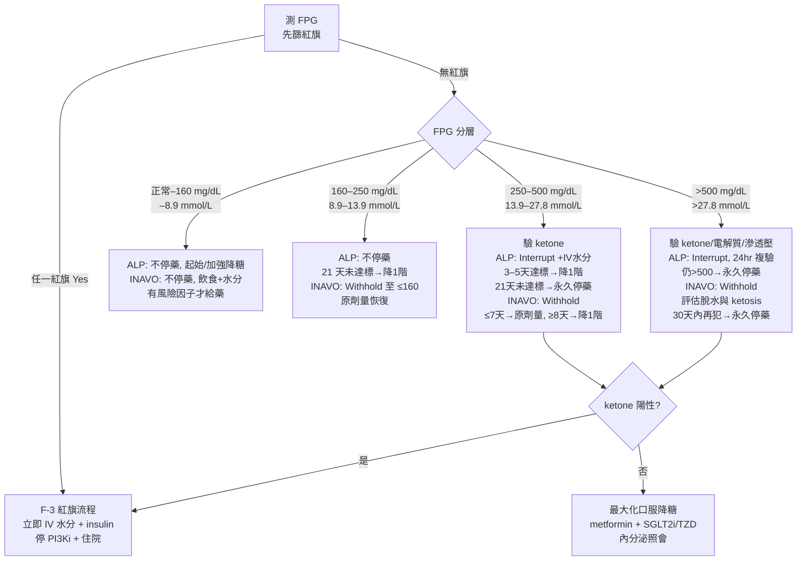

# F. 以 FPG（mg/dL 及 mmol/L）呈現的臨床處置流程

> **本節回答 Q9（何時開始 metformin）與 Q13（為何 insulin-sparing、何時仍必須立即用 insulin）。**
> **全節硬規則**：alpelisib（PIQRAY®）與 inavolisib（ITOVEBI®）之仿單規定**不同、不可互相外推**；本節一律分開陳述。alpelisib 仿單自身即明載「本品之規定不得外推至其他 PI3K/AKT inhibitor」之比較限制 [label_alpelisib.md]。
> 📄 = 本地有全文可 grep；📌 = 僅 abstract。本節引用之檔案除另註外皆為 📄。
> **本次改版**：`SOLAR1_AE_Rugo_2020.md`（SOLAR-1 不良事件時序與處置專文，Ann Oncol 2020）與 `INAVO120_Turner_2024.md`（NEJM 2024）**已由 📌 升級為 📄**；F-0、F-1-2、F-2A、F-2B、F-2C、F-3-1、F-3-2-1、F-3-3、F-4-2、F-5 已改引原文可 grep 之數字。**BYLieve 主論文與 SOLAR-1 主論文（Andre 2019）之補充表仍為 📌，不得引用其內文細節。**

---

## F-0. 兩藥的分層門檻與停藥規則：先看差異

FPG 分段門檻**兩藥相同**（皆為 ULN–160 / >160–250 / >250–500 / >500 mg/dL），但**抗癌藥的處置完全不同**。

| 項目 | **alpelisib（PIQRAY）**【L1】 | **inavolisib（ITOVEBI）**【L1】 |
|---|---|---|
| 起始劑量 | 300 mg PO QD [label_alpelisib.md] | 9 mg PO QD [label_inavolisib.md] |
| 減量階梯 | 300 → 250 → 200 mg（最多 2 次減量）[label_alpelisib.md] | 9 → 6 → 3 mg → 永久停藥 [label_inavolisib.md] |
| FPG >160–250 | **不需調整劑量**，加強降糖治療 [label_alpelisib.md] | **Withhold**（暫停）直到 FPG ≤160，再以**原劑量**恢復 [label_inavolisib.md] |
| FPG >250–500 | **Interrupt**；3–5 天內降至 ≤160 → 降**一階**恢復 [label_alpelisib.md] | **Withhold**；**≤7 天**降至 ≤160 → **原劑量**恢復；**≥8 天**才降至 ≤160 → 降**一階**恢復 [label_inavolisib.md] |
| FPG >500 | **Interrupt**；24 小時內複驗；確認仍 >500 → **永久停藥** [label_alpelisib.md]（EMA 版寫「after 24 hours」[label_alpelisib.md]） | **Withhold**；降至 ≤160 → 降**一階**恢復；**30 天內再犯 >500 → 永久停藥** [label_inavolisib.md] |
| 21 天規則 | **有**：任一級高血糖若 21 天內無法降至 ≤160 → 永久停藥（Grade 2 則先降一階）[label_alpelisib.md] | **無此條文**；改以「30 天內復發」為永久停藥判準 [label_inavolisib.md] |
| 恢復治療門檻 | ≤160 mg/dL（8.9 mmol/L）[label_alpelisib.md] | ≤160 mg/dL（8.9 mmol/L）[label_inavolisib.md] |
| 治療中 FPG 監測 | 前 2 週每週至少 1 次 → 之後每 4 週至少 1 次 [label_alpelisib.md] | Day 1–7 **每 3 天**→ Day 8–28 每週 → 接下來 8 週每 2 週 → 其後每 4 週 [label_inavolisib.md] |
| HbA1c | 每 3 個月 [label_alpelisib.md] | 每 3 個月 [label_inavolisib.md] |
| 仿單有無指名 metformin | **有**（Table 3 註²，含 SOLAR-1 titration）[label_alpelisib.md] | **FDA PI 全文未出現 metformin 字樣**；僅 EMA SmPC 指其為 INAVO120 之 "preferred initial agent" [label_inavolisib.md] |
| 高血糖中位發生時間 | 15 天（range 5–517 天）[label_alpelisib.md]；SOLAR-1 AE 專文另報 **grade ≥3** 高血糖之中位發生時間 **15 天（range 5–395 天，依 FPG 判定）**📄[SOLAR1_AE_Rugo_2020.md]【L2】 | **7 天**（range 2–955 天）[label_inavolisib.md]；INAVO120 主論文**未報告** median time to onset（已 grep 確認）📄[INAVO120_Turner_2024.md]【L2】 |
| 腎功能減量 | 本回顧未於仿單擷取稿中取得可驗證之 eGFR 分層減量條文 | eGFR 30–<60 → 6 mg；eGFR <30 → 3 mg [label_inavolisib.md] |

**臨床要點【L1】**：inavolisib 從 Grade 2（FPG >160）就要**暫停抗癌藥**，alpelisib 到 Grade 2 仍**不需停藥**。把 alpelisib 的習慣直接套到 inavolisib，會導致該停不停。

---

## F-1. Q9：何時開始 metformin？

### F-1-1. 三個「起始 metformin」的時機，證據等級不同

| 時機 | 建議內容 | 等級 | 來源 |
|---|---|---|---|
| **① 治療前預防性（prophylactic）** | alpelisib：仿單措辭為 **"Consider premedication with metformin"**，依病人風險因子、腸胃耐受性與臨床情境決定 | 【L1】 | [label_alpelisib.md] |
| | inavolisib：EMA 措辭為 **"Metformin premedication can be considered in patients with risk factors for hyperglycaemia"** — **限於有風險因子者**，非全面投藥 | 【L1】 | [label_inavolisib.md] |
| | 專家 Delphi：**baseline HbA1c 5.7–6.4% 者建議預防性 metformin**；HbA1c <5.7% 者「may be appropriate」；最高風險族群是否加第二種藥則**專家意見不一致（disagreement）** | 【L3】 | [Delphi_Gallagher_2024.md] |
| | METALLICA（**單臂 phase 2**）：metformin 500 mg BID ×3 天 →（若無腸胃不耐）1000 mg BID，**於 alpelisib 前 1 週開始**；cohort A 正常血糖、cohort B prediabetes | 【L2】 | [METALLICA_LlombartCussac_2024.md] |
| **② 一偵測到高血糖即起始（治療性、早期）** | 專家共識：FPG **>126 mg/dL（>7.0 mmol/L）** 即應起始 metformin 500 mg/day，titrate 至最高 2000 mg/day | 【L3】 | [Consensus_Tankova_2022.md] |
| | 另一份管理綜論：**任何程度空腹高血糖（FG ≥100 mg/dL），不論 baseline 血糖狀態**，即起始 metformin 500 mg 餐前 QD，每週加 500 mg 至最高 2000 mg/day | 【L3】 | [Mgmt_Goncalves_2022.md] |
| **③ 依仿單分層（FPG >ULN 起）** | alpelisib Grade 1（>ULN–160）即 "Initiate or intensify anti-hyperglycemic treatment"；SOLAR-1 建議 metformin 500 mg QD → 500 mg BID → 早 500/晚 1000 → 1000 mg BID | 【L1】 | [label_alpelisib.md] |
| | inavolisib Grade 1（>ULN–160）：飲食調整＋確保水分；**僅對有高血糖風險因子者**起始或加強口服降糖藥 | 【L1】 | [label_inavolisib.md] |

### F-1-2. 本回顧對 Q9 的實務答案

- **SOLAR-1 中降糖藥的真實使用樣貌【L2】📄**：187 名任一級高血糖（AESI grouped term）病人中，**163 人**接受降糖藥物；在這 **163 人**當中，**metformin（單用或合併）佔 87.1%**，是最常使用的藥物；**67 人（41.1%）僅需一種降糖藥，但 47 人（28.8%）需要三種以上**[SOLAR1_AE_Rugo_2020.md]。
  → **臨床意涵**：metformin 確實是主力，但將近三成病人單靠一種口服藥不夠。開 metformin 的同時就該先想好第二、第三線（見 F-2 各分層）。
  ⚠ 分母務必寫清楚：87.1%／41.1%／28.8% 的分母是「**163 名接受降糖藥者**」，不是 284（safety population）也不是 187[SOLAR1_AE_Rugo_2020.md]。
- ⚠ **關於「SOLAR-1 的 metformin titration」之來源澄清【L1】**：上表 ③ 所列之 500 mg QD → 500 mg BID → 早 500／晚 1000 → 1000 mg BID，其可驗證來源是 **FDA alpelisib 仿單 §2.3 之表註**[label_alpelisib.md]。**SOLAR-1 AE 專文全文並未載任何 mg 級的 metformin 起始劑量或加量時程**（已就 "metformin"、"titrat"、"500 mg"、"1000 mg" 全文 grep 確認）；該文之 protocol 表僅有 "consider metformin"、"start or intensify metformin"、"beyond MTD of metformin" 等文字敘述📄[SOLAR1_AE_Rugo_2020.md]。引用時不可寫成「SOLAR-1 論文建議 500 mg 起始」。
- **不要等到 Grade 2 才開始。** 回溯性資料顯示：Grade 1/2 高血糖若**延遲介入**（grade 1 於 4 週後、grade 2 於 3 週後才給藥），高血糖不改善或惡化為嚴重高血糖的機率較高【L3】[Multidisc_Rugo_2022.md]。
- **最保守可執行的門檻**：FPG >126 mg/dL（>7.0 mmol/L）即起始 metformin 500 mg QD【L3】[Consensus_Tankova_2022.md]；更積極者以 FG ≥100 mg/dL（5.6 mmol/L）為門檻【L3】[Mgmt_Goncalves_2022.md]。兩者皆為專家意見，**本回顧未取得比較此二門檻之前瞻性隨機證據**。
- **起始前必查 eGFR**【L3】[Multidisc_Rugo_2022.md]：
  - eGFR ≥60：可起始，每年監測腎功能。
  - eGFR 45–60：可續用，每 3–6 個月監測。
  - eGFR 30–45：**不得新起始**；已在用者停用或減半劑量，每 3 個月監測腎功能。
  - eGFR <30：**禁忌**。
- **劑量爬升**（三份來源一致，數字略異，選一套照做即可）：
  - 仿單／SOLAR-1：500 QD → 500 BID → 早 500 ＋ 晚 1000 → 1000 BID【L1】[label_alpelisib.md]
  - 專家綜論：500 mg 餐前 QD，每週 +500 mg 至 2000 mg/day【L3】[Mgmt_Goncalves_2022.md]
  - Jhaveri 2026：500 mg/day 起（若已出現明顯早發高血糖可自 1000 mg 起），**每 3–4 週**以 500 mg 遞增至 2000 mg；**優先用 extended-release**，>500 mg/day 之 immediate-release 應分兩次給【L3】[ToxMgmt_Jhaveri_2026.md]
- **Delphi 之藥物順位**：metformin 為第一線；SGLT2i 或 TZD 為第二／三線，或 metformin 不耐者之第一線；**insulin、sulfonylurea、DPP4i 一般不適合作為第一或第二線**；DPP4i 可為第三線【L3】[Delphi_Gallagher_2024.md]。
- **癌症病人特有的取捨**：METALLICA 中，僅給 metformin 尚未給 alpelisib 的第一週即有 **14.7%** 出現腹瀉；全期任何級腹瀉 **67.6%**、Grade 3–4 **13.2%**（原文 Results 段；Discussion 段寫 11.8%，本回顧全稿統一採 Results 之 13.2% 並註記此來源內部不一致），高於 SOLAR-1（57.7% / 6.7%）與 BYLieve（59.8% / 5.5%）【L2】[METALLICA_LlombartCussac_2024.md]。alpelisib 仿單亦明載「metformin premedication 會增加噁心、嘔吐與腹瀉（含 Grade 3 腹瀉）之發生率」【L1】[label_alpelisib.md]。腹瀉 → 脫水 → eGFR 下降 → metformin 須再減量，且 inavolisib 於 eGFR 30–<60 須降至 6 mg【L1】[label_inavolisib.md]。**開 metformin 前務必把腹瀉、食慾、體重與腎功能一起評估。**
- ⚠ **METALLICA 是 single-arm、n=68 的 phase 2 試驗**，主要終點為前 8 週 Grade 3–4 高血糖發生率【L2】[METALLICA_LlombartCussac_2024.md]。**不可據此宣稱「所有病人都應使用預防性 metformin」**；alpelisib 仿單措辭僅為 "Consider"【L1】[label_alpelisib.md]，EMA 對 inavolisib 亦僅為 "can be considered ... in patients with risk factors"【L1】[label_inavolisib.md]。
- **METALLICA 之外部效度限制**：cohort A 要求 FPG <100 mg/dL 且 HbA1c <5.7%；cohort B 為 FPG 100–140 mg/dL 且／或 HbA1c 5.7–6.4%【L2】[METALLICA_LlombartCussac_2024.md]。**已確診糖尿病者未被納入**，故預防性 metformin 在糖尿病病人的效果，**本回顧未取得可驗證來源**。
- **GLP-1 RA**：Delphi 認為在無明顯腸胃副作用或體重下降時可適用【L3】[Delphi_Gallagher_2024.md]；Jhaveri 2026 對 BMI >30 者可考慮，但須權衡 cachexia 與營養不良風險【L3】[ToxMgmt_Jhaveri_2026.md]。**對食慾不佳、體重下降的癌症病人應避免。**

---

## F-2. 以 FPG 為主軸的分層處置流程（可直接照做）

> 判斷一律**以空腹血糖（FPG／FBG）為準**——alpelisib 仿單明文：「Dose modifications and management should only be based on fasting glucose values」【L1】[label_alpelisib.md]。

### 文字流程圖

```
【每次回診／每次自我監測】
  │
  ├─ 先問三個「紅旗」問題（任一為 Yes → 直接跳到 F-3 紅旗流程，不管 FPG 幾多）
  │     • 有無意識改變／脫水／呼吸急促／嘔吐無法進食？
  │     • 有無感染、發燒、敗血症徵象？
  │     • 血／尿 ketone 是否陽性？
  │
  ▼
【測 FPG】
  │
  ├── ① FPG 正常 ～ <160 mg/dL（<8.9 mmol/L）  ────────────────┐
  │     ALPELISIB：不調整劑量；起始或加強降糖治療【L1】          │
  │     INAVOLISIB：不調整劑量；飲食調整＋確保水分；            │
  │                 「有風險因子者」起始／加強口服降糖藥【L1】     │
  │     降糖藥：FPG >126 (>7.0) → metformin 500 mg QD 起【L3】     │
  │     回驗：依各藥仿單監測表（見 F-0）【L1】                   │
  │     轉介：不需常規轉介                                       │
  │                                                              │
  ├── ② FPG 160–250 mg/dL（8.9–13.9 mmol/L）────────────────────┤
  │     ALPELISIB：★ 不需停藥、不需減量 ★；加強降糖治療【L1】     │
  │        └─ 若 21 天內仍未降至 ≤160 (8.9) → 降 1 個劑量階【L1】 │
  │     INAVOLISIB：★ Withhold（暫停）★ 直到 FPG ≤160 (8.9)，     │
  │        再以「原劑量」恢復【L1】                               │
  │        └─ 若在適當降糖治療下 FPG 持續 200–250 (11.1–13.9)     │
  │           達 7 天 → 照會高血糖專科【L1】                      │
  │     降糖藥：metformin 上調至最大可耐受劑量；                  │
  │             已達最大量 → 加 SGLT2i 或 pioglitazone 15–45 mg【L3】│
  │     回驗：每週至少 1 次，直到 FPG 回到正常【L3】               │
  │     轉介：可考慮內分泌照會（Delphi 對此有歧見）【L3】          │
  │                                                              │
  ├── ③ FPG 250–500 mg/dL（13.9–27.8 mmol/L）───────────────────┤
  │     ▶ 先驗 ketone（血酮優先）。陽性 → 跳 F-3【L3】            │
  │     ALPELISIB：★ Interrupt ★；起始／加強口服降糖藥，          │
  │        必要時加用其他降糖藥 1–2 天；                          │
  │        給 IV hydration，並處理電解質／ketoacidosis／           │
  │        hyperosmolar 之異常【L1】                              │
  │        ├─ 3–5 天內降至 ≤160 (8.9) → 降 1 階恢復【L1】         │
  │        ├─ 3–5 天內未達標 → 照會高血糖專科【L1】               │
  │        └─ 21 天內未達標 → ★ 永久停藥 ★【L1】                  │
  │     INAVOLISIB：★ Withhold ★；起始／加強降糖藥；              │
  │        必要時給予適當水分補充【L1】                           │
  │        ├─ ≤7 天降至 ≤160 (8.9) → 以「原劑量」恢復【L1】       │
  │        ├─ ≥8 天才降至 ≤160 (8.9) → 降 1 階恢復【L1】          │
  │        └─ 30 天內再次出現 250–500 → 暫停至 ≤160，            │
  │           再以降 1 階恢復【L1】                               │
  │     降糖藥：ketone 陰性時，metformin 上調至 2000 mg           │
  │             ＋第二線（pioglitazone 或 SGLT2i），              │
  │             或三者併用【L3】                                  │
  │     回驗：每日至數日一次（依 3–5 天／7 天決策點回推）【L1】    │
  │     轉介：內分泌／糖尿病專科照會【L1】【L3】                   │
  │     住院：若無法口服、脫水、ketone 陽性 → 住院（見 F-3）      │
  │                                                              │
  └── ④ FPG >500 mg/dL（>27.8 mmol/L）──────────────────────────┘
        ▶ 一律視為高血糖急症風險，先驗 ketone ＋ 電解質 ＋ 滲透壓
        ALPELISIB：★ Interrupt ★；起始／加強降糖治療，
           給 IV hydration 並處理電解質／ketoacidosis／
           hyperosmolar 異常；★ 24 小時內複驗 FPG ★【L1】
           ├─ 降至 ≤500 (27.8) → 依 Grade 3 規則走【L1】
           └─ 確認仍 >500 (27.8) → ★ 永久停藥 ★【L1】
        INAVOLISIB：★ Withhold ★；起始／加強降糖藥；
           ★ 評估 volume depletion 與 ketosis ★ 並給予適當水分【L1】
           ├─ 降至 ≤160 (8.9) → 降 1 階恢復【L1】
           └─ 30 天內再次 >500 → ★ 永久停藥 ★【L1】
        降糖藥：ketone 陰性 → 最大化口服治療
                （metformin 2000 mg ＋ pioglitazone 45 mg
                  ＋最大劑量 SGLT2i）【L3】
                ketone 陽性 → ★ 停口服藥、立即 insulin ＋ IV 水分、
                住院處理 ★【L3】
        轉介／住院：內分泌照會；Delphi 建議「第二次或之後之
                    FBG >500 且已用盡非 insulin 治療者 → 暫停
                    alpelisib、起始 insulin、內分泌照會，或永久停藥」；
                    情況需要時直接送急診【L3】
```

### 同一份流程的 mermaid 版（投影片用）



### F-2A. SOLAR-1 protocol 的原始處置條文（與仿單並列對照）📄【L2】

SOLAR-1 之試驗 protocol 表（Rugo 2020 Table 1）與 FDA 仿單分層一致，但**多出兩條可直接照做的用藥指示**，是仿單所沒有的：

| Grade（FPG） | SOLAR-1 protocol 的**降糖藥**指示（逐字重點） | 對 alpelisib 的處置 |
|---|---|---|
| 1（>ULN–160 mg/dL） | FPG <140 mg/dL → "consider metformin"；FPG 140–160 mg/dL → "start or **intensify metformin**" | 不需調整 |
| 2（>160–250 mg/dL） | "Start oral antidiabetic treatment (eg, metformin)"；**"If FPG keeps rising beyond MTD of metformin, add an insulin sensitizer (eg, pioglitazone)"** | 不需調整；給降糖藥後 21 天內未降至 grade ≤1 → 減 1 個 dose level |
| 3（>250–500 mg/dL） | "Consider consultation with endocrinologist"；"Start metformin and add pioglitazone"；**"Insulin may be used as rescue medication for 1 to 2 days"** | 停藥；停藥＋metformin 後 **3–5 天**內降至 grade ≤1 → 重啟並減 1 階；21 天內未達標 → 永久停用 |
| 4（>500 mg/dL） | "Consult with endocrinologist"；依 grade 3 建議處理，**24 小時後複驗** | 停藥 24 小時；仍為 grade 4 且無干擾因素 → 永久停用 |

[SOLAR1_AE_Rugo_2020.md]（Table 1，CTCAE v4.03）
> **要點**：SOLAR-1 protocol 對 grade 3 明文允許 **insulin 作為 1–2 天的 rescue**，並非「禁止 insulin」。所謂 insulin-sparing 指的是「不把 insulin 當長期第一線」，**不是「重症時也不用」**。

**SOLAR-1 的血糖監測頻率（比仿單更密）**：FPG 於 screening、**前 8 週每 2 週一次**、之後每 4 週一次；且**第 1–4 週另加 day 8 與 day 15**[SOLAR1_AE_Rugo_2020.md]【L2】。

---

### F-2B. 高血糖的時序與可逆性 —— 決定「何時可以恢復 alpelisib」📄【L2】

| 參數（SOLAR-1，alpelisib 組 n=284） | 數值 | 來源 |
|---|---|---|
| Grade ≥3 高血糖之中位發生時間 | **15 天（range 5–395 天）** | [SOLAR1_AE_Rugo_2020.md] |
| Grade ≥3 高血糖**改善 ≥1 grade** 之中位時間 | **6 天（range 4–7 天）** | 同上 |
| 平均 FPG 曲線 | **在治療前 2 週達峰**，之後在降糖藥支持下回落趨近基線 | 同上 |
| HbA1c | 不論基線血糖狀態均**緩慢上升並維持輕度上升** | 同上 |
| 停用 alpelisib 之後 | **所有發生高血糖者，高血糖均回到 grade 0 或 1** | 同上 |

**如何轉換成床邊決策：**

1. **仿單的「3–5 天」判定窗有時序依據。** SOLAR-1 中 grade ≥3 高血糖改善 ≥1 grade 的中位時間是 **6 天（range 4–7 天）**[SOLAR1_AE_Rugo_2020.md]；因此 alpelisib 仿單要求「停藥後 3–5 天內降至 ≤160 才可降階恢復」【L1】[label_alpelisib.md]，落在同一時間尺度內。**停藥超過 5 天仍未達標，就不該再等，應照會內分泌科。**
2. **「可逆」是族群層次的描述，不是個別保證。** 原文的可逆性陳述是「**停用 alpelisib 之後**回到 grade 0/1」與「reversible and manageable with monitoring, early detection, and intervention」[SOLAR1_AE_Rugo_2020.md]——前提是有監測與介入，不是放著會自己好。
3. ⚠ **原文未報告**「停藥後回復至 grade 0/1 所需的中位天數」；6 天是「改善 ≥1 grade」而非「完全回復」。**本回顧未取得停藥後完全回復時間之可驗證數字**，不得以 6 天代稱[SOLAR1_AE_Rugo_2020.md]。
4. **前 2 週是決戰期。** grade ≥3 中位第 15 天發生、FPG 平均值在前 2 週達峰[SOLAR1_AE_Rugo_2020.md]，與 inavolisib 仿單要求 **Day 1–7 每 3 天驗一次 FPG**【L1】[label_inavolisib.md] 方向一致——**監測密度必須前重後輕**。

---

### F-2C. 主動處置可以維持 dose intensity —— 不要輕易減量 📄【L2】

**（1）AE management guideline 修訂前後的差異**（SOLAR-1 於約 560 名計畫收案數中已隨機 **317 人（56.6%）**時修訂 protocol：HbA1c 收案門檻由 <8% 改為 <6.5%、對基線 FPG ≥100 mg/dL 且／或 HbA1c ≥5.7% 者於 screening 衛教生活型態並轉介專科、**新增 day 8 門診**以早期偵測）[SOLAR1_AE_Rugo_2020.md]：

| 指標（前 50% 隨機者 → 後 50%） | 前 50% | 後 50% |
|---|---|---|
| 高血糖 any grade（preferred term） | 63.9% | 63.6%（**幾乎不變**） |
| 高血糖 grade 3/4 | **40.3%** | **32.9%** |
| **因高血糖停藥** | **9.0%** | **3.6%** |
| 因任何級 AE 停藥（alpelisib 或 placebo） | 29.2% | 20.7% |
| **因 grade ≥3 AE 停藥** | **18.1%** | **7.9%** |

[SOLAR1_AE_Rugo_2020.md]

> **臨床訊息**：**高血糖的「發生率」幾乎沒變（63.9% → 63.6%），改變的是「嚴重度」與「因此停藥的比率」。** 也就是說，主動監測與早期介入無法讓高血糖不發生，但可以讓它不升級、不必停藥。
> ⚠ **詮釋界線【L2】**：這是「前 50% vs 後 50% 隨機者」的**非隨機、時序性比較**，不是 amendment 前後的嚴格對照；作者自述改善「may be attributed to the protocol amendment, as well as other factors, such as earlier identification and appropriate management of AESIs」[SOLAR1_AE_Rugo_2020.md]。**不可宣稱因果。** 同文亦載：兩半段之中位暴露時間、因 AE 減量與因 AE 中斷之頻率「generally consistent」，即差異主要落在**停藥**而非減量[SOLAR1_AE_Rugo_2020.md]。

**（2）Dose intensity 與 PFS 的關聯（PIK3CA-mutant 族群）**：

- 中位 alpelisib dose intensity **248 mg/day**（起始劑量為 300 mg/day）
- 中位 PFS：**dose intensity ≥248 mg/day 組 12.5 個月** vs **<248 mg/day 組 9.6 個月** vs **placebo 5.8 個月**

[SOLAR1_AE_Rugo_2020.md]

> ⚠ **這條證據必須誠實標注其極限**：原文**未報告**兩組間的 HR、95% CI 或 p 值；此為**事後 landmark 式分組**，存在 guarantee-time bias 與反向因果（早進展者暴露短、平均劑量強度自然低）[SOLAR1_AE_Rugo_2020.md]。且原文明載「**PFS benefit over placebo was still evident even at the lower dose intensity**」——**低劑量強度組（9.6 個月）仍優於 placebo（5.8 個月）**。
> **因此可以說的是**：「積極控糖以避免非必要的減量與停藥」是合理的臨床目標【L2】；**不可以說的是**：「維持 300 mg 才有效」或「減量就會失去療效」——後者在本地檔案中無可驗證來源。
> **反向的安全性底線**：當病人已出現 grade 3/4 高血糖、脫水或無法進食時，**依仿單停藥／降階永遠優先於維持 dose intensity**【L1】[label_alpelisib.md]。

**（3）SOLAR-1 的整體劑量調整實況**（safety population，n=284）：alpelisib 中位暴露 **5.5 個月（range 0–30.8）**；**dose reduction 59.2%、dose interruption 72.2%**，其中因 AE 者分別為 **57.7%** 與 **66.5%**[SOLAR1_AE_Rugo_2020.md]。
> ⚠ 原文**未拆分**「單獨因高血糖」而減量／中斷之比率，只有整體 AE 之數字。**不可把 59.2%／72.2% 說成「因高血糖」**[SOLAR1_AE_Rugo_2020.md]。全試驗因 AE 停用 alpelisib 者為 **25.0%**（placebo 4.2%）[SOLAR1_AE_Rugo_2020.md]。

---

### 恢復治療時的「反向陷阱」

**停 PI3Ki 時，必須同步下修降糖藥。** EMA inavolisib SmPC 明載：使用 insulin、sulfonylurea 等降糖藥控制高血糖時，**在 Itovebi 被中斷或停用之前即應考量低血糖風險**【L1】[label_inavolisib.md]。alpelisib 側亦有一致建議：中斷 alpelisib 時應考慮同時中斷降糖藥以避免低血糖（fulvestrant 可續用）【L3】[Multidisc_Rugo_2022.md]。alpelisib 仿單註³更指出，**因 alpelisib 半衰期短，停藥後血糖多可回復，故多數病人不需要持續 insulin**【L1】[label_alpelisib.md]。

---

## F-3. Q13：insulin-sparing approach —— 理由，以及「絕對不可延誤 insulin」的紅旗

### F-3-1. 為何要 insulin-sparing（理論與機轉）

- **機轉**：PI3Kα（p110α）媒介幾乎所有細胞對 insulin 的反應；抑制之後阻斷骨骼肌與脂肪的葡萄糖攝取、促進肝醣分解，造成高血糖，並引發**代償性 insulin 分泌（insulin feedback）**【L5】[InsulinFeedback_Hopkins_2018.md]。
- **前臨床證據**：在小鼠模型中，10 ng/mL insulin（即給藥後 15–30 分鐘的體內濃度）**足以在 PI3K inhibitor 持續存在下部分回復 pAKT、幾乎完全回復 pS6**，並部分回復細胞增殖【L5】[InsulinFeedback_Hopkins_2018.md]。在 ketogenic diet ＋ BYL-719 的小鼠加打 0.4 mU insulin，**大幅抵消了飲食帶來的治療效益**【L5】[InsulinFeedback_Hopkins_2018.md]。
- **不同降糖策略對 insulin feedback 的差異**：同一研究中，**metformin 對 PI3Ki 誘發的血糖與 insulin 上升幾乎無影響**（p=0.2136 / 0.7566，皆不顯著），而 **SGLT2i 與 ketogenic diet 顯著降低血糖與 c-peptide**，並降低腫瘤 mTORC1 訊號【L5】[InsulinFeedback_Hopkins_2018.md]。
  ⚠ 這是小鼠資料，**不得直接外推為「臨床上 metformin 無效」**；臨床上 metformin 仍是仿單與各共識的第一線用藥【L1】[label_alpelisib.md]【L3】[Delphi_Gallagher_2024.md]。
- **臨床端的表述**：專家綜論指出「雖然 insulin 治療可矯正高血糖，但過量 insulin 可能降低 PI3K inhibitor 對腫瘤的效果，形成治療腫瘤與處理副作用之間的取捨」【L3】[ToxMgmt_Jhaveri_2026.md]；另一份綜論明言「insulin 一般不建議使用，因其對 PI3K 路徑的影響，但在嚴重高血糖（persistent grade ≥3）時可以使用」【L3】[Mgmt_Goncalves_2022.md]。
- **SOLAR-1 作者的實際立場：偏好 insulin sensitizer，但明文肯定 short-term insulin【L2】📄**。Rugo 2020 Discussion 一方面寫「insulin sensitizers (e.g., metformin) **may be preferable to** insulin secretagogues (e.g., sulfonylurea, meglitinides) ... due to the insulin spikes and relative resistance noted with PI3K inhibitors」，並指出「**Beyond metformin, there is no second agent widely accepted as a standard**」、對 SGLT2i 僅稱 "more data is needed to support their use"；另一方面**明白寫下**：「**short-term insulin is clearly effective for managing acute cases as well as more severe hyperglycemia associated with alpelisib and not controlled by oral antihyperglycemic medications alone**」[SOLAR1_AE_Rugo_2020.md]。
  → **insulin-sparing 的正確定義是「不把 insulin 當長期第一線」，不是「重症時也不用」。**
- **Sulfonylurea 同理**：SU 為 insulin secretagogue，會拉高 insulin 濃度，**不應作為 alpelisib 誘發高血糖的主要治療**，僅可作為 rescue，且須在較適當的藥物證實不足之後【L3】[Consensus_Tankova_2022.md]。Jhaveri 2026 亦建議一般避免 SU（rebound hypoglycemia 風險）【L3】[ToxMgmt_Jhaveri_2026.md]。
- **不經 PI3K 路徑的藥物較受青睞**：case report 之討論指出，SGLT2i 的降糖機轉在 PI3K/AKT/mTOR 路徑之外；而 insulin 及其 secretagogues（SU、meglitinide）皆倚賴該路徑【L4】[DKA_Rechallenge_Leung_2022.md]。同文明白標註：此「insulin 可能削弱 PI3Ki 抗癌效果」之顧慮**尚未在大型臨床試驗中被驗證，目前仍屬假說**【L4】[DKA_Rechallenge_Leung_2022.md]。

> **結論性表述**：insulin-sparing 是一個**基於機轉與前臨床資料（【L5】）＋專家意見（【L3】）**的偏好排序，**不是被隨機臨床試驗證實的療效終點**。本回顧未取得任何比較「insulin vs 非 insulin 降糖策略對腫瘤結果影響」之前瞻性臨床試驗證據。

### F-3-2. ★ 絕對不可延誤 insulin 的紅旗情境 ★

**以下情境一律立即使用 insulin ＋ 靜脈輸液，不得以「避免 hyperinsulinemia」或「等停藥後血糖自己會降」為由延遲。**

| 紅旗 | 立即動作 | 等級／來源 |
|---|---|---|
| **Ketone 陽性（血酮優先）／ketoacidosis** | **停用口服降糖藥**，改為積極 insulin ＋ IV hydration，**於住院環境處置**；Grade 3/4 高血糖應常規驗 ketone | 【L3】[Consensus_Tankova_2022.md] |
| **DKA** | 生理食鹽水補液 → insulin → 補鉀；pH 持續偏低者給 bicarbonate、嚴重低磷者補磷 | 【L3】[ToxMgmt_Jhaveri_2026.md] |
| **HHS／高滲透壓、脫水、意識改變** | IV hydration ＋ insulin；仿單於 Grade 3、Grade 4 均明文要求「給予靜脈輸液，並考慮處理電解質／ketoacidosis／hyperosmolar 之異常」 | 【L1】[label_alpelisib.md] |
| **FPG 極高（>500 mg/dL / >27.8 mmol/L），口服藥無法及時控制** | inavolisib 仿單要求「評估 volume depletion 與 ketosis 並給予適當水分」；alpelisib 要求 24 小時內複驗；Delphi 對第二次以後之 FBG >500 且已用盡非 insulin 治療者，建議**暫停抗癌藥＋起始 insulin＋內分泌照會** | 【L1】[label_inavolisib.md]【L1】[label_alpelisib.md]【L3】[Delphi_Gallagher_2024.md] |
| **合併感染／敗血症、或其他急性病況** | 共識明列 insulin 之啟用指徵包含「uncontrolled severe hyperglycemia、ketoacidosis、非 insulin 治療失敗、**concomitant acute illness**」 | 【L3】[Consensus_Tankova_2022.md] |
| **無法進食、嘔吐、嚴重腹瀉導致無法口服藥物** | 口服路徑已不可靠；EMA 明文允許 **short-term insulin 作為 rescue treatment** | 【L1】[label_inavolisib.md]【L3】[Consensus_Tankova_2022.md] |
| **高血糖快速惡化（tempo 而非只看絕對值）** | 對「顯著高血糖、血糖快速上升、或 HHS 等高血糖急症」，**insulin-based therapy 應為第一線**，同時視臨床需要暫停 inavolisib | 【L4】[Inavolisib_HHS_Li_2026.md] |

### F-3-2-1. SOLAR-1 中 insulin 究竟用了多少？（駁「insulin 不能用」的誤解）📄【L2】

在一個明確偏好 insulin-sparing 的第三期試驗中，**alpelisib 組 284 人中仍有 52 人用過 insulin**：

| 基線血糖狀態 | 用過 insulin 之人數 |
|---|---|
| Diabetic | **5 / 12** |
| Prediabetic | **34 / 159** |
| Normal | **13 / 113** |

其中 **33 人為長期使用（>2 天）**、**19 人為 rescue 用藥**[SOLAR1_AE_Rugo_2020.md]（insulin 可能與其他降糖藥併用）。

> **臨床意涵**：insulin 在 SOLAR-1 並非罕用，而是**在需要時就用、且多數為短期**。基線已是 diabetic 者更近半數（5/12）用到 insulin——**基線糖尿病病人不要假設可以只靠口服藥撐過去**。
> ⚠ 原文未報告 insulin 之劑型、劑量或起始門檻，亦未報告 SGLT2i／DPP-4i／GLP-1 RA／SU 之實際使用人數（僅 metformin 87.1% 與 insulin 52 人有數字）[SOLAR1_AE_Rugo_2020.md]。

### F-3-3. 「多為 non-ketotic」不等於「不會發生 DKA/HHS」——本地檔案的個案證據

PI3Kα inhibitor 相關高血糖的主病生理是**嚴重藥物誘發的 insulin resistance**（C-peptide 保留、autoantibody 陰性）【L4】[Inavolisib_HHS_Li_2026.md]，多數不伴 ketosis。**但本地檔案中確有下列急症個案：**

| 個案 | 藥物 | 關鍵數值 | 來源／等級 |
|---|---|---|---|
| HHS（無 ketoacidosis） | **inavolisib** 9 mg QD | 起藥後 **72 小時內**血糖 48.0 mmol/L；有效滲透壓 327 mOsm/L；尿酮陰性；fasting C-peptide 10.2 ng/mL、fasting insulin 41.5 μU/mL；**baseline HbA1c 僅 5.7%、BMI 19.55** | 【L4】[Inavolisib_HHS_Li_2026.md] |
| DKA | alpelisib 300 mg（prediabetes 病人） | 入院血糖 **1137 mg/dL**、anion gap 25、尿酮大量、血中 acetone 陽性、HbA1c 9.4%（7 個月前 6.3%）；**前 36 小時需 166 units insulin** | 【L4】[DKA_Carrillo_2021.md] |
| DKA | alpelisib（既有 T2DM，服 metformin） | 入院血糖 **612 mg/dL**、HbA1c 11.9%（2 個月內上升 4.6%）；IV insulin ＋ 停藥後快速緩解 | 【L4】[DKA_Loke_2025.md] |
| DKA（含 rechallenge 後再發） | alpelisib 300 mg（長期 T2DM，併用 empagliflozin） | 起藥後 11 天 DKA；rechallenge 後 **4 小時內**第二次 DKA（anion gap 20、glucose 397 mg/dL、ketonemia＋ketonuria），alpelisib 永久停用 | 【L4】[DKA_Rechallenge_Leung_2022.md] |

**仿單層級的確認**：
- alpelisib：SOLAR-1 中 ketoacidosis 發生率 **0.7%（n=2）**【L1】[label_alpelisib.md]。
- inavolisib：FDA 04/2026 版 5.1 節已改寫為 **"Severe or fatal hyperglycemia, including ketoacidosis, can occur"**，並新增 **"Ketoacidosis with a fatal outcome has occurred in the postmarketing setting"**（10/2024 版無此二句）【L1】[label_inavolisib.md]。

**⚠ 兩篇第三期試驗全文的「沉默」必須誠實交代（本回顧新增之稽核註記）📄**：

- **SOLAR-1 AE 專文全文未提及任何 DKA／HHNKS／ketoacidosis 個案或發生率**（已就 `ketoacid`、`DKA`、`HHNK`、`hyperosmolar` 全文 grep，**0 命中**），亦未聲明「無此類事件」[SOLAR1_AE_Rugo_2020.md]。
- **INAVO120 主論文全文同樣未出現 DKA／HHS／ketoacidosis 字樣**；其 grade 5（致死）AE 清單中亦不含 hyperglycemia[INAVO120_Turner_2024.md]。
- **但 alpelisib 仿單載明 SOLAR-1 之 ketoacidosis 發生率 0.7%（n=2）**【L1】[label_alpelisib.md]，且 inavolisib 仿單已納入上市後致死性 ketoacidosis【L1】[label_inavolisib.md]。

> **正確表述**：應寫「**該篇論文未報告 DKA/HHS 事件**」，**不可**寫成「SOLAR-1／INAVO120 未發生 DKA」。**主論文沒寫，不等於沒發生**——仿單的 0.7% 就是反證。臨床上仍須依 F-3-2 紅旗表處置。

> **臨床斷言【L1】【L4】**：PI3Kα inhibitor 相關高血糖「多為 non-ketotic」是**流行病學描述，不是個別病人的安全保證**。inavolisib 個案顯示 baseline HbA1c 5.7%、BMI 19.55 的病人仍可在 **72 小時內**進展到 HHS【L4】[Inavolisib_HHS_Li_2026.md]。**正常的基礎血糖指標不能排除嚴重毒性。**

### F-3-4. 兩個關於 ketone 判讀的陷阱

1. **ketogenic／極低碳飲食會造成尿酮陽性，可能被誤判為藥物誘發之 ketoacidosis**；且若病人同時使用 SGLT2i，判讀更混亂。專家共識因此**不建議極低碳水化合物飲食，僅建議中度碳水限制**【L3】[Consensus_Tankova_2022.md]。
2. **SGLT2i 有 euglycemic DKA 風險。** Delphi 專家**未要求**使用 SGLT2i 時常規監測 ketone，但可依醫師判斷施行【L3】[Delphi_Gallagher_2024.md]。本地檔案中有 taselisib ＋ canagliflozin 之酮酸中毒個案報告【L4】[EuglycemicDKA_Bowman_2017.md]（本節未引用其內文細節）。**兩份仿單皆未針對 SGLT2i ＋ PI3Kα inhibitor 之 ketoacidosis 交互風險作特別警語**【L1】[label_inavolisib.md]。

---

## F-4. 恢復用藥（resume）與再挑戰（rechallenge）原則

### F-4-1. 恢復用藥的門檻（仿單）

| | alpelisib【L1】 | inavolisib【L1】 |
|---|---|---|
| 恢復門檻 | FPG ≤160 mg/dL（8.9 mmol/L） | FPG ≤160 mg/dL（8.9 mmol/L） |
| 恢復劑量（來自 Grade 3） | 降 **1 階**（300→250→200） | **≤7 天達標 → 原劑量**；**≥8 天達標 → 降 1 階**（9→6→3） |
| 恢復劑量（來自 Grade 2） | 未曾停藥；21 天未達標才降 1 階 | 停藥期後**原劑量**恢復 |
| 恢復劑量（來自 Grade 4） | 降至 ≤500 後改依 Grade 3 規則 | 降至 ≤160 後**降 1 階** |
| 永久停藥 | 21 天內未降至 ≤160；或 24 小時後確認仍 >500 | 30 天內 >500 再犯；或（250–500 復發時）降階後仍不耐 |
| 恢復後劑量上調 | 仿單擷取稿未載 re-escalation 條文 | **EMA 允許回調至 9 mg；FDA 無對應條文** [label_inavolisib.md] |

[label_alpelisib.md]、[label_inavolisib.md]

### F-4-2. Rechallenge 的安全原則（case-based，【L4】為主）

**先認清風險量級**：

- alpelisib 停藥後，多數病人 **3–5 天**回到基礎血糖控制【L4】[DKA_Rechallenge_Leung_2022.md]；SOLAR-1 中停用 alpelisib 而續用 fulvestrant 者，**93.4% FPG 回到基礎（正常）值**【L1】[label_alpelisib.md]；SOLAR-1 AE 專文全文亦載「**All patients who developed hyperglycemia had grade 0 or 1 hyperglycemia following discontinuation of alpelisib**」📄【L2】[SOLAR1_AE_Rugo_2020.md]（惟該文未報告回復所需之中位天數，見 F-2B）。
- **但復用時高血糖來得極快**：一名長期 T2DM 病人在 rechallenge 後 **4 小時**再發 DKA【L4】[DKA_Rechallenge_Leung_2022.md]；另一名 prediabetes 病人在復用 alpelisib 250 mg 後 **24 小時內**明顯高血糖【L4】[DKA_Carrillo_2021.md]。
- **恢復到血糖正常，不足以保證安全**：Leung 個案明白指出「rechallenge 前恢復 euglycemia 並不足以控制或延緩第二次 grade 3/4 高血糖事件」【L4】[DKA_Rechallenge_Leung_2022.md]。

**可執行的 rechallenge checklist（【L4】為主，【L1】為輔）**：

1. **重新評估是否該復用**：長期 T2DM、需多種降糖藥控制、或血糖控制不佳者，「rechallenge 的風險必須與獲益作嚴格權衡」，且「可能不是 alpelisib 的合適人選」【L4】[DKA_Rechallenge_Leung_2022.md]。
2. **復用前重新檢視降糖藥組合與飲食**：優先保留**不經 PI3K/AKT/mTOR 路徑**的藥物（SGLT2i 等）；Leung 個案認為停掉 empagliflozin 可能促成了第二次 DKA【L4】[DKA_Rechallenge_Leung_2022.md]。
3. **降階復用，不要用回原劑量**：Leung 個案是以**全劑量**復用而失敗【L4】[DKA_Rechallenge_Leung_2022.md]；仿單於 Grade 3/4 後亦要求降 1 階恢復（alpelisib）【L1】[label_alpelisib.md] 或依達標速度決定（inavolisib）【L1】[label_inavolisib.md]。
4. **曾發生嚴重高血糖或 DKA 者，rechallenge 應在住院或同等監測環境進行**，並使用 CGM【L4】[DKA_Rechallenge_Leung_2022.md]。
5. **事先建立快速反應機制**：早期轉介 diabetologist／endocrinologist；並給病人一份可交給急診醫師的書面說明，避免 DKA 被歸因於較常見的原因而延誤【L4】[DKA_Rechallenge_Leung_2022.md]。
6. **同步下修 insulin／SU**：停藥或降階時務必調降，避免低血糖【L1】[label_inavolisib.md]【L3】[Multidisc_Rugo_2022.md]。
7. **metformin 本身的 rechallenge**：若因 metformin 相關腹瀉而停藥，可考慮 **4–5 天後**以「晚餐後半顆 850 mg」漸進式再挑戰，或改用 XR 劑型【L3】[Consensus_Tankova_2022.md]。

### F-4-3. 血糖控制目標（癌症病人須個別化）

| 族群 | HbA1c | 餐前血糖 | 睡前血糖 |
|---|---|---|---|
| 預後良好 | <7.5%（58 mmol/mol） | 90–130 mg/dL（5.0–7.2 mmol/L） | 90–150 mg/dL（5.0–8.3 mmol/L） |
| 餘命有限 | <8.5%（69 mmol/mol） | 100–180 mg/dL（5.6–10 mmol/L） | 110–200 mg/dL（6.1–11.1 mmol/L） |

【L3】[Mgmt_Goncalves_2022.md]。另一份綜論建議以 CGM 使血糖維持在 **70–250 mg/dL 達每日 >90% 時間**，並以餐後血糖 <250 mg/dL 為合理目標，以避免 catabolic wasting【L3】[ToxMgmt_Jhaveri_2026.md]。

---

## F-5. 本節「本回顧未取得可驗證來源」之項目

1. **TFDA 正式核准之 inavolisib 中文仿單**：查無，故本節之 inavolisib 條文全部來自 FDA PI 與 EMA SmPC 擷取稿 [label_inavolisib.md]。
2. **alpelisib 之 eGFR 分層劑量調整條文**：仿單擷取稿中未見對應規定（inavolisib 有）。
3. **metformin 起始門檻 FPG >126 mg/dL vs FG ≥100 mg/dL 之比較性證據**：兩者皆為專家意見，無頭對頭研究。
4. **降糖藥物間（metformin vs SGLT2i vs TZD）之比較性療效數據**：alpelisib 仿單明載未提供任何頭對頭比較數據 [label_alpelisib.md]；本節亦未取得臨床頭對頭試驗。
5. **「insulin 是否真的削弱 PI3Ki 抗癌效果」之臨床證據**：目前僅有前臨床【L5】與 case-report 層級之推論【L4】，**無大型臨床試驗驗證**（此點由 [DKA_Rechallenge_Leung_2022.md] 自身明載）。
6. **預防性 metformin 在「已確診糖尿病」病人的效果**：METALLICA 未納入此族群，查無證據。
7. **inavolisib 之預防性 metformin 隨機證據**：INAVO120 主論文全文僅寫 **"The protocol allowed prophylactic use of metformin in patients with a high risk of hyperglycemia"**，**未報告實際使用率、未定義「高風險」之操作型定義、亦未做隨機比較**📄[INAVO120_Turner_2024.md]；仿單亦無對應條文 [label_inavolisib.md]。**任何「inavolisib 預防性 metformin 已證實有效」之敘述無可驗證來源。**
8. **SGLT2i 合併 PI3Kα inhibitor 之 ketoacidosis 風險量化**：兩份仿單皆無特別警語，本回顧未取得可驗證的風險估計 [label_inavolisib.md]。
9. **停用 alpelisib 後高血糖「完全回復至 grade 0/1」所需之中位天數**：SOLAR-1 AE 專文僅報「改善 ≥1 grade」之中位 6 天，未報完全回復時間📄[SOLAR1_AE_Rugo_2020.md]。
10. **「單獨因高血糖」導致之 alpelisib 減量／中斷比率**：SOLAR-1 AE 專文僅有整體 AE 之 57.7%／66.5%，未拆分📄[SOLAR1_AE_Rugo_2020.md]。
11. **INAVO120 之高血糖時序與處置細節**：主論文未報告 median time to onset／time to resolution、未拆分 grade 3 與 grade 4（僅合併 5.6%）、未報因高血糖之暫停與永久停藥率、未載 protocol 之高血糖 dose-modification 演算法（正文僅稱 "described in the protocol"，本地無 protocol 檔）📄[INAVO120_Turner_2024.md]。
12. **全文落地狀態更新**：`SOLAR1_AE_Rugo_2020.md`（Ann Oncol 2020，PMID 32416251）與 `INAVO120_Turner_2024.md`（NEJM 2024，PMID 39476340）**已由 📌 升級為 📄**，本節已改引其內文數字。**BYLieve 主論文與 SOLAR-1 主論文（Andre 2019）之補充表仍未落地全文，其 subgroup 細節依規定不得引用。**
10. **inavolisib 與 alpelisib 之頭對頭比較**：無此類資料 [label_inavolisib.md]。
